# Week 1 Lecture — Introduction to Operating Systems

> **Last Updated:** 2026-03-18

---

## Table of Contents

- [1. Orientation](#1-orientation)
  - [1.1 Instructor](#11-instructor)
  - [1.2 Syllabus](#12-syllabus)
  - [1.3 Grading Policy](#13-grading-policy)
  - [1.4 Assignments](#14-assignments)
  - [1.5 Midterm & Final Exams](#15-midterm--final-exams)
  - [1.6 Final Project](#16-final-project)
  - [1.7 Class Format](#17-class-format)
- [2. What is an Operating System?](#2-what-is-an-operating-system)
  - [2.1 Definition](#21-definition)
  - [2.2 Where the OS Sits](#22-where-the-os-sits)
  - [2.3 Two Roles of the OS](#23-two-roles-of-the-os)
  - [2.4 Dual-Mode Operation](#24-dual-mode-operation)
  - [2.5 System Calls](#25-system-calls)
  - [2.6 How a Computer System Works](#26-how-a-computer-system-works)
  - [2.7 Storage-Device Hierarchy](#27-storage-device-hierarchy)
  - [2.8 OS Structure](#28-os-structure)
  - [2.9 xv6](#29-xv6)
- [3. Semester Preview](#3-semester-preview)
  - [3.1 Processes (Weeks 2–3)](#31-processes-weeks-23)
  - [3.2 Threads & Concurrency (Weeks 4–5)](#32-threads--concurrency-weeks-45)
  - [3.3 CPU Scheduling (Weeks 6–7)](#33-cpu-scheduling-weeks-67)
  - [3.4 Synchronization (Week 9)](#34-synchronization-week-9)
  - [3.5 Deadlocks (Week 10)](#35-deadlocks-week-10)
  - [3.6 Memory Management (Weeks 11–12)](#36-memory-management-weeks-1112)
  - [3.7 File Systems & Security (Weeks 13–14)](#37-file-systems--security-weeks-1314)
  - [3.8 Course Roadmap](#38-course-roadmap)
- [Summary](#summary)
- [Appendix](#appendix)

---

<br>

## 1. Orientation

### 1.1 Instructor

> *Redacted for privacy.*

### 1.2 Syllabus

- The syllabus is available on the **LMS**.
- Total of **15 weeks**
  - Week 8 — **Midterm Exam**
  - Week 15 — **Final Exam**

### 1.3 Grading Policy

| Component | Weight |
|:----------|:-------|
| Assignments | **10%** |
| Midterm Exam (Written) | **30%** |
| Final Exam (Written) | **30%** |
| Final Exam (Project) | **30%** |
| Attendance | 0% |

> However, students who are absent for more than **1/3** of the total class hours will not receive a grade.

### 1.4 Assignments

**In-class Quizzes: 5%**
- **10** quizzes → **0.5%** each
- Weeks 3, 4, 5, 6, 7, 9, 10, 11, 12, 13

**Take-home Assignments: 5%**
- **5** assignments → **1%** each
- Weeks 2, 3, 4, 5, 6

### 1.5 Midterm & Final Exams

- **Handwritten** (no electronic devices allowed)
- **1 hour** each

### 1.6 Final Project

- Begins in **Week 9**, teams of **3–4 members**
- **Coding agents** may be used without restriction (Claude Code, Codex, Gemini CLI, OpenCode, etc.)
- Tasks:
  - **Design and develop** an OS prototype (e.g., add new features to xv6, design LLM-based OS concepts)
  - Write an **OS specification document** and **project report**
  - **Presentation** (in-person, Week 14)
- Evaluation: Instructor **15%** + Peer evaluation **15%**

### 1.7 Class Format

| Period | Content |
|:-------|:--------|
| **Period 1** | Lecture (Part 1) + Quiz |
| **Period 2** | Lecture (Part 2) |
| **Period 3** | Hands-on Lab |

- Textbook: Silberschatz, **Operating System Concepts** 10th edition
- Lab reference: **xv6** (RISC-V), MIT 6.1810

---

<br>

## 2. What is an Operating System?

### 2.1 Definition

- **One program running at all times** on the computer = the **Kernel**
- Everything else is either a **system program** or an **application program**

**The OS is like a government:**
> The OS itself does not perform useful functions; rather, it provides an **environment** in which other programs can do useful work.

> **Exam Tip:** If asked "What is an OS?", you must include the keyword **kernel**. Programs outside the kernel (shell, compiler, GUI, etc.) are system programs, while word processors, games, etc. are application programs.

### 2.2 Where the OS Sits

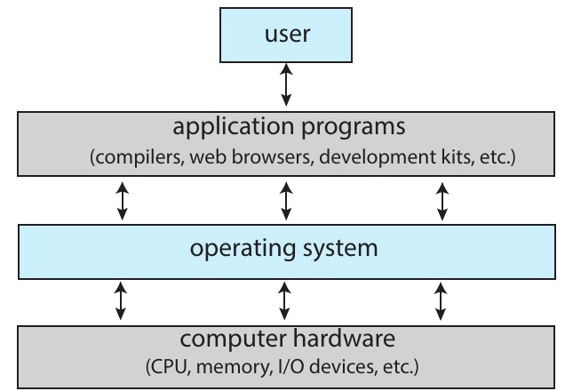

*Silberschatz, Figure 1.1 — Abstract view of the components of a computer system*

- The OS sits **between** hardware and applications.
- It directly controls hardware and provides a **clean interface** to programs.

> **[Computer Architecture]** A computer system is layered as: hardware → OS → applications → users. Each layer hides the complex details of the layer below and provides a simplified interface upward — this is called **abstraction**. Representative abstractions provided by the OS: processes (CPU), virtual memory (memory), files (disk).

### 2.3 Two Roles of the OS

**Resource Allocator:**

Manages and distributes **limited resources** efficiently and fairly:
- **CPU time** — which process runs when
- **Memory space** — allocation for each process
- **Storage & I/O** — disk access, device sharing

**Control Program:**

Controls the execution of user programs and prevents errors and misuse:
- **Execution management** — starting, stopping, scheduling programs
- **Error prevention** — catching illegal operations
- **Isolation guarantee** — mutual protection between processes

> **Exam Tip:** Resource allocator vs. control program are two perspectives on the role of the OS. The resource allocator focuses on "how to divide resources," while the control program focuses on "how to execute safely." When asked to describe the roles of the OS on an exam, it is best to mention both.

### 2.4 Dual-Mode Operation

**Dual-Mode Operation**

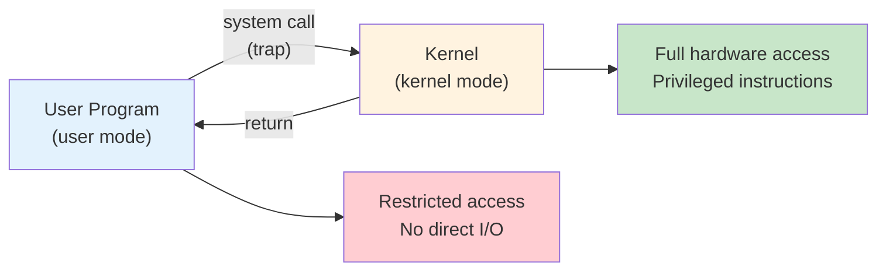

| Mode | Mode Bit | Executing Entity |
|:-----|:---------|:-----------------|
| **Kernel mode** | 0 | OS kernel — full hardware access |
| **User mode** | 1 | Applications — restricted access |

> **[Computer Architecture]** The mode bit is stored in the CPU's **status register (PSW: Program Status Word)**. In RISC-V, the SPP (Supervisor Previous Privilege) bit in the `sstatus` register serves this role. Since the hardware automatically changes the mode bit upon a trap, software cannot arbitrarily switch to kernel mode.

> **[Computer Architecture]** CPUs have regular instructions and **privileged instructions**. Privileged instructions (e.g., I/O instructions, interrupt control, timer configuration) can only be executed in kernel mode. If execution is attempted in user mode, the hardware generates a **trap** and transfers control to the OS. This is the core mechanism for OS self-protection.

### 2.5 System Calls

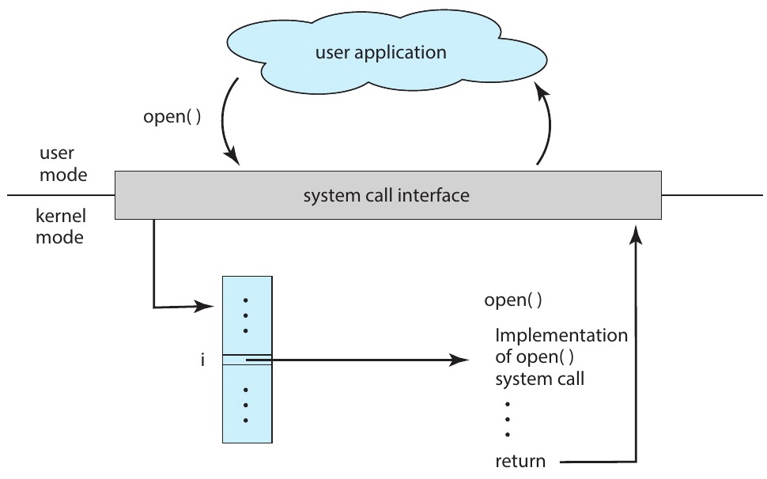

*Silberschatz, Figure 2.6 — The handling of a user application invoking the open() system call*

- **System Call** = the **only way** a user program can request OS services
- User program → C library → `syscall` instruction (trap) → kernel handles it → return
- Even a simple `cp in.txt out.txt` command generates **thousands** of system calls.

> **[Programming Languages]** The commonly used `printf()` in C is not a system call — it is a C library function. Internally, `printf()` buffers data and then calls the `write()` system call. In other words, library functions execute in user mode, and at the point where actual hardware access is needed, they switch to kernel mode via system calls. On Linux, the `strace` command can be used to view the list of system calls a program invokes.

> **Note:** System calls are identified by **system call numbers**. When a user program invokes a system call, the corresponding number is stored in a designated register (RISC-V uses `a7`, x86 uses `eax`) and then a trap occurs. The kernel reads this number and looks up the corresponding handler function in the **system call table**. In the Week 3 lab, you will directly examine the xv6 system call table (`syscall.c`).

### 2.6 How a Computer System Works

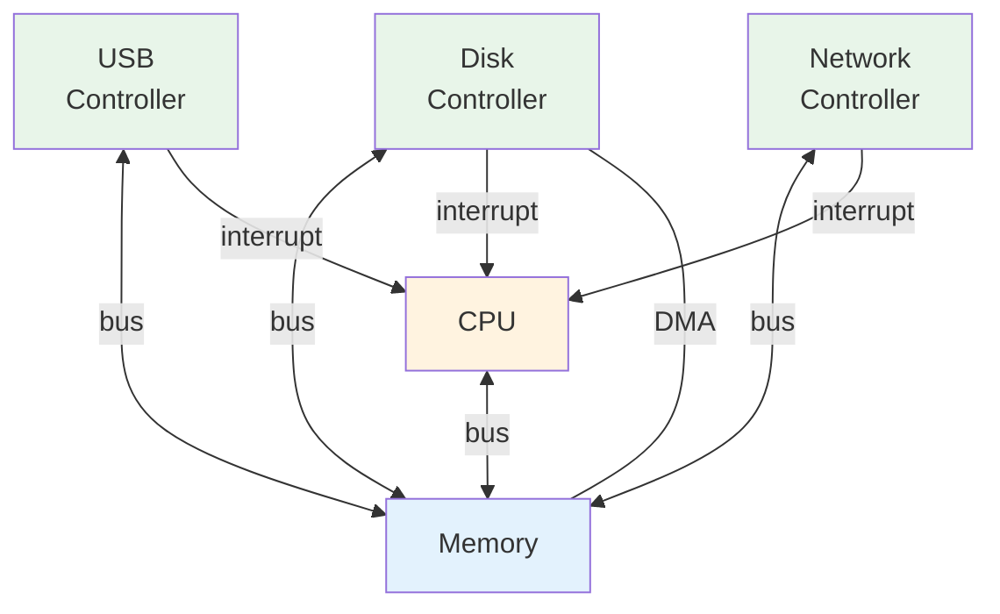

- Devices notify the CPU of completed work via **interrupts**.
- **DMA** (Direct Memory Access): a method for transferring large amounts of data without CPU intervention.

> **[Computer Architecture]** An **interrupt** is a mechanism by which a device signals the CPU, saying "I've finished my task — please handle it." The CPU pauses its current work and executes the corresponding Interrupt Service Routine (ISR) by consulting the Interrupt Vector Table (IVT). Without **DMA**, the CPU would have to transfer data byte by byte, which is highly inefficient. The DMA controller handles data transfer instead, and upon completion, notifies the CPU via an interrupt.

### 2.7 Storage-Device Hierarchy

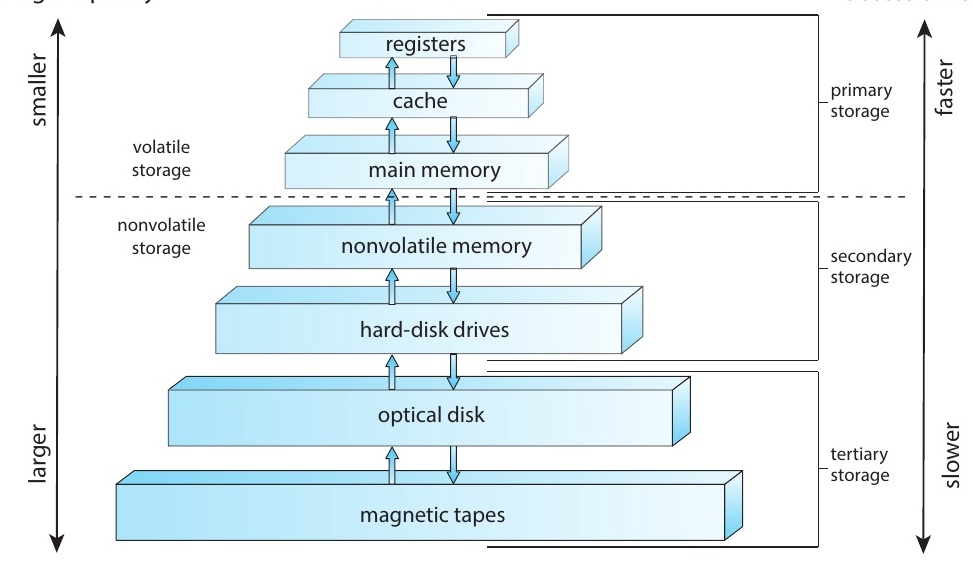

*Silberschatz, Figure 1.6 — Storage-device hierarchy*

| Level | Size | Access Time | Managed By |
|:------|:-----|:-----------|:-----------|
| **Registers** | < 1 KB | ~0.3 ns | Hardware |
| **Cache (L1/L2)** | < 64 MB | ~1–25 ns | Hardware |
| **Main Memory** | < 64 GB | ~100 ns | **OS** |
| **SSD** | < 4 TB | ~50 us | **OS** |
| **HDD** | < 20 TB | ~5 ms | **OS** |

> **[Computer Architecture]** Higher levels are faster, more expensive, and smaller in capacity. This hierarchy works because of the **locality** principle. **Temporal locality**: recently accessed data is likely to be accessed again soon. **Spatial locality**: data near recently accessed data is likely to be accessed soon. The OS manages storage devices at and below main memory, actively leveraging this hierarchy in virtual memory (Weeks 11–12).

### 2.8 OS Structure

| Structure | Core Idea | Example |
|:----------|:----------|:--------|
| **Monolithic** | All functions in a single kernel binary | Linux, traditional UNIX |
| **Microkernel** | Minimal kernel + user-space services | Mach, QNX |
| **Hybrid** | A mix of both | macOS (Mach + BSD), Windows |
| **Loadable Modules** | Core kernel + dynamic modules | Linux (LKM) |

Most modern OSes are **hybrid** — they take a pragmatic approach rather than adhering to pure theory.


> **Note:** A monolithic kernel runs all services in kernel space, making it fast, but a single bug can crash the entire system. A microkernel keeps only minimal functionality (IPC, scheduling) in the kernel and runs the rest in user space, making it more stable but incurring greater context-switching overhead. Linux is monolithic but also provides modular flexibility through LKMs.

### 2.9 xv6

- **xv6**: A simple Unix-like educational OS created by MIT
- Written in **C** for the **RISC-V** architecture.
- Approximately 10,000 lines of code — small enough to read in its entirety.
- Implements: processes, virtual memory, file system, shell
- We will **read, modify, and extend** xv6 throughout the semester.


```bash
git clone https://github.com/mit-pdos/xv6-riscv
cd xv6-riscv
make qemu    # Boot xv6 in the QEMU emulator
```

> **Note:** To build xv6, the following tools must be pre-installed:
> - **RISC-V cross compiler**: `riscv64-unknown-elf-gcc` (or `riscv64-linux-gnu-gcc`) — needed to generate RISC-V binaries on an x86/ARM host
> - **QEMU**: `qemu-system-riscv64` — emulates RISC-V hardware to run xv6
> - **make, git**: build system and source control
>
> Ubuntu/Debian: `sudo apt install gcc-riscv64-linux-gnu qemu-system-misc`
> macOS (Homebrew): `brew install riscv-tools qemu`

> **Note:** xv6 was originally developed for x86, but the RISC-V version is now primarily used. While the actual Linux kernel comprises tens of millions of lines, xv6 covers all core OS concepts in only about 10,000 lines, making it highly suitable for learning. Using it alongside the MIT 6.1810 (formerly 6.S081) course can greatly enhance understanding.

---

<br>

## 3. Semester Preview

### 3.1 Processes (Weeks 2–3)

**Process** = a program in execution, with its own memory and state.

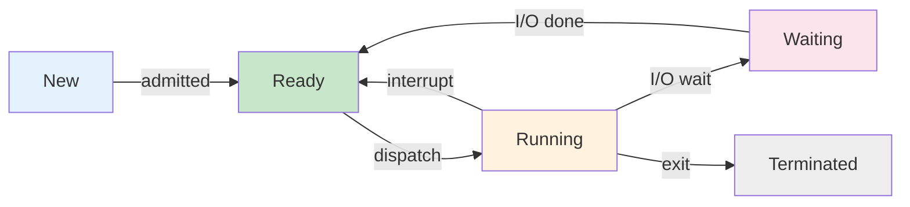

- Key system calls: **`fork()`**, **`exec()`**, **`wait()`**, **`exit()`**
- `fork()` creates a **copy** of the current process (parent → child).
- `exec()` **replaces** the process image with a new program.
- In xv6: `kernel/proc.c` — process table and state transitions

> **Note:** When `fork()` returns 0, it is the child process; when it returns a positive value (the child's PID), it is the parent process. This return value is used to branch the execution flow between parent and child. The pattern of calling `exec()` after `fork()` is the fundamental way Unix/Linux shells execute commands.

> **Note:** If processes only ran independently, it would be difficult to build useful systems. Most real systems have multiple processes that cooperate by exchanging data, which is called **Interprocess Communication (IPC)**. IPC mechanisms such as shared memory, message passing, pipes, and sockets are covered in detail in Week 3.

### 3.2 Threads & Concurrency (Weeks 4–5)

**Thread** = a lightweight execution unit that shares a process's address space

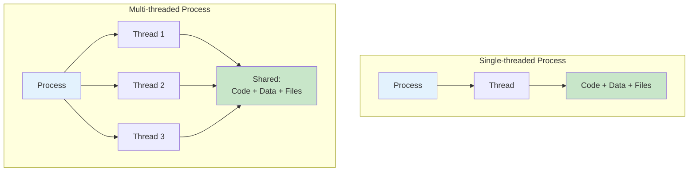

- Multiple threads within a single process → **parallelism** on multi-core CPUs
- Challenge: **race conditions** that arise when threads access shared data concurrently

> **Note:** The key difference between processes and threads: processes have independent address spaces, but threads within the same process **share** code, data, and files. Each thread has only its own stack and register set. While shared memory makes inter-thread communication fast, synchronization issues can arise.

### 3.3 CPU Scheduling (Weeks 6–7)

The OS decides **which process to run next** on the CPU.

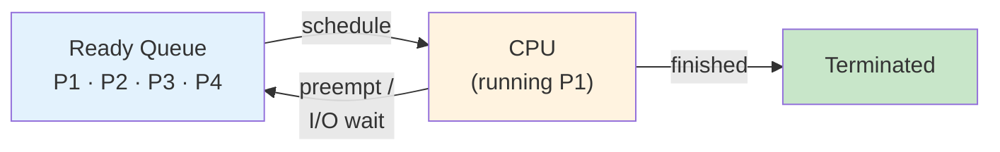

**Scheduling algorithms** balance competing goals:

| Algorithm | Idea | Trade-off |
|:----------|:-----|:----------|
| **FCFS** | First Come, First Served | Simple but suffers from the convoy effect |
| **SJF** | Shortest Job First | Optimal average wait time but hard to predict |
| **Round Robin** | Fixed time slice, cyclic | Fair with good response time |
| **Priority** | Highest priority first | Risk of starvation |

> **[Algorithms]** SJF is theoretically the optimal algorithm for minimizing average wait time, but in practice, the next job's CPU burst time cannot be known exactly. Therefore, prediction is done using exponential averaging based on past data. In Round Robin, if the time slice is too large, it becomes equivalent to FCFS; if too small, context-switching overhead increases.

### 3.4 Synchronization (Week 9)

When multiple threads share data, **coordination** is needed.

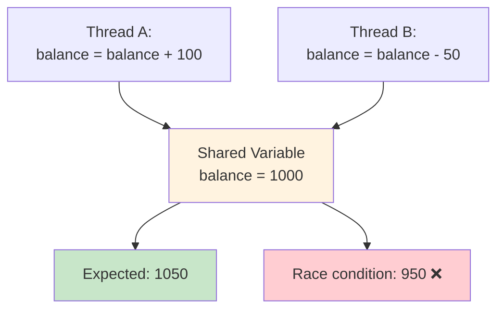

- **Critical Section**: a code region that accesses shared resources
- **Lock (Mutex)**: ensures only one thread can enter at a time
- **Semaphore** and **Condition Variable**: more flexible coordination tools
- Classic problems: producer-consumer, readers-writers, dining philosophers

> **Note:** In the diagram above, the reason balance can become 950: Thread A reads balance (1000), then Thread B also reads the same value (1000). If Thread B stores 950 first and then Thread A stores 1100, the result is 1100; if stored in the opposite order, the result is 950. This nondeterministic outcome is a race condition. To resolve this, **mutual exclusion** over the critical section is needed.

### 3.5 Deadlocks (Week 10)

**Deadlock** = a state where two or more processes are waiting for each other to release resources

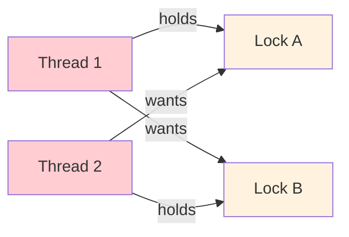

**Four conditions** (all must hold for deadlock): Mutual Exclusion · Hold and Wait · No Preemption · **Circular Wait**

**Solutions**: Lock Ordering · `trylock` + Back-off · Deadlock Detection and Recovery

> **[Discrete Mathematics]** Deadlocks can be modeled using a **Resource Allocation Graph**. If a **cycle** exists in this graph, deadlock may occur (when each resource type has a single instance, a cycle = deadlock). Breaking any one of the four conditions prevents deadlock; in practice, **preventing circular wait** (fixing the lock acquisition order) is most commonly used.

### 3.6 Memory Management (Weeks 11–12)

**Virtual Memory** gives each process its own independent address space.

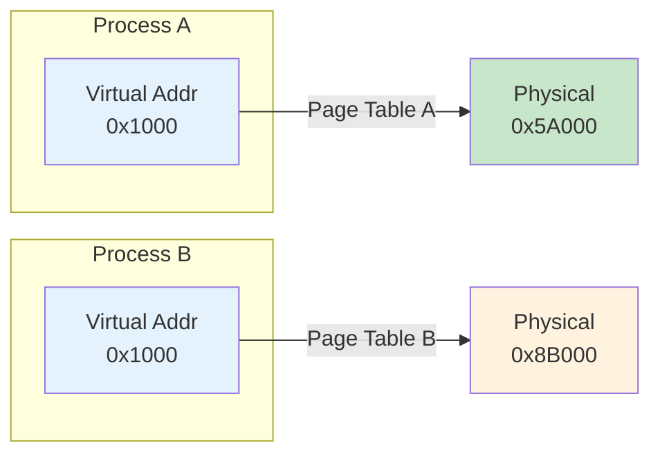

- Same virtual address → **different** physical locations (isolation!)
- **Page Table**: maps virtual pages to physical frames per process
- Enables **COW fork**, **lazy allocation**, **memory-mapped files**, and more
- In xv6: RISC-V **Sv39** — 3-level page table, 39-bit virtual address

> **[Computer Architecture]** To translate virtual addresses to physical addresses, the page table in memory must be consulted each time, which can double (or more) memory access latency. To solve this, CPUs include a cache called the **TLB (Translation Lookaside Buffer)** that stores recent translation results. COW (Copy-On-Write) fork is an optimization where during `fork()`, only the page table is shared instead of actually copying memory, and physical pages are copied only when a write occurs.

### 3.7 File Systems & Security (Weeks 13–14)

**File Systems** organize persistent data hierarchically.

| Layer | Component | Key Functions |
|:------|:----------|:-------------|
| 6 | **File Descriptors** | `open()`, `read()`, `write()`, `close()` |
| 5 | **Pathnames** | `namei()` — resolves `/path/to/file` |
| 4 | **Directories** | `dirlookup()`, `dirlink()` |
| 3 | **Inodes** | `ialloc()`, `readi()`, `writei()` |
| 2 | **Logging** | Crash safety through WAL (Write-Ahead Log) |
| 1 | **Buffer Cache** | `bread()`, `bwrite()` — disk block caching |
| 0 | **Disk** | Physical block device |

- Each layer depends **only on the layer below** — a clean, modular design.
- **Security** (Week 14): Protection Rings, Access Control, Encryption

> **[Data Structures]** The directory structure of a file system is a **tree** (starting from root `/`). An inode is a data structure that stores file metadata (size, permissions, data block locations, etc.), while file names are stored in directory entries. The reason a single file can have multiple names (hard links) is precisely because of this separated structure.

### 3.8 Course Roadmap

| Week | Topic | Week | Topic |
|:-----|:------|:-----|:------|
| **1** | Introduction + Coding Agents | **9** | Synchronization |
| **2–3** | Processes | **10** | Deadlocks |
| **4–5** | Threads & Concurrency | **11–12** | Memory Management |
| **6–7** | CPU Scheduling | **13** | File Systems |
| **8** | *Midterm Exam* | **14** | Security + Project Presentations |
| | | **15** | *Final Exam (Written)* |

---

<br>

## Summary

| Concept | Key Summary |
|:--------|:-----------|
| OS = Kernel | An always-running program that manages hardware resources |
| Two Roles of the OS | **Resource Allocator** (fair distribution) + **Control Program** (safe execution) |
| Dual Mode | User mode (restricted) / Kernel mode (full access) to protect the OS |
| System Calls | The only interface between applications and the kernel |
| Interrupts & DMA | Mechanism for devices to notify CPU of completion / bulk data transfer without CPU |
| Storage Hierarchy | Registers → Cache → Memory → SSD → HDD (higher = faster, more expensive, smaller) |
| OS Structure | Monolithic, Microkernel, Hybrid, Loadable Modules; most modern OSes are hybrid |
| xv6 | MIT educational OS; RISC-V, C language, ~10,000 lines; used throughout the semester |
| Key Topics | Processes, Threads, Scheduling, Synchronization, Memory, File Systems, Security |
| Textbook | Silberschatz, Operating System Concepts 10th edition |

---

<br>

## Appendix

- Next week: **Processes** — fork, exec, wait, pipe
- **Contact:** *[redacted]*

---
