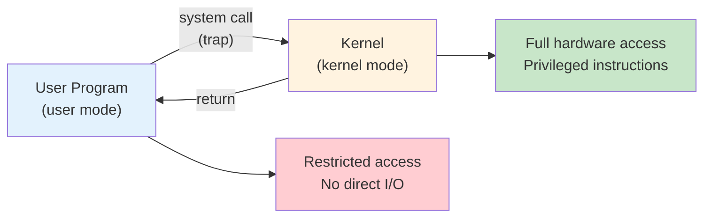
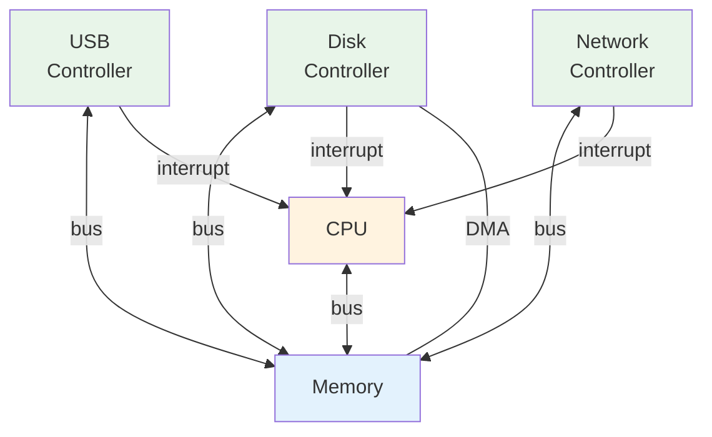
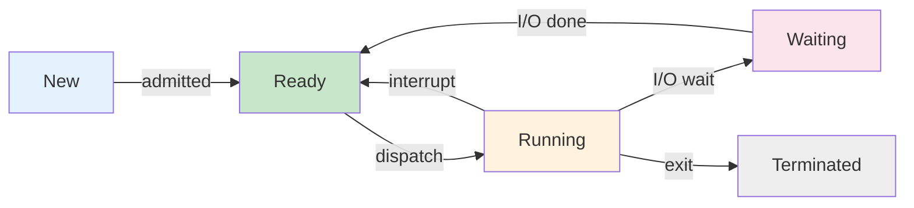
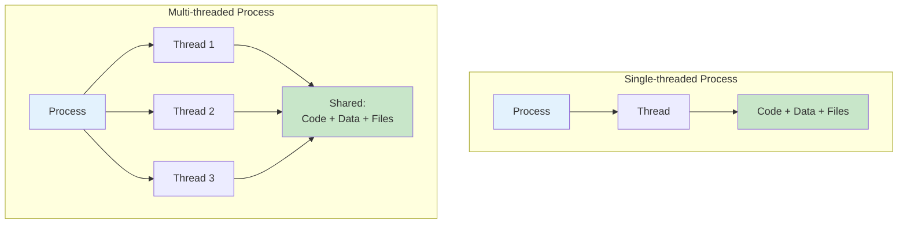
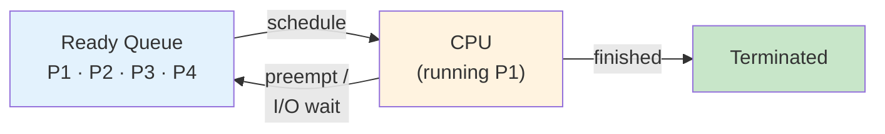
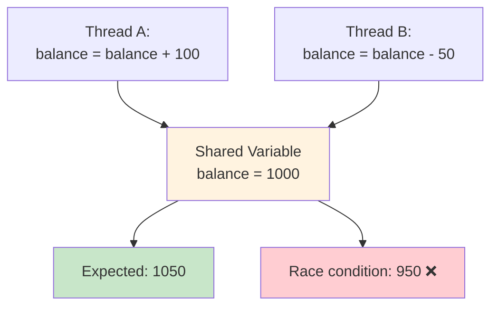
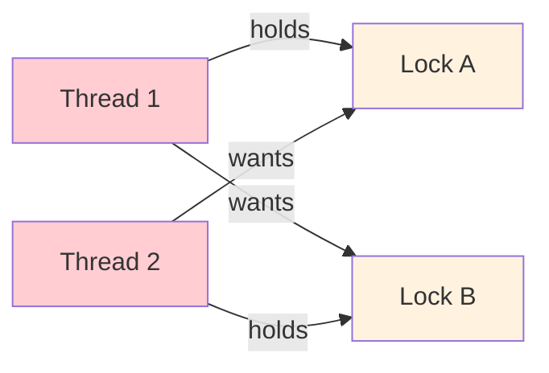
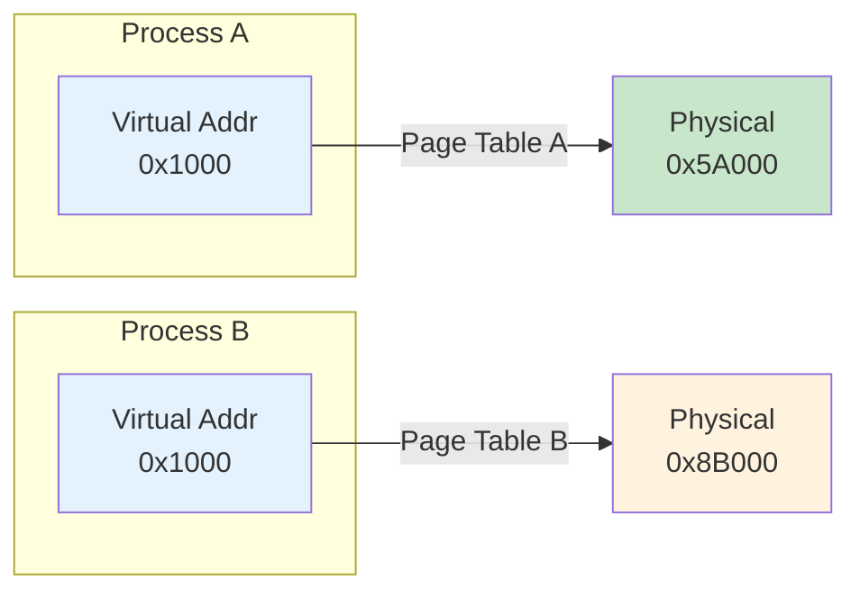

# W01 이론 — 운영체제 소개

> **최종 수정일:** 2026-03-17

---

## 목차

- [1. OT (오리엔테이션)](#1-ot-오리엔테이션)
  - [1.1 담당 교수](#11-담당-교수)
  - [1.2 강의 계획서](#12-강의-계획서)
  - [1.3 성적 평가](#13-성적-평가)
  - [1.4 과제](#14-과제)
  - [1.5 중간고사 & 기말고사](#15-중간고사--기말고사)
  - [1.6 기말 프로젝트](#16-기말-프로젝트)
  - [1.7 수업 형식](#17-수업-형식)
- [2. 운영체제란 무엇인가?](#2-운영체제란-무엇인가)
  - [2.1 정의](#21-정의)
  - [2.2 OS의 위치](#22-os의-위치)
  - [2.3 OS의 두 가지 역할](#23-os의-두-가지-역할)
  - [2.4 이중 모드 동작](#24-이중-모드-동작)
  - [2.5 시스템 콜](#25-시스템-콜)
  - [2.6 컴퓨터 시스템의 동작 방식](#26-컴퓨터-시스템의-동작-방식)
  - [2.7 저장 장치 계층](#27-저장-장치-계층)
  - [2.8 OS 구조](#28-os-구조)
  - [2.9 xv6](#29-xv6)
- [3. 학기 미리보기](#3-학기-미리보기)
  - [3.1 프로세스 (2~3주차)](#31-프로세스-23주차)
  - [3.2 스레드 & 동시성 (4~5주차)](#32-스레드--동시성-45주차)
  - [3.3 CPU 스케줄링 (6~7주차)](#33-cpu-스케줄링-67주차)
  - [3.4 동기화 (9주차)](#34-동기화-9주차)
  - [3.5 교착 상태 (10주차)](#35-교착-상태-10주차)
  - [3.6 메모리 관리 (11~12주차)](#36-메모리-관리-1112주차)
  - [3.7 파일 시스템 & 보안 (13~14주차)](#37-파일-시스템--보안-1314주차)
  - [3.8 수업 로드맵](#38-수업-로드맵)
- [요약](#요약)
- [부록](#부록)

---

<br>

## 1. OT (오리엔테이션)

### 1.1 담당 교수

**이웅기(Unggi Lee)**, codingchild@korea.ac.kr

- 고려대학교 세종캠퍼스 컴퓨터소프트웨어학과 조교수
- 경력:
  - 조선대학교 컴퓨터공학과 조교수
  - 글로벌 에듀테크 AI/NLP 엔지니어 (Enuma, 아이스크림에듀)
  - 초등학교 교사
- 연구 ([Google Scholar](https://scholar.google.co.kr/citations?user=xnsGrp0AAAAJ)):
  - AIED: 교육에서의 생성형 AI, 교수학적 정렬(Pedagogical Alignment), 지식 추적(Knowledge Tracing)
  - NLP & 로보틱스: 대규모 언어 모델(LLMs), 시각-언어-행동 모델(VLA)
- 연구실 활동 ([Lab](https://codingchild2424.github.io/lab-website/)):
  - 조선대학교 학부생들과 VLA 프리프린트 게재
  - Upstage, Neudive 등과의 산학 협력
  - 미국, 싱가포르, 영국 연구자들과의 공동 연구

### 1.2 강의 계획서

- 강의 계획서는 **LMS**에서 확인할 수 있다.
- 총 **15주**
  - 8주차 — **중간고사**
  - 15주차 — **기말고사**

### 1.3 성적 평가

| 항목 | 비중 |
|:-----|:-----|
| 과제(Assignment) | **10%** |
| 중간고사 (필기) | **30%** |
| 기말고사 (필기) | **30%** |
| 기말고사 (프로젝트) | **30%** |
| 출석 | 0% |

> 단, 전체 수업 시수의 **1/3** 이상 결석 시 성적이 부여되지 않는다.

### 1.4 과제

**수업 내 퀴즈: 5%**
- **10회** 퀴즈 → 각 **0.5%**
- 3, 4, 5, 6, 7, 9, 10, 11, 12, 13주차

**가정 과제(Take-home Assignment): 5%**
- **5회** 과제 → 각 **1%**
- 2, 3, 4, 5, 6주차

### 1.5 중간고사 & 기말고사

- **손글씨 작성** (전자기기 사용 불가)
- 각 **1시간**

### 1.6 기말 프로젝트

- **9주차**부터 시작, 팀당 **3~4명**
- **코딩 에이전트** 무제한 사용 가능 (Claude Code, Codex, Gemini CLI, OpenCode 등)
- 수행 내용:
  - OS 프로토타입을 **설계 및 개발** (예: xv6에 새 기능 추가, LLM 기반 OS 개념 설계)
  - **OS 명세 문서** 및 **프로젝트 보고서** 작성
  - **발표** (대면, 14주차)
- 평가: 교수 **15%** + 학생 동료 평가 **15%**

### 1.7 수업 형식

| 교시 | 내용 |
|:-----|:-----|
| **1교시** | 이론 강의 (Part 1) + 퀴즈 |
| **2교시** | 이론 강의 (Part 2) |
| **3교시** | 실습(Hands-on Lab) |

- 교재: Silberschatz, **Operating System Concepts** 10판
- 실습 참고: **xv6** (RISC-V), MIT 6.1810

---

<br>

## 2. 운영체제란 무엇인가?

### 2.1 정의

- 컴퓨터에서 **항상 실행되고 있는 하나의 프로그램** = **커널(Kernel)**
- 그 외의 모든 것은 **시스템 프로그램(System Program)** 또는 **응용 프로그램(Application Program)**

**OS는 정부와 같다:**
> OS 자체가 유용한 기능을 수행하는 것이 아니라, 다른 프로그램들이 유용한 작업을 할 수 있는 **환경(environment)**을 제공한다.

> **시험 팁:** "OS란 무엇인가?"라는 문제가 나오면, 커널(Kernel)이라는 키워드를 반드시 포함해야 한다. 커널 외의 프로그램(셸, 컴파일러, GUI 등)은 시스템 프로그램에 해당하며, 워드프로세서·게임 등은 응용 프로그램에 해당한다.

### 2.2 OS의 위치


*Silberschatz, Figure 1.1 — 컴퓨터 시스템 구성 요소의 추상적 관점*

- OS는 하드웨어와 응용 프로그램 **사이에** 위치한다.
- 하드웨어를 직접 제어하고, 프로그램에 **깔끔한 인터페이스(clean interface)**를 제공한다.

> **[컴퓨터구조]** 컴퓨터 시스템은 하드웨어 → OS → 응용 프로그램 → 사용자 순으로 계층화되어 있다. 각 계층은 아래 계층의 복잡한 세부 사항을 숨기고 단순화된 인터페이스를 위로 제공하는데, 이를 **추상화(abstraction)**라고 한다. OS가 제공하는 대표적 추상화: 프로세스(CPU), 가상 메모리(메모리), 파일(디스크).

### 2.3 OS의 두 가지 역할

**자원 할당자(Resource Allocator):**

**한정된 자원**을 효율적이고 공정하게 관리·분배한다:
- **CPU 시간** — 어떤 프로세스가 언제 실행되는지
- **메모리 공간** — 각 프로세스에 대한 할당
- **저장 장치 & I/O** — 디스크 접근, 장치 공유

**제어 프로그램(Control Program):**

사용자 프로그램의 실행을 제어하고, 오류와 오용을 방지한다:
- **실행 관리** — 프로그램 시작, 정지, 스케줄링
- **오류 방지** — 불법 연산 포착
- **격리 보장** — 프로세스 간 상호 보호

> **시험 팁:** 자원 할당자 vs 제어 프로그램은 OS의 역할을 바라보는 두 가지 관점이다. 자원 할당자는 "어떻게 나눌 것인가"에 초점을 맞추고, 제어 프로그램은 "어떻게 안전하게 실행할 것인가"에 초점을 맞춘다. 시험에서 OS의 역할을 서술하라고 하면 이 두 가지를 모두 언급하는 것이 좋다.

### 2.4 이중 모드 동작

**이중 모드 동작(Dual-Mode Operation)**



| 모드 | 모드 비트 | 실행 주체 |
|:-----|:---------|:---------|
| **커널 모드(Kernel mode)** | 0 | OS 커널 — 하드웨어 전체 접근 가능 |
| **사용자 모드(User mode)** | 1 | 응용 프로그램 — 접근 제한 |

> **[컴퓨터구조]** 모드 비트는 CPU의 **상태 레지스터(Status Register, PSW: Program Status Word)**에 저장된다. RISC-V에서는 `sstatus` 레지스터의 SPP(Supervisor Previous Privilege) 비트가 이 역할을 수행한다. 하드웨어가 트랩 발생 시 자동으로 모드 비트를 변경하므로, 소프트웨어가 임의로 커널 모드로 전환하는 것은 불가능하다.

> **[컴퓨터구조]** CPU에는 일반 명령어와 **특권 명령어(privileged instruction)**가 있다. 특권 명령어(예: I/O 명령, 인터럽트 제어, 타이머 설정 등)는 커널 모드에서만 실행 가능하며, 사용자 모드에서 실행을 시도하면 하드웨어가 **트랩(trap)**을 발생시켜 OS에 제어를 넘긴다. 이것이 OS 자기 보호의 핵심 메커니즘이다.

### 2.5 시스템 콜


*Silberschatz, Figure 2.6 — 사용자 애플리케이션이 open() 시스템 콜을 호출하는 과정*

- **시스템 콜(System Call)** = 사용자 프로그램이 OS 서비스를 요청하는 **유일한 방법**
- 사용자 프로그램 → C 라이브러리 → `syscall` 명령어 (트랩) → 커널이 처리 → 반환
- 단순한 `cp in.txt out.txt` 명령어도 **수천 번**의 시스템 콜을 발생시킨다.

> **[프로그래밍언어]** C에서 자주 사용하는 `printf()`는 시스템 콜이 아니라 C 라이브러리 함수이다. 내부적으로 `printf()`는 버퍼링 후 `write()` 시스템 콜을 호출한다. 즉, 라이브러리 함수는 사용자 모드에서 실행되고, 실제 하드웨어 접근이 필요한 시점에 시스템 콜을 통해 커널 모드로 전환된다. Linux에서 `strace` 명령어를 사용하면 프로그램이 호출하는 시스템 콜 목록을 확인할 수 있다.

> **참고:** 시스템 콜은 **번호(system call number)**로 식별된다. 사용자 프로그램이 시스템 콜을 호출하면, 해당 시스템 콜 번호가 지정된 레지스터(RISC-V에서는 `a7`, x86에서는 `eax`)에 저장된 뒤 트랩이 발생한다. 커널은 이 번호를 읽어 **시스템 콜 테이블(syscall table)**에서 대응하는 핸들러 함수를 찾아 실행한다. 3주차 실습에서 xv6의 시스템 콜 테이블(`syscall.c`)을 직접 확인하게 된다.

### 2.6 컴퓨터 시스템의 동작 방식



- 장치는 **인터럽트(interrupt)**를 통해 작업 완료를 알린다.
- **DMA**(Direct Memory Access): CPU 개입 없이 대량 데이터를 전송하는 방식이다.

> **[컴퓨터구조]** **인터럽트(Interrupt)**란 장치가 CPU에 "작업이 끝났으니 처리해 달라"고 신호를 보내는 메커니즘이다. CPU는 현재 작업을 중단하고, 인터럽트 벡터 테이블(IVT)을 참조하여 해당 인터럽트 서비스 루틴(ISR)을 실행한다. **DMA**가 없으면 CPU가 직접 바이트 단위로 데이터를 옮겨야 하므로 매우 비효율적이다. DMA 컨트롤러가 데이터 전송을 대신 수행하고, 완료 후 인터럽트로 CPU에 알린다.

### 2.7 저장 장치 계층


*Silberschatz, Figure 1.6 — 저장 장치 계층 구조*

| 수준 | 크기 | 접근 시간 | 관리 주체 |
|:-----|:-----|:---------|:---------|
| **레지스터(Registers)** | < 1 KB | ~0.3 ns | 하드웨어 |
| **캐시(Cache, L1/L2)** | < 64 MB | ~1–25 ns | 하드웨어 |
| **주기억장치(Main Memory)** | < 64 GB | ~100 ns | **OS** |
| **SSD** | < 4 TB | ~50 us | **OS** |
| **HDD** | < 20 TB | ~5 ms | **OS** |

> **[컴퓨터구조]** 위로 갈수록 빠르고, 비싸고, 용량이 작다. 이 계층 구조가 작동하는 이유는 **지역성(locality)** 원리 때문이다. **시간적 지역성**: 최근 접근한 데이터는 곧 다시 접근될 가능성이 높다. **공간적 지역성**: 접근한 데이터 근처의 데이터가 곧 접근될 가능성이 높다. OS는 주기억장치 이하의 저장 장치를 관리하며, 가상 메모리(11~12주차)에서 이 계층 구조를 적극 활용한다.

### 2.8 OS 구조

| 구조 | 핵심 아이디어 | 예시 |
|:-----|:-------------|:-----|
| **모놀리식(Monolithic)** | 모든 기능을 하나의 커널 바이너리에 | Linux, 전통적 UNIX |
| **마이크로커널(Microkernel)** | 최소한의 커널 + 사용자 공간 서비스 | Mach, QNX |
| **하이브리드(Hybrid)** | 두 가지의 혼합 | macOS (Mach + BSD), Windows |
| **적재 가능 모듈(Loadable Modules)** | 핵심 커널 + 동적 모듈 | Linux (LKM) |

대부분의 현대 OS는 **하이브리드(Hybrid)** — 순수한 이론보다는 실용적 접근을 취한다.


> **참고:** 모놀리식 커널은 모든 서비스가 커널 공간에서 실행되므로 빠르지만, 하나의 버그가 전체 시스템을 다운시킬 수 있다. 마이크로커널은 최소한의 기능(IPC, 스케줄링)만 커널에 두고 나머지를 사용자 공간에서 실행하므로 안정적이지만, 컨텍스트 스위칭 오버헤드가 크다. Linux는 모놀리식이지만 LKM을 통해 모듈 방식의 유연성도 갖추고 있다.

### 2.9 xv6

- **xv6**: MIT에서 만든 간단한 Unix 계열 교육용 OS
- **RISC-V** 아키텍처를 위해 **C**로 작성되었다.
- 약 10,000줄의 코드 — 전체를 읽을 수 있을 만큼 작다.
- 구현 내용: 프로세스, 가상 메모리, 파일 시스템, 셸
- 학기 내내 xv6를 **읽고, 수정하고, 확장**할 예정이다.


```bash
git clone https://github.com/mit-pdos/xv6-riscv
cd xv6-riscv
make qemu    # QEMU 에뮬레이터에서 xv6 부팅
```

> **참고:** xv6를 빌드하려면 다음 도구가 사전에 설치되어 있어야 한다:
> - **RISC-V 크로스 컴파일러**: `riscv64-unknown-elf-gcc` (또는 `riscv64-linux-gnu-gcc`) — x86/ARM 호스트에서 RISC-V 바이너리를 생성하기 위해 필요하다
> - **QEMU**: `qemu-system-riscv64` — RISC-V 하드웨어를 에뮬레이션하여 xv6를 실행한다
> - **make, git**: 빌드 시스템과 소스 관리
>
> Ubuntu/Debian: `sudo apt install gcc-riscv64-linux-gnu qemu-system-misc`
> macOS (Homebrew): `brew install riscv-tools qemu`

> **참고:** xv6는 원래 x86용으로 개발되었으나, 현재는 RISC-V 버전이 주로 사용된다. 실제 리눅스 커널은 수천만 줄이지만, xv6는 약 1만 줄로 핵심 OS 개념을 모두 포함하고 있어 학습에 매우 적합하다. MIT 6.1810(구 6.S081) 강의와 함께 활용하면 이해도를 크게 높일 수 있다.

---

<br>

## 3. 학기 미리보기

### 3.1 프로세스 (2~3주차)

**프로세스(Process)** = 실행 중인 프로그램으로, 자신만의 메모리와 상태를 갖는다.



- 핵심 시스템 콜: **`fork()`**, **`exec()`**, **`wait()`**, **`exit()`**
- `fork()`는 현재 프로세스의 **복사본**을 생성한다 (부모 → 자식).
- `exec()`는 프로세스 이미지를 새로운 프로그램으로 **대체**한다.
- xv6에서: `kernel/proc.c` — 프로세스 테이블과 상태 전이

> **참고:** `fork()` 호출 시 반환값이 0이면 자식 프로세스, 양수(자식의 PID)이면 부모 프로세스이다. 이 반환값으로 부모와 자식의 실행 흐름을 분기한다. `fork()` 후 `exec()`를 호출하는 패턴은 Unix/Linux 셸이 명령어를 실행하는 기본 방식이다.

> **참고:** 프로세스가 독립적으로만 실행되면 유용한 시스템을 구성하기 어렵다. 대부분의 실제 시스템은 여러 프로세스가 데이터를 주고받으며 협력하는데, 이를 **프로세스 간 통신(IPC, Interprocess Communication)**이라 한다. 공유 메모리, 메시지 전달, 파이프, 소켓 등의 IPC 메커니즘은 3주차에서 상세히 다룬다.

### 3.2 스레드 & 동시성 (4~5주차)

**스레드(Thread)** = 프로세스의 주소 공간을 공유하는 경량 실행 단위



- 하나의 프로세스 내 다수의 스레드 → 멀티코어 CPU에서 **병렬성(parallelism)**
- 과제: 스레드가 공유 데이터에 동시에 접근할 때 발생하는 **경쟁 조건(race condition)**

> **참고:** 프로세스 vs 스레드의 핵심 차이: 프로세스는 독립된 주소 공간을 가지지만, 스레드는 같은 프로세스 내에서 코드·데이터·파일을 **공유**한다. 각 스레드는 자신만의 스택(stack)과 레지스터 세트만 별도로 가진다. 공유 메모리 덕분에 스레드 간 통신이 빠르지만, 동기화 문제가 발생할 수 있다.

### 3.3 CPU 스케줄링 (6~7주차)

OS는 CPU에서 **다음에 어떤 프로세스를 실행할지** 결정한다.



**스케줄링 알고리즘**은 상충하는 목표들 사이에서 균형을 잡는다:

| 알고리즘 | 아이디어 | 트레이드오프 |
|:---------|:---------|:-----------|
| **FCFS** | 선착순(First Come, First Served) | 단순하지만 호위 효과(convoy effect) 발생 |
| **SJF** | 최단 작업 우선(Shortest Job First) | 최적 평균 대기 시간이지만 예측 어려움 |
| **라운드 로빈(Round Robin)** | 고정 타임 슬라이스, 순환 | 공정하고 응답 시간이 좋다 |
| **우선순위(Priority)** | 최고 우선순위 우선 | 기아(starvation) 위험 |

> **[알고리즘]** SJF는 이론적으로 평균 대기 시간을 최소화하는 최적 알고리즘이지만, 실제로는 다음 작업의 CPU 버스트 시간을 정확히 알 수 없다. 따라서 과거 데이터를 기반으로 지수 평균(exponential averaging)으로 예측한다. 라운드 로빈에서 타임 슬라이스가 너무 크면 FCFS와 같아지고, 너무 작으면 컨텍스트 스위칭 오버헤드가 커진다.

### 3.4 동기화 (9주차)

여러 스레드가 데이터를 공유할 때, **조율(coordination)**이 필요하다.



- **임계 구역(Critical Section)**: 공유 자원에 접근하는 코드 영역
- **락(Lock, 뮤텍스)**: 한 번에 하나의 스레드만 진입하도록 보장
- **세마포어(Semaphore)**와 **조건 변수(Condition Variable)**: 더 유연한 조율 수단
- 고전적 문제: 생산자-소비자, 독자-저자, 식사하는 철학자

> **참고:** 위 다이어그램에서 balance가 950이 되는 이유: Thread A가 balance(1000)를 읽은 후 Thread B도 같은 값(1000)을 읽고, Thread B가 먼저 950을 저장한 뒤 Thread A가 1100을 저장하면 1100이 되거나, 반대 순서로 저장되면 950이 된다. 이런 비결정적 결과가 경쟁 조건이다. 이를 해결하기 위해 임계 구역에 대한 **상호 배제(mutual exclusion)**가 필요하다.

### 3.5 교착 상태 (10주차)

**교착 상태(Deadlock)** = 둘 이상의 프로세스가 서로 상대방이 자원을 해제하기를 기다리는 상태



**네 가지 조건** (모두 충족되어야 교착 상태 발생): 상호 배제(Mutual Exclusion) · 점유 대기(Hold and Wait) · 비선점(No Preemption) · **순환 대기(Circular Wait)**

**해결 방법**: 락 순서 지정(Lock Ordering) · `trylock` + 백오프(Back-off) · 교착 상태 탐지 및 회복

> **[이산수학]** 교착 상태는 **자원 할당 그래프(Resource Allocation Graph)**로 모델링할 수 있다. 이 그래프에 **사이클(cycle)**이 존재하면 교착 상태가 발생할 수 있다(자원 인스턴스가 하나인 경우 사이클 = 교착 상태). 네 가지 조건 중 하나라도 깨면 교착 상태를 예방할 수 있으며, 실무에서는 주로 **순환 대기를 방지**하는 방법(락 획득 순서를 고정)을 사용한다.

### 3.6 메모리 관리 (11~12주차)

**가상 메모리(Virtual Memory)**는 각 프로세스에 자신만의 독립적인 주소 공간을 제공한다.



- 같은 가상 주소 → **다른** 물리적 위치 (격리!)
- **페이지 테이블(Page Table)**: 프로세스별로 가상 페이지를 물리 프레임에 매핑
- **COW fork**, **지연 할당(lazy allocation)**, **메모리 매핑 파일** 등을 가능하게 한다.
- xv6에서: RISC-V **Sv39** — 3단계 페이지 테이블, 39비트 가상 주소

> **[컴퓨터구조]** 가상 주소를 물리 주소로 변환하려면 매번 메모리에 있는 페이지 테이블을 참조해야 하므로, 메모리 접근이 2배(이상)로 느려질 수 있다. 이를 해결하기 위해 CPU 내부에 **TLB(Translation Lookaside Buffer)**라는 캐시를 두어 최근 변환 결과를 저장한다. COW(Copy-On-Write) fork는 `fork()` 시 메모리를 실제로 복사하지 않고 페이지 테이블만 공유한 뒤, 쓰기가 발생할 때만 복사하는 최적화 기법이다.

### 3.7 파일 시스템 & 보안 (13~14주차)

**파일 시스템(File System)**은 영속적 데이터를 계층적으로 구성한다.

| 계층 | 구성 요소 | 주요 함수 |
|:-----|:---------|:---------|
| 6 | **파일 디스크립터(File Descriptors)** | `open()`, `read()`, `write()`, `close()` |
| 5 | **경로명(Pathnames)** | `namei()` — `/path/to/file` 해석 |
| 4 | **디렉토리(Directories)** | `dirlookup()`, `dirlink()` |
| 3 | **아이노드(Inodes)** | `ialloc()`, `readi()`, `writei()` |
| 2 | **로깅(Logging)** | WAL(Write-Ahead Log)을 통한 충돌 안전성 |
| 1 | **버퍼 캐시(Buffer Cache)** | `bread()`, `bwrite()` — 디스크 블록 캐싱 |
| 0 | **디스크(Disk)** | 물리적 블록 장치 |

- 각 계층은 **아래 계층에만** 의존한다 — 깔끔하고 모듈화된 설계이다.
- **보안(Security)** (14주차): 보호 링(Protection Rings), 접근 제어(Access Control), 암호화(Encryption)

> **[자료구조]** 파일 시스템의 디렉토리 구조는 **트리(tree)** 형태이다 (루트 `/`에서 시작). 아이노드(inode)는 파일의 메타데이터(크기, 권한, 데이터 블록 위치 등)를 저장하는 자료구조로, 파일 이름은 디렉토리 엔트리에 저장된다. 하나의 파일에 여러 이름(하드 링크)이 있을 수 있는 이유가 바로 이 분리된 구조 때문이다.

### 3.8 수업 로드맵

| 주차 | 주제 | 주차 | 주제 |
|:-----|:-----|:-----|:-----|
| **1** | 개론 + 코딩 에이전트 | **9** | 동기화(Synchronization) |
| **2~3** | 프로세스(Process) | **10** | 교착 상태(Deadlocks) |
| **4~5** | 스레드(Thread) & 동시성 | **11~12** | 메모리 관리(Memory Management) |
| **6~7** | CPU 스케줄링(CPU Scheduling) | **13** | 파일 시스템(File System) |
| **8** | *중간고사* | **14** | 보안(Security) + 프로젝트 발표 |
| | | **15** | *기말고사 (필기)* |

---

<br>

## 요약

| 개념 | 핵심 정리 |
|:-----|:---------|
| OS = 커널 | 하드웨어 자원을 관리하는, 항상 실행 중인 프로그램 |
| OS의 두 역할 | **자원 할당자** (공정한 분배) + **제어 프로그램** (안전한 실행) |
| 이중 모드 | 사용자 모드(제한) / 커널 모드(전체 접근)로 OS를 보호한다 |
| 시스템 콜 | 응용 프로그램과 커널 사이의 유일한 인터페이스 |
| 인터럽트 & DMA | 장치가 CPU에 완료를 알리는 메커니즘 / CPU 없이 대량 데이터 전송 |
| 저장 장치 계층 | 레지스터 → 캐시 → 메모리 → SSD → HDD (위로 갈수록 빠르고, 비싸고, 작다) |
| OS 구조 | 모놀리식, 마이크로커널, 하이브리드, 적재 가능 모듈; 대부분 현대 OS는 하이브리드 |
| xv6 | MIT 교육용 OS; RISC-V, C 언어, ~10,000줄; 학기 내내 활용 |
| 핵심 주제 | 프로세스, 스레드, 스케줄링, 동기화, 메모리, 파일 시스템, 보안 |
| 교재 | Silberschatz, Operating System Concepts 10판 |

---

<br>

## 부록

- 다음 주: **프로세스(Process)** — fork, exec, wait, pipe
- **문의:** codingchild@korea.ac.kr

---
