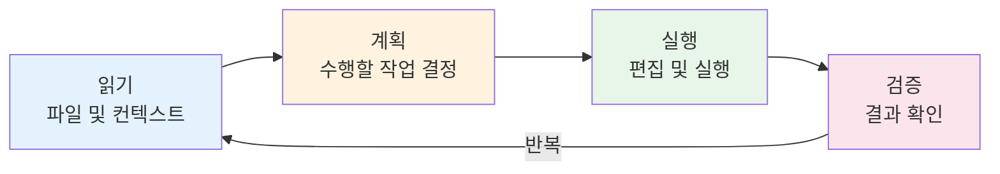
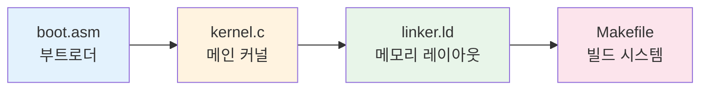

# 1주차 실습 — 코딩 에이전트

> **최종 수정일:** 2026-03-21

> **선수 지식**: W01 이론 개념 (OS 정의, 이중 모드, 시스템 콜).
>
> **학습 목표**: 이 실습을 완료하면 다음을 할 수 있어야 한다:
> 1. 코딩 에이전트(Coding Agent)를 설치하고 인증할 수 있다 (예: Gemini CLI, Claude Code)
> 2. 에이전트에게 실제 작업을 위임하고 결과물을 비판적으로 평가할 수 있다
> 3. RALPH 기법을 적용하여 에이전트 생성 결과물을 반복적으로 개선할 수 있다
> 4. 최소한의 OS가 어떻게 구성되는지 이해할 수 있다 (부트로더, 커널, 링커 스크립트)

---

## 목차

- [1. 실습 개요](#1-실습-개요)
- [2. 코딩 에이전트란?](#2-코딩-에이전트란)
- [3. 사용 가능한 에이전트](#3-사용-가능한-에이전트)
- [4. 과제 1 — 코딩 에이전트 설치](#4-과제-1--코딩-에이전트-설치)
- [5. 과제 2 — 파일 정리](#5-과제-2--파일-정리)
- [6. 과제 3 — GitHub 저장소 문서화](#6-과제-3--github-저장소-문서화)
- [7. 과제 4 — RALPH 기법](#7-과제-4--ralph-기법)
  - [7.1 RALPH 실전 적용](#71-ralph-실전-적용)
- [8. 과제 5 — 미니 OS 구축](#8-과제-5--미니-os-구축)
  - [8.1 관찰할 점](#81-관찰할-점)
- [요약](#요약)
- [부록](#부록)

---

<br>

## 1. 실습 개요

- **목표**: AI 기반 코딩 에이전트(Coding Agent)를 설치하고 실제 개발 작업에 활용한다.
- **소요 시간**: 약 50분
- **제출물**: 없음 — 탐색형 실습
- 이 도구들은 **학기 전체**에 걸쳐 실습 및 과제에 사용된다.


---

<br>

## 2. 코딩 에이전트란?

**컨텍스트를 이해**하여 코드를 생성하는 AI 기반 CLI 도구이다.



- 파일 시스템을 읽고, 명령을 실행하고, 자율적으로 편집할 수 있다.
- 활용 분야: 스캐폴딩(scaffolding), 리팩토링, 문서화, 디버깅

> **참고:** **스캐폴딩(scaffolding)** 이란 프로젝트의 초기 뼈대(디렉토리 구조, 설정 파일, 보일러플레이트 코드 등)를 자동으로 생성하는 것을 뜻한다. 건축에서 공사용 비계(scaffold)를 먼저 세우는 것에서 유래한 용어이다. 예를 들어 "React 프로젝트를 생성해줘"라고 하면 에이전트가 `package.json`, `src/` 디렉토리, 기본 컴포넌트 파일 등을 한꺼번에 만들어 준다.

> **예시**: _"디버그 및 릴리스 타겟이 포함된 C 프로젝트용 Makefile을 작성해줘"_
> 에이전트: 디렉토리 확인 → Makefile 작성 → 빌드 성공 확인

> **핵심:** 코딩 에이전트는 단순한 코드 자동완성(Copilot 등)과 달리, 프로젝트 전체 맥락을 파악하여 여러 파일을 동시에 읽고, 수정하고, 명령어를 실행할 수 있는 자율적인 도구이다. 기존의 ChatGPT 웹 인터페이스와 달리 로컬 파일 시스템에 직접 접근하여 작업을 수행한다는 점이 핵심적인 차이이다.

---

<br>

## 3. 사용 가능한 에이전트

| 에이전트 | 가격 | 설명 |
|:---------|:-----|:-----|
|  **Gemini CLI** | 무료 (1일 1000회) | Google의 에이전트. 기본 선택으로 적합하다. |
|  **Claude Code** | 유료 | Anthropic의 에이전트. 강력한 다중 파일 추론 능력이 있다. |
|  **Codex CLI** | 유료 | OpenAI의 에이전트. 오픈소스 CLI이다. |

기타: **OpenCode** (오픈소스 하네스 — 오픈소스 LLM을 포함한 모든 모델 사용 가능)

> **참고:** Gemini CLI는 무료이므로 실습용으로 부담 없이 사용 가능하다. Claude Code는 복잡한 멀티파일 프로젝트에서 강점이 있고, Codex CLI는 오픈소스라 커스터마이징이 가능하다. 먼저 무료인 Gemini CLI로 시작한 뒤 필요에 따라 다른 에이전트도 시도해 보는 것을 권장한다.

---

<br>

## 4. 과제 1 — 코딩 에이전트 설치

공식 문서를 참고하여 코딩 에이전트를 최소 하나 이상 설치한다.

**설치 명령어:**

```bash
npm install -g @google/gemini-cli           # Gemini CLI (무료)
npm install -g @anthropic-ai/claude-code    # Claude Code (유료)
```

**설치 확인:**

```bash
gemini --version    # 또는: claude --version
```

**확인 사항:**
- CLI가 오류 없이 실행되는지
- 인증이 가능한지 (Gemini는 Google 계정, Claude는 Anthropic 계정)
- 간단한 프롬프트를 시도: `"2 + 2는?"` — 응답이 오는지 확인

> **LTS (Long-Term Support)**: LTS는 대부분의 사용자에게 권장되는 안정적인 장기 지원 버전이다.

> **[프로그래밍언어]** `npm`은 Node.js의 패키지 관리자이다. 설치되어 있지 않다면 먼저 [Node.js 공식 사이트](https://nodejs.org)에서 LTS 버전을 설치해야 한다. 설치 후 터미널에서 `node --version`과 `npm --version`으로 정상 설치를 확인할 수 있다.

> **참고:** `npm install -g`에서 `-g`는 **global**의 약자로, 패키지를 현재 프로젝트가 아닌 시스템 전역에 설치하라는 의미이다. 전역 설치하면 터미널 어디서든 `gemini`, `claude` 같은 명령어를 직접 실행할 수 있다. `-g` 없이 설치하면 현재 디렉토리의 `node_modules/`에만 설치되어 전역 명령어로 사용할 수 없다.

---

<br>

## 5. 과제 2 — 파일 정리

에이전트를 사용하여 정리되지 않은 디렉토리의 **파일을 정리**한다.

**예시 프롬프트:**

```
"~/Downloads에 있는 파일들을 파일 유형별 하위 폴더
 (images, documents, code 등)로 정리해줘. 실행 전에 계획을 보여줘."
```

**관찰할 점:**
- 에이전트가 파일을 옮기기 전에 **확인을 요청**하는가?
- 합리적인 폴더 구조를 만드는가?
- 예외 상황(예: 확장자 없는 파일)을 잘 처리하는가?

**토론:**
- _"먼저 계획을 보여줘"_ 라고 말하지 않았다면 어떤 일이 벌어졌을까?
- 결과가 마음에 들지 않을 때 어떻게 더 구체적인 지시를 내릴 수 있을까?

> **참고:** 에이전트에게 작업을 맡길 때 "계획을 먼저 보여줘(Show me the plan first)"라고 요청하는 습관은 매우 중요하다. 이를 통해 의도하지 않은 파일 삭제나 이동을 방지할 수 있다. 특히 실제 파일 시스템을 다룰 때는 되돌리기(undo)가 어려우므로, 항상 에이전트의 계획을 먼저 검토한 후 승인하는 방식으로 작업하는 것이 안전하다.

---

<br>

## 6. 과제 3 — GitHub 저장소 문서화

에이전트를 사용하여 기존 코드베이스의 **README.md를 생성**한다.

**대상 저장소 선택:**
- 자신의 프로젝트, 또는 다음과 같은 공개 저장소:
  - `https://github.com/code-yeongyu/oh-my-opencode`

**예시 프롬프트:**

```
"이 코드베이스를 읽고 아키텍처 개요, 설치 방법,
 사용 예시가 포함된 포괄적인 README.md를 작성해줘."
```

**결과 평가:**
- README가 프로젝트를 **정확하게** 설명하는가?
- 설치 방법이 정확하고 완전한가?
- 빠진 내용은 없는가 (라이선스, 기여 가이드, 스크린샷)?

> 이 README를 저장하라 — 다음 과제에서 개선할 것이다.

---

<br>

## 7. 과제 4 — RALPH 기법

> **루브릭(Rubric)** 이란 결과물의 품질을 평가하기 위해 사용하는 구조화된 기준 목록이다.

**검증 가능한 평가 루브릭(rubric)** 을 작성하고, 이를 활용하여 반복적으로 결과물의 품질을 개선한다.


**R**equest(요청) → **A**nalyze(분석) → **L**ist issues(문제 나열) → **P**rompt again(재요청) → **H**armonize(조율)

**단계별 진행:**

1. 에이전트에게 루브릭 생성 요청 (예: _"최고 수준의 README란 어떤 것인가?"_)
2. 에이전트에게 **자체 출력물을 루브릭에 따라 평가**하도록 요청
3. 식별된 모든 문제를 수정하도록 요청
4. 모든 기준이 충족될 때까지 반복

**시도해볼 핵심 표현:**
- _"기준이 모두 충족될 때까지 계속해"_
- _"루브릭에 따라 평가하고 모든 문제를 수정해"_

> **핵심:** RALPH 기법은 AI 에이전트의 출력을 체계적으로 개선하는 방법론이다. 핵심은 "에이전트 스스로 평가 기준을 만들게 하고, 그 기준으로 자기 결과물을 평가하게 한 뒤, 미달 항목을 수정하게 하는 것"이다. 이 루프를 반복하면 처음 출력보다 훨씬 높은 품질의 결과물을 얻을 수 있다.

### 7.1 RALPH 실전 적용

**과제 3의 README를 활용한 예시 워크플로:**

```
You:   "고품질 오픈소스 README를 평가하기 위한 루브릭을 만들어줘."
Agent: 8개 기준 반환 (설명, 설치, 사용법, 아키텍처, ...)

You:   "네가 작성한 README를 이 루브릭으로 평가해줘. 각 기준별로 점수를 매겨."
Agent: 6/8 점수 — 미충족: 아키텍처 다이어그램, 기여 가이드.

You:   "미충족 기준을 모두 수정해. 아키텍처 다이어그램과 기여 가이드를 추가해."
Agent: 두 항목을 추가하여 README 업데이트.

You:   "다시 평가해. 모든 기준이 충족됐어?"
Agent: 8/8 — 모든 기준 충족.
```

**왜 이것이 중요한가:**
- 에이전트는 첫 시도에서 _그럭저럭 괜찮은_ 결과를 만들지만, **완벽하지는 않다**.
- RALPH 루프는 에이전트 출력물을 **체계적으로 개선**하는 방법을 가르친다.
- 이 기술은 코딩 에이전트뿐 아니라 모든 AI 도구에 적용 가능하다.

---

<br>

## 8. 과제 5 — 미니 OS 구축

에이전트를 사용하여 **최소한의 운영체제**를 만든다 — 기말 프로젝트의 미리보기이다.

**예시 프롬프트:**

```
"x86용 최소 부팅 가능 OS를 만들어줘. 화면에 'Hello, OS!'를 출력해야 해.
 Makefile과 QEMU에서 실행하는 방법도 포함해줘."
```

**예상 결과 파일:**



> **부트로더(Bootloader) / 리얼 모드(Real Mode) / 프로텍티드 모드(Protected Mode)**: CPU가 처음 시작되면 리얼 모드(Real Mode)로 동작하며, 이 모드에서는 1MB의 메모리만 접근할 수 있다. 부트로더(Bootloader)는 CPU를 프로텍티드 모드(Protected Mode)로 전환하는 역할을 하며, 프로텍티드 모드에서는 전체 메모리 접근과 하드웨어 보호 기능(메모리 세그멘테이션, 특권 레벨 등)이 활성화된다. 이후에야 커널을 로드하고 실행할 수 있다.

> **[컴퓨터구조]** 컴퓨터가 전원이 켜지면 BIOS/UEFI가 부트 섹터(512바이트)를 메모리에 로드하고 실행한다. `boot.asm`은 이 부트 섹터 코드로, 리얼 모드(Real Mode)에서 시작하여 프로텍티드 모드(Protected Mode)로 전환한 뒤 커널(`kernel.c`)을 로드한다. `linker.ld`는 커널 코드와 데이터가 메모리 어디에 배치될지를 지정하는 링커 스크립트이다.

> **참고:** 일반 응용 프로그램은 OS가 메모리 배치를 관리해 주지만, OS 자체를 개발할 때는 "코드가 메모리 어디에 올라갈지"를 직접 지정해야 한다. **링커 스크립트(linker script)** 가 바로 이 역할을 수행한다. 예를 들어, 부트로더는 반드시 메모리 주소 `0x7C00`에 위치해야 하고, 커널 코드는 그 뒤에 배치되어야 하는데, 이를 링커 스크립트에서 `.text`, `.data`, `.bss` 섹션의 시작 주소와 순서로 지정한다. 링커 스크립트가 없으면 컴파일러가 임의의 주소를 사용하여 부팅에 실패한다.

### 8.1 관찰할 점

OS를 성공적으로 부팅할 필요는 **없다** — **과정**이 중요하다.

**에이전트가 어떻게 하는지 관찰하라:**
- 복잡한 문제를 여러 파일로 분해하는 과정
- 각 구성 요소의 역할을 설명하는 방식
- 피드백을 줬을 때 오류를 처리하는 방식
- 빌드 실패 시 반복 수정하는 과정

**후속 프롬프트 시도:**
- _"키보드 입력 지원을 추가해"_
- _"링커 스크립트가 하는 일을 한 줄씩 설명해"_
- _"빌드가 X 에러로 실패해 — 고쳐줘"_

> **참고:** 에이전트가 생성한 OS 코드를 그대로 실행하면 빌드 오류가 발생할 가능성이 높다. 이때 당황하지 말고 에러 메시지를 에이전트에게 그대로 전달하면 된다. "빌드가 실패했어. 에러 메시지는 다음과 같아: [에러 메시지]"처럼 구체적으로 알려주는 것이 핵심이다.

---

<br>

## 요약

| 과제 | 습득한 기술 |
|:-----|:-----------|
| 1. 에이전트 설치 | 도구 설정, 인증, 기본 프롬프팅 |
| 2. 파일 정리 | 실제 작업 위임, 에이전트 판단 검토 |
| 3. 저장소 문서화 | AI 생성 기술 문서 평가 |
| 4. RALPH 기법 | 루브릭을 활용한 체계적 반복 개선 |
| 5. 미니 OS | 복잡한 다중 파일 시스템 프로젝트 다루기 |

> 코딩 에이전트는 도구일 뿐 — 에이전트가 생성한 결과물을 이해하는 것은 여전히 **여러분의** 책임이다.

> **참고:** 에이전트를 "마법 도구"가 아닌 "강력한 보조 도구"로 인식하는 것이 중요하다. 에이전트가 생성한 코드를 이해하지 못한 채 제출하면 학습 효과가 없다. 항상 "왜 이렇게 했는지 설명해줘"라고 물어보고, 생성된 코드를 직접 읽고 이해하는 습관을 들여야 한다.

---

<br>

## 자기 점검 문제

1. 코딩 에이전트와 Copilot 같은 단순 코드 자동완성 도구의 핵심 차이점은 무엇인가?
2. 파일 시스템 작업을 실행하기 전에 에이전트에게 "계획을 먼저 보여줘"라고 요청하는 것이 왜 중요한가?
3. RALPH 기법을 자신의 말로 설명하라. 루브릭을 활용한 반복 개선이 단일 프롬프트보다 더 나은 결과를 만드는 이유는 무엇인가?
4. 미니 OS를 구축할 때 부트로더(Bootloader)의 역할은 무엇이며, 리얼 모드(Real Mode)에서 프로텍티드 모드(Protected Mode)로 전환해야 하는 이유는 무엇인가?
5. 에이전트가 생성한 OS 코드가 빌드에 실패했을 때, 에이전트에게 수정을 요청하는 가장 효과적인 방법은 무엇인가?

---

<br>

## 부록

- **본 교과목과의 연결**: 9주차에 3~4인 팀을 구성하며, 기말 프로젝트는 코딩 에이전트를 활용하여 OS 프로토타입을 만드는 것이다.
- **다음 시간 — 2주차 실습**: 프로세스 시스템 콜 (`fork`, `exec`, `wait`, `pipe`)


---
