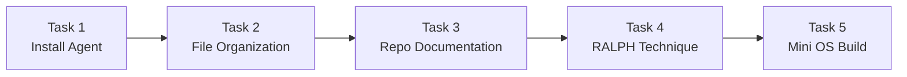
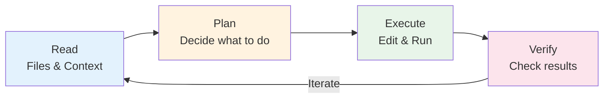
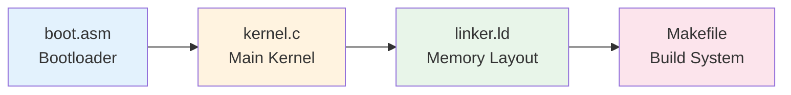

# Week 1 Lab — Coding Agents

> **Last Updated:** 2026-04-09

> **Prerequisites**: Week 1 Lecture concepts (OS definition, dual-mode, system calls).
>
> **Learning Objectives**: After completing this lab, you should be able to:
> 1. Install and authenticate a coding agent (e.g., Gemini CLI, Claude Code)
> 2. Delegate real tasks to an agent and critically evaluate its output
> 3. Apply the RALPH technique to iteratively improve agent-generated work
> 4. Understand how a minimal OS is structured (bootloader, kernel, linker script)

---

## Table of Contents

- [1. Lab Overview](#1-lab-overview)
- [2. What is a Coding Agent?](#2-what-is-a-coding-agent)
- [3. Available Agents](#3-available-agents)
- [4. Task 1 — Install a Coding Agent](#4-task-1--install-a-coding-agent)
- [5. Task 2 — File Organization](#5-task-2--file-organization)
- [6. Task 3 — GitHub Repository Documentation](#6-task-3--github-repository-documentation)
- [7. Task 4 — The RALPH Technique](#7-task-4--the-ralph-technique)
  - [7.1 Applying RALPH in Practice](#71-applying-ralph-in-practice)
- [8. Task 5 — Build a Mini OS](#8-task-5--build-a-mini-os)
  - [8.1 What to Observe](#81-what-to-observe)
- [Summary](#summary)
- [Appendix](#appendix)

---

<br>

## 1. Lab Overview

- **Objective**: Install AI-based coding agents and use them in real development tasks.
- **Duration**: Approximately 50 minutes
- **Deliverables**: None — this is an exploratory lab
- These tools will be used for labs and assignments **throughout the semester**.



---

<br>

## 2. What is a Coding Agent?

An AI-based CLI tool that generates code by **understanding context**.



- It can read the file system, execute commands, and make edits autonomously.
- Use cases: scaffolding, refactoring, documentation, debugging

> **Note:** **Scaffolding** refers to automatically generating a project's initial skeleton (directory structure, configuration files, boilerplate code, etc.). The term originates from the construction industry, where scaffolds are erected before building. For example, if you say "Create a React project," the agent will create `package.json`, a `src/` directory, basic component files, and more all at once.

> **Example**: _"Write a Makefile for a C project with debug and release targets."_
> Agent: checks directory → writes Makefile → verifies build success

> **Key Point:** Unlike simple code autocompletion tools (such as Copilot), coding agents are autonomous tools that can understand the entire project context, read and modify multiple files simultaneously, and execute commands. The key difference from a ChatGPT web interface is that they directly access the local file system to perform tasks.

---

<br>

## 3. Available Agents

| Agent | Price | Description |
|:------|:------|:------------|
|  **Gemini CLI** | Free (1,000 requests/day) | Google's agent. A good default choice. |
|  **Claude Code** | Paid | Anthropic's agent. Powerful multi-file reasoning capabilities. |
|  **Codex CLI** | Paid | OpenAI's agent. An open-source CLI. |

Others: **OpenCode** (open-source harness — supports all models including open-source LLMs)

> **Note:** Gemini CLI is free and can be used without cost concerns for lab exercises. Claude Code excels in complex multi-file projects, and Codex CLI is open-source and customizable. We recommend starting with the free Gemini CLI and trying other agents as needed.

---

<br>

## 4. Task 1 — Install a Coding Agent

Refer to the official documentation and install at least one coding agent.

**Installation commands:**

```bash
npm install -g @google/gemini-cli           # Gemini CLI (free)
npm install -g @anthropic-ai/claude-code    # Claude Code (paid)
```

**Verify installation:**

```bash
gemini --version    # or: claude --version
```

**Checklist:**
- Does the CLI run without errors?
- Can you authenticate? (Gemini uses a Google account, Claude uses an Anthropic account)
- Try a simple prompt: `"What is 2 + 2?"` — verify that a response is returned

> **LTS (Long-Term Support)**: LTS is the stable, recommended version of Node.js for most users.

> **[Programming Languages]** `npm` is the package manager for Node.js. If it is not installed, you must first install the LTS version from [the official Node.js website](https://nodejs.org). After installation, you can verify it by running `node --version` and `npm --version` in the terminal.

> **Note:** The `-g` in `npm install -g` stands for **global**, meaning the package is installed system-wide rather than in the current project. With a global installation, you can run commands like `gemini` or `claude` directly from any terminal location. Without `-g`, the package is installed only in the current directory's `node_modules/` and cannot be used as a global command.

---

<br>

## 5. Task 2 — File Organization

Use an agent to **organize files** in a messy directory.

**Example prompt:**

```
"Organize the files in ~/Downloads into subdirectories by file type
 (images, documents, code, etc.). Show me the plan before executing."
```

**What to observe:**
- Does the agent **ask for confirmation** before moving files?
- Does it create a reasonable folder structure?
- Does it handle edge cases well (e.g., files without extensions)?

**Discussion:**
- What would have happened if you hadn't said _"Show me the plan first"_?
- How can you give more specific instructions when the result is unsatisfactory?

> **Note:** Getting into the habit of asking the agent to "Show me the plan first" when delegating tasks is very important. This prevents unintended file deletion or movement. Especially when working with real file systems, undo is difficult, so it is safest to always review and approve the agent's plan before execution.

---

<br>

## 6. Task 3 — GitHub Repository Documentation

Use an agent to **generate a README.md** for an existing codebase.

**Choose a target repository:**
- Your own project, or a public repository such as:
  - `https://github.com/code-yeongyu/oh-my-opencode`

**Example prompt:**

```
"Read this codebase and write a comprehensive README.md that includes
 an architecture overview, installation instructions, and usage examples."
```

**Evaluate the result:**
- Does the README **accurately** describe the project?
- Are the installation instructions correct and complete?
- Is anything missing (license, contribution guide, screenshots)?

> Save this README — you will improve it in the next task.

---

<br>

## 7. Task 4 — The RALPH Technique

> **Rubric**: A rubric is a structured set of criteria used to evaluate the quality of a deliverable.

Create a **verifiable evaluation rubric** and use it to iteratively improve the quality of the output.


**R**equest → **A**nalyze → **L**ist issues → **P**rompt again → **H**armonize

**Step-by-step process:**

1. Ask the agent to generate a rubric (e.g., _"What makes a world-class README?"_)
2. Ask the agent to **evaluate its own output against the rubric**
3. Ask it to fix all identified issues
4. Repeat until all criteria are met

**Key phrases to try:**
- _"Keep going until all criteria are met"_
- _"Evaluate against the rubric and fix all issues"_

> **Key Point:** The RALPH technique is a methodology for systematically improving AI agent output. The core idea is to "have the agent create its own evaluation criteria, evaluate its own output against those criteria, and then fix any deficiencies." Repeating this loop yields results of much higher quality than the initial output.

### 7.1 Applying RALPH in Practice

**Example workflow using the README from Task 3:**

```
You:   "Create a rubric for evaluating a high-quality open-source README."
Agent: Returns 8 criteria (description, installation, usage, architecture, ...)

You:   "Evaluate the README you wrote against this rubric. Score each criterion."
Agent: 6/8 score — not met: architecture diagram, contribution guide.

You:   "Fix all unmet criteria. Add an architecture diagram and a contribution guide."
Agent: Updates README with both additions.

You:   "Evaluate again. Are all criteria met?"
Agent: 8/8 — all criteria met.
```

**Why this matters:**
- Agents produce _decent_ results on the first try, but they are **not perfect**.
- The RALPH loop teaches you how to **systematically improve** agent output.
- This technique applies not only to coding agents but to all AI tools.

---

<br>

## 8. Task 5 — Build a Mini OS

Use an agent to create a **minimal operating system** — a preview of the final project.

**Example prompt:**

```
"Create a minimal bootable OS for x86. It should print 'Hello, OS!' to the screen.
 Include a Makefile and instructions for running it in QEMU."
```

**Expected output files:**



> **Bootloader / Real Mode / Protected Mode**: When the CPU first starts, it runs in Real Mode, which can only access 1 MB of memory. The bootloader is responsible for switching the CPU to Protected Mode, which enables full memory access and hardware protection features (like memory segmentation and privilege levels). Only then can the kernel be loaded and run.

> **[Computer Architecture]** When a computer is powered on, the BIOS/UEFI loads the boot sector (512 bytes) into memory and executes it. `boot.asm` is this boot sector code, which starts in Real Mode, transitions to Protected Mode, and then loads the kernel (`kernel.c`). `linker.ld` is a linker script that specifies where the kernel code and data are placed in memory.

> **Note:** For regular applications, the OS manages memory layout, but when developing an OS itself, you must specify "where the code is loaded in memory" yourself. The **linker script** is what performs this role. For example, the bootloader must be located at memory address `0x7C00`, and the kernel code must be placed after it — this is specified in the linker script through the starting addresses and ordering of `.text`, `.data`, and `.bss` sections. `.text` holds executable code, `.data` holds initialized variables, and `.bss` holds uninitialized variables. `0x7C00` is the memory address where the BIOS places the boot sector — a hardware convention established decades ago. Without a linker script, the compiler would use arbitrary addresses and booting would fail.

### 8.1 What to Observe

You do **not** need to successfully boot the OS — the **process** is what matters.

**Observe how the agent:**
- Decomposes a complex problem into multiple files
- Explains the role of each component
- Handles errors when given feedback
- Iteratively fixes build failures

**Follow-up prompts to try:**
- _"Add keyboard input support"_
- _"Explain what the linker script does, line by line"_
- _"The build failed with error X — fix it"_

> **Note:** It is highly likely that the OS code generated by the agent will produce build errors when run as-is. Do not panic — just pass the error message directly to the agent. The key is to be specific: "The build failed. Here is the error message: [error message]."

---

<br>

## Summary

| Task | Skills Acquired |
|:-----|:----------------|
| 1. Install Agent | Tool setup, authentication, basic prompting |
| 2. File Organization | Delegating real tasks, reviewing agent decisions |
| 3. Repo Documentation | Evaluating AI-generated technical documentation |
| 4. RALPH Technique | Systematic iterative improvement using rubrics |
| 5. Mini OS | Working with complex multi-file system projects |

> Coding agents are just tools — understanding the output they generate is still **your** responsibility.

> **Note:** It is important to view agents as "powerful assistants," not "magic tools." If you submit agent-generated code without understanding it, there is no learning benefit. Always ask "Explain why you did it this way," and develop the habit of reading and understanding the generated code yourself.

---

<br>

## Self-Check Questions

1. What is the key difference between a coding agent and a simple code autocompletion tool like Copilot?
2. Why is it important to ask an agent to "show the plan first" before executing file system operations?
3. Describe the RALPH technique in your own words. Why does iterating with a rubric produce better results than a single prompt?
4. When building a mini OS, what is the role of the bootloader, and why must it switch from Real Mode to Protected Mode?
5. If the agent-generated OS code fails to build, what is the most effective way to ask the agent to fix it?

---
