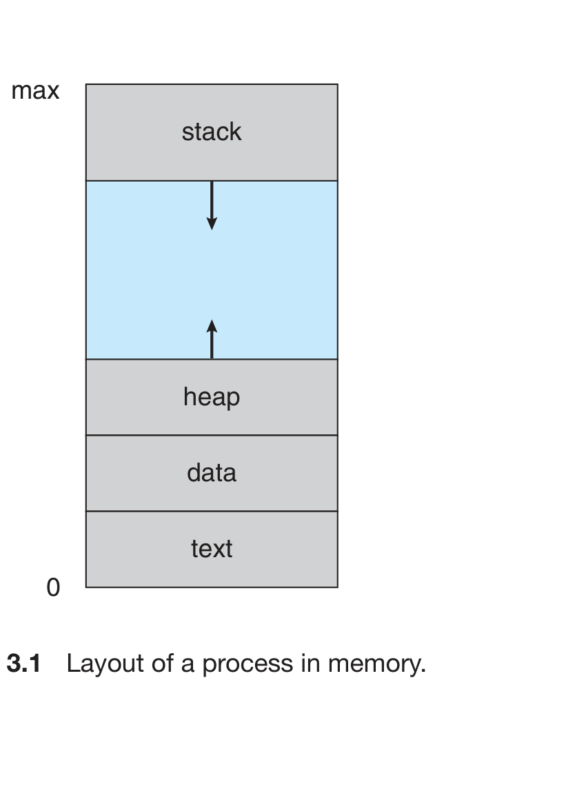
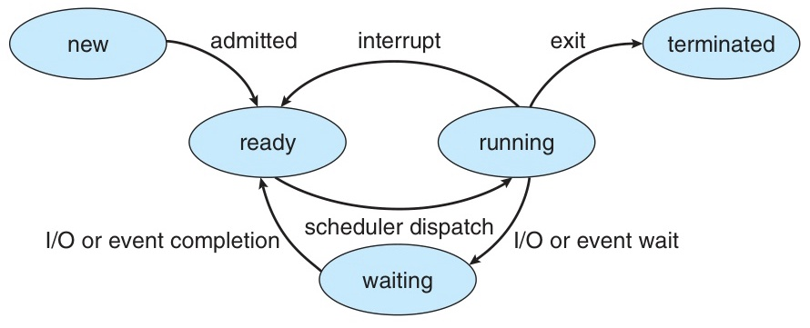
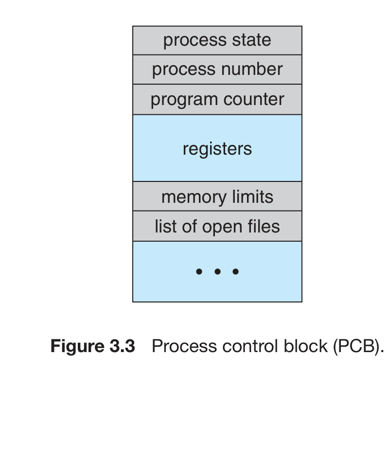
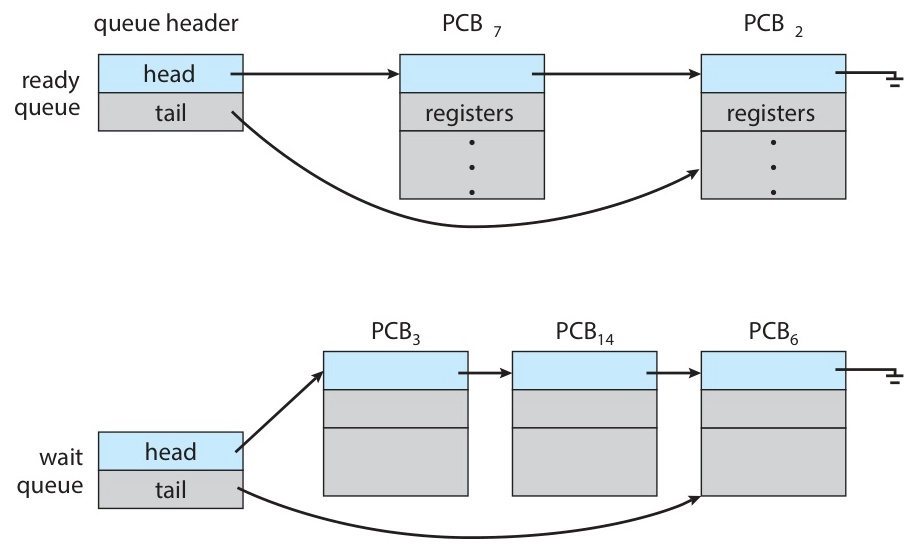
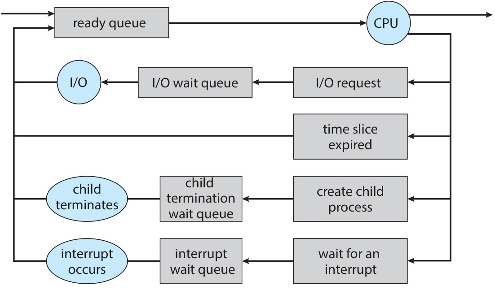
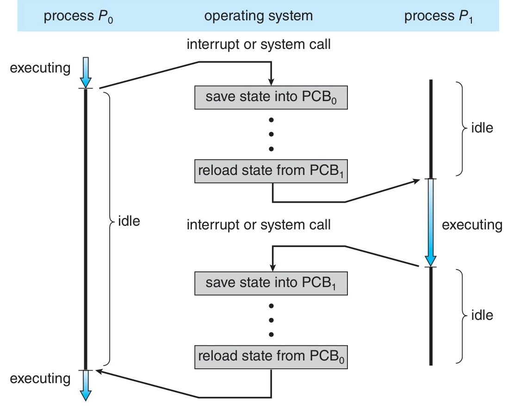
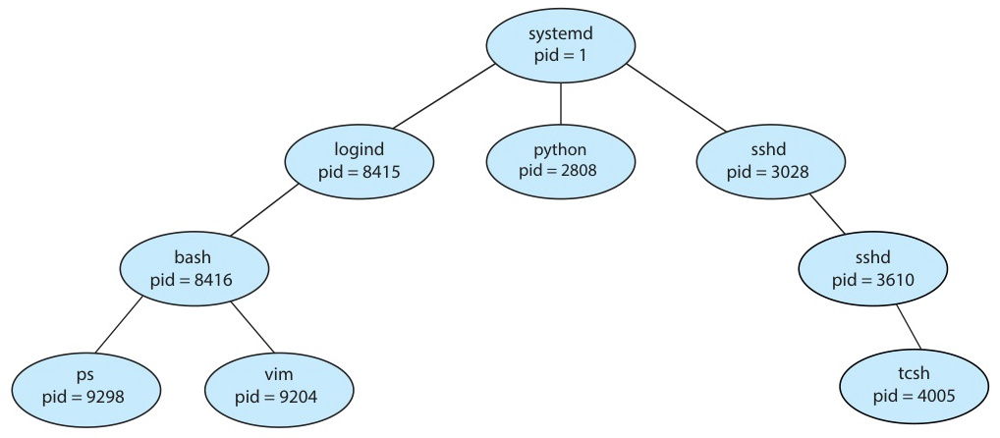

# W02 이론 — 프로세스 (1)

> **최종 수정일:** 2026-03-17
>
> Silberschatz, Operating System Concepts Ch 3 (Sections 3.1 – 3.3)

---

## 목차

- [1. 프로세스 개념](#1-프로세스-개념)
  - [1.1 프로세스란 무엇인가?](#11-프로세스란-무엇인가)
  - [1.2 메모리 레이아웃](#12-메모리-레이아웃)
  - [1.3 스택과 힙의 동적 성장](#13-스택과-힙의-동적-성장)
  - [1.4 C 프로그램의 메모리 레이아웃](#14-c-프로그램의-메모리-레이아웃)
  - [1.5 프로그램 vs 프로세스](#15-프로그램-vs-프로세스)
  - [1.6 프로세스 상태](#16-프로세스-상태)
  - [1.7 프로세스 제어 블록 (PCB)](#17-프로세스-제어-블록-pcb)
  - [1.8 Linux에서의 PCB — task_struct](#18-linux에서의-pcb--task_struct)
  - [1.9 스레드 개요](#19-스레드-개요)
- [2. 프로세스 스케줄링](#2-프로세스-스케줄링)
  - [2.1 왜 필요한가?](#21-왜-필요한가)
  - [2.2 다중 프로그래밍 정도와 프로세스 유형](#22-다중-프로그래밍-정도와-프로세스-유형)
  - [2.3 스케줄링 큐](#23-스케줄링-큐)
  - [2.4 CPU 스케줄링](#24-cpu-스케줄링)
  - [2.5 문맥 교환](#25-문맥-교환)
  - [2.6 모바일 시스템에서의 멀티태스킹](#26-모바일-시스템에서의-멀티태스킹)
- [3. 프로세스 연산](#3-프로세스-연산)
  - [3.1 프로세스 생성](#31-프로세스-생성)
  - [3.2 UNIX/Linux에서의 fork()](#32-unixlinux에서의-fork)
  - [3.3 fork() 이후의 exec()](#33-fork-이후의-exec)
  - [3.4 fork() 코드 예제](#34-fork-코드-예제)
  - [3.5 프로세스 생성 — Windows 비교](#35-프로세스-생성--windows-비교)
  - [3.6 프로세스 종료](#36-프로세스-종료)
  - [3.7 좀비 프로세스와 고아 프로세스](#37-좀비-프로세스와-고아-프로세스)
  - [3.8 Android 프로세스 계층 구조](#38-android-프로세스-계층-구조)
  - [3.9 Chrome 멀티프로세스 아키텍처](#39-chrome-멀티프로세스-아키텍처)
- [4. 실습 — fork(), exec(), wait()](#4-실습--fork-exec-wait)
  - [4.1 fork() 기본 사용법](#41-fork-기본-사용법)
  - [4.2 fork()로 여러 자식 생성](#42-fork로-여러-자식-생성)
  - [4.3 exec()으로 새 프로그램 실행](#43-exec으로-새-프로그램-실행)
  - [4.4 exec() 함수 계열 비교](#44-exec-함수-계열-비교)
  - [4.5 wait()의 상세 동작](#45-wait의-상세-동작)
  - [4.6 간단한 셸의 동작 원리](#46-간단한-셸의-동작-원리)
- [요약](#요약)
- [부록](#부록)

---

<br>

## 1. 프로세스 개념

### 1.1 프로세스란 무엇인가?

**프로세스(Process)** = 실행 중인 프로그램(a program in execution)

- 초기의 컴퓨터: 한 번에 하나의 프로그램만 실행
- 현대의 컴퓨터: 여러 프로그램이 메모리에 적재되어 **동시에(concurrently)** 실행
- 이러한 발전은 더 엄격한 제어와 구획화를 요구하게 되었으며, **프로세스** 개념이 탄생했다.

> "프로세스는 현대 컴퓨팅 시스템에서의 작업 단위이다."

- 운영체제의 관점에서, 사용자 코드를 실행하는 프로세스와 운영체제 코드를 실행하는 프로세스가 모두 존재한다.
- CPU(들)은 이러한 프로세스들 사이에서 **다중화(multiplexed)** 된다.

> **시험 팁:** "실행 중인 프로그램"이라는 정의가 핵심이다. 디스크에 저장된 실행 파일 자체는 프로그램(수동적 entity)이고, 이것이 메모리에 올라와 CPU를 할당받아 실행되면 프로세스(능동적 entity)가 된다. 이 구분은 시험에서 자주 출제된다.

### 1.2 메모리 레이아웃

프로세스의 메모리 레이아웃은 여러 **영역(section)**으로 나뉜다:



*Silberschatz, Figure 3.1 — 메모리에서의 프로세스 레이아웃*

- **텍스트(Text)** — 실행 코드
- **데이터(Data)** — 전역 변수
- **힙(Heap)** — 런타임에 동적으로 할당 (`malloc`, `new`)
- **스택(Stack)** — 함수 호출 시 임시 데이터 (매개변수, 복귀 주소, 지역 변수)

> **참고:** "텍스트(text)"라는 이름이 코드 영역에 사용되는 이유는 초기 어셈블리 언어에서 유래한다. 어셈블리에서 `.text` 지시자(directive)가 "이후의 내용은 기계어 명령어(= 프로그램의 본문, 즉 텍스트)"임을 나타냈기 때문이다. 프로그램의 "본문(text)"이라는 비유에서 출발한 역사적 관례이다.

텍스트와 데이터는 크기가 **고정**이고, 스택과 힙은 **동적으로** 확장 및 축소된다.

> **[프로그래밍언어]** C 프로그래밍에서 배운 메모리 영역을 떠올리면 이해가 쉽다. 전역 변수는 데이터 영역에, `malloc()`으로 할당한 메모리는 힙 영역에, 함수의 지역 변수는 스택 영역에 저장된다. 스택은 높은 주소에서 낮은 주소로, 힙은 낮은 주소에서 높은 주소로 성장하며, 이 둘이 충돌하지 않도록 운영체제가 관리한다.

### 1.3 스택과 힙의 동적 성장

**스택의 성장:**
- 함수가 호출될 때마다 **활성화 레코드(activation record)**(함수 매개변수, 지역 변수, 복귀 주소)가 스택에 push된다.
- 함수가 반환되면 활성화 레코드가 pop된다.
- 스택은 **높은 주소에서 낮은 주소 방향으로** 성장한다 (아래로).

**힙의 성장:**
- `malloc()`, `new` 등으로 동적 메모리 할당 시 힙이 성장한다.
- `free()`, `delete`로 해제하면 힙이 축소된다.
- 힙은 **낮은 주소에서 높은 주소 방향으로** 성장한다 (위로).

**운영체제의 역할:** 스택과 힙이 서로를 향해 성장하므로, 운영체제는 이 둘이 **겹치지 않도록** 보장해야 한다.

> **[자료구조]** 스택 자료구조의 LIFO(Last In, First Out) 원리가 여기서 활용된다. 함수 A가 함수 B를 호출하고, B가 함수 C를 호출하면, 반환 순서는 C → B → A로 가장 마지막에 호출된 함수가 가장 먼저 반환된다. 이것이 스택 프레임(활성화 레코드)으로 관리된다.

### 1.4 C 프로그램의 메모리 레이아웃

```c
#include <stdio.h>
#include <stdlib.h>

int x;            // 초기화되지 않은 데이터 (BSS)
int y = 15;       // 초기화된 데이터

int main(int argc, char *argv[]) {   // argc, argv 영역
    int *values;   // 지역 변수 → 스택
    int i;         // 지역 변수 → 스택

    values = (int *)malloc(sizeof(int)*5);  // 동적 할당 → 힙
    for (i = 0; i < 5; i++)
        values[i] = i;
    return 0;
}
```

`size` 명령어로 각 섹션의 크기를 확인할 수 있다:

| text | data | bss | dec | hex |
|:-----|:-----|:----|:----|:----|
| 1158 | 284 | 8 | 1450 | 5aa |

- **data**: 초기화된 전역 변수, **bss** (block started by symbol): 초기화되지 않은 전역 변수

> **참고:** BSS를 data와 분리하는 이유는 **실행 파일 크기를 줄이기 위해서**이다. data 영역의 변수(`int y = 15`)는 초기값 15를 실행 파일에 저장해야 하지만, BSS 영역의 변수(`int x`)는 어차피 0으로 초기화되므로 실행 파일에 "BSS 크기는 8바이트"라는 정보만 기록하면 된다. 즉, BSS는 디스크에 실제 데이터를 저장하지 않아 실행 파일이 더 작아진다. 프로그램 로드 시 OS가 BSS 영역을 0으로 채워준다.

### 1.5 프로그램 vs 프로세스

| 구분 | 프로그램(Program) | 프로세스(Process) |
|:-----|:-----------------|:-----------------|
| 성격 | **수동적(Passive)** 개체 | **능동적(Active)** 개체 |
| 형태 | 디스크에 저장된 실행 파일 | 프로그램 카운터(PC)와 관련 자원을 가진 실행 단위 |
| 변환 | 실행 파일이 메모리에 적재되면 프로세스가 된다 | |

**주요 차이점:**
- 동일한 프로그램이 여러 프로세스로 실행될 수 있다.
  - 예: 여러 사용자가 동시에 같은 웹 브라우저를 실행
  - 텍스트 영역은 동일하지만, **데이터, 힙, 스택은 각각 별도**이다.
- 프로세스 자체가 다른 코드의 실행 환경이 될 수 있다.
  - 예: JVM은 하나의 프로세스로 실행되며 Java 프로그램을 해석/실행한다.

### 1.6 프로세스 상태

프로세스는 실행 중에 **상태(state)**가 변화한다:

| 상태 | 설명 |
|:-----|:-----|
| **생성(New)** | 프로세스가 생성되는 중 |
| **실행(Running)** | 명령어가 실행되는 중 |
| **대기(Waiting)** | 프로세스가 특정 이벤트(I/O 완료, 시그널 등)를 기다리는 중 |
| **준비(Ready)** | 프로세스가 프로세서에 할당되기를 기다리는 중 |
| **종료(Terminated)** | 프로세스가 실행을 마침 |

**중요:** 어느 시점에서든 단일 프로세서 코어 위에서는 **하나의 프로세스만** 실행 상태에 있을 수 있다. 그러나 여러 프로세스가 동시에 준비 또는 대기 상태에 있을 수 있다.



*Silberschatz, Figure 3.2 — 프로세스 상태 다이어그램*

**상태 전이 상세:**

| 전이 | 원인 |
|:-----|:-----|
| **New → Ready** | admitted — 운영체제가 프로세스 생성을 승인; 메모리 할당 완료 |
| **Ready → Running** | scheduler dispatch — CPU 스케줄러가 프로세스를 선택하여 CPU 코어에 할당 |
| **Running → Ready** | interrupt — 타임 슬라이스 만료로 CPU가 선점(preempt)됨 |
| **Running → Waiting** | I/O or event wait — I/O 요청이 발생하거나 특정 이벤트를 대기 |
| **Waiting → Ready** | I/O or event completion — 대기하던 I/O나 이벤트가 완료됨 |
| **Running → Terminated** | exit — 프로세스가 실행을 마치고 종료 |

> **시험 팁:** Running → Ready (타임 슬라이스 만료에 의한 **비자발적** 전이)와 Running → Waiting (I/O 요청에 의한 **자발적** 전이)의 차이를 명확히 구분해야 한다.

### 1.7 프로세스 제어 블록 (PCB)

각 프로세스는 운영체제에서 **PCB (프로세스 제어 블록, Process Control Block)**로 표현된다. 다른 이름으로 **태스크 제어 블록(task control block)**이라고도 한다.



*Silberschatz, Figure 3.3 — 프로세스 제어 블록(PCB)*

PCB는 프로세스를 **시작하거나 재시작**하는 데 필요한 모든 데이터의 저장소 역할을 한다.

| 필드 | 설명 |
|:-----|:-----|
| **프로세스 상태** | 현재 상태 (new, ready, running, waiting, terminated) |
| **프로그램 카운터** | 다음에 실행할 명령어의 주소 |
| **CPU 레지스터** | 누산기, 인덱스 레지스터, 스택 포인터, 범용 레지스터, 조건 코드 등 |
| **CPU 스케줄링 정보** | 프로세스 우선순위, 스케줄링 큐 포인터, 기타 매개변수 |
| **메모리 관리 정보** | 베이스/리밋 레지스터 값, 페이지 테이블 또는 세그먼트 테이블 |
| **계정 정보** | 사용된 CPU 시간, 경과된 실제 시간, 시간 제한, 프로세스 번호 |
| **I/O 상태 정보** | 할당된 I/O 장치 목록, 열린 파일 목록 |

> **[컴퓨터구조]** **베이스 레지스터(Base Register)**는 프로세스가 접근할 수 있는 메모리의 **시작 주소**, **리밋 레지스터(Limit Register)**는 해당 프로세스의 메모리 **크기(범위)**를 저장한다. CPU가 메모리 접근 시 주소가 [베이스, 베이스+리밋) 범위 내에 있는지 하드웨어가 자동으로 검사하여, 다른 프로세스의 메모리에 접근하는 것을 방지한다. 이는 가상 메모리(페이지 테이블)가 등장하기 전의 메모리 보호 방식이며, 11주차에서 더 발전된 방식을 배운다.

> **핵심:** PCB는 운영체제가 프로세스를 관리하기 위한 핵심 자료구조이다. 문맥 교환(Context Switch)이 발생할 때, 현재 프로세스의 PC와 레지스터 값이 해당 PCB에 저장되고, 새로 실행할 프로세스의 PCB에서 값을 복원한다. PCB가 없다면 프로세스를 중단했다가 다시 이어서 실행하는 것이 불가능하다.

### 1.8 Linux에서의 PCB — task_struct

Linux 커널에서 PCB는 **`task_struct`** C 구조체로 표현된다. 위치: `<include/linux/sched.h>`

```c
long state;                    /* 프로세스 상태 */
struct sched_entity se;        /* 스케줄링 정보 */
struct task_struct *parent;    /* 부모 프로세스 */
struct list_head children;     /* 자식 프로세스 목록 */
struct files_struct *files;    /* 열린 파일 목록 */
struct mm_struct *mm;          /* 주소 공간 (메모리 관리) */
```

- 모든 활성 프로세스는 **이중 연결 리스트(doubly linked list)**로 관리된다.
- `current` 포인터는 현재 실행 중인 프로세스의 `task_struct`를 가리킨다.

```c
current->state = new_state;  // 현재 프로세스의 상태 변경
```

> **[자료구조]** Linux 커널이 프로세스들을 이중 연결 리스트로 관리하는 이유는, 프로세스의 삽입과 삭제가 빈번하게 발생하기 때문에 O(1)의 삽입/삭제 성능이 중요하기 때문이다. 배열로 관리하면 삽입/삭제 시 O(n)의 이동 비용이 발생한다.

### 1.9 스레드 개요

지금까지 논의한 프로세스 모델은 **단일 실행 스레드(single thread of execution)**를 가정한다.
- 프로세스가 한 번에 하나의 작업만 수행 가능
- 예: 워드프로세서에서 타이핑과 맞춤법 검사를 동시에 할 수 없다.

**스레드(Thread)** = 프로세스 내의 실행 단위

현대 운영체제는 **다중 스레드 실행**을 허용한다:
- 단일 프로세스가 여러 작업을 동시에 수행 가능
- 멀티코어 시스템에서 **병렬 실행(parallel execution)**이 가능

**같은 프로세스의 스레드들이 공유하는 것:** 텍스트 영역, 데이터 영역, 힙, 열린 파일, 시그널 등

**스레드마다 독립적인 것:** 프로그램 카운터(PC), 레지스터 세트, 스택

> 스레드에 대한 자세한 내용은 **Ch 4**에서 다룬다.

---

<br>

## 2. 프로세스 스케줄링

### 2.1 왜 필요한가?

**다중 프로그래밍(multiprogramming)의 목표:** 항상 어떤 프로세스가 실행되도록 하여 **CPU 이용률(utilization)**을 극대화한다.

**시분할(time sharing)의 목표:** CPU 코어를 프로세스 간에 빈번하게 전환하여 사용자가 각 프로그램과 **상호작용**할 수 있도록 한다.

→ **프로세스 스케줄러(Process Scheduler)**: 사용 가능한 프로세스들 중에서 CPU 코어에서 실행할 프로세스를 선택한다.

- 단일 코어: 한 번에 하나의 프로세스만 실행 가능
- 멀티코어: 여러 프로세스가 동시에 실행 가능
- 프로세스 수가 코어 수를 초과하면 나머지는 대기해야 한다.

### 2.2 다중 프로그래밍 정도와 프로세스 유형

**다중 프로그래밍 정도(Degree of Multiprogramming):** 현재 메모리에 있는 프로세스의 수

| 유형 | 특성 |
|:-----|:-----|
| **I/O 바운드 프로세스** | 계산보다 I/O에 더 많은 시간을 소비; I/O 요청이 빈번하다 |
| **CPU 바운드 프로세스** | I/O보다 계산에 더 많은 시간을 소비; I/O 요청이 드물다 |

효율적인 스케줄링을 위해 I/O 바운드와 CPU 바운드 프로세스의 적절한 혼합이 중요하다.

### 2.3 스케줄링 큐

프로세스가 시스템에 진입하면 **스케줄링 큐(scheduling queue)**에 배치된다.

- **레디 큐(Ready Queue):** CPU를 기다리는 프로세스들의 큐; **연결 리스트**로 구현
- **대기 큐(Wait Queue):** 특정 이벤트(예: I/O 완료)를 기다리는 프로세스들의 큐



*Silberschatz, Figure 3.4 — 레디 큐와 대기 큐*



*Silberschatz, Figure 3.5 — 프로세스 스케줄링의 큐잉 다이어그램*

프로세스는 종료될 때까지 이 사이클을 반복한다. 종료 시 모든 큐에서 제거되고, PCB와 자원이 해제(deallocate)된다.

### 2.4 CPU 스케줄링

**CPU 스케줄러의 역할:** 레디 큐에 있는 프로세스 중 하나를 선택하여 CPU 코어에 할당한다.

**스케줄링 빈도:** 일반적으로 CPU 스케줄러는 최소 **100ms**마다 한 번 실행된다.

**스와핑(Swapping):**
- 프로세스를 메모리에서 디스크로 이동(**스왑 아웃**)하고 나중에 다시 적재(**스왑 인**)한다.
- 다중 프로그래밍 정도를 줄여 메모리 압박을 완화한다.
- 메모리가 **과다 할당(overcommitted)**된 경우에만 필요하다. Ch 9에서 상세히 다룬다.

### 2.5 문맥 교환

**문맥(Context):** 프로세스의 PCB에 표현된다. CPU 레지스터 값, 프로세스 상태, 메모리 관리 정보 등을 포함한다.

**문맥 교환(Context Switch):** CPU 코어를 다른 프로세스로 전환하는 작업이다. 현재 프로세스의 **상태 저장(state save)** + 새 프로세스의 **상태 복원(state restore)**으로 구성된다.



*Silberschatz, Figure 3.6 — 프로세스 간 문맥 교환*

> **핵심:** 문맥 교환은 운영체제의 핵심 메커니즘이다. 실제로 사용자가 여러 프로그램을 동시에 사용하는 것처럼 느끼는 것은, 운영체제가 매우 빠르게 프로세스 간 문맥 교환을 수행하기 때문이다. 단, 문맥 교환 중에는 유용한 작업이 수행되지 않으므로 순수한 오버헤드이다.

> **참고:** 구체적인 예시: 프로세스 A(워드 프로세서)가 실행 중일 때 타이머 인터럽트가 발생하면, OS는 (1) A의 PC, 레지스터 값, 스택 포인터 등을 A의 PCB에 저장하고, (2) 레디 큐에서 프로세스 B(웹 브라우저)를 선택한 뒤, (3) B의 PCB에서 이전에 저장해 둔 PC, 레지스터 값 등을 CPU에 복원한다. 이 전체 과정이 수 마이크로초 내에 완료되어 사용자는 A와 B가 동시에 실행되는 것처럼 느끼게 된다.

**문맥 교환의 오버헤드:**
- 일반적인 속도: **수 마이크로초**
- 속도에 영향을 미치는 요인: 메모리 속도, 복사해야 하는 레지스터의 수, 특수 명령어의 가용 여부
- 일부 프로세서는 **다중 레지스터 세트**를 제공하여 문맥 교환 비용을 줄인다.

> **[컴퓨터구조]** 레지스터는 CPU 내부의 가장 빠른 저장 장치이다. 문맥 교환 시 모든 레지스터 값을 메모리(PCB)에 저장하고 복원해야 하므로, 레지스터 수가 많을수록 문맥 교환 비용이 증가한다. 일부 CPU(예: SPARC)는 레지스터 윈도우(register window) 기법을 사용하여 이 오버헤드를 줄인다.

### 2.6 모바일 시스템에서의 멀티태스킹

**iOS:**
- 초기 iOS: 사용자 앱에 대한 멀티태스킹 없음 (포그라운드 앱만 실행; 나머지는 일시 중단)
- iOS 4부터: 제한적 멀티태스킹 (포그라운드 1개 + 백그라운드 여러 개)
- iPad: 분할 화면을 통한 2개의 포그라운드 앱 동시 실행

**Android:**
- 처음부터 멀티태스킹을 지원하며, 백그라운드 앱 유형에 제한 없다.
- 백그라운드 처리를 위해 **서비스(Service)**(별도의 앱 컴포넌트)를 사용한다.
  - 서비스는 UI가 없으며 메모리를 적게 사용한다.
  - 백그라운드 앱이 일시 중단되더라도 서비스는 계속 실행된다.

---

<br>

## 3. 프로세스 연산

### 3.1 프로세스 생성

프로세스는 실행 중에 여러 개의 새 프로세스를 생성할 수 있다.

| 용어 | 설명 |
|:-----|:-----|
| **부모 프로세스(Parent)** | 다른 프로세스를 생성하는 프로세스 |
| **자식 프로세스(Child)** | 새로 생성된 프로세스 |
| **프로세스 트리(Process tree)** | 부모-자식 관계로 형성된 트리 구조 |
| **프로세스 ID (pid)** | 각 프로세스의 고유 식별자 (일반적으로 정수) |



*Silberschatz, Figure 3.7 — 일반적인 Linux 시스템의 프로세스 트리*

- **systemd** (pid = 1): 모든 사용자 프로세스의 **루트 부모(root parent)**
- 전통적인 UNIX에서는 **init** (pid = 1)이 이 역할을 수행했다.

> **[자료구조]** 프로세스 트리는 트리(tree) 구조 그대로이다. 루트 노드는 최초의 프로세스(Linux에서 systemd, pid=1)이고, 각 노드가 자식 노드(자식 프로세스)를 가질 수 있다. 부모-자식 관계가 명확하여 프로세스 관리(종료, 자원 회수 등)가 체계적으로 이루어진다.

**자원 및 실행 옵션:**

자식 프로세스가 자원을 얻는 방법:
1. 운영체제로부터 직접 자원을 획득
2. 부모 프로세스 자원의 부분 집합을 받음

실행 옵션:
1. 부모가 자식과 **동시에** 계속 실행
2. 부모가 자식이 종료될 때까지 **대기(wait)**

주소 공간 옵션:
1. 자식이 부모의 **복제본(duplicate)** — 동일한 프로그램과 데이터
2. 자식에 **새 프로그램**이 적재됨

### 3.2 UNIX/Linux에서의 fork()

UNIX에서는 **`fork()`** 시스템 호출로 새 프로세스를 생성한다.

**fork()의 동작 방식:**
1. 호출하는 프로세스의 **주소 공간의 복사본**으로 새 프로세스를 생성한다.
2. 부모와 자식 **모두** fork() 이후의 명령어부터 실행을 계속한다.

**fork()의 반환 값:**

| 반환 값 | 의미 |
|:--------|:-----|
| **0** | 자식 프로세스 (새로 생성된 프로세스) |
| **양수 (> 0)** | 부모 프로세스 (자식의 pid가 반환됨) |
| **-1** | fork 실패 (오류) |

> **시험 팁:** fork()의 반환 값 구분은 시험에서 거의 반드시 출제된다. 핵심은 fork() 호출 후 부모와 자식이 동일한 코드를 실행하지만, 반환 값이 다르다는 점이다.

### 3.3 fork() 이후의 exec()

**exec()** 시스템 호출: 프로세스의 메모리 공간을 새 프로그램으로 **대체(replace)**한다.

```text
fork() → 자식 프로세스 생성 (부모의 복사본)
         │
    자식: exec() 호출
         │
    자식의 메모리 이미지가 새 프로그램으로 대체됨
    (원래 프로그램은 파괴됨)
```

- exec() 성공 시: 원래 코드로 **반환하지 않는다** (메모리가 덮어쓰기됨).
- exec() 실패 시: 제어가 반환된다 (오류 처리 가능).

### 3.4 fork() 코드 예제

```c
#include <sys/types.h>
#include <stdio.h>
#include <unistd.h>

int main() {
    pid_t pid;

    /* 자식 프로세스를 fork */
    pid = fork();

    if (pid < 0) {          /* 오류 발생 */
        fprintf(stderr, "Fork Failed");
        return 1;
    }
    else if (pid == 0) {    /* 자식 프로세스 */
        execlp("/bin/ls", "ls", NULL);
    }
    else {                  /* 부모 프로세스 */
        /* 부모가 자식의 완료를 기다림 */
        wait(NULL);
        printf("Child Complete");
    }

    return 0;
}
```

> **참고:** `execlp("/bin/ls", "ls", NULL)`에서 첫 번째 인자 `"/bin/ls"`는 실행할 **파일 경로**이고, 두 번째 인자부터는 프로그램에 전달되는 **argv 배열**이다. UNIX 관례상 `argv[0]`은 프로그램 자신의 이름이어야 한다. 따라서 `"ls"`가 `argv[0]`으로 전달된다. 이 관례를 무시해도 실행 자체는 되지만, 프로그램 내부에서 `argv[0]`을 사용하여 에러 메시지를 출력하는 경우가 많으므로 반드시 포함시키는 것이 올바른 사용법이다. 마지막 `NULL`은 인자 목록의 끝을 표시한다.

**fork() + exec() + wait() 흐름도:**

```text
부모 프로세스 (Parent Process)
    │
    ├── fork() 호출
    │       │
    │       ├── [자식 프로세스 생성]
    │       │       │
    │       │       ├── pid == 0 (자식)
    │       │       │       │
    │       │       │       └── execlp("/bin/ls", "ls", NULL)
    │       │       │               → ls 명령어 실행
    │       │       │               → exit()으로 종료
    │       │
    │       ├── pid > 0 (부모)
    │       │       │
    │       │       └── wait(NULL)  ← 자식 종료를 기다림
    │       │               │
    │       │               └── "Child Complete" 출력
    │
    └── return 0
```

이것이 UNIX 셸(shell)의 기본적인 동작 원리이다!

**fork() 반환 값 심층 분석:**

```c
pid_t pid = fork();
// 이 시점에서 2개의 프로세스가 존재!

printf("pid = %d\n", pid);
```

출력 (실행 순서는 보장되지 않음):
```text
pid = 3456    ← 부모: 자식의 실제 pid를 출력
pid = 0       ← 자식: 0을 출력
```

왜 이렇게 설계되었는가?
- 부모: 관리 목적(wait, kill 등)으로 자식의 pid가 필요하다.
- 자식: `getpid()`로 자신의 pid를, `getppid()`로 부모의 pid를 얻을 수 있다.

### 3.5 프로세스 생성 — Windows 비교

| 비교 | UNIX fork() | Windows CreateProcess() |
|:-----|:-----------|:------------------------|
| 주소 공간 | 부모의 주소 공간을 **복제** | 새 프로그램을 **지정하여 적재** |
| 매개변수 | 없음 (0개) | **10개 이상** 필요 |
| 자식 대기 | `wait()` | `WaitForSingleObject()` |
| 프로세스 정보 | pid (정수) | `PROCESS_INFORMATION` 구조체 |

### 3.6 프로세스 종료

**정상 종료:**
- 프로세스가 마지막 문장을 실행하고 `exit()` 시스템 호출로 운영체제에 삭제를 요청한다.
- 상태 값이 `wait()`를 통해 **대기 중인 부모**에게 전달된다.
- 운영체제가 프로세스의 모든 자원을 회수한다.

**부모에 의한 강제 종료 (abort):**
1. 자식이 **할당된 자원을 초과**한 경우
2. 자식에게 **할당된 작업이 더 이상 필요 없는** 경우
3. **부모가 종료**하는데 운영체제가 고아 프로세스를 허용하지 않는 경우

**연쇄 종료(Cascading Termination):** 부모가 종료되면 모든 자식이 종료되어야 하는 시스템. 일반적으로 운영체제에 의해 시작된다.

### 3.7 좀비 프로세스와 고아 프로세스

**좀비 프로세스(Zombie Process):**
- 자식 프로세스가 **종료(exit)**했지만, 부모가 아직 **wait()를 호출하지 않은** 상태
- 프로세스의 실행은 끝났지만 **프로세스 테이블 항목이 남아 있다**.
- 모든 프로세스는 종료 시 잠시 좀비 상태를 거친다.
- 부모가 `wait()`를 절대 호출하지 않으면, 좀비가 계속 누적되어 시스템 자원을 낭비한다.

**고아 프로세스(Orphan Process):**
- 부모가 `wait()`를 호출하지 않고 **먼저 종료**하여 남겨진 자식 프로세스
- UNIX/Linux에서 init/systemd가 고아 프로세스의 새로운 부모가 되어 정리한다.

| 구분 | 좀비 프로세스 | 고아 프로세스 |
|:-----|:------------|:------------|
| 상태 | 자식이 **종료됨** | 자식이 **아직 실행 중** (부모가 먼저 종료) |
| 원인 | 부모가 **wait()를 호출하지 않음** | 부모가 **먼저 종료** |
| 자원 | 프로세스 테이블 항목만 차지 | 정상적으로 실행 중 |
| 해결 | 부모가 wait() 호출 | init/systemd가 입양하여 관리 |

> **시험 팁:** **좀비**는 자식이 죽었는데 부모가 수습(wait)을 안 한 것이고, **고아**는 부모가 먼저 죽어서 자식이 혼자 남은 것이다. 상황을 주고 좀비인지 고아인지 구분하라는 문제가 자주 출제된다.

> **참고:** `ps aux` 명령어로 프로세스 목록을 보면 상태가 `Z`로 표시된 것이 좀비 프로세스이다. 좀비 자체는 CPU나 메모리를 소비하지 않지만, 프로세스 테이블 항목을 차지하므로 시스템에서 생성 가능한 프로세스 수를 줄인다.

> **참고:** 좀비 프로세스를 제거하는 방법:
> 1. **부모에게 SIGCHLD 시그널 전송**: `kill -SIGCHLD <부모PID>` — 부모가 시그널 핸들러에서 `wait()`를 호출하도록 유도한다
> 2. **부모 프로세스 종료**: 부모를 `kill`하면 좀비의 부모가 init/systemd로 변경되고, init/systemd가 자동으로 `wait()`를 호출하여 좀비를 회수한다
> 3. **코드 수준 예방**: `signal(SIGCHLD, SIG_IGN)`을 설정하면 자식 종료 시 OS가 자동으로 좀비를 회수한다 (POSIX 표준)
>
> 좀비 자체를 직접 `kill`하는 것은 불가능하다 — 이미 종료된 프로세스이기 때문이다. 반드시 부모를 통해 해결해야 한다.

### 3.8 Android 프로세스 계층 구조

Android는 **중요도 계층(importance hierarchy)**에 따라 종료 순서를 결정한다:

| 순위 | 유형 | 설명 | 종료 우선순위 |
|:-----|:-----|:-----|:-----------|
| 1 | **포그라운드 프로세스** | 현재 화면에 보이며 사용자가 상호작용 중 | 가장 마지막에 종료 |
| 2 | **가시적 프로세스** | 직접 보이지는 않지만 포그라운드 앱이 참조하는 활동 수행 | |
| 3 | **서비스 프로세스** | 사용자에게 인지되는 백그라운드 활동 수행 (예: 음악) | |
| 4 | **백그라운드 프로세스** | 사용자에게 보이지 않는 활동 수행 | |
| 5 | **빈 프로세스** | 어떤 앱 컴포넌트와도 연결되지 않음 | 가장 먼저 종료 |

### 3.9 Chrome 멀티프로세스 아키텍처

**문제:** 탭 기반 웹 브라우저에서 한 탭의 웹 앱이 충돌하면 전체 브라우저가 충돌한다.

**Chrome의 해결책:** 멀티프로세스 아키텍처

| 프로세스 유형 | 역할 | 개수 |
|:------------|:-----|:-----|
| **브라우저(Browser)** | UI 관리, 디스크/네트워크 I/O | 1개 |
| **렌더러(Renderer)** | 웹 페이지 렌더링 (HTML, JS, 이미지) | 탭당 1개 |
| **플러그인(Plug-in)** | 플러그인 코드 실행 | 유형당 1개 |

**장점:** 웹사이트들이 서로 **격리** — 한 사이트의 충돌은 해당 렌더러에만 영향을 미친다. 렌더러 프로세스는 **샌드박스(sandbox)**에서 실행되어 보안 취약점의 영향을 최소화한다.

> **참고:** Chrome의 멀티프로세스 아키텍처는 프로세스 간 격리와 독립적인 주소 공간이 실제로 어떻게 활용되는지 보여주는 좋은 예시이다. 작업 관리자에서 Chrome의 프로세스를 확인하면 탭 수만큼 프로세스가 존재하는 것을 볼 수 있다.

---

<br>

## 4. 실습 — fork(), exec(), wait()

### 4.1 fork() 기본 사용법

```c
#include <stdio.h>
#include <unistd.h>
#include <sys/wait.h>

int main() {
    pid_t pid;

    printf("Before fork: pid = %d\n", getpid());

    pid = fork();

    if (pid < 0) {
        perror("fork failed");
        return 1;
    } else if (pid == 0) {
        /* 자식 프로세스 */
        printf("Child: my pid = %d, parent pid = %d\n",
               getpid(), getppid());
    } else {
        /* 부모 프로세스 */
        printf("Parent: my pid = %d, child pid = %d\n",
               getpid(), pid);
        wait(NULL);
    }

    printf("Process %d exiting\n", getpid());
    return 0;
}
```

### 4.2 fork()로 여러 자식 생성

```c
#include <stdio.h>
#include <unistd.h>
#include <sys/wait.h>

int main() {
    pid_t pid;
    int i;

    for (i = 0; i < 3; i++) {
        pid = fork();
        if (pid == 0) {
            printf("Child %d: pid = %d, parent pid = %d\n",
                   i, getpid(), getppid());
            return 0;  // 자식은 여기서 종료 (중요!)
        }
    }
    // 부모: 모든 자식이 종료될 때까지 대기
    for (i = 0; i < 3; i++) {
        wait(NULL);
    }
    printf("Parent: all children finished\n");
    return 0;
}
```

**주의:** 자식 프로세스에서 `return 0`을 하지 않으면, 자식도 루프를 돌며 fork()를 호출하게 된다! 이는 **포크 폭탄(fork bomb)**의 위험이 있다!

> **참고:** 포크 폭탄(fork bomb)은 프로세스가 무한히 자기 자신을 복제하여 시스템 자원을 고갈시키는 공격이다. Linux에서 유명한 포크 폭탄 명령어는 `:(){ :|:& };:`인데, 자기 자신을 재귀적으로 두 번 호출하는 함수를 정의하고 실행하는 것이다.

### 4.3 exec()으로 새 프로그램 실행

```c
#include <stdio.h>
#include <unistd.h>
#include <sys/wait.h>

int main() {
    pid_t pid = fork();

    if (pid == 0) {
        /* 자식: ls -l 명령어 실행 */
        printf("Child: about to exec ls -l\n");
        execlp("ls", "ls", "-l", NULL);

        /* exec()이 성공하면 아래 코드는 절대 실행되지 않음 */
        perror("exec failed");
        return 1;
    } else if (pid > 0) {
        /* 부모: 자식 완료를 기다림 */
        wait(NULL);
        printf("Parent: child has finished\n");
    }
    return 0;
}
```

### 4.4 exec() 함수 계열 비교

| 함수 | 인자 전달 | 경로 검색 | 환경 변수 |
|:-----|:---------|:---------|:---------|
| `execl()` | 리스트 (l) | 전체 경로 | 상속 |
| `execlp()` | 리스트 (l) | PATH 검색 (p) | 상속 |
| `execle()` | 리스트 (l) | 전체 경로 | 지정 (e) |
| `execv()` | 배열 (v) | 전체 경로 | 상속 |
| `execvp()` | 배열 (v) | PATH 검색 (p) | 상속 |
| `execve()` | 배열 (v) | 전체 경로 | 지정 (e) |

- **l** (list): 가변 인자 리스트로 전달 — `execlp("ls", "ls", "-l", NULL)`
- **v** (vector): 문자열 배열로 전달 — `execvp("ls", args)`
- **p** (path): PATH 환경 변수에서 실행 파일을 검색
- **e** (environment): 환경 변수를 명시적으로 지정

### 4.5 wait()의 상세 동작

```c
#include <stdio.h>
#include <stdlib.h>
#include <unistd.h>
#include <sys/wait.h>

int main() {
    pid_t pid = fork();

    if (pid == 0) {
        printf("Child: working...\n");
        sleep(2);
        exit(42);  // 상태 42로 종료
    } else {
        int status;
        pid_t child_pid = wait(&status);

        if (WIFEXITED(status)) {
            printf("Child %d exited with status %d\n",
                   child_pid, WEXITSTATUS(status));
        }
    }
    return 0;
}
```

- `WIFEXITED(status)`: 자식이 정상적으로 종료했는지 확인
- `WEXITSTATUS(status)`: 종료 상태 값을 추출 (0-255)
- `WIFSIGNALED(status)`: 자식이 시그널에 의해 종료되었는지 확인

### 4.6 간단한 셸의 동작 원리

```c
#include <stdio.h>
#include <string.h>
#include <unistd.h>
#include <sys/wait.h>

int main() {
    char command[256];

    while (1) {
        printf("myshell> ");
        if (fgets(command, sizeof(command), stdin) == NULL)
            break;
        command[strlen(command) - 1] = '\0';  // 개행 문자 제거

        if (strcmp(command, "exit") == 0)
            break;

        pid_t pid = fork();
        if (pid == 0) {
            execlp(command, command, NULL);
            perror("Command not found");
            return 1;
        } else {
            wait(NULL);  // 자식 종료를 기다림 → 이것이 셸의 기본 동작!
        }
    }
    return 0;
}
```

**셸의 동작 = fork() + exec() + wait()의 반복**

```text
셸 (부모 프로세스)
    │
    ├── 프롬프트 "myshell> " 표시
    ├── 사용자 입력 읽기 (예: "ls")
    ├── fork() → 자식 프로세스 생성
    │       └── [자식] execlp("ls", "ls", NULL) → ls 실행 → exit()
    ├── [부모] wait() → 자식 종료 대기
    ├── 자식 종료 확인
    └── 처음으로 돌아가 다음 명령어를 위해 반복
```

> **참고:** 실제 bash나 zsh 같은 셸도 기본적으로 이 fork() + exec() + wait() 패턴을 사용한다. 셸에서 명령어 뒤에 `&`를 붙이면 부모(셸)가 wait()를 호출하지 않고 바로 다음 명령어를 받을 수 있게 되는데, 이것이 백그라운드 실행의 원리이다.

**실습 핵심 정리:**

| 함수 | 역할 | 핵심 특징 |
|:-----|:-----|:---------|
| **fork()** | 현재 프로세스의 복사본 생성 | 부모: 자식 pid 반환, 자식: 0 반환 |
| **exec()** | 메모리 이미지를 새 프로그램으로 대체 | 성공 시 원래 코드로 반환하지 않음 |
| **wait()** | 자식 프로세스의 종료를 대기 | 종료 상태를 수집; 좀비 방지 |
| **exit()** | 프로세스를 종료 | 종료 상태를 부모에게 전달 |

**조합 패턴:**
- `fork() + exec()` = 새 프로그램 실행
- `fork() + exec() + wait()` = 기본적인 셸 동작
- `fork()`만 = 부모와 같은 코드를 실행하는 자식 생성

---

<br>

## 요약

| 개념 | 핵심 정리 |
|:-----|:---------|
| 프로세스 | 실행 중인 프로그램 (프로그램=수동적, 프로세스=능동적) |
| 메모리 레이아웃 | 텍스트(코드) / 데이터(전역) / 힙(동적 할당) / 스택(함수 호출); 텍스트·데이터 고정, 힙·스택 동적 |
| 프로세스 상태 | New → Ready → Running → Waiting → Terminated; 단일 코어에서 Running은 최대 1개 |
| 상태 전이 | Running→Ready: 비자발적(타이머), Running→Waiting: 자발적(I/O) |
| PCB | 프로세스의 모든 정보를 저장하는 자료구조; 상태, PC, 레지스터, 스케줄링, 메모리, I/O 정보 |
| Linux task_struct | PCB의 Linux 구현; 이중 연결 리스트로 관리; `current` 포인터 |
| 스레드 | 프로세스 내 실행 단위; 코드·데이터·파일 공유, PC·레지스터·스택은 독립 |
| 스케줄링 큐 | 레디 큐(CPU 대기) + 대기 큐(이벤트 대기); 연결 리스트로 구현 |
| 문맥 교환 | 현재 프로세스 상태 저장 + 새 프로세스 상태 복원; 순수 오버헤드 (수 마이크로초) |
| fork() | 프로세스 복제; 부모→자식 pid, 자식→0 반환 |
| exec() | 메모리 이미지를 새 프로그램으로 대체; 성공 시 반환하지 않음 |
| wait() | 자식 종료 대기 + 종료 상태 수집; 좀비 방지 |
| 좀비 프로세스 | 자식 종료 + 부모 wait() 미호출 → 프로세스 테이블 항목만 잔존 |
| 고아 프로세스 | 부모 먼저 종료 → init/systemd가 입양하여 정리 |
| Android 계층 | 포그라운드 > 가시적 > 서비스 > 백그라운드 > 빈 프로세스 (역순으로 종료) |
| Chrome | 탭당 별도 렌더러 프로세스 → 격리 + 샌드박스 보안 |
| 셸 동작 원리 | fork() + exec() + wait()의 반복 |
| 교재 범위 | Silberschatz Ch 3, Sections 3.1–3.3 |

---

<br>

## 부록

- **다음 주 — 3주차: 프로세스 2**
  - 프로세스 간 통신(IPC): 공유 메모리, 메시지 전달
  - 실제 IPC 구현: POSIX 공유 메모리, 파이프 (일반/이름 있는)
  - 클라이언트-서버 통신: 소켓, RPC
  - 교재: Ch 3, Sections 3.4–3.8
- **문의:** codingchild@korea.ac.kr

---
