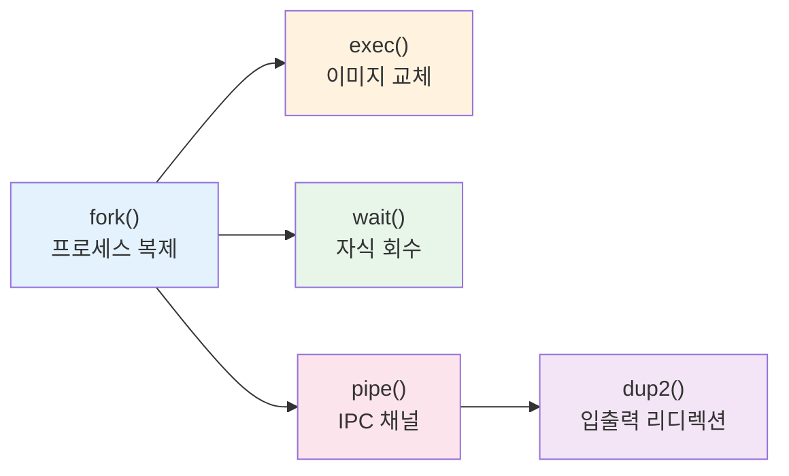
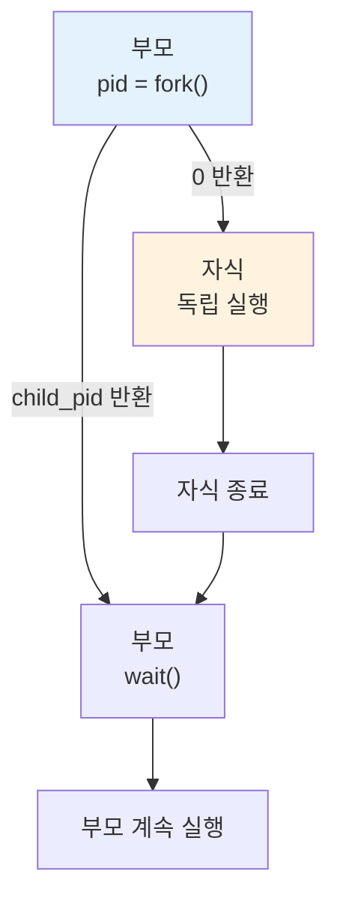
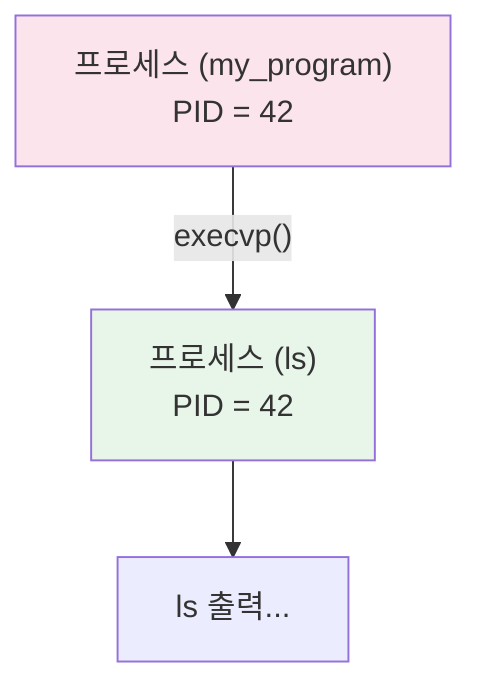
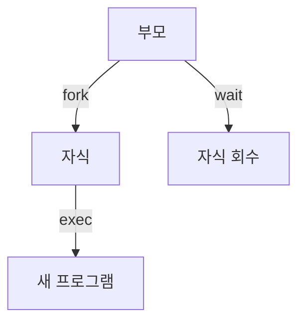
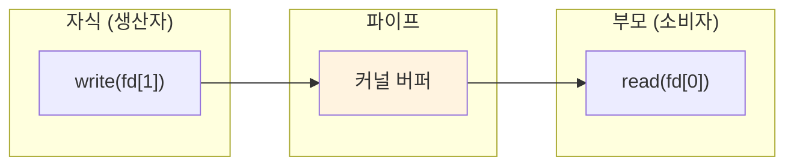
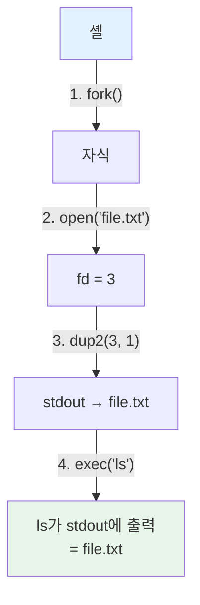
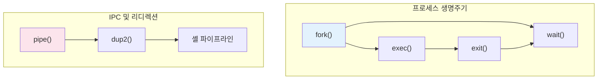

# 2주차 실습 — 프로세스 시스템 콜

> **최종 수정일:** 2026-03-21

---

> **선수 지식**: 2주차 이론 개념 (프로세스, fork, exec, wait). C 프로그램을 컴파일하고 실행할 수 있는 능력.
>
> **학습 목표**: 이 실습을 마치면 다음을 할 수 있어야 한다:
> 1. fork()/wait()를 사용하여 자식 프로세스를 생성하고 관리할 수 있다
> 2. exec()를 사용하여 프로세스 이미지를 교체할 수 있다
> 3. pipe()를 사용하여 프로세스 간 통신(IPC)을 구현할 수 있다
> 4. dup2()를 사용하여 셸 스타일의 입출력 리디렉션을 구현할 수 있다

---

## 목차

- [1. 실습 개요](#1-실습-개요)
- [2. 실습 1: fork()와 wait()](#2-실습-1-fork와-wait)
- [3. 실습 2: exec()](#3-실습-2-exec)
- [4. 실습 3: pipe()](#4-실습-3-pipe)
- [5. 실습 4: dup2()와 입출력 리디렉션](#5-실습-4-dup2와-입출력-리디렉션)
- [요약](#요약)
- [부록](#부록)

---

<br>

## 1. 실습 개요

- **목표**: C 프로그램을 통해 핵심 UNIX 프로세스 시스템 콜을 실습한다.
- **소요 시간**: 약 50분 · 4개 실습
- **주제**: `fork()`, `exec()`, `wait()`, `pipe()`, `dup()`



---

<br>

## 2. 실습 1: fork()와 wait()

`fork()`는 호출한 프로세스를 복제한다 — 자식 프로세스는 부모의 주소 공간(Address Space) **사본** 을 받는다.

```c
pid_t pid = fork();
if (pid == 0) {
    // 자식 프로세스
    printf("Child PID: %d\n", getpid());
} else {
    // 부모 프로세스
    wait(NULL);
    printf("Parent: child finished\n");
}
```



- `fork()`는 자식에게 **0** 을, 부모에게 **자식 PID** 를 반환한다.
- `wait(NULL)`은 자식 프로세스가 종료될 때까지 블록(Block)한다.

> **용어 정의:** `wait(NULL)`에서 `NULL` 인자는 자식의 종료 상태(exit status)를 신경 쓰지 않겠다는 의미이다. `int` 포인터를 전달하면(예: `wait(&status)`) 커널이 해당 변수에 자식의 종료 상태를 기록한다.

- **실습**: `wait()`를 제거하면 어떤 일이 발생하는가?

> **참고:** `fork()` 호출 시 부모의 메모리 공간이 자식에게 복사된다. 실제 구현에서는 **COW(Copy-On-Write)** 기법을 사용하여 쓰기가 발생할 때까지 물리 페이지 복사를 지연시킨다. `wait()`를 호출하지 않으면 자식이 종료되어도 PCB가 회수되지 않아 **좀비 프로세스(Zombie Process)** 가 된다.

> **용어 정의:** COW(Copy-On-Write)란 `fork()` 이후 부모와 자식이 처음에는 동일한 물리 메모리 페이지를 공유하다가, 어느 한쪽이 페이지에 **쓰기** 를 시도할 때만 커널이 해당 페이지를 복사하는 기법이다. 메모리와 시간을 모두 절약할 수 있으며, `fork()` 직후 `exec()`를 호출하는 경우 자식의 페이지가 곧바로 대체되므로 fork()의 비용이 거의 0에 가깝다.

---

<br>

## 3. 실습 2: exec()

`exec()`는 현재 프로세스 이미지를 새로운 프로그램으로 교체한다. PID는 변경되지 **않는다**.

```c
printf("Before exec\n");

char *args[] = {"ls", "-l", NULL};
execvp("ls", args);

// exec가 성공하면 여기에 도달하지 않음
printf("After exec\n");
```



**일반적인 패턴**: `fork()` + `exec()`



> **핵심:** `exec()`는 성공 시 호출한 프로세스의 코드·데이터·힙·스택을 새 프로그램으로 완전히 덮어쓰므로, 호출 이후의 코드는 실행되지 않는다. 실패 시에만 반환값 -1을 돌려준다. `fork()` → `exec()` → `wait()` 패턴은 UNIX 셸의 핵심 동작 원리이므로 반드시 숙지해야 한다.

---

<br>

## 4. 실습 3: pipe()

`pipe()`는 두 파일 디스크립터(File Descriptor) 사이에 **단방향** 통신 채널을 생성한다.

```c
int fd[2];
pipe(fd);  // fd[0]=읽기, fd[1]=쓰기

if (fork() == 0) {
    close(fd[0]);  // 읽기 끝 닫기
    char *msg = "hello from child";
    write(fd[1], msg, strlen(msg));
    close(fd[1]);
} else {
    close(fd[1]);  // 쓰기 끝 닫기
    char buf[64] = {0};
    read(fd[0], buf, sizeof(buf));
    printf("Received: %s\n", buf);
    close(fd[0]);
}
```



**규칙**:
- 항상 **사용하지 않는** 쪽을 닫을 것
- **생산자-소비자(Producer-Consumer)** 패턴을 따른다
- 쓰기 끝을 닫으면 → 읽기 쪽에서 EOF를 수신한다

> **용어 정의:** EOF(End of File)란 더 이상 읽을 데이터가 없음을 나타내는 신호이다. 파이프에서는 **모든** 쓰기 끝(write-end) 파일 디스크립터가 닫혀야 EOF가 발생한다. 따라서 쓰기 끝 fd의 사본을 보유한 모든 프로세스가 이를 닫아야 한다.

> **[프로그래밍언어]** 파일 디스크립터(File Descriptor)는 커널이 열린 파일을 식별하기 위해 프로세스에 부여하는 음이 아닌 정수이다. 0=표준입력(stdin), 1=표준출력(stdout), 2=표준에러(stderr)가 기본으로 할당되어 있다. `pipe()`가 생성하는 fd[0], fd[1]도 이 파일 디스크립터 테이블에 등록된다.

> **핵심:** 파이프가 `read()`/`write()`라는 파일 I/O 함수로 조작되는 것은 UNIX의 핵심 설계 철학인 **"모든 것은 파일이다(Everything is a file)"** 에 기반한다. UNIX에서 일반 파일, 디렉토리, 파이프, 소켓, 장치(키보드, 디스크 등)는 모두 **파일 디스크립터** 를 통해 동일한 인터페이스(`open/read/write/close`)로 접근된다. 이 덕분에 한 가지 API만 알면 다양한 자원을 다룰 수 있어 프로그래밍이 간결해진다.

> **[자료구조]** 파이프(Pipe)는 생산자-소비자 패턴의 대표적 구현이다. 한쪽(자식)이 데이터를 쓰고 다른 쪽(부모)이 읽는 구조로, 커널 내부의 유한 버퍼(Bounded Buffer)를 통해 동기화된다. 버퍼가 가득 차면 `write()`가 블록되고, 비어 있으면 `read()`가 블록된다.

> **참고:** `close()`를 빠뜨리면 발생하는 구체적 시나리오: 부모가 `fd[1]`(쓰기 끝)을 닫지 않고 `read(fd[0])`를 호출하면, 자식이 쓰기를 마치고 `fd[1]`을 닫아도 부모 자신이 여전히 `fd[1]`을 보유하고 있으므로 커널은 "아직 쓰기 끝이 열려 있다"고 판단한다. 결과적으로 `read()`가 EOF를 받지 못하고 **영원히 블록** 되어 프로그램이 멈춘다. 이것이 파이프 프로그래밍에서 가장 흔한 버그이다.

---

<br>

## 5. 실습 4: dup2()와 입출력 리디렉션

`dup2(oldfd, newfd)`는 `newfd`가 `oldfd`와 같은 파일을 가리키도록 한다 — 셸에서 리디렉션에 사용된다.

```c
int fd = open("output.txt",
    O_WRONLY | O_CREAT | O_TRUNC, 0644);
dup2(fd, STDOUT_FILENO);
close(fd);

// 이 출력은 output.txt로 향함
printf("Redirected!\n");
```

> **참고:** `open()` 함수의 플래그 설명:
> - `O_WRONLY` — 쓰기 전용으로 열기 (읽기 불가)
> - `O_CREAT` — 파일이 존재하지 않으면 새로 생성
> - `O_TRUNC` — 파일이 이미 존재하면 내용을 모두 지우고(truncate) 빈 파일로 만든다
> - `0644` — 파일 권한 (소유자: 읽기+쓰기, 그룹/기타: 읽기만). 8진수 표기법으로, `rw-r--r--`에 해당한다
>
> 이 조합은 셸에서 `> file.txt` 리디렉션의 동작과 동일하다. `>>` (추가 모드)를 구현하려면 `O_TRUNC` 대신 `O_APPEND`를 사용하면 된다.

**`ls > file.txt`의 동작 원리:**



**연습 문제**: `fork()` + `pipe()` + `dup2()`를 조합하여 `ls | wc -l`을 구현하라.

> **참고:** `dup2(oldfd, newfd)` 호출 시 `newfd`가 이미 열려 있으면 자동으로 닫은 후 복제한다. 셸이 `ls > file.txt`를 실행할 때의 전체 순서: (1) `fork()`로 자식 생성 → (2) 자식이 `open()`으로 파일을 열어 fd=3을 얻는다 → (3) `dup2(3, 1)`로 stdout(fd=1)을 파일로 리디렉션한다 → (4) `close(3)`으로 원래 fd를 정리한다 → (5) `exec("ls")`로 프로그램을 교체한다. 이후 `ls`가 `printf()`/`write(1,...)`로 출력하면 자동으로 파일에 기록된다.

> **참고:** `ls | wc -l` 구현 단계별 가이드:
> 1. 부모가 `pipe(fd)`를 호출하여 파이프 생성 → `fd[0]`(읽기), `fd[1]`(쓰기)
> 2. 첫 번째 `fork()` → **자식 1** (ls 역할):
>    - `dup2(fd[1], STDOUT_FILENO)` — stdout을 파이프 쓰기 끝으로 리디렉션
>    - `close(fd[0])`, `close(fd[1])` — 원본 fd를 모두 닫는다
>    - `execlp("ls", "ls", NULL)` — ls 실행
> 3. 두 번째 `fork()` → **자식 2** (wc 역할):
>    - `dup2(fd[0], STDIN_FILENO)` — stdin을 파이프 읽기 끝으로 리디렉션
>    - `close(fd[0])`, `close(fd[1])` — 원본 fd를 모두 닫는다
>    - `execlp("wc", "wc", "-l", NULL)` — wc -l 실행
> 4. **부모**: `close(fd[0])`, `close(fd[1])` — 부모도 파이프 fd를 모두 닫는다 (필수!)
> 5. **부모**: `wait(NULL)` 두 번 호출 — 두 자식 모두 회수
>
> 핵심: 부모를 포함한 **모든 프로세스** 에서 사용하지 않는 파이프 fd를 닫아야 EOF가 정상 전달된다.

---

<br>

## 요약



| 시스템 콜 | 용도 |
|:----------|:-----|
| `fork()` | 자식 프로세스 생성 (부모의 사본); 자식에게 0, 부모에게 자식 PID 반환 |
| `exec()` | 프로세스 이미지를 새 프로그램으로 교체; PID 유지, 성공 시 반환하지 않음 |
| `wait()` | 자식이 종료될 때까지 블록; 좀비(Zombie) 프로세스 회수 |
| `pipe()` | 단방향 IPC 채널 생성; fd[0]=읽기, fd[1]=쓰기 |
| `dup2()` | 파일 디스크립터(File Descriptor) 리디렉션; 셸 리디렉션의 핵심 |
| 셸 파이프라인 | `cmd1 \| cmd2` = fork + pipe + dup2 + exec (×2) + wait |

---

<br>

## 자기 점검 문제

1. **파이프 EOF:** fork+pipe 프로그램에서 부모가 `read(fd[0])`를 호출하기 전에 `fd[1]`을 닫지 않았다. 자식은 데이터를 쓰고 `fd[1]`을 닫았다. 부모의 `read()`가 반환될 수 있는가? 그 이유는?
2. **dup2 동작:** `dup2(fd, STDOUT_FILENO)` 이후 프로세스가 `printf()`를 호출하면 어떤 일이 발생하는가? 이후에 `close(fd)`를 하는 것이 왜 중요한가?
3. **fork + exec 패턴:** `exec()`가 성공하면 `perror("exec failed")` 줄이 실행될 수 있는가? 해당 에러 메시지를 보게 된다면 무엇을 의미하는가?
4. **wait(NULL) vs wait(&status):** 둘의 차이를 설명하라. 각각 어떤 경우에 사용하는가?
5. **파이프라인 구현:** `ls | wc -l` 구현에서 부모가 파이프에 읽거나 쓰지 않는데도 `fd[0]`과 `fd[1]`을 **모두** 닫아야 하는 이유는 무엇인가?

---
