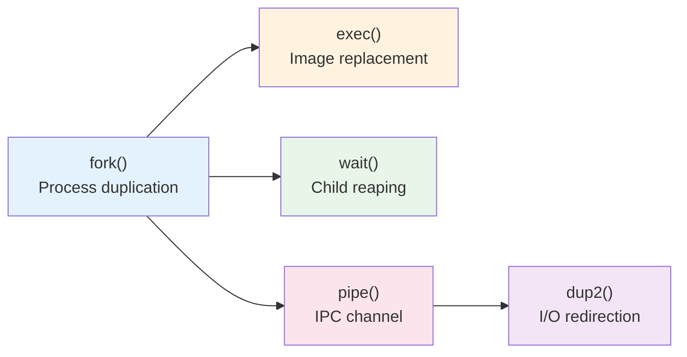
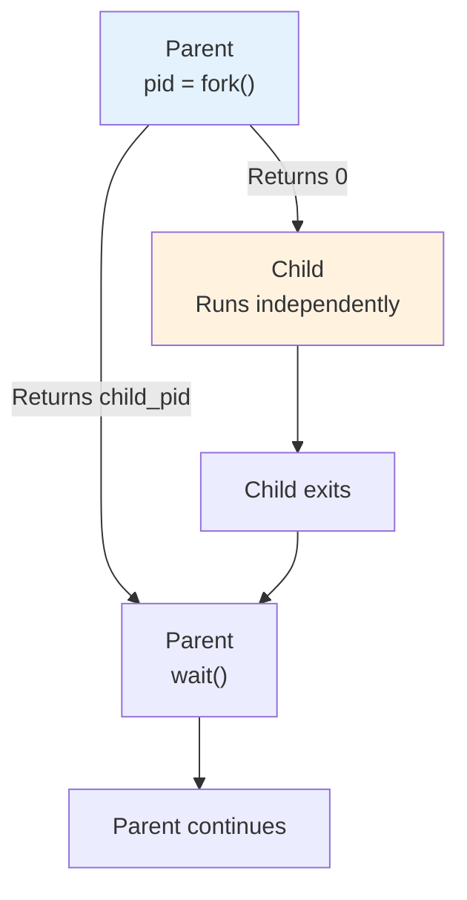
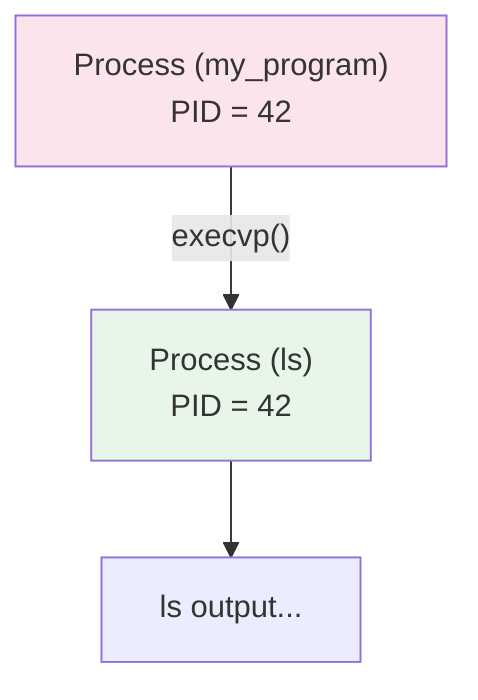
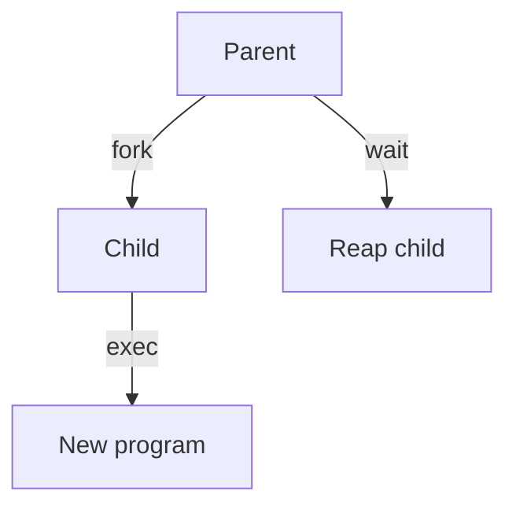
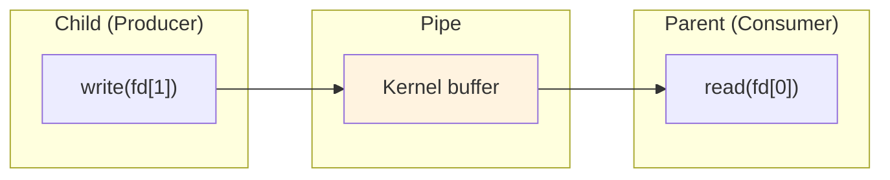
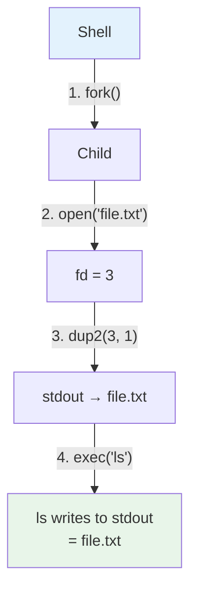
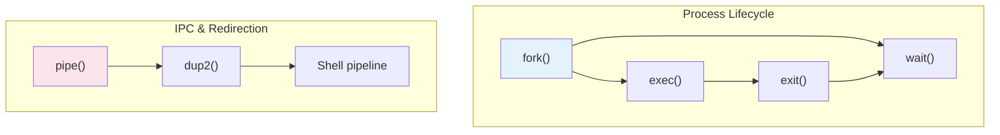

# Week 2 Lab — Process System Calls

> **Last Updated:** 2026-03-21

---

> **Prerequisites**: Week 2 Lecture concepts (process, fork, exec, wait). Ability to compile and run C programs.
>
> **Learning Objectives**: After completing this lab, you should be able to:
> 1. Use fork()/wait() to create and manage child processes
> 2. Replace a process image using exec()
> 3. Establish inter-process communication using pipe()
> 4. Implement shell-style I/O redirection using dup2()

---

## Table of Contents

- [1. Lab Overview](#1-lab-overview)
- [2. Lab 1: fork() and wait()](#2-lab-1-fork-and-wait)
- [3. Lab 2: exec()](#3-lab-2-exec)
- [4. Lab 3: pipe()](#4-lab-3-pipe)
- [5. Lab 4: dup2() and I/O Redirection](#5-lab-4-dup2-and-io-redirection)
- [Summary](#summary)
- [Appendix](#appendix)

---

<br>

## 1. Lab Overview

- **Objective**: Practice core UNIX process system calls through C programs.
- **Duration**: Approximately 50 minutes · 4 labs
- **Topics**: `fork()`, `exec()`, `wait()`, `pipe()`, `dup()`



---

<br>

## 2. Lab 1: fork() and wait()

`fork()` duplicates the calling process — the child process receives a **copy** of the parent's address space.

```c
pid_t pid = fork();
if (pid == 0) {
    // Child process
    printf("Child PID: %d\n", getpid());
} else {
    // Parent process
    wait(NULL);
    printf("Parent: child finished\n");
}
```



- `fork()` returns **0** to the child and the **child's PID** to the parent.
- `wait(NULL)` blocks until a child process terminates.

> **Definition:** In `wait(NULL)`, the `NULL` argument means we do not care about the child's exit status. If you pass a pointer to an `int` instead (e.g., `wait(&status)`), the kernel writes the child's exit status into that variable.

- **Exercise**: What happens if you remove `wait()`?

> **Note:** When `fork()` is called, the parent's memory space is copied to the child. In actual implementations, the **COW (Copy-On-Write)** technique is used to defer physical page copying until a write occurs. If `wait()` is not called, even after the child terminates, the PCB is not reclaimed, and the child becomes a **zombie process**.

> **Definition:** COW (Copy-On-Write) means the parent and child initially share the same physical memory pages after `fork()`. Only when either process tries to **write** to a page does the kernel copy that specific page, saving both memory and time. This is why `fork()` followed immediately by `exec()` is nearly free — the child's pages are about to be replaced anyway.

---

<br>

## 3. Lab 2: exec()

`exec()` replaces the current process image with a new program. The PID does **not** change.

```c
printf("Before exec\n");

char *args[] = {"ls", "-l", NULL};
execvp("ls", args);

// This line is never reached if exec succeeds
printf("After exec\n");
```



**Common pattern**: `fork()` + `exec()`



> **Key Point:** Upon success, `exec()` completely overwrites the calling process's code, data, heap, and stack with the new program, so code after the call is never executed. It returns -1 only on failure. The `fork()` → `exec()` → `wait()` pattern is the core operating principle of UNIX shells and must be thoroughly understood.

---

<br>

## 4. Lab 3: pipe()

`pipe()` creates a **unidirectional** communication channel between two file descriptors.

```c
int fd[2];
pipe(fd);  // fd[0]=read, fd[1]=write

if (fork() == 0) {
    close(fd[0]);  // Close read end
    char *msg = "hello from child";
    write(fd[1], msg, strlen(msg));
    close(fd[1]);
} else {
    close(fd[1]);  // Close write end
    char buf[64] = {0};
    read(fd[0], buf, sizeof(buf));
    printf("Received: %s\n", buf);
    close(fd[0]);
}
```



**Rules**:
- Always close the **unused** end
- Follows the **producer-consumer** pattern
- Closing the write end → the read side receives EOF

> **Definition:** EOF (End of File) signals that there is no more data to read. For pipes, this occurs when **all** write-end file descriptors are closed. This is why every process that holds a copy of the write-end fd must close it.

> **[Programming Languages]** A file descriptor is a non-negative integer assigned by the kernel to a process to identify an open file. 0=standard input (stdin), 1=standard output (stdout), and 2=standard error (stderr) are assigned by default. The fd[0] and fd[1] created by `pipe()` are also registered in this file descriptor table.

> **Key Point:** The fact that pipes are manipulated using file I/O functions like `read()`/`write()` is based on the core UNIX design philosophy: **"Everything is a file."** In UNIX, regular files, directories, pipes, sockets, and devices (keyboard, disk, etc.) are all accessed through **file descriptors** using the same interface (`open/read/write/close`). This means that knowing just one API lets you work with many different resources, keeping programming concise.

> **[Data Structures]** A pipe is a classic implementation of the producer-consumer pattern. One side (the child) writes data and the other side (the parent) reads it, synchronized through a bounded buffer inside the kernel. When the buffer is full, `write()` blocks; when it is empty, `read()` blocks.

> **Note:** A specific scenario when `close()` is omitted: if the parent does not close `fd[1]` (the write end) and calls `read(fd[0])`, even after the child finishes writing and closes `fd[1]`, the parent itself still holds `fd[1]`, so the kernel considers "the write end is still open." As a result, `read()` never receives EOF and **blocks forever**, causing the program to hang. This is the most common bug in pipe programming.

---

<br>

## 5. Lab 4: dup2() and I/O Redirection

`dup2(oldfd, newfd)` makes `newfd` point to the same file as `oldfd` — used for redirection in shells.

```c
int fd = open("output.txt",
    O_WRONLY | O_CREAT | O_TRUNC, 0644);
dup2(fd, STDOUT_FILENO);
close(fd);

// This output goes to output.txt
printf("Redirected!\n");
```

> **Note:** Explanation of the `open()` flags:
> - `O_WRONLY` — open for writing only (no reading)
> - `O_CREAT` — create the file if it does not exist
> - `O_TRUNC` — if the file already exists, truncate its contents to make it empty
> - `0644` — file permissions (owner: read+write, group/others: read only). In octal notation, this corresponds to `rw-r--r--`
>
> This combination is equivalent to the `> file.txt` redirection in a shell. To implement `>>` (append mode), use `O_APPEND` instead of `O_TRUNC`.

**How `ls > file.txt` works:**



**Exercise**: Combine `fork()` + `pipe()` + `dup2()` to implement `ls | wc -l`.

> **Note:** When `dup2(oldfd, newfd)` is called and `newfd` is already open, it is automatically closed before duplication. The full sequence when the shell executes `ls > file.txt`: (1) `fork()` to create a child → (2) the child calls `open()` to open the file, getting fd=3 → (3) `dup2(3, 1)` redirects stdout (fd=1) to the file → (4) `close(3)` cleans up the original fd → (5) `exec("ls")` replaces the program. After this, when `ls` outputs via `printf()`/`write(1,...)`, it is automatically written to the file.

> **Note:** Step-by-step guide for implementing `ls | wc -l`:
> 1. The parent calls `pipe(fd)` to create a pipe → `fd[0]` (read), `fd[1]` (write)
> 2. First `fork()` → **Child 1** (ls role):
>    - `dup2(fd[1], STDOUT_FILENO)` — redirect stdout to the pipe's write end
>    - `close(fd[0])`, `close(fd[1])` — close all original fds
>    - `execlp("ls", "ls", NULL)` — run ls
> 3. Second `fork()` → **Child 2** (wc role):
>    - `dup2(fd[0], STDIN_FILENO)` — redirect stdin to the pipe's read end
>    - `close(fd[0])`, `close(fd[1])` — close all original fds
>    - `execlp("wc", "wc", "-l", NULL)` — run wc -l
> 4. **Parent**: `close(fd[0])`, `close(fd[1])` — the parent must also close all pipe fds (required!)
> 5. **Parent**: call `wait(NULL)` twice — reap both children
>
> Key: unused pipe fds must be closed in **all processes** including the parent for EOF to be properly delivered.

---

<br>

## Summary



| System Call | Purpose |
|:------------|:--------|
| `fork()` | Create a child process (copy of parent); returns 0 to child, child PID to parent |
| `exec()` | Replace process image with a new program; PID preserved, does not return on success |
| `wait()` | Block until a child terminates; reap zombie processes |
| `pipe()` | Create a unidirectional IPC channel; fd[0]=read, fd[1]=write |
| `dup2()` | Redirect file descriptors; the core of shell redirection |
| Shell pipeline | `cmd1 \| cmd2` = fork + pipe + dup2 + exec (x2) + wait |

---

<br>

## Appendix

- Next week: we dive into the xv6 internals to **read the kernel source** that implements these system calls.

---

<br>

## Self-Check Questions

1. **Pipe EOF:** In a fork+pipe program, the parent forgets to close `fd[1]` before calling `read(fd[0])`. The child writes data and closes `fd[1]`. Will the parent's `read()` ever return? Why or why not?
2. **dup2 Behavior:** After `dup2(fd, STDOUT_FILENO)`, what happens when the process calls `printf()`? Why is it important to `close(fd)` afterward?
3. **fork + exec Pattern:** If `exec()` succeeds, will the line `perror("exec failed")` ever execute? What does it mean when you see that error message?
4. **wait(NULL) vs wait(&status):** Explain the difference. When would you use one over the other?
5. **Pipeline Implementation:** In the `ls | wc -l` implementation, why must the parent close **both** `fd[0]` and `fd[1]` even though it does not read from or write to the pipe?

---
