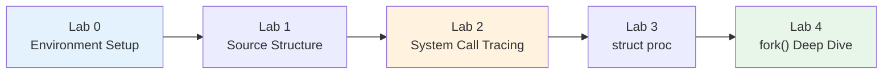

# Week 3 Lab — Exploring xv6 Internals

> **Last Updated:** 2026-03-21

---

## Table of Contents

- [1. Lab Overview](#1-lab-overview)
- [2. Lab 0: Environment Setup](#2-lab-0-environment-setup)
  - [2.1 Prerequisites](#21-prerequisites)
  - [2.2 Build Verification & Troubleshooting](#22-build-verification--troubleshooting)
- [3. Lab 1: Source Structure](#3-lab-1-source-structure)
- [4. Lab 2: System Call Tracing](#4-lab-2-system-call-tracing)
  - [4.1 System Call Path](#41-system-call-path)
  - [4.2 How to Run the Tracing Exercise](#42-how-to-run-the-tracing-exercise)
- [5. Lab 3: struct proc Analysis](#5-lab-3-struct-proc-analysis)
  - [5.1 Process State Machine](#51-process-state-machine)
  - [5.2 Full Definition of struct proc](#52-full-definition-of-struct-proc)
- [6. Lab 4: Deep Dive into fork() Implementation](#6-lab-4-deep-dive-into-fork-implementation)
- [Summary](#summary)
- [Appendix](#appendix)

---

<br>

## 1. Lab Overview

- **Objective**: Explore the xv6 kernel source and trace how system calls work from start to finish.
- **Duration**: Approximately 50 minutes · 5 labs (Lab 0–4)



---

<br>

## 2. Lab 0: Environment Setup

### 2.1 Prerequisites

Building xv6-riscv requires a **RISC-V cross compiler** and a **QEMU emulator**.

> **Note:** **QEMU** = Quick EMUlator — a software emulator capable of running an entire OS built for a different CPU architecture. It allows running xv6 (built for RISC-V) on an x86/ARM laptop without actual RISC-V hardware.

<div class="grid grid-cols-3 gap-4">
<div>

### macOS (Homebrew)

```bash
brew install qemu
brew install riscv64-elf-gcc
```

</div>
<div>

### Ubuntu / Debian

```bash
sudo apt update
sudo apt install -y git build-essential \
  qemu-system-misc \
  gcc-riscv64-linux-gnu \
  binutils-riscv64-linux-gnu
```

</div>
<div>

### Windows (WSL2)

```powershell
# PowerShell (administrator):
wsl --install -d Ubuntu
```

After restarting, follow the Ubuntu installation instructions on the left in the WSL Ubuntu terminal.

> Work in `~/`. `/mnt/c/` is **very slow**

</div>
</div>

<div class="mt-4 text-sm">

**Clone xv6** (common to all platforms):
```bash
git clone https://github.com/mit-pdos/xv6-riscv.git
```

**Detailed guide**: [`setup_xv6_env.md`](../week02/2_lab/setup_xv6_env.md) · **MIT 6.1810 tools**: [pdos.csail.mit.edu/6.828/2024/tools.html](https://pdos.csail.mit.edu/6.828/2024/tools.html) · **xv6 repository**: [github.com/mit-pdos/xv6-riscv](https://github.com/mit-pdos/xv6-riscv)

</div>

> **[Computer Architecture]** xv6 runs on the RISC-V architecture, where the transition from user mode (U-mode) to kernel mode (S-mode) is performed via the `ecall` instruction. Understanding this structure makes it much easier to follow the system call path later.

---

### 2.2 Build Verification & Troubleshooting

<div class="grid grid-cols-2 gap-4">
<div>

### Build & Run

```bash
cd xv6-riscv
make qemu
```

Expected output:
```
xv6 kernel is booting

hart 2 starting
hart 1 starting
init: starting sh
$
```

Try running `ls`, `echo hello` in the xv6 shell.
**Exit QEMU**: Press **Ctrl-A** then **X**.

</div>
<div>

### Common Issues

| Problem | Solution |
|:--------|:---------|
| `riscv64 version of GCC not found` | Manually set `TOOLPREFIX` as shown below |
| QEMU version < 5.0 | Upgrade QEMU |
| macOS linker error | Use `brew install riscv64-elf-gcc` (not linux-gnu) |
| WSL2 "KVM not available" | Harmless warning — ignore |

**TOOLPREFIX** — when auto-detection fails:
```bash
# Check installed tools:
ls /usr/bin/riscv64-*

# Set explicitly:
make TOOLPREFIX=riscv64-linux-gnu- qemu
# Or for macOS:
make TOOLPREFIX=riscv64-elf- qemu
```

</div>
</div>

---

<br>

## 3. Lab 1: Source Structure

| File | Role |
|:-----|:-----|
| `proc.h` | `struct proc` definition |
| `proc.c` | fork, exit, wait, scheduler |
| `syscall.c` | System call dispatch table |
| `sysproc.c` | System call handlers |
| `trap.c` | Trap entry from user space |
| `usys.pl` | User-space stub code generator |

> **Note:** A **stub** is a short piece of code that acts as a proxy for the actual implementation. Here, user-space stubs only put the system call number into a register and execute the `ecall` instruction when a user program calls `fork()`. In other words, the user writes `fork()` as if calling a regular function, but the stub actually mediates the entry into the kernel. The `usys.pl` script auto-generates these stubs.

---

<br>

## 4. Lab 2: System Call Tracing

### 4.1 System Call Path

**The full path of `fork()` from user space to the kernel:**

```
  User program: fork()
         │
         ▼
  usys.S:  li a7, SYS_fork  →  ecall
         │
         ▼
  trap.c:  usertrap()        ← Handles all user traps
         │
         ▼
  syscall.c:  syscall()      ← Reads a7, looks up dispatch table
         │
         ▼
  sysproc.c:  sys_fork()     ← Thin wrapper
         │
         ▼
  proc.c:  kfork()           ← Performs the actual work
```

**Exercise**: Add a `printf` to `sys_fork()`, rebuild, and verify that you found the correct location.

<div class="mt-4 text-sm opacity-80">

**Resources**: `examples/skeletons/lab2_syscall_trace.patch` (TODO template) · `examples/solutions/lab2_syscall_trace.patch` (solution)
**Test program**: `examples/skeletons/lab2_trace.c` (skeleton) · `examples/solutions/lab2_trace.c` (solution)

</div>

> **Note:** When the `ecall` instruction is executed, the hardware automatically performs the following: (1) saves the current PC to the `sepc` register, (2) switches the privilege mode to S-mode, (3) jumps to the trap handler address set in the `stvec` register. Understanding this flow makes the `usertrap()` → `syscall()` path clear.

> **[Computer Architecture]** Explanation of RISC-V assembly instructions in the diagram:
> - `li a7, SYS_fork` — **Load Immediate**: loads the constant `SYS_fork` (= 1) into register `a7`. `a7` is the register used to convey the system call number
> - `ecall` — **Environment Call**: triggers a trap to the CPU signaling "there is a request for the kernel." The hardware automatically switches from user mode to kernel mode
>
> RISC-V register naming conventions: `a0`–`a7` are for function arguments/return values, `t0`–`t6` are temporaries, `s0`–`s11` are saved registers (callee-saved), `sp` is the stack pointer, `ra` is the return address.

---

### 4.2 How to Run the Tracing Exercise

<div class="grid grid-cols-2 gap-4">
<div>

### Step 1 — Apply the kernel patch

```bash
# From the repository root:
cd xv6-riscv

# Apply the solution (or skeleton) patch
git apply ../lectures/week03/2_lab/\
examples/solutions/lab2_syscall_trace.patch
```

### Step 2 — Add the test program

```bash
# Copy the test program to the xv6 user/ directory
cp ../lectures/week03/2_lab/\
examples/solutions/lab2_trace.c \
user/lab2_trace.c
```

</div>
<div>

### Step 3 — Modify the Makefile

Open `xv6-riscv/Makefile`, find the `UPROGS` list, and add the following:

```makefile
UPROGS=\
  ...
  $U/_lab2_trace\
```

### Step 4 — Build and run

```bash
make clean && make qemu
```

At the xv6 shell prompt:
```
$ lab2_trace
```

You should see `[TRACE] sys_fork() called by ...` output from the kernel.

**Exit QEMU**: Press **Ctrl-A** then **X**.

</div>
</div>

---

<br>

## 5. Lab 3: struct proc Analysis

### 5.1 Process State Machine

**Process State Machine** — defined in `kernel/proc.h`:

```
                  allocproc()        fork()/userinit()        scheduler
  UNUSED ──────────▶ USED ──────────────▶ RUNNABLE ──────────▶ RUNNING
    ▲                                        ▲                  │  │
    │                                        │   yield()/       │  │
    │                                        │   interrupt      │  │
    │                                        ◀──────────────────┘  │
    │                                        ▲                     │
    │                              wakeup()  │       sleep()       │
    │                                        │         │           │
    │                                     SLEEPING ◀───┘           │
    │                                                              │
    │                                                      exit()  │
    │                       wait() reaps                           │
    └──────────────────────── ZOMBIE ◀─────────────────────────────┘
```

**Key fields**: `state`, `pid`, `pagetable`, `trapframe`, `context`, `ofile[]`, `parent`

- **Exercise**: Which fields change at each state transition?

> **[Data Structures]** `enum procstate` is a C enumeration that represents each state as an integer constant. State machines are a design pattern used not only in operating systems but in protocols, game logic, and many other fields.

### 5.2 Full Definition of struct proc

```c
struct proc {
  struct spinlock lock;
  enum procstate state;        // UNUSED → USED → RUNNABLE → RUNNING → ZOMBIE
  void *chan;                  // Sleep channel (when in SLEEPING state)
  int killed;                  // Pending kill signal
  int xstate;                  // Exit status to pass to parent
  int pid;                     // Process ID

  struct proc *parent;         // Parent process (protected by wait_lock)

  uint64 kstack;               // Kernel stack virtual address
  uint64 sz;                   // Process memory size (bytes)
  pagetable_t pagetable;       // User page table
  struct trapframe *trapframe; // Saved user registers (used by trampoline.S)
  struct context context;      // Saved kernel registers (used by swtch.S)
  struct file *ofile[NOFILE];  // Open file descriptors
  struct inode *cwd;           // Current working directory
  char name[16];               // Process name (for debugging)
};
```

> **Note:** `struct spinlock lock` is the **spinlock** for this process structure. A spinlock is the simplest synchronization tool that prevents other CPU cores from simultaneously modifying the same `struct proc`. It is called a "spin" lock because a core trying to acquire it spins in a `while (lock == held)` loop. Since xv6 supports multi-core, this lock must be acquired before changing the process state. Details on spinlocks and synchronization are covered in Weeks 9–10.

> **Note:** A **sleep channel** is an **arbitrary address value** that identifies "what a process is waiting for while sleeping." For example, if a process sleeps while waiting for data on a pipe, the address of that pipe structure is stored in `chan`. Later, when data arrives, `wakeup(chan)` is called to wake all processes sleeping on that address. This mechanism avoids busy waiting and uses the CPU efficiently. The `sleep()`/`wakeup()` implementation is covered in detail in Week 9.

> **[Programming Languages]** `struct proc` is a C structure representing a single process. Each field covers a different aspect of the process (scheduling state, memory layout, open files, etc.). In the Linux kernel, the corresponding `task_struct` has over 700 fields, highlighting the simplicity of xv6 for learning purposes.

> **Exam Tip:** `trapframe` is a structure for preserving user register values when transitioning from user mode to kernel mode. It is the core mechanism that allows a user program to resume exactly where it left off after a system call completes. Be sure to understand the role of each field.

---

<br>

## 6. Lab 4: Deep Dive into fork() Implementation

```
  1. allocproc()         ── Secure new process slot, pid, kstack, trapframe
         │
  2. uvmcopy()           ── Copy parent's page table + memory
         │
  3. Copy trapframe      ── Child also returns from fork()
         │
  4. Set a0 = 0          ── Child's fork() return value is 0
         │
  5. Copy ofile[]        ── Share open file descriptors
         │
  6. Set parent,         ── Child becomes runnable
     state = RUNNABLE
         │
  7. Return child PID    ── To the parent
```

**Discussion questions**:
- Why does the child process need its **own copy** of the trapframe?
- What happens if step 4 (`a0 = 0`) is skipped?
- Why does `uvmcopy` copy **all** pages? (Hint: Week 12 — COW fork)

> **Note:** Breaking down the internal operation of `uvmcopy()` step by step:
> 1. Walk the parent's page table to find all mapped user pages
> 2. For each page, allocate a new physical memory frame with `kalloc()`
> 3. Copy the contents of the parent's page to the new frame **byte by byte** (`memmove`)
> 4. Map the new frame to the same virtual address in the child's page table
>
> This process becomes more expensive as the process memory grows. "u" stands for user, "vm" for virtual memory, and "copy" for copy — as the name suggests, it is "a function that copies user virtual memory."

> **[Computer Architecture]** The `a0` register in RISC-V is used to convey function return values. The mechanism by which `fork()` returns the child PID to the parent and 0 to the child is implemented through manipulation of `trapframe->a0`. The fact that identical code returns different values in two processes via this mechanism is a frequent exam question.

> **Note:** Having `uvmcopy()` copy all pages is highly inefficient. In real Linux, the COW (Copy-On-Write) technique is used: at fork time, only page table entries are copied, and actual physical pages are copied only when a write is attempted. This optimization is covered in Week 12.

> **Note:** Representative registers saved in the trapframe:
> - `epc` — program counter at the time of the trap (the address to return to)
> - `a0`–`a7` — function arguments / system call arguments / return values
> - `sp` — user stack pointer
> - `s0`–`s11` — callee-saved registers (values that must be preserved per calling convention)
>
> Setting `trapframe->a0 = 0` in fork() ensures that when the child returns from kernel to user mode, it reads 0 from `a0` (the return value register), allowing it to recognize "I am the child."

---

<br>

## Summary

| Concept | Key Summary |
|:--------|:-----------|
| xv6 | ~10,000 lines of C code — an educational OS small enough to read in its entirety |
| Key kernel files | `proc.h/c` (processes), `syscall.c` (dispatch), `sysproc.c` (handlers), `trap.c` (trap entry) |
| System call path | user → `ecall` → `usertrap()` → `syscall()` → handler → implementation |
| struct proc | The kernel's complete view of a process (scheduling state, memory, files) |
| Process states | UNUSED → USED → RUNNABLE → RUNNING → ZOMBIE → UNUSED |
| fork() | `allocproc` → `uvmcopy` → copy trapframe → `a0=0` → copy files → RUNNABLE |
| fork() return value | Parent: child PID, Child: 0 — implemented via `trapframe->a0` manipulation |
| COW fork | xv6 copies all pages, but Linux optimizes with COW (Week 12) |

```
  What we explored today:

  Source structure ──▶ System call path ──▶ struct proc lifecycle ──▶ fork() implementation
```

---

<br>

## Appendix

- Next topic: **Threads, Scheduling, Synchronization** — built upon what we explored today.
- **Contact:** *[redacted]*

---
