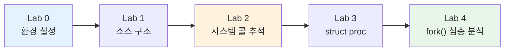

# 3주차 실습 — xv6 내부 구조 탐색

> **최종 수정일:** 2026-04-09

> **선행 지식**: 2주차-W03 이론 개념. xv6 빌드 환경 설정 완료 (QEMU + RISC-V 툴체인).
>
> **학습 목표**: 이 실습을 완료하면 다음을 할 수 있어야 한다:
> 1. xv6 소스 코드 구조를 탐색
> 2. 유저 공간에서 커널까지의 시스템 콜 경로를 추적
> 3. struct proc의 필드와 목적을 설명
> 4. xv6에서 fork()의 내부 단계를 서술

---

## 목차

- [1. 실습 개요](#1-실습-개요)
- [2. Lab 0: 환경 설정](#2-lab-0-환경-설정)
  - [2.1 선행 요건](#21-선행-요건)
  - [2.2 빌드 확인 & 트러블슈팅](#22-빌드-확인--트러블슈팅)
- [3. Lab 1: 소스 구조](#3-lab-1-소스-구조)
- [4. Lab 2: 시스템 콜 추적](#4-lab-2-시스템-콜-추적)
  - [4.1 시스템 콜 경로](#41-시스템-콜-경로)
  - [4.2 추적 연습 실행 방법](#42-추적-연습-실행-방법)
- [5. Lab 3: struct proc 분석](#5-lab-3-struct-proc-분석)
  - [5.1 프로세스 상태 머신](#51-프로세스-상태-머신)
  - [5.2 struct proc 전체 정의](#52-struct-proc-전체-정의)
- [6. Lab 4: fork() 구현 심층 분석](#6-lab-4-fork-구현-심층-분석)
- [요약](#요약)
- [부록](#부록)

---

<br>

## 1. 실습 개요

- **목표**: xv6 커널 소스를 탐색하고, 시스템 콜(System Call)이 처음부터 끝까지 어떻게 동작하는지 추적한다.
- **소요 시간**: 약 50분 · 5개 실습 (Lab 0–4)



---

<br>

## 2. Lab 0: 환경 설정

> **참고:** 2주차에서 이미 xv6 환경을 설정했다면 [3. Lab 1: 소스 구조](#3-lab-1-소스-구조)로 건너뛰어도 된다.

### 2.1 선행 요건

xv6-riscv를 빌드하려면 **RISC-V 크로스 컴파일러** 와 **QEMU 에뮬레이터** 가 필요하다.

> **참고:** **QEMU** = Quick EMUlator — 다른 CPU 아키텍처용 OS 전체를 실행할 수 있는 소프트웨어 에뮬레이터이다. 실제 RISC-V 하드웨어 없이도 x86/ARM 노트북에서 xv6(RISC-V용으로 빌드됨)를 실행할 수 있게 해준다.

<div class="grid grid-cols-3 gap-4">
<div>

### macOS (Homebrew)

```bash
brew install qemu
brew install riscv64-elf-gcc
```

</div>
<div>

### Ubuntu / Debian

```bash
sudo apt update
sudo apt install -y git build-essential \
  qemu-system-misc \
  gcc-riscv64-linux-gnu \
  binutils-riscv64-linux-gnu
```

</div>
<div>

### Windows (WSL2)

```powershell
# PowerShell (관리자 권한):
wsl --install -d Ubuntu
```

재시작 후, WSL Ubuntu 터미널에서 왼쪽의 Ubuntu 설치 방법을 따른다.

> `~/`에서 작업할 것. `/mnt/c/`는 **매우 느리다**

</div>
</div>

<div class="mt-4 text-sm">

**xv6 클론** (모든 플랫폼 공통):
```bash
git clone https://github.com/mit-pdos/xv6-riscv.git
```

**상세 가이드**: [`setup_xv6_env.md`](../week02/2_lab/setup_xv6_env.md) · **MIT 6.1810 도구**: [pdos.csail.mit.edu/6.828/2024/tools.html](https://pdos.csail.mit.edu/6.828/2024/tools.html) · **xv6 저장소**: [github.com/mit-pdos/xv6-riscv](https://github.com/mit-pdos/xv6-riscv)

</div>

> **[컴퓨터구조]** xv6는 RISC-V 아키텍처에서 동작하며, 유저 모드(U-mode)에서 커널 모드(S-mode)로의 전환이 `ecall` 명령어를 통해 이루어진다. 이 구조를 이해하면 이후 시스템 콜 경로를 따라가기가 훨씬 수월하다.

> **참고:** U-mode(사용자 모드)는 일반 프로그램이 제한된 권한으로 실행되는 모드이고, S-mode(관리자 모드)는 커널이 실행되는 특권 수준이다 — CPU가 각 모드에서 허용되는 연산을 엄격히 제한한다.

---

### 2.2 빌드 확인 & 트러블슈팅

<div class="grid grid-cols-2 gap-4">
<div>

### 빌드 & 실행

```bash
cd xv6-riscv
make qemu
```

예상 출력:
```
xv6 kernel is booting

hart 2 starting
hart 1 starting
init: starting sh
$
```

xv6 셸에서 `ls`, `echo hello`를 실행해 본다.
**QEMU 종료**: **Ctrl-A** 를 누른 뒤 **X** 를 누른다.

</div>
<div>

### 자주 발생하는 문제

| 문제 | 해결 방법 |
|:-----|:---------|
| `riscv64 version of GCC not found` | 아래를 참고하여 `TOOLPREFIX`를 수동 설정 |
| QEMU 버전 < 5.0 | QEMU 업그레이드 |
| macOS 링커 오류 | `brew install riscv64-elf-gcc` 사용 (linux-gnu 아님) |
| WSL2 "KVM not available" | 무해한 경고 — 무시 |

**TOOLPREFIX** — 자동 감지가 실패할 경우:
```bash
# 설치된 도구 확인:
ls /usr/bin/riscv64-*

# 명시적으로 설정:
make TOOLPREFIX=riscv64-linux-gnu- qemu
# 또는 macOS의 경우:
make TOOLPREFIX=riscv64-elf- qemu
```

</div>
</div>

---

<br>

## 3. Lab 1: 소스 구조

| 파일 | 역할 |
|:-----|:-----|
| `proc.h` | `struct proc` 정의 |
| `proc.c` | fork, exit, wait, 스케줄러(Scheduler) |
| `syscall.c` | 시스템 콜(System Call) 디스패치 테이블 |
| `sysproc.c` | 시스템 콜 핸들러 |
| `trap.c` | 유저 공간(User Space)에서의 트랩(Trap) 진입 |
| `usys.pl` | 유저 공간 스텁(Stub) 코드 생성 |

> **참고:** **스텁(Stub)** 이란 실제 구현을 대리하는 짧은 코드 조각이다. 여기서 유저 공간 스텁은 사용자 프로그램이 `fork()`를 호출하면, 내부적으로 시스템 콜 번호를 레지스터에 넣고 `ecall` 명령어를 실행하는 역할만 수행한다. 즉, 사용자는 일반 함수를 호출하는 것처럼 `fork()`를 쓰지만, 실제로는 스텁이 커널로의 진입을 중개해 주는 것이다. `usys.pl` 스크립트가 이 스텁들을 자동 생성한다.

---

<br>

## 4. Lab 2: 시스템 콜 추적

### 4.1 시스템 콜 경로

**`fork()`가 유저 공간에서 커널까지 도달하는 전체 경로:**

```
  유저 프로그램: fork()
         │
         ▼
  usys.S:  li a7, SYS_fork  →  ecall
         │
         ▼
  trap.c:  usertrap()        ← 모든 유저 트랩 처리
         │
         ▼
  syscall.c:  syscall()      ← a7 읽기, 디스패치 테이블 조회
         │
         ▼
  sysproc.c:  sys_fork()     ← 얇은 래퍼(Wrapper)
         │
         ▼
  proc.c:  kfork()           ← 실제 작업 수행
```

> **참고:** 여기서 `kfork()`라는 이름을 사용한 것은 유저용 `fork()` 시스템 콜과 커널 내부 구현을 구분하기 위함이다. 실제 xv6 소스에서는 `proc.c`에 `fork()`라는 이름으로 정의되어 있다.

**연습**: `sys_fork()`에 `printf`를 추가한 뒤 다시 빌드하여, 올바른 위치를 찾았는지 확인하라.

<div class="mt-4 text-sm opacity-80">

**자료**: `examples/skeletons/lab2_syscall_trace.patch` (TODO 템플릿) · `examples/solutions/lab2_syscall_trace.patch` (정답)
**테스트 프로그램**: `examples/skeletons/lab2_trace.c` (스켈레톤) · `examples/solutions/lab2_trace.c` (정답)

</div>

> **참고:** `ecall` 명령어가 실행되면 하드웨어가 자동으로 다음을 수행한다: (1) 현재 PC를 `sepc` 레지스터에 저장, (2) 특권 모드를 S-mode로 전환, (3) `stvec` 레지스터에 설정된 트랩 핸들러 주소로 점프. 이 흐름을 이해하면 `usertrap()` → `syscall()` 경로가 명확해진다.

> **[컴퓨터구조]** 다이어그램에 나오는 RISC-V 어셈블리 명령어 해설:
> - `li a7, SYS_fork` — **Load Immediate**: 상수 `SYS_fork`(= 1)를 레지스터 `a7`에 넣는다. `a7`은 시스템 콜 번호를 전달하는 레지스터이다
> - `ecall` — **Environment Call**: CPU에 "커널에 요청이 있다"는 트랩을 발생시킨다. 하드웨어가 자동으로 유저 모드 → 커널 모드로 전환한다
>
> RISC-V의 레지스터 이름 규약: `a0`~`a7`은 함수 인자/반환값, `t0`~`t6`은 임시값, `s0`~`s11`은 저장 레지스터(callee-saved), `sp`는 스택 포인터, `ra`는 반환 주소이다.

---

### 4.2 추적 연습 실행 방법

<div class="grid grid-cols-2 gap-4">
<div>

### Step 1 — 커널 패치 적용

```bash
# 저장소 루트에서:
cd xv6-riscv

# 정답(또는 스켈레톤) 패치 적용
git apply ../lectures/week03/2_lab/\
examples/solutions/lab2_syscall_trace.patch
```

### Step 2 — 테스트 프로그램 추가

```bash
# 테스트 프로그램을 xv6 user/ 디렉토리에 복사
cp ../lectures/week03/2_lab/\
examples/solutions/lab2_trace.c \
user/lab2_trace.c
```

</div>
<div>

### Step 3 — Makefile 수정

`xv6-riscv/Makefile`을 열고 `UPROGS` 목록을 찾아 다음을 추가한다:

```makefile
UPROGS=\
  ...
  $U/_lab2_trace\
```

### Step 4 — 빌드 및 실행

```bash
make clean && make qemu
```

xv6 셸 프롬프트에서:
```
$ lab2_trace
```

커널로부터 `[TRACE] sys_fork() called by ...`가 출력되어야 한다.

**QEMU 종료**: **Ctrl-A** 를 누른 뒤 **X** 를 누른다.

</div>
</div>

---

<br>

## 5. Lab 3: struct proc 분석

### 5.1 프로세스 상태 머신

**프로세스 상태 머신(State Machine)** — `kernel/proc.h`에 정의:

```
                  allocproc()        fork()/userinit()        scheduler
  UNUSED ──────────▶ USED ──────────────▶ RUNNABLE ──────────▶ RUNNING
    ▲                                        ▲                  │  │
    │                                        │   yield()/       │  │
    │                                        │   interrupt      │  │
    │                                        ◀──────────────────┘  │
    │                                        ▲                     │
    │                              wakeup()  │       sleep()       │
    │                                        │         │           │
    │                                     SLEEPING ◀───┘           │
    │                                                              │
    │                                                      exit()  │
    │                       wait() reaps                           │
    └──────────────────────── ZOMBIE ◀─────────────────────────────┘
```

**주요 필드**: `state`, `pid`, `pagetable`, `trapframe`, `context`, `ofile[]`, `parent`

- **연습**: 각 상태 전이(State Transition)에서 어떤 필드가 변경되는가?

> **[자료구조]** `enum procstate`는 C 언어의 열거형(enum)으로, 각 상태를 정수 상수로 표현한다. 상태 머신(State Machine)은 운영체제뿐 아니라 프로토콜, 게임 로직 등 다양한 분야에서 핵심적으로 사용되는 설계 패턴이다.

### 5.2 struct proc 전체 정의

```c
struct proc {
  struct spinlock lock;
  enum procstate state;        // UNUSED → USED → RUNNABLE → RUNNING → ZOMBIE
  void *chan;                  // 슬립 채널 (SLEEPING 상태일 때)
  int killed;                  // 대기 중인 킬 시그널
  int xstate;                  // 부모에게 전달할 종료 상태
  int pid;                     // 프로세스 ID

  struct proc *parent;         // 부모 프로세스 (wait_lock으로 보호됨)

  uint64 kstack;               // 커널 스택 가상 주소
  uint64 sz;                   // 프로세스 메모리 크기 (바이트)
  pagetable_t pagetable;       // 유저 페이지 테이블(Page Table, 아래 참고)
  struct trapframe *trapframe; // 저장된 유저 레지스터 (trampoline.S에서 사용)
  struct context context;      // 저장된 커널 레지스터 (swtch.S에서 사용)
  struct file *ofile[NOFILE];  // 열린 파일 디스크립터
  struct inode *cwd;           // 현재 작업 디렉토리
  char name[16];               // 프로세스 이름 (디버깅용)
};
```

> **참고:** `context`는 스케줄러가 커널 내부에서 프로세스 간 전환할 때 사용하는 피호출자 저장 커널 레지스터를 저장하고(`swtch.S` 사용), `trapframe`은 사용자 공간에서 커널로 진입할 때 전체 사용자 모드 레지스터 상태를 저장한다. 서로 다른 전환을 담당한다: 커널↔커널 vs. 사용자↔커널.

> **참고:** (`inode` = 파일이나 디렉토리에 대한 커널의 내부 서술자로, 크기, 권한, 디스크 위치 등의 메타데이터를 저장한다 — 파일 시스템 주차에서 다룸)

> **참고:** `ofile[]`는 커널 측 파일 객체를 저장한다. 사용자 프로그램이 사용하는 파일 디스크립터 번호(예: `fd = 3`)는 단순히 이 배열의 인덱스이다.

> **참고:** `pagetable_t`는 xv6에서 프로세스 페이지 테이블의 루트를 가리키는 포인터의 typedef이다. 가상 주소를 물리 메모리에 매핑하는 역할을 한다. 정의는 `kernel/riscv.h`에 있는 `typedef uint64 *pagetable_t;`이다.

> **참고:** `struct spinlock lock`은 이 프로세스 구조체에 대한 **스핀락(spinlock)** 이다. 스핀락은 다른 CPU 코어가 동시에 같은 `struct proc`를 수정하는 것을 방지하는 가장 단순한 동기화 도구이다. 락을 획득하려는 코어가 `while (lock == 잠김)` 루프를 돌며 대기(spin)하기 때문에 "스핀"락이라 부른다. xv6는 멀티코어를 지원하므로, 프로세스 상태를 변경하기 전에 반드시 이 락을 획득해야 한다. 스핀락과 동기화에 대한 상세한 내용은 9~10주차에서 다룬다.

> **참고:** **슬립 채널(sleep channel)** 은 프로세스가 "무엇을 기다리며 잠들었는지"를 식별하는 **임의의 주소값** 이다. 예를 들어 프로세스가 파이프에서 데이터를 기다리며 잠들면 `chan`에 해당 파이프 구조체의 주소가 저장된다. 나중에 데이터가 도착하면 `wakeup(chan)`을 호출하여 해당 주소로 잠든 모든 프로세스를 깨운다. 이 메커니즘은 바쁜 대기(busy wait)를 피하고 CPU를 효율적으로 사용하기 위한 것이며, 9주차에서 `sleep()`/`wakeup()` 구현을 상세히 다룬다.

> **[프로그래밍언어]** `struct proc`는 프로세스 하나를 표현하는 C 구조체이다. 각 필드가 프로세스의 서로 다른 측면(스케줄링 상태, 메모리 레이아웃, 열린 파일 등)을 담당한다. Linux 커널에서는 이에 대응하는 `task_struct`가 약 700개 이상의 필드를 가지고 있어, xv6의 간결함이 학습에 유리하다.

> **시험 팁:** `trapframe`은 유저 모드에서 커널 모드로 전환될 때 유저의 레지스터 값을 보존하기 위한 구조체이다. 시스템 콜 완료 후 유저 프로그램이 정확히 이전 상태로 복귀할 수 있도록 하는 핵심 메커니즘이다. 각 필드의 역할을 숙지할 것.

---

<br>

## 6. Lab 4: fork() 구현 심층 분석

```
  1. allocproc()         ── 새 프로세스 슬롯, pid, kstack*, 트랩프레임 확보
         │
  2. uvmcopy()           ── 부모의 페이지 테이블 + 메모리 복사
         │
  3. 트랩프레임 복사         ── 자식도 fork()에서 리턴
         │
  4. a0 = 0 설정          ── 자식은 fork() 반환값이 0
         │
  5. ofile[] 복사         ── 열린 파일 디스크립터 공유
         │
  6. parent 설정,         ── 자식이 실행 가능 상태
     state = RUNNABLE
         │
  7. 부모에게 자식 PID      ── 반환
```

> **참고:** 커널 스택(`kstack`)은 이 프로세스가 커널 내부에서 실행될 때(예: 시스템 콜 중) 사용하는 커널 메모리의 사적 스택 영역이다. 사용자 코드가 커널 실행을 변조하는 것을 방지하기 위해 사용자 스택과 완전히 분리되어 있다.

**토론 질문**:
- 왜 자식 프로세스에게 **자체적인** 트랩프레임(Trapframe) 사본이 필요한가?
  <details><summary>힌트</summary>fork() 반환 후 부모와 자식이 서로 다른 명령어를 실행할 때 독립적인 레지스터 상태가 필요하다는 점을 생각해 보라.</details>
- 4단계(`a0 = 0`)를 건너뛰면 어떻게 되는가?
  <details><summary>힌트</summary>자식의 <code>a0</code> 레지스터에 어떤 값이 남는지 생각해 보라. 부모와 같은 값이 되어 자식이 스스로를 부모로 인식하게 된다.</details>
- 왜 `uvmcopy`는 **모든** 페이지를 복사하는가? (힌트: 12주차 — COW fork)
  <details><summary>힌트</summary>xv6는 단순한 접근 방식을 택한다. 실제 Linux 등의 OS는 쓰기가 발생할 때까지 복사를 지연한다 (Copy-On-Write).</details>

> **참고:** `uvmcopy()`의 내부 동작을 단계별로 풀어보면:
> 1. 부모의 페이지 테이블을 순회하며 매핑된 모든 유저 페이지를 찾는다
> 2. 각 페이지마다 새로운 물리 메모리 프레임을 `kalloc()`으로 할당한다
> 3. 부모 페이지의 내용을 새 프레임에 **바이트 단위로 복사** 한다 (`memmove`)
> 4. 자식의 페이지 테이블에 새 프레임을 동일한 가상 주소로 매핑한다
>
> 이 과정은 프로세스 메모리가 클수록 비용이 높아진다. "u"는 user, "vm"은 virtual memory, "copy"는 복사를 의미하여, 이름 그대로 "유저 가상 메모리를 복사하는 함수"이다.

> **[컴퓨터구조]** `a0` 레지스터는 RISC-V에서 함수 반환값을 전달하는 레지스터이다. `fork()`가 부모에게는 자식 PID를, 자식에게는 0을 반환하는 구조가 바로 이 `trapframe->a0` 값 조작을 통해 구현된다. 동일한 코드가 두 프로세스에서 서로 다른 값을 반환하는 이 메커니즘은 시험 단골 출제 포인트이다.

> **참고:** `uvmcopy()`가 모든 페이지를 복사하는 것은 매우 비효율적이다. 실제 Linux에서는 COW(Copy-On-Write) 기법을 사용하여, fork 시점에는 페이지 테이블 항목만 복사하고 쓰기 시도 시에만 실제 물리 페이지를 복사한다. 이 최적화는 12주차에서 다룬다.

> **참고:** 트랩프레임(trapframe)에 저장되는 대표적인 레지스터들:
> - `epc` — 트랩 발생 시점의 프로그램 카운터 (돌아갈 주소)
> - `a0`~`a7` — 함수 인자/시스템 콜 인자/반환값
> - `sp` — 유저 스택 포인터
> - `s0`~`s11` — callee-saved 레지스터 (함수 호출 규약에 의해 보존되어야 하는 값)
>
> fork()에서 자식의 `trapframe->a0 = 0`으로 설정하는 것은, 자식이 커널에서 유저 모드로 복귀할 때 `a0`(반환값 레지스터)에서 0을 읽게 하여 "나는 자식이다"를 인식하게 하는 메커니즘이다.

---

<br>

## 요약

| 개념 | 핵심 정리 |
|:-----|:---------|
| xv6 | 약 10,000줄의 C 코드 — 전체를 읽을 수 있을 만큼 간결한 교육용 OS |
| 주요 커널 파일 | `proc.h/c` (프로세스), `syscall.c` (디스패치), `sysproc.c` (핸들러), `trap.c` (트랩 진입) |
| 시스템 콜 경로 | user → `ecall` → `usertrap()` → `syscall()` → 핸들러 → 구현 |
| struct proc | 커널이 프로세스를 바라보는 완전한 뷰 (스케줄링 상태, 메모리, 파일) |
| 프로세스 상태 | UNUSED → USED → RUNNABLE → RUNNING → ZOMBIE → UNUSED |
| fork() | `allocproc` → `uvmcopy` → 트랩프레임 복사 → `a0=0` → 파일 복사 → RUNNABLE |
| fork() 반환값 | 부모: 자식 PID, 자식: 0 — `trapframe->a0` 조작으로 구현 |
| COW fork | xv6는 모든 페이지를 복사하지만, Linux는 COW로 최적화 (12주차) |

```
  오늘 탐색한 내용:

  소스 구조 ──▶ 시스템 콜 경로 ──▶ struct proc 생명주기 ──▶ fork() 구현
```

---


<br>

## 점검 문제

1. **시스템 콜 경로**: `fork()` 호출이 유저 프로그램에서 커널 구현까지 통과하는 6개의 파일을 순서대로 나열하라. 실제 프로세스 생성 작업을 수행하는 파일은 어느 것인가?

   > **정답:** ① `user/sh.c`(사용자 호출) → ② `user/usys.S`(syscall 트랩 스텁) → ③ `kernel/syscall.c`(디스패처) → ④ `kernel/sysproc.c`(`sys_fork`) → ⑤ `kernel/proc.c`(`fork()` 구현) → ⑥ `kernel/vm.c`(`uvmcopy()`로 페이지 테이블 복사). 실제 프로세스 생성 작업은 **`kernel/proc.c`의 `fork()`** 에서 수행된다.

2. **struct proc 필드**: `struct proc`에서 `fork()` 반환 후 자식 프로세스가 올바른 지점에서 실행을 재개할 수 있게 하는 필드는 무엇인가? 이 필드가 `context`와 분리되어 있는 이유는?

   > **정답:** **`trapframe`** 필드. 시스템 콜 진입 시점의 사용자 레지스터 상태 전체(PC, sp, a0..a7 등)가 저장돼 있어 자식이 `fork()` 다음 명령부터 재개할 수 있다. `context`는 다르다: `swtch()`가 스케줄러 커널 스레드와 프로세스의 커널 스레드 사이에서 사용하는 피호출자 저장 레지스터 집합이다. 둘은 서로 다른 전이(사용자↔커널 vs 커널↔커널)에 쓰이므로 분리해야 한다.

3. **프로세스 상태**: RUNNING 상태의 프로세스가 `sleep()`을 호출한다. 발생하는 상태 전이와 `struct proc`의 어떤 필드가 변경되는지 설명하라.

   > **정답:** RUNNING → **SLEEPING**. 변경 필드: `state = SLEEPING`, `chan = <대기 채널>`(`wakeup()`과의 매칭용). 이후 `sched()`를 호출해 스케줄러에 제어를 넘긴다.

4. **fork() 내부 동작**: `uvmcopy()`가 트랩프레임(trapframe) 복사보다 먼저 호출되어야 하는 이유를 설명하라. 순서가 반대라면 어떤 일이 발생하는가?

   > **정답:** `uvmcopy()`는 새 페이지 테이블을 할당하고 모든 물리 페이지를 복사하므로 **실패 가능**(메모리 부족)이며 가장 비싼 단계이다. 먼저 수행하면, 실패 가능성이 높은 비싼 작업이 자식의 부분 초기화 전에 끝나므로 에러 정리 경로가 간단해진다. 반대로 trapframe 복사가 먼저이고 나중에 `uvmcopy()`가 실패하면, 자식은 이미 부분 상태를 가지고 있어 순서를 신경 써서 해제해야 한다.

5. **스핀락(spinlock)**: xv6가 `struct proc`를 보호하기 위해 (슬리핑 락이 아닌) 스핀락을 사용하는 이유는 무엇인가? `struct proc`이 접근되는 시점을 고려하라.

   > **정답:** `struct proc`은 스케줄러·인터럽트 핸들러·다른 CPU에서 동시에 접근된다. 슬리핑 락은 경합 시 호출자를 `sleep()`하는데, 스케줄러 자신이 — `sleep()`과 `wakeup()`을 돌리는 바로 그 코드가 — 이 락을 필요로 한다. 따라서 잠들게 만들면 데드락이 된다. 인터럽트 핸들러는 잠들 수조차 없다. 크리티컬 섹션이 짧으므로 회전 대기하는 스핀락이 유일한 안전 선택이다.

---
