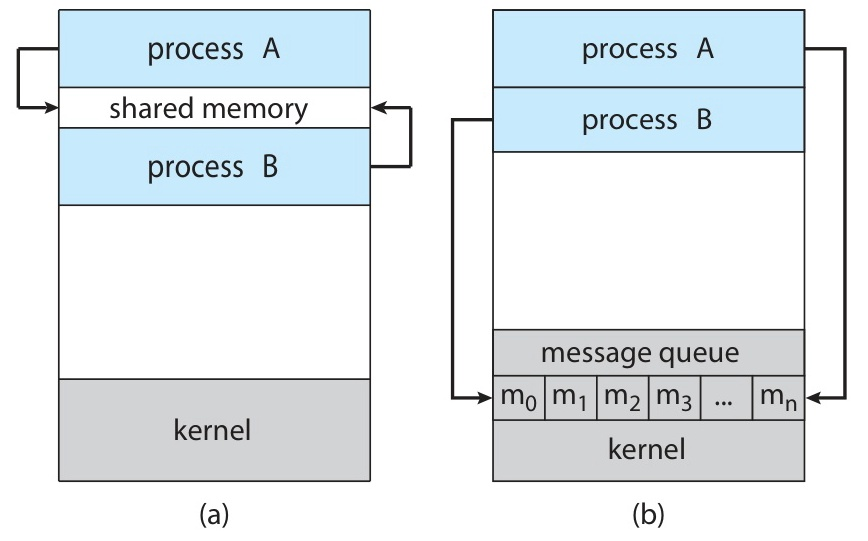
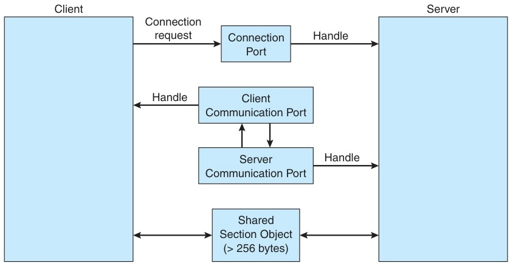
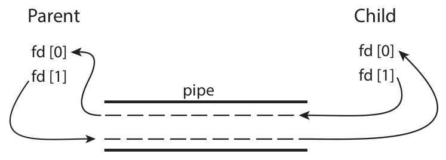
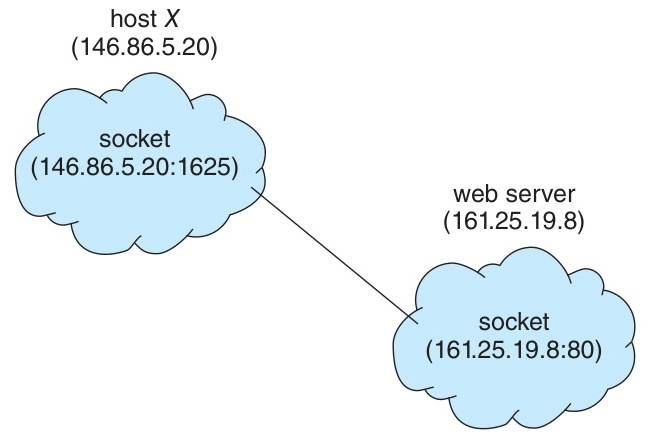
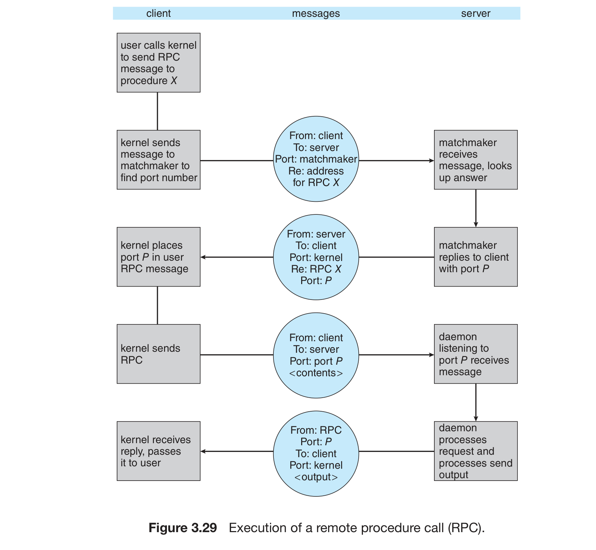
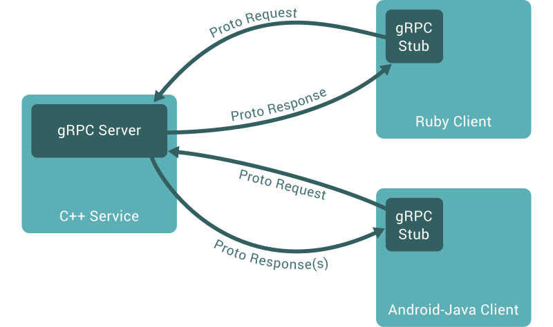

# 3주차 이론 — 프로세스 (2)

> **최종 수정일:** 2026-03-21
>
> Silberschatz, Operating System Concepts Ch 3 (Sections 3.4 – 3.8)

> **선행 지식**: W02 프로세스 개념 (process, fork, exec, wait). 파일 디스크립터(file descriptor)에 대한 이해.
>
> **학습 목표**:
> 1. 공유 메모리(shared memory)와 메시지 전달(message passing) IPC 모델을 비교 설명
> 2. 생산자-소비자 문제(producer-consumer problem)와 유한 버퍼(bounded buffer)를 설명
> 3. 파이프(pipe)와 소켓(socket)이 프로세스 간 통신을 가능하게 하는 방식을 서술
> 4. RPC 메커니즘과 전달 의미론(delivery semantics)을 개괄

---

## 목차

- [1. 프로세스 간 통신(IPC) 개요](#1-프로세스-간-통신ipc-개요)
  - [1.1 독립 프로세스 vs 협력 프로세스](#11-독립-프로세스-vs-협력-프로세스)
  - [1.2 프로세스 협력의 이유](#12-프로세스-협력의-이유)
  - [1.3 IPC란 무엇인가?](#13-ipc란-무엇인가)
- [2. 공유 메모리 시스템](#2-공유-메모리-시스템)
  - [2.1 공유 메모리 IPC](#21-공유-메모리-ipc)
  - [2.2 생산자-소비자 문제](#22-생산자-소비자-문제)
  - [2.3 유한 버퍼 구현](#23-유한-버퍼-구현)
- [3. 메시지 전달 시스템](#3-메시지-전달-시스템)
  - [3.1 메시지 전달 개요](#31-메시지-전달-개요)
  - [3.2 네이밍: 직접 통신 vs 간접 통신](#32-네이밍-직접-통신-vs-간접-통신)
  - [3.3 동기화](#33-동기화)
  - [3.4 버퍼링](#34-버퍼링)
- [4. IPC 사례](#4-ipc-사례)
  - [4.1 POSIX 공유 메모리](#41-posix-공유-메모리)
  - [4.2 Mach 메시지 전달](#42-mach-메시지-전달)
  - [4.3 Windows ALPC](#43-windows-alpc)
- [5. 파이프](#5-파이프)
  - [5.1 일반 파이프](#51-일반-파이프)
  - [5.2 명명 파이프 (FIFO)](#52-명명-파이프-fifo)
- [6. 클라이언트-서버 통신](#6-클라이언트-서버-통신)
  - [6.1 소켓](#61-소켓)
  - [6.2 원격 프로시저 호출 (RPC)](#62-원격-프로시저-호출-rpc)
  - [6.3 Android RPC](#63-android-rpc)
  - [6.4 현대 RPC: gRPC](#64-현대-rpc-grpc)
- [7. 실습 — pipe, POSIX 공유 메모리](#7-실습--pipe-posix-공유-메모리)
  - [7.1 실습 1: pipe()로 부모-자식 간 데이터 전달](#71-실습-1-pipe로-부모-자식-간-데이터-전달)
  - [7.2 실습 2: 생산자-소비자 (pipe 사용)](#72-실습-2-생산자-소비자-pipe-사용)
  - [7.3 실습 3: POSIX 공유 메모리](#73-실습-3-posix-공유-메모리)
- [요약](#요약)
- [부록](#부록)

---

<br>

## 1. 프로세스 간 통신(IPC) 개요

### 1.1 독립 프로세스 vs 협력 프로세스

운영체제에서 동시에 실행되는 프로세스는 두 가지 범주로 나뉜다:

**독립 프로세스 (Independent process):**
- 다른 프로세스의 실행에 영향을 주거나 받을 수 없다.
- 다른 프로세스와 데이터를 공유하지 않는다.

**협력 프로세스 (Cooperating process):**
- 다른 프로세스의 실행에 영향을 주거나 받을 수 있다.
- 다른 프로세스와 데이터를 공유하는 모든 프로세스가 이 범주에 속한다.

> 대부분의 실제 시스템은 협력 프로세스로 구성된다.

### 1.2 프로세스 협력의 이유

1. **정보 공유 (Information sharing)** — 여러 프로세스가 동시에 같은 데이터에 접근 (예: 복사-붙여넣기)
2. **계산 속도 향상 (Computation speedup)** — 작업을 병렬로 실행하여 처리 속도 향상; 멀티코어 시스템에서 효과적
3. **모듈성 (Modularity)** — 시스템 기능을 별도의 프로세스/스레드로 설계
4. **편의성 (Convenience)** — 사용자가 여러 작업을 동시에 수행 (편집, 음악 재생, 웹 브라우징 등)

**실세계 IPC 사례:**

IPC는 현대 소프트웨어 어디에서나 사용된다:

| 애플리케이션 | IPC 메커니즘 | 역할 |
|:------------|:------------|:-----|
| **셸 파이프라인** `cat log \| grep err` | 파이프 | 프로세스 출력 → 입력 연결 |
| **Google Chrome** | 공유 메모리 + IPC | 탭 ↔ 브라우저 프로세스 격리 |
| **Docker** | 명명 파이프, 소켓 | 컨테이너 ↔ 호스트 통신 |
| **PostgreSQL** | 공유 메모리 | 연결 간 공유 버퍼 캐시 |
| **Slack / Discord** | 소켓 (WebSocket) | 실시간 메시징 |
| **Android 앱** | Binder (RPC) | Activity ↔ Service 통신 |

> 두 프로그램이 데이터를 교환할 때마다 어떤 형태의 IPC가 작동하고 있다.

### 1.3 IPC란 무엇인가?

**프로세스 간 통신(IPC, Interprocess Communication)** = 협력 프로세스가 데이터를 교환하기 위한 메커니즘

두 가지 기본 IPC 모델:

| | 공유 메모리(Shared Memory) | 메시지 전달(Message Passing) |
|:--|:--------------------------|:---------------------------|
| 방법 | 공유 메모리 영역에 읽기/쓰기 | 메시지 송수신 |
| 성능 | 빠름 (커널 개입 최소) | 상대적으로 느림 (시스템 콜) |
| 동기화 | 프로그래머가 직접 처리 | OS가 관리 |
| 적합한 용도 | 대량 데이터 교환 | 소량 데이터, 분산 시스템 |

> 대부분의 운영체제는 **두 모델 모두** 제공한다.



*Silberschatz, Figure 3.11 — (a) 공유 메모리. (b) 메시지 전달.*

> **핵심:** 공유 메모리는 초기 설정 시에만 커널이 개입하고 이후에는 일반 메모리 접근처럼 빠르게 동작하지만, 동기화를 프로그래머가 직접 해야 하는 부담이 있다. 반면 메시지 전달은 매번 시스템 콜을 통해 커널이 중재하므로 느리지만, OS가 동기화를 관리해 주므로 프로그래밍이 상대적으로 간단하다.

**Chrome 브라우저의 IPC 활용:**
- 브라우저 프로세스(1개), 렌더러 프로세스(탭마다), 플러그인 프로세스(유형마다)로 구성
- 각 탭이 별도 프로세스이므로, 하나의 탭 크래시가 다른 탭에 영향을 주지 않는다.

> **참고:** 현재 Chrome은 각 iframe마다 별도의 렌더러 프로세스를 사용하는 **Site Isolation** 정책을 적용하여 보안을 더욱 강화하고 있다.


*Silberschatz, Ch 3.4 — 각 탭은 별도의 프로세스를 나타낸다*

유사한 멀티프로세스/멀티컴포넌트 아키텍처를 채택한 현대 애플리케이션:

- **VS Code / Electron 앱** — 메인 프로세스 + 창마다 렌더러 프로세스 (메시지 전달을 통한 IPC)
- **Android** — 각 앱이 자체 프로세스에서 실행; 서비스는 Binder IPC 사용
- **마이크로서비스** — REST / gRPC / 메시지 큐로 통신하는 독립 프로세스
- **컨테이너 오케스트레이션 (Kubernetes)** — Pod 간 네트워크 소켓으로 통신

> **핵심:** 추세는 "**결함 허용성과 보안을 위해 구성 요소를 별도 프로세스로 격리**하고, IPC로 연결"하는 것이다.

---

<br>

## 2. 공유 메모리 시스템

### 2.1 공유 메모리 IPC

공유 메모리 IPC의 동작 방식:
1. 통신하려는 프로세스들이 **공유 메모리 영역을 설정**한다.
2. 공유 영역은 일반적으로 생성한 프로세스의 주소 공간에 위치한다.
3. 다른 프로세스는 공유 메모리를 자신의 주소 공간에 **첨부(attach)** 한다.
4. 읽기/쓰기 연산을 통해 데이터를 교환한다.

주요 특징:
- OS는 보통 프로세스 간 메모리 접근을 **금지**하지만, 공유 메모리를 사용하려면 이 제한을 명시적으로 해제해야 한다.
- 데이터의 형식과 위치는 **프로세스들이 결정**한다 (OS는 관여하지 않는다).
- **동기화는 프로그래머의 책임**이다.

> **[컴퓨터구조]** 공유 메모리는 운영체제가 가상 메모리의 페이지 테이블을 조작하여 서로 다른 프로세스의 가상 주소가 동일한 물리 메모리 프레임을 가리키도록 설정하는 방식으로 구현된다. 이후의 접근은 일반 메모리 접근과 동일하므로 커널 개입이 없어 빠르다.

> **참고:** 공유 메모리에서 커널이 개입하는 시점과 그렇지 않은 시점을 정리하면:
> - **커널 개입 O**: `shm_open()` (공유 메모리 객체 생성), `mmap()` (페이지 테이블 매핑 설정), `shm_unlink()` (객체 삭제) — 이 시스템 콜들은 커널 모드에서 실행된다
> - **커널 개입 X**: 매핑 이후의 `ptr[i] = value` 같은 읽기/쓰기 — 일반 메모리 접근과 동일하므로 커널을 거치지 않는다
>
> 따라서 초기 설정 비용 이후에는 메시지 전달보다 훨씬 빠르다. 반면 메시지 전달은 `send()`/`receive()` 때마다 시스템 콜이 필요하다.

### 2.2 생산자-소비자 문제

협력 프로세스의 고전적 패러다임:
- **생산자(Producer)** — 정보를 생산하는 프로세스
- **소비자(Consumer)** — 정보를 소비하는 프로세스

실제 사례: 컴파일러(생산자) → 어셈블러(소비자), 웹 서버(생산자) → 웹 브라우저(소비자)

**두 종류의 버퍼:**

| | 무한 버퍼 | 유한 버퍼 |
|:--|:---------|:---------|
| 크기 | 제한 없음 | **고정** |
| 소비자 대기 | 버퍼가 비면 대기 | 버퍼가 비면 대기 |
| 생산자 대기 | 대기하지 않음 | 버퍼가 가득 차면 대기 |

> 실제로는 유한 버퍼가 훨씬 일반적이며, 동기화 문제를 야기한다.

**실생활에서의 유한 버퍼:**

- **키보드 → OS** — 키 입력이 고정 크기 입력 버퍼에 들어가고, OS가 소비한다.
- **비디오 스트리밍** — 네트워크 스레드가 재생 버퍼를 채우고, 플레이어가 소비한다.
- **인쇄 스풀러** — 애플리케이션이 인쇄 작업을 큐에 넣고, 프린터가 소비한다.
- **웹 서버** — 수신된 HTTP 요청이 유한 버퍼에 큐잉된다 (예: Nginx 작업자 큐).
- **오디오 녹음** — 마이크가 링 버퍼를 채우고, 앱이 읽어서 인코딩한다.

```text
  ┌───┬───┬───┬───┬───┐
  │ A │ B │ C │   │   │
  └───┴───┴───┴───┴───┘
    ↑               ↑
   out             in
  (소비자)         (생산자)

 원형 배열 (순환)
```

> 버퍼가 가득 차면 생산자가 대기하고, 비어 있으면 소비자가 대기한다.

### 2.3 유한 버퍼 구현

생산자와 소비자 간에 공유되는 데이터:

```c
#define BUFFER_SIZE 10

typedef struct {
    /* ... */
} item;

item buffer[BUFFER_SIZE];
int in = 0;    /* 다음 쓰기 위치 (생산자) */
int out = 0;   /* 다음 읽기 위치 (소비자) */
```

- **원형 배열(circular array)** 로 구현한다.
- 버퍼 비어 있음: `in == out`
- 버퍼 가득 참: `((in + 1) % BUFFER_SIZE) == out`
- 이 방식에서는 최대 **BUFFER_SIZE - 1**개의 항목만 저장 가능하다.

> **[자료구조]** 이 구조는 원형 큐(Circular Queue)와 동일하다. `in`은 rear, `out`은 front에 해당하며, 한 칸을 비워두는 이유는 빈 상태와 가득 찬 상태를 구분하기 위해서이다.

**생산자 코드 (Figure 3.12):**

```c
item next_produced;

while (true) {
    /* next_produced에 항목 생산 */

    while (((in + 1) % BUFFER_SIZE) == out)
        ; /* 바쁜 대기 -- 버퍼 가득 참 */

    buffer[in] = next_produced;
    in = (in + 1) % BUFFER_SIZE;
}
```

**소비자 코드 (Figure 3.13):**

```c
item next_consumed;

while (true) {
    while (in == out)
        ; /* 바쁜 대기 -- 버퍼 비어 있음 */

    next_consumed = buffer[out];
    out = (out + 1) % BUFFER_SIZE;

    /* next_consumed의 항목 소비 */
}
```

> **참고:** 바쁜 대기(busy wait)는 CPU가 while 루프를 계속 돌며 조건을 확인하는 방식으로, CPU 자원을 낭비한다. 이를 개선하기 위해 Ch 6에서 세마포어, 뮤텍스 등의 동기화 도구를 배운다. 이 예제는 동시 접근 문제를 다루지 않는다.

> **참고:** 바쁜 대기의 대안은 **블로킹(sleep) 방식**이다. 조건이 충족되지 않으면 프로세스를 **대기(Waiting) 상태**로 전환하여 CPU를 반납하고, 조건이 충족될 때 다른 프로세스가 **깨워주는(wakeup)** 방식이다. 대표적 구현:
> - **세마포어(Semaphore)**: `wait()` 시 값을 감소시키고, 0 이하이면 프로세스를 슬립시킨다 (9주차)
> - **뮤텍스(Mutex)**: 임계 구역 진입 시 락이 잡혀 있으면 슬립한다 (9주차)
> - **조건 변수(Condition Variable)**: 특정 조건이 참이 될 때까지 슬립한다 (9주차)
>
> 바쁜 대기는 개념 설명에는 유용하지만, 실제 코드에서는 반드시 이러한 블로킹 동기화 도구로 대체해야 한다.

---

<br>

## 3. 메시지 전달 시스템

### 3.1 메시지 전달 개요

공유 메모리 없이 프로세스 간 통신하는 방법이다.

두 가지 기본 연산:
- **send(message)** — 메시지 보내기
- **receive(message)** — 메시지 받기

특징:
- 동일한 주소 공간을 공유하지 않는다.
- **분산 환경**에서 특히 유용하다 (네트워크로 연결된 다른 컴퓨터).

통신 링크의 **논리적 구현**을 위한 세 가지 고려사항:
1. **네이밍(Naming)** — 통신 상대를 어떻게 식별하는가?
2. **동기화(Synchronization)** — 동기 또는 비동기?
3. **버퍼링(Buffering)** — 메시지 큐의 용량은?

### 3.2 네이밍: 직접 통신 vs 간접 통신

**직접 통신 (Direct Communication):**
- 통신 상대를 명시적으로 지정한다.
- 대칭형: `send(P, message)` / `receive(Q, message)` — 양쪽 모두 상대를 지정
- 비대칭형: `send(P, message)` / `receive(id, message)` — 수신자는 임의 프로세스로부터 수신

> **참고:** 비대칭 통신이 필요한 이유: **서버 패턴**에서 유용하다. 예를 들어 웹 서버는 어떤 클라이언트가 요청을 보낼지 미리 알 수 없으므로, "임의의 프로세스로부터 수신(`receive(id, message)`)"하는 비대칭 방식이 적합하다. 수신 후 `id`를 확인하여 해당 클라이언트에게 `send(id, response)`로 응답한다. 반면 대칭 방식은 통신 상대가 고정된 1:1 통신에 적합하다.

- 통신하는 프로세스 사이에 링크가 **자동으로** 설정된다.
- 각 프로세스 쌍 사이에 **정확히 하나의 링크**가 존재한다.
- 단점: 프로세스 식별자 변경 시 모든 참조를 수정해야 한다 → **모듈성 제한**

**간접 통신 (Indirect Communication):**
- **메일박스(Mailbox, 포트)**를 통해 메시지를 교환한다.

> **메일박스(mailbox)** 또는 **포트(port)**는 커널이 관리하는 이름 있는 메시지 큐이다. 실제 우편함처럼, 이름을 아는 프로세스라면 누구나 메시지를 보내거나 받을 수 있다.

- `send(A, message)` / `receive(A, message)` — 메일박스 A를 통해 통신
- 두 프로세스가 링크를 가지려면 **공통 메일박스를 공유**해야 한다.
- 하나의 링크가 **둘 이상의** 프로세스와 연관될 수 있다.
- 한 쌍의 프로세스 사이에 **여러 링크**가 존재할 수 있다.

> **메일박스 소유권:**
> - **프로세스 소유 메일박스(Process-owned mailbox)**: 소유자만 수신 가능; 프로세스 종료 시 메일박스도 파괴된다.
> - **OS 소유 메일박스(OS-owned mailbox)**: 독립적으로 존재; OS가 생성, 삭제, 송신, 수신을 위한 시스템 콜을 제공한다.

**다중 수신자 문제:** P1이 메일박스 A에 메시지를 보내고, P2와 P3 모두 receive()를 호출하면?
→ 해결: (1) 최대 두 프로세스만 연관 허용, (2) 한 번에 하나만 receive 허용, (3) 시스템이 임의 선택

### 3.3 동기화

| 연산 | 블로킹 (동기) | 넌블로킹 (비동기) |
|:-----|:------------|:----------------|
| **send** | 수신자가 수락할 때까지 대기 | 보내고 즉시 진행 |
| **receive** | 메시지가 도착할 때까지 대기 | 가능하면 수신, 아니면 null 반환 |

**랑데부(Rendezvous):** 블로킹 send + 블로킹 receive의 조합이다. 송신자와 수신자가 서로를 기다리며, 생산자-소비자 문제가 간단하게 해결된다.

```c
/* 생산자 — 블로킹 send */
while (true) {
    /* next_produced에 항목 생산 */
    send(next_produced);    /* 수신될 때까지 대기 */
}

/* 소비자 — 블로킹 receive */
while (true) {
    receive(next_consumed); /* 메시지가 도착할 때까지 대기 */
    /* next_consumed의 항목 소비 */
}
```

> **참고:** 블로킹 방식은 구현이 간단하지만 프로세스가 대기 상태에 빠질 수 있다. 넌블로킹 방식은 응답성이 좋지만, 메시지 도착 여부를 폴링하거나 콜백으로 처리해야 하는 복잡성이 있다.

### 3.4 버퍼링

메시지는 통신 링크에 부착된 **임시 큐**에 저장된다.

| 방식 | 큐 용량 | 송신자 동작 |
|:-----|:--------|:-----------|
| **용량 0** | 대기 메시지 없음 | 수신자가 수락할 때까지 **반드시 대기** (랑데부) |
| **유한 용량** | 최대 n개 | 가득 차면 대기, 아니면 즉시 진행 |
| **무한 용량** | 제한 없음 | **절대 대기하지 않음** |

> 용량 0 = 버퍼링 없음 (송신자가 반드시 블로킹). 용량이 0이 아닌 경우 = 자동 버퍼링(automatic buffering).

---

<br>

## 4. IPC 사례

### 4.1 POSIX 공유 메모리

POSIX는 **메모리 매핑 파일** 기반의 공유 메모리 API를 제공한다.

**3단계 절차:**

```c
/* 1단계: 공유 메모리 객체 생성 */
int fd = shm_open(name, O_CREAT | O_RDWR, 0666);

/* 2단계: 크기 설정 */
ftruncate(fd, 4096);

/* 3단계: 주소 공간에 매핑 */
char *ptr = (char *)mmap(0, 4096, PROT_READ | PROT_WRITE,
                          MAP_SHARED, fd, 0);
```

> **`shm_open()` 매개변수:** `name` — 공유 메모리 객체의 이름 (프로세스들이 같은 이름으로 접근). `O_CREAT` — 존재하지 않으면 생성. `O_RDWR` — 읽기와 쓰기 모두 허용. 반환값 — 파일 디스크립터(file descriptor, 정수).

> **[컴퓨터구조]** `mmap()`은 파일이나 공유 메모리 객체를 프로세스의 가상 주소 공간에 직접 매핑하는 시스템 콜이다. 매핑 후에는 포인터를 통해 일반 메모리처럼 접근할 수 있어, `read()`/`write()` 시스템 콜 없이도 데이터를 교환할 수 있다.

**생산자 (Figure 3.16):**

```c
#include <stdio.h>
#include <stdlib.h>
#include <string.h>
#include <fcntl.h>
#include <sys/shm.h>
#include <sys/stat.h>
#include <sys/mman.h>

int main()
{
    const int SIZE = 4096;
    const char *name = "OS";
    const char *message_0 = "Hello";
    const char *message_1 = "World!";

    int fd;
    char *ptr;

    fd = shm_open(name, O_CREAT | O_RDWR, 0666);
    ftruncate(fd, SIZE);
    ptr = (char *)mmap(0, SIZE, PROT_READ | PROT_WRITE,
                        MAP_SHARED, fd, 0);

    sprintf(ptr, "%s", message_0);
    ptr += strlen(message_0);
    sprintf(ptr, "%s", message_1);
    ptr += strlen(message_1);

    return 0;
}
```

**소비자 (Figure 3.17):**

```c
#include <stdio.h>
#include <stdlib.h>
#include <fcntl.h>
#include <sys/shm.h>
#include <sys/stat.h>
#include <sys/mman.h>

int main()
{
    const int SIZE = 4096;
    const char *name = "OS";

    int fd;
    char *ptr;

    fd = shm_open(name, O_RDONLY, 0666);
    ptr = (char *)mmap(0, SIZE, PROT_READ, MAP_SHARED, fd, 0);

    printf("%s", (char *)ptr);

    shm_unlink(name);

    return 0;
}
```

컴파일: `gcc producer.c -o producer -lrt`

> **참고:** `-lrt`는 **POSIX 실시간 라이브러리(librt)**를 링크하라는 옵션이다. `shm_open()`, `shm_unlink()` 같은 POSIX 공유 메모리 함수는 이 라이브러리에 구현되어 있다. `-l`은 "라이브러리를 링크하라"는 의미이고, `rt`가 라이브러리 이름(librt.so)이다. 참고로 최신 glibc(2.17+)에서는 이 함수들이 기본 C 라이브러리(libc)에 통합되어 `-lrt` 없이도 컴파일되는 경우가 있지만, 이식성을 위해 명시하는 것이 안전하다.

**흐름 요약:**

```text
          Producer                           Consumer
          ────────                           ────────
  shm_open("OS", O_CREAT|O_RDWR)
  ftruncate(fd, 4096)
  mmap(..., MAP_SHARED, fd, 0)
              ↓
  sprintf(ptr, "Hello")
  sprintf(ptr, "World!")
              ↓
            Exit                      shm_open("OS", O_RDONLY)
                                      mmap(..., MAP_SHARED, fd, 0)
                                                 ↓
                                      printf("%s", ptr)
                                      → Outputs "HelloWorld!"
                                                 ↓
                                      shm_unlink("OS")
```

**실세계 공유 메모리 활용 사례:**

| 시스템 | 사용 방식 | 공유 메모리를 사용하는 이유 |
|:------|:---------|:------------------------|
| **PostgreSQL** | 연결 간 공유 버퍼 풀 | 쿼리마다 8KB 페이지 복사 방지 |
| **Redis** (fork 지속성) | 부모 ↔ 자식이 COW로 페이지 공유 | 클라이언트 차단 없이 스냅샷 |
| **Chromium** | 렌더러 ↔ GPU가 텍스처 공유 | 웹 페이지 제로 카피 렌더링 |
| **비디오 편집기** | 디코드 ↔ 미리보기가 프레임 공유 | 60fps 4K 실시간 재생 |
| **NGINX** | 워커 간 캐시 영역 공유 | 중복 없이 빠른 캐싱 |

> **핵심:** 공유 메모리는 **데이터 양이 크고 지연 시간이 낮아야 할 때** 탁월하다. 대신 프로그래머가 **동기화**를 직접 처리해야 한다 (Ch 6, 7).

> **참고:** Mach와 Windows ALPC 섹션(4.2, 4.3)은 비교를 위해 제시된 것이다. 일반적인 메시지 전달 개념을 이해하는 데 집중하고, 구현 세부사항은 부차적으로 다루면 된다.

### 4.2 Mach 메시지 전달

Mach — macOS와 iOS의 기반이 되는 마이크로커널이다.

핵심 개념: **모든 것이 메시지**
- 시스템 콜조차도 메시지로 구현된다.

**포트(Port, 메일박스):**
- 유한 용량의 메시지 큐이다.
- **단방향** — 양방향 통신에는 별도의 응답 포트가 필요하다.
- 다수의 송신자가 허용되지만, **수신자는 하나만** 가능하다.

**특수 포트(Special Ports):**
- **Task Self 포트** — 커널에 메시지를 보내는 데 사용된다.
- **Notify 포트** — 커널이 태스크에 이벤트를 알리는 데 사용된다.

**포트 생성:**

```c
mach_port_t port;
mach_port_allocate(
    mach_task_self(),           /* 태스크 자체에 대한 참조 */
    MACH_PORT_RIGHT_RECEIVE,    /* 수신 권한 */
    &port);                     /* 포트 이름 */
```

**메시지 구조:** 고정 크기 헤더(메시지 크기와 송신/수신 포트 포함); 가변 크기 본문(실제 데이터 포함).

**메시지 송수신:**

```c
/* 메시지 보내기 */
mach_msg(message, MACH_SEND_MSG, size, 0, MACH_PORT_NULL,
         MACH_MSG_TIMEOUT_NONE, MACH_PORT_NULL);

/* 메시지 받기 */
mach_msg(message, MACH_RCV_MSG, 0, size, port,
         MACH_MSG_TIMEOUT_NONE, MACH_PORT_NULL);
```

**큐가 가득 찬 경우의 옵션:** (1) 무기한 대기, (2) 타임아웃 대기, (3) 즉시 반환, (4) 메시지를 임시 캐시 (OS에 맡김)

> 임시 캐시 옵션의 경우: 메시지를 OS에 맡기고, 공간이 확보되면 알림을 받는다. 스레드당 대기 중인 메시지는 하나만 허용된다.

**성능 최적화:** 같은 시스템 내의 메시지는 **가상 메모리 매핑**을 사용하여 실제 복사 없이 전달한다.

### 4.3 Windows ALPC

Windows에서 같은 머신 내의 프로세스 간 통신 메커니즘이다.

**연결 절차:**
1. 클라이언트가 서버의 **연결 포트(connection port)**에 연결 요청
2. 서버가 **채널** 생성 → 클라이언트/서버 양쪽에 통신 포트
3. 채널을 통한 양방향 통신

**메시지 전달 방식 (크기에 따라):**
1. **소형 (≤256 bytes)** — 포트의 메시지 큐 사용, 복사로 전달
2. **대형** — **섹션 객체(section object, 공유 메모리)** 사용
3. **초대형** — 서버가 클라이언트의 주소 공간을 직접 읽기/쓰기



*Silberschatz, Figure 3.19 — Windows의 Advanced local procedure calls*

> ALPC는 Windows API를 통해 직접 노출되지 않는다. 애플리케이션은 표준 RPC를 사용하며, ALPC가 내부적으로 통신을 처리한다.

---

<br>

## 5. 파이프

파이프 구현 시 고려사항:
1. 양방향(bidirectional)인가, 단방향(unidirectional)인가?
2. 양방향이라면 반이중(half-duplex)인가, 전이중(full-duplex)인가?
3. 부모-자식 관계(parent-child relationship)가 필요한가?
4. 네트워크를 통해 통신할 수 있는가?

### 5.1 일반 파이프

**파이프(Pipe)** = 두 프로세스가 통신할 수 있는 **도관(conduit)**이다. 초기 UNIX 시스템부터 존재한 가장 오래된 IPC 메커니즘 중 하나이다. 파이프는 특수 파일(special file)로, `read()`와 `write()`를 통해 접근한다.

- 생산자는 **쓰기 끝(write end)** 에 쓰고, 소비자는 **읽기 끝(read end)** 에서 읽는다.
- **단방향** — 양방향에는 두 개의 파이프가 필요하다.



*Silberschatz, Figure 3.23 — 일반 파이프의 파일 디스크립터*

```c
int fd[2];
pipe(fd);
```
- `fd[0]` — **읽기 끝**, `fd[1]` — **쓰기 끝**
- 자식은 fork()를 통해 파이프를 **상속**받는다.

> **참고:** 이 코드는 2주차에서 다룬 `fork()`를 사용한다. `fork()`가 자식 프로세스를 생성하는 방법에 대한 자세한 내용은 W02 Concepts_Lecture를 참고하라.

**코드 예제 (Figures 3.21-3.22):**

```c
#include <sys/types.h>
#include <stdio.h>
#include <string.h>
#include <unistd.h>

#define BUFFER_SIZE 25
#define READ_END    0
#define WRITE_END   1

int main(void)
{
    char write_msg[BUFFER_SIZE] = "Greetings";
    char read_msg[BUFFER_SIZE];
    int fd[2];
    pid_t pid;

    if (pipe(fd) == -1) {
        fprintf(stderr, "Pipe failed");
        return 1;
    }

    pid = fork();

    if (pid > 0) {           /* 부모 프로세스 */
        close(fd[READ_END]);
        write(fd[WRITE_END], write_msg, strlen(write_msg) + 1);
        close(fd[WRITE_END]);
    }
    else if (pid == 0) {     /* 자식 프로세스 */
        close(fd[WRITE_END]);
        read(fd[READ_END], read_msg, BUFFER_SIZE);
        printf("read %s", read_msg);
        close(fd[READ_END]);
    }
    return 0;
}
```

> **참고:** `strlen(write_msg) + 1`에서 `+1`은 문자열 끝의 **널 종결 문자(`\0`)**를 포함시키기 위한 것이다. C 언어에서 `strlen()`은 `\0`을 제외한 문자 수를 반환하므로, `\0`까지 전송하려면 1을 더해야 한다. 수신 측에서 `printf("read %s", read_msg)`가 정상 동작하려면 `read_msg`에 `\0`이 포함되어 있어야 하기 때문이다. `\0` 없이 전송하면 수신 측에서 문자열 끝을 알 수 없어 쓰레기 값이 출력될 수 있다.

**핵심 규칙:**
1. **사용하지 않는 끝은 반드시 close()로 닫아야 한다.**
2. **이유:** 모든 쓰기 끝이 닫혔을 때만 읽는 쪽이 EOF(0)를 받는다. 닫지 않으면 읽는 쪽이 영구적인 블로킹 상태에 빠질 수 있다.
3. 일반 파이프는 생성한 프로세스 **외부에서 접근할 수 없다**.

> **시험 팁:** 파이프의 EOF 메커니즘은 시험에서 자주 출제된다. fork() 후에는 부모와 자식 모두 fd[0], fd[1]의 복사본을 가지므로, 사용하지 않는 끝을 닫지 않으면 참조 카운트가 0이 되지 않아 EOF가 발생하지 않는다.

**셸에서의 활용:**

```text
ls -l | less                          # ls의 stdout이 파이프를 통해 less의 stdin으로 전달
cat file.txt | grep "error" | wc -l   # 파이프 체인
```

> Windows에서도 파이프가 사용된다: 예) `dir | more`.

### 5.2 명명 파이프 (FIFO)

일반 파이프의 제한을 극복한다:

| 속성 | 일반 파이프 | 명명 파이프 (FIFO) |
|:-----|:----------|:-----------------|
| 프로세스 관계 | 부모-자식 필요 | 관계 불필요 |
| 수명 | 프로세스 종료 시 파괴 | 파일 시스템에 존재, 명시적 삭제 전까지 유지 |
| 방향 | 단방향 | 양방향 가능 (UNIX: 반이중) |
| 식별 | fd[0], fd[1] | 파일 시스템 경로 |

```c
/* 생성 */
mkfifo("/tmp/my_fifo", 0666);

/* 쓰기 프로세스 */
int fd = open("/tmp/my_fifo", O_WRONLY);
write(fd, "Hello", 6);

/* 읽기 프로세스 (별도 프로그램) */
int fd = open("/tmp/my_fifo", O_RDONLY);
read(fd, buf, 6);
```

**UNIX vs Windows 명명 파이프:**

| | UNIX (FIFO) | Windows |
|:--|:-----------|:--------|
| 방향 | 반이중(half-duplex) | **전이중(full-duplex)** |
| 데이터 | 바이트 지향만 | 바이트 + 메시지 지향 |
| 범위 | 같은 머신만 | **다른 머신 간** 가능 |

**실세계 파이프 활용:**

파이프는 단순한 셸 명령어를 넘어 다양한 곳에서 활용된다:

**DevOps / CI-CD 파이프라인** (이름이 우연이 아니다!)

```text
  Build → Test → Lint → Deploy   (각 단계 = 프로세스, 데이터가 "파이프"를 통해 흐른다)
```

- **Docker** — 데몬 ↔ CLI 통신에 명명 파이프(`/var/run/docker.sock`) 사용
- **로그 처리** — `journalctl | grep error | wc -l`로 3개의 프로세스를 체인
- **CGI 웹 서버** — 초기 웹 서버는 파이프를 통해 CGI 스크립트와 통신:

```text
  HTTP 요청 → 웹 서버 ──pipe──▷ CGI 스크립트 (Python/Perl)
                   ◁──pipe── HTML 응답
```

- **셸 작업 제어** — `|`가 프로세스 간 익명 파이프를 생성:

```bash
# 2개의 파이프로 연결된 3개의 프로세스
find / -name "*.log" 2>/dev/null | xargs grep "ERROR" | sort -u
```

> 파이프는 UNIX 철학의 "접착제"이다: *"한 가지를 잘 하고, 파이프로 연결하라."*

---

<br>

## 6. 클라이언트-서버 통신

### 6.1 소켓

**소켓(Socket)** = 통신의 **끝점(endpoint)**이다. **IP 주소 + 포트 번호**로 식별된다.



*Silberschatz, Figure 3.26 — 소켓을 이용한 통신*

- 클라이언트: 1024보다 큰 임의의 포트 할당
- 서버: **잘 알려진 포트(well-known port)** 에서 대기 (HTTP=80, SSH=22, FTP=21)
- 모든 연결은 **고유한 소켓 쌍(unique pair of sockets)**으로 구성된다.

| 포트 | 서비스 |
|:-----|:------|
| 22 | SSH |
| 21 | FTP |
| 80 | HTTP |
| 443 | HTTPS |

**루프백 주소: 127.0.0.1** — 로컬 머신 자체를 가리키는 특수 IP 주소이다.

통신 방식:
- **TCP** — 연결 지향, 신뢰성 있는 바이트 스트림
- **UDP** — 비연결, 신뢰성 보장 없음, 빠름

> **[컴퓨터네트워크]** 소켓은 전송 계층(Transport Layer)에서 동작하며, TCP 소켓은 연결 지향적으로 `connect()` → `send()`/`recv()` → `close()` 순서로 사용하고, UDP 소켓은 비연결형으로 `sendto()`/`recvfrom()`을 사용한다.

**소켓 예제 — Date 서버 (Java, Figure 3.27):**

> **참고:** 교재(Silberschatz)에서 소켓 예제를 Java로 제공하는 이유: Java의 소켓 API가 C보다 간결하여 IPC 개념 자체에 집중할 수 있기 때문이다. C로 동일한 서버를 작성하면 `socket()`, `bind()`, `listen()`, `accept()`, `send()`, `close()` 등 더 많은 시스템 콜과 에러 처리가 필요하다. 실제 운영체제 수준에서는 Java의 `ServerSocket`도 내부적으로 이 C 시스템 콜들을 호출한다. C 소켓 프로그래밍은 컴퓨터네트워크 과목에서 상세히 다루게 된다.

```java
import java.net.*;
import java.io.*;

public class DateServer {
    public static void main(String[] args) {
        try {
            ServerSocket sock = new ServerSocket(6013);
            while (true) {
                Socket client = sock.accept();
                PrintWriter pout = new
                    PrintWriter(client.getOutputStream(), true);
                pout.println(new java.util.Date().toString());
                client.close();
            }
        }
        catch (IOException ioe) {
            System.err.println(ioe);
        }
    }
}
```

> **핵심 코드:** `ServerSocket(6013)` — 포트 6013에서 대기. `accept()` — 연결 요청이 도착할 때까지 블로킹.

**소켓 예제 — Date 클라이언트 (Java, Figure 3.28):**

```java
import java.net.*;
import java.io.*;

public class DateClient {
    public static void main(String[] args) {
        try {
            Socket sock = new Socket("127.0.0.1", 6013);
            InputStream in = sock.getInputStream();
            BufferedReader bin = new
                BufferedReader(new InputStreamReader(in));
            String line;
            while ((line = bin.readLine()) != null)
                System.out.println(line);
            sock.close();
        }
        catch (IOException ioe) {
            System.err.println(ioe);
        }
    }
}
```

> **핵심 코드:** `Socket("127.0.0.1", 6013)` — 로컬 서버의 포트 6013에 연결.

**일상 애플리케이션에서의 소켓:**

| 애플리케이션 | 프로토콜 | 소켓 사용 방식 |
|:------------|:---------|:-------------|
| **ChatGPT / AI 챗봇** | WebSocket (TCP) | 토큰 단위 스트리밍 응답 |
| **멀티플레이어 게임** | UDP | 저지연 위치 업데이트 |
| **Zoom / Google Meet** | UDP (WebRTC) | 실시간 오디오/비디오 스트리밍 |
| **웹 브라우저** | TCP (HTTP/S) | 모든 페이지 로드 = 소켓 연결 |
| **SSH 터미널** | TCP | 암호화된 양방향 바이트 스트림 |
| **데이터베이스 클라이언트** | TCP / UNIX 소켓 | `psql`, `mysql` 소켓으로 연결 |

> **참고:** ChatGPT와 대화할 때 브라우저는 API 서버에 대한 **WebSocket** 연결을 유지하며, 토큰을 하나씩 실시간으로 수신한다.

**소켓의 한계:** 비구조화된 바이트 스트림만 교환하며, 데이터에 구조를 부여하는 것은 애플리케이션의 책임이다. → 더 높은 수준의 추상화 필요 → **RPC**

> **참고:** 직렬화(serialization)란 메모리상의 데이터 구조를 바이트 스트림으로 변환하는 과정이다. JSON, Protocol Buffers 등이 대표적인 직렬화 포맷이다.

### 6.2 원격 프로시저 호출 (RPC)

**RPC** = 네트워크로 연결된 원격 시스템의 프로시저를 호출하는 메커니즘이다.

**핵심 구성요소:**

1. **스텁(Stub)** — 클라이언트 측의 프록시. 서버의 실제 프로시저를 대리하여 매개변수를 패킹하여 서버로 전송한다.
2. **마샬링(Marshalling)** — 데이터를 네트워크 전송에 적합한 형식으로 변환한다. Big-endian vs Little-endian 차이를 해결하기 위해 **XDR** 등의 표준을 사용한다.

> **마샬링(marshalling)**이란 서로 다른 내부 표현을 가질 수 있는 시스템 간 전송을 위해, 데이터를 표준화된 형식(XDR, JSON 등)으로 변환하는 과정이다.



*Silberschatz, Figure 3.29 — 원격 프로시저 호출(RPC)의 실행*

> **참고:** 스텁은 클라이언트와 서버 양쪽에 존재한다. 클라이언트 스텁은 매개변수를 마샬링하여 네트워크로 전송하고, 서버 스텁(skeleton)은 수신된 데이터를 언마샬링하여 실제 프로시저를 호출한다.

> **[컴퓨터구조]** **엔디안(Endianness)**이란 멀티바이트 데이터를 메모리에 저장하는 바이트 순서를 뜻한다. 예를 들어 정수 `0x12345678`을:
> - **빅 엔디안(Big-endian)**: 상위 바이트부터 저장 → `12 34 56 78` (네트워크 바이트 순서)
> - **리틀 엔디안(Little-endian)**: 하위 바이트부터 저장 → `78 56 34 12` (x86, RISC-V 등)
>
> 클라이언트(리틀 엔디안)와 서버(빅 엔디안)가 다른 아키텍처일 때 같은 바이트열을 다르게 해석하면 데이터가 깨진다. 이를 방지하기 위해 RPC는 **XDR(External Data Representation)** 같은 중간 표현으로 마샬링하여, 송수신 양쪽이 동일하게 데이터를 해석할 수 있도록 한다.

**실행 의미론:**

네트워크 패킷은 유실될 수 있어 송신자가 재전송하게 된다. 이 재전송으로 인해 서버가 동일한 요청을 두 번 수신하고 실행할 수 있다. RPC 의미론은 이러한 상황을 처리하기 위해 존재한다.

> 네트워크 메시지는 유실되거나 중복될 수 있다. 편지를 보냈는데 분실될 수 있어 다시 보내면, 수신자가 두 통을 받게 되는 상황과 같다. RPC 의미론(semantics)은 이런 경우를 어떻게 처리할지 정의한다.

| | 설명 |
|:--|:-----|
| **최대 한 번(At most once)** | 타임스탬프로 중복 메시지 무시; 최대 한 번만 실행 |
| **정확히 한 번(Exactly once)** | "최대 한 번" + ACK; 가장 이상적이지만 구현이 가장 복잡 |

> **시험 팁:** "최소 한 번(At least once)"도 존재하는데, ACK를 받을 때까지 재전송하되 중복 검사를 하지 않는 방식이다. 잔액 조회(멱등)에는 "최소 한 번", 송금(비멱등)에는 "정확히 한 번"이 필요하다.

**바인딩 방법:**
- **고정 포트 주소:** 컴파일 시 RPC에 고정 포트 번호 할당. 단순하지만 유연하지 않다.
- **동적 바인딩:** OS가 매치메이커 데몬을 제공하여, 클라이언트가 먼저 서비스 포트를 조회한 뒤 실제 RPC를 호출한다.

### 6.3 Android RPC

Android는 **binder 프레임워크**를 통해 같은 시스템 내에서 RPC를 IPC로 사용한다.

**AIDL (Android Interface Definition Language):**

```java
/* RemoteService.aidl */
interface RemoteService {
    boolean remoteMethod(int x, double y);
}
```

- AIDL 파일로부터 스텁 코드가 자동 생성된다.
- 클라이언트가 로컬 메서드처럼 호출: `service.remoteMethod(3, 0.14);`
- 내부적으로 binder 프레임워크가 마샬링과 프로세스 간 전달을 처리한다.

> **참고:** Android의 binder는 Linux 커널의 `/dev/binder` 드라이버를 통해 한 번의 복사만으로 데이터를 전달하여 성능이 우수하다. Android의 거의 모든 시스템 서비스가 binder를 통해 통신한다.

> **Android Service:** Service는 UI 없이 백그라운드에서 실행되는 컴포넌트이다. 클라이언트는 `bindService()`로 서비스에 바인딩한다. 통신은 메시지 전달(message passing) 또는 RPC를 통해 이루어진다.

### 6.4 현대 RPC: gRPC

**gRPC** (Google RPC) — 현대 클라우드 시스템에서 지배적인 RPC 프레임워크이다.

- **Protocol Buffers**로 마샬링 (이진, 컴팩트, 빠름)
- 전송: **HTTP/2** (멀티플렉싱, 스트리밍)
- 10개 이상의 언어로 **스텁 코드 자동 생성**

```protobuf
// weather.proto
service WeatherService {
   rpc GetForecast (Location)
      returns (Forecast);
}
```

클라이언트는 `GetForecast()`를 로컬 함수처럼 호출하고, gRPC가 마샬링, 네트워크 전송, 언마샬링을 자동으로 처리한다.



*출처: grpc.io — gRPC 개념 다이어그램*

사용 기업: **Netflix, Spotify, Uber, Kubernetes, gRPC-Web**

> **참고:** gRPC는 교재에서 다루는 전통적 RPC 개념의 현대적 구현이다. 스텁 자동 생성, 마샬링(Protocol Buffers), 네트워크 전송까지 모든 과정이 프레임워크에 의해 추상화되므로, 개발자는 `.proto` 파일에 인터페이스만 정의하면 된다.

---

<br>

## 7. 실습 — pipe, POSIX 공유 메모리

### 7.1 실습 1: pipe()로 부모-자식 간 데이터 전달

```c
#include <stdio.h>
#include <string.h>
#include <unistd.h>
#include <sys/wait.h>

#define READ_END  0
#define WRITE_END 1

int main() {
    int fd[2];
    char write_msg[] = "Hello from parent!";
    char read_msg[100];

    pipe(fd);

    if (fork() == 0) {
        /* 자식: 파이프에서 읽기 */
        close(fd[WRITE_END]);
        read(fd[READ_END], read_msg, sizeof(read_msg));
        printf("Child received: %s\n", read_msg);
        close(fd[READ_END]);
    } else {
        /* 부모: 파이프에 쓰기 */
        close(fd[READ_END]);
        write(fd[WRITE_END], write_msg, strlen(write_msg) + 1);
        close(fd[WRITE_END]);
        wait(NULL);
    }
    return 0;
}
```

**실행 흐름:**

```text
1. pipe(fd) → fd[0]=read, fd[1]=write 생성
2. fork() → 부모와 자식 모두 fd[0], fd[1] 보유
3. Parent: close(READ_END) → write → close(WRITE_END) → wait
4. Child: close(WRITE_END) → read → printf → close(READ_END)
```

### 7.2 실습 2: 생산자-소비자 (pipe 사용)

```c
#include <stdio.h>
#include <unistd.h>
#include <sys/wait.h>

#define READ_END  0
#define WRITE_END 1

int main() {
    int fd[2];
    pipe(fd);

    if (fork() == 0) {
        /* 생산자 (자식) */
        close(fd[READ_END]);
        for (int i = 0; i < 5; i++) {
            int item = i * 10;
            write(fd[WRITE_END], &item, sizeof(int));
            printf("Produced: %d\n", item);
        }
        close(fd[WRITE_END]);
    } else {
        /* 소비자 (부모) */
        close(fd[WRITE_END]);
        int item;
        while (read(fd[READ_END], &item, sizeof(int)) > 0) {
            printf("Consumed: %d\n", item);
        }
        close(fd[READ_END]);
        wait(NULL);
    }
    return 0;
}
```

**동작 분석:** 생산자가 쓰기 끝을 닫으면, 소비자의 `read()`가 0을 반환하여 루프가 종료된다.

**예상 출력:**

```text
Produced: 0
Produced: 10
Consumed: 0
Produced: 20
Consumed: 10
Produced: 30
Consumed: 20
Produced: 40
Consumed: 30
Consumed: 40
```

> 실제 출력 순서는 스케줄링에 따라 인터리브(interleave)될 수 있다.

### 7.3 실습 3: POSIX 공유 메모리

**생산자:**

```c
#include <stdio.h>
#include <string.h>
#include <fcntl.h>
#include <sys/mman.h>
#include <unistd.h>

#define SHM_NAME "/os_lab_shm"
#define SHM_SIZE 4096

int main() {
    int shm_fd = shm_open(SHM_NAME, O_CREAT | O_RDWR, 0666);
    ftruncate(shm_fd, SHM_SIZE);
    void *ptr = mmap(0, SHM_SIZE,
                     PROT_READ | PROT_WRITE,
                     MAP_SHARED, shm_fd, 0);
    sprintf(ptr, "Operating Systems is fun!");
    printf("Producer: wrote to shared memory\n");
    return 0;
}
```

**소비자:**

```c
#include <stdio.h>
#include <fcntl.h>
#include <sys/mman.h>
#include <unistd.h>

#define SHM_NAME "/os_lab_shm"
#define SHM_SIZE 4096

int main() {
    int shm_fd = shm_open(SHM_NAME, O_RDONLY, 0666);
    void *ptr = mmap(0, SHM_SIZE,
                     PROT_READ,
                     MAP_SHARED, shm_fd, 0);
    printf("Consumer read: %s\n", (char *)ptr);
    munmap(ptr, SHM_SIZE);
    shm_unlink(SHM_NAME);
    return 0;
}
```

**주요 플래그:**
- `O_CREAT` — 존재하지 않으면 생성
- `O_RDWR` / `O_RDONLY` — 읽기-쓰기 / 읽기 전용
- `PROT_READ` / `PROT_WRITE` — 메모리 보호(memory protection)
- `MAP_SHARED` — 변경사항이 다른 프로세스에 보임

**주요 API 요약:**

| 함수 | 역할 |
|:-----|:-----|
| `shm_open(name, flags, mode)` | 공유 메모리 객체 생성/열기 |
| `ftruncate(fd, size)` | 공유 메모리 크기 설정 |
| `mmap(addr, length, prot, flags, fd, offset)` | 주소 공간에 매핑 |
| `munmap(addr, length)` | 매핑 해제 |
| `shm_unlink(name)` | 공유 메모리 객체 삭제 |

**실습 핵심 정리:**
- **파이프(Pipe)**: `pipe()`는 단방향 채널을 생성; 사용하지 않는 끝은 반드시 닫을 것; 모든 쓰기 끝이 닫히면 EOF 발생.
- **POSIX 공유 메모리**: `shm_open()` + `ftruncate()` + `mmap()`이 표준 순서; 가장 빠른 IPC 방식 (설정 후 커널 복사 없음).
- **공통 고려사항**: 두 방법 모두 동기화(synchronization)가 매우 중요하다.

---

<br>

## 요약

| 개념 | 핵심 정리 |
|:-----|:---------|
| IPC | 협력 프로세스가 데이터를 교환하기 위한 메커니즘; 공유 메모리 또는 메시지 전달 |
| 공유 메모리 | 커널 개입 최소 → 빠름; 동기화는 프로그래머 책임; 생산자-소비자 패턴 |
| 유한 버퍼 | 원형 배열로 구현; `in == out`이면 빈 상태; `(in+1)%SIZE == out`이면 가득 참 |
| 메시지 전달 | send/receive 연산; 네이밍(직접/간접), 동기화(블로킹/넌블로킹), 버퍼링(0/유한/무한) |
| 랑데부 | 블로킹 send + 블로킹 receive; 공유 버퍼 불필요 |
| POSIX 공유 메모리 | `shm_open()` → `ftruncate()` → `mmap()`; 사용 후 `shm_unlink()` |
| Mach | 마이크로커널; 모든 것이 메시지; 포트(메일박스) 사용; 단방향 |
| Windows ALPC | 소형(복사), 대형(섹션 객체), 초대형(직접 읽기/쓰기) |
| 일반 파이프 | 단방향; 부모-자식 관계 필요; fd[0]=읽기, fd[1]=쓰기; 사용하지 않는 끝 반드시 close |
| 명명 파이프 (FIFO) | 관련 없는 프로세스도 통신 가능; 파일 시스템에 존재; `mkfifo()` |
| 소켓 | IP + 포트로 식별되는 통신 끝점; TCP(연결 지향) / UDP(비연결); 루프백 127.0.0.1 |
| RPC | 원격 프로시저를 로컬처럼 호출; 스텁 + 마샬링; 실행 의미론(최대 한 번/정확히 한 번) |
| Android binder | AIDL로 인터페이스 정의; 스텁 자동 생성; 한 번의 복사로 고성능 IPC |
| gRPC | Google이 개발한 현대 RPC 프레임워크; Protocol Buffers + HTTP/2; 스텁 자동 생성 |
| 교재 범위 | Silberschatz Ch 3, Sections 3.4–3.8 |

---

<br>

## 부록

- **다음 주 — 4주차: 스레드와 동시성 (Ch 4)**
  - 스레드의 개념과 필요성
  - 멀티스레드 모델 (Many-to-One, One-to-One, Many-to-Many)
  - 스레드 라이브러리 (Pthreads, Windows, Java)
  - 암묵적 스레딩(Implicit Threading)
  - 실습: Pthreads를 이용한 멀티스레드 프로그래밍

---

<br>

## 자가 점검 문제

1. **공유 메모리 vs 메시지 전달**: 비디오 스트리밍 애플리케이션에서 디코더 프로세스와 렌더러 프로세스 사이에 4K 프레임(수 MB)을 같은 머신에서 전달해야 한다. 어떤 IPC 모델을 선택하겠는가, 그리고 그 이유는?
2. **유한 버퍼**: 원형 버퍼 구현에서 왜 `BUFFER_SIZE`개가 아닌 `BUFFER_SIZE - 1`개만 저장 가능한가? 모든 슬롯을 사용하면 어떤 문제가 발생하는가?
3. **파이프와 EOF**: `fork()` 후에 부모와 자식 모두 `fd[0]`과 `fd[1]`의 복사본을 가진다. 쓰기 측이 `close(fd[READ_END])`를 잊으면 읽기 측이 왜 영원히 블로킹되는지 설명하라.
4. **RPC 의미론**: 은행 애플리케이션이 `transfer(from, to, amount)` RPC를 제공한다. "최대 한 번(at most once)"과 "정확히 한 번(exactly once)" 중 어떤 의미론을 사용해야 하는가? "최소 한 번(at least once)"을 사용하면 어떤 문제가 발생할 수 있는가?
5. **직접 통신 vs 간접 통신**: 워커 프로세스가 자주 생성되고 소멸되는 시스템에서, 직접 통신보다 간접 통신(메일박스)이 유리한 점을 하나 서술하라.

---
