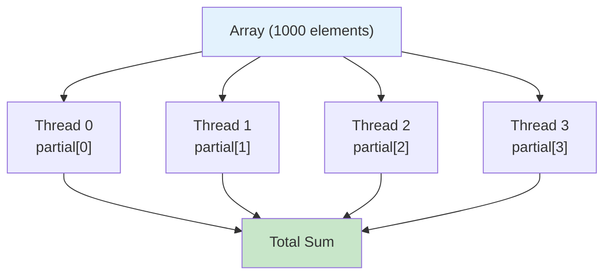
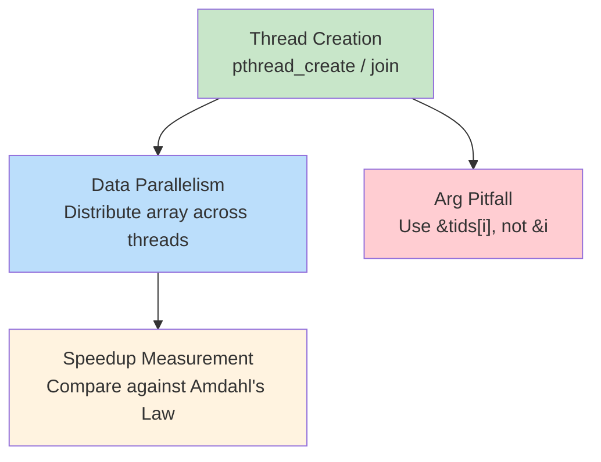

# 4주차 실습 — Pthreads: 스레드 생성, 데이터 병렬성, 속도 향상

> **최종 수정일:** 2026-03-31

> **선수 지식**: 4주차 이론 개념 (스레드, Pthreads API). `-pthread` 플래그로 C를 컴파일할 수 있는 능력.
>
> **학습 목표**: 이 실습을 완료하면 다음을 할 수 있어야 한다:
> 1. pthread_create/pthread_join을 사용하여 스레드를 생성하고 합류(join)할 수 있다
> 2. 부분 결과(partial results)를 활용한 데이터 병렬 계산을 구현할 수 있다
> 3. 흔한 스레드 인자 전달 함정을 피할 수 있다
> 4. 암달의 법칙(Amdahl's Law)에 대비하여 속도 향상을 측정하고 해석할 수 있다

---

## 목차

- [1. 실습 개요](#1-실습-개요)
- [2. 실습 1: Hello 스레드](#2-실습-1-hello-스레드)
- [3. 실습 2: 데이터 병렬 배열 합계](#3-실습-2-데이터-병렬-배열-합계)
- [4. 실습 3: 스레드 인자 전달 함정](#4-실습-3-스레드-인자-전달-함정)
- [5. 실습 4: 속도 향상과 암달의 법칙](#5-실습-4-속도-향상과-암달의-법칙)
- [요약](#요약)
- [부록](#부록)

---

<br>

## 1. 실습 개요

- **목표**: Pthreads 기초 실습 — 스레드 생성, 데이터 병렬성, 속도 향상 측정
- **소요 시간**: 약 50분 · 실습 4개
- **주제**: `pthread_create`, `pthread_join`, 데이터 병렬성(Data Parallelism), 인자 전달, 암달의 법칙(Amdahl's Law)


**전체 빌드**:

```bash
cd examples/
gcc -Wall -pthread -o lab1_hello_threads lab1_hello_threads.c
gcc -Wall -pthread -o lab2_parallel_sum  lab2_parallel_sum.c
gcc -Wall -pthread -o lab3_arg_pitfall   lab3_arg_pitfall.c
gcc -Wall -O2 -pthread -o lab4_speedup   lab4_speedup.c
```

> **참고:** `-pthread` 플래그는 컴파일러에 POSIX 스레드 라이브러리를 링크하도록 지시한다. 이 플래그가 없으면 `pthread_create`와 `pthread_join` 호출에서 링커 에러가 발생한다.

---

<br>

## 2. 실습 1: Hello 스레드

**목표**: `pthread_create` / `pthread_join`을 사용하여 스레드를 생성하고 합류(join)하기

```bash
./lab1_hello_threads        # 4개 스레드 (기본값)
./lab1_hello_threads 8      # 8개 스레드
```

**핵심 API** (교재 4.4절):

```c
pthread_create(&tid, NULL, func, arg);   // 스레드 생성
pthread_join(tid, NULL);                 // 스레드 종료 대기
```

> **[프로그래밍언어]** `pthread_create`의 세 번째 인자는 **함수 포인터(Function Pointer)** 이다. `void *(*func)(void *)`는 "`void *` 매개변수를 받고 `void *`를 반환하는 함수의 포인터"를 의미한다. 새 스레드가 어떤 함수를 진입점으로 실행할지 알려주는 역할이다.

### 스레드 생명주기

```text
메인 스레드          스레드 0        스레드 1        스레드 2        스레드 3
    |
    |--create()----> 시작
    |--create()-------------------> 시작
    |--create()----------------------------------> 시작
    |--create()---------------------------------------------------> 시작
    |                  |              |              |              |
    |             (동시 실행 — 순서는 스케줄러에 따라 결정)
    |                  |              |              |              |
    |                  |              |         printf("Hello 2!")  |
    |             printf("Hello 0!") |              |              |
    |                  |              |              |         printf("Hello 3!")
    |                  |         printf("Hello 1!") |              |
    |                  |              |              |              |
    |--join(T0)------> 완료          |              |              |
    |--join(T1)--------------------> 완료           |              |
    |--join(T2)----------------------------------> 완료            |
    |--join(T3)---------------------------------------------------> 완료
    |
 "모든 스레드가 종료되었습니다."
```

**관찰**: 프로그램을 여러 번 실행해보면 출력 순서가 **비결정적(non-deterministic)** 이다. 스레드는 OS에 의해 독립적으로 스케줄링되기 때문이다.

> **핵심:** `pthread_join()`이 없으면 메인 스레드가 자식 스레드보다 먼저 종료되어 전체 프로세스가 조기에 종료될 수 있다. `fork()` 이후에 `wait()`가 필요한 것과 유사하게, 생성한 모든 스레드는 반드시 join해야 한다.

---

<br>

## 3. 실습 2: 데이터 병렬 배열 합계

**목표**: 배열을 스레드에 분배 — 각 스레드가 **부분 합(partial sum)** 을 계산

```text
배열: [1, 2, 3, ..., 1000]

스레드 0: 합계 [  1 ~ 250 ] = 31375
스레드 1: 합계 [251 ~ 500 ] = 93875
스레드 2: 합계 [501 ~ 750 ] = 156375
스레드 3: 합계 [751 ~ 1000] = 218875
                              ──────
전체 합계                   = 500500 ✓
```



이것이 **데이터 병렬성(Data Parallelism)**(교재 4.2절)이다: 동일한 연산을 서로 다른 데이터 부분집합에 적용하는 것.

### 핵심 코드 패턴

```c
/* 각 스레드가 자기 담당 구간을 계산 — 공유 충돌 없음 */
void *sum_array(void *arg)
{
    int id    = ((struct thread_arg *)arg)->id;
    int chunk = ARRAY_SIZE / nthreads;
    int start = id * chunk;
    int end   = (id == nthreads - 1) ? ARRAY_SIZE : start + chunk;

    partial_sum[id] = 0;                        // 스레드마다 별도 인덱스 사용
    for (int i = start; i < end; i++)
        partial_sum[id] += array[i];

    return NULL;
}
```

> **왜 공유 변수 대신 `partial_sum[id]`를 사용하는가?**
> - 각 스레드가 **자신만의 인덱스** 에 기록 — 충돌 없음
> - 모든 스레드가 하나의 `total` 변수에 기록하면 **경쟁 조건(Race Condition)** 이 발생 (교재 6장에서 다룸)

> **[자료구조]** 여기서 사용하는 분할-정복 방식은 병합 정렬(Merge Sort)과 유사하다: 데이터를 나누고, 각 부분을 독립적으로 처리한 뒤, 결과를 합친다. 핵심 차이는 "분할"과 "처리" 단계가 여러 코어에서 **병렬로** 실행된다는 것이다.

---

<br>

## 4. 실습 3: 스레드 인자 전달 함정

**흔한 버그**: 반복문 변수의 주소 `&i`를 `pthread_create`에 전달하는 것

**잘못된 코드**:

```c
for (int i = 0; i < 4; i++)
    pthread_create(&t[i], NULL,
                   func, &i);  // 모두 &i를 공유!
```

출력 (비결정적):

```text
Thread received id = 2
Thread received id = 4
Thread received id = 4
Thread received id = 4
```

**올바른 코드**:

```c
int tids[4];
for (int i = 0; i < 4; i++) {
    tids[i] = i;               // 별도 복사본
    pthread_create(&t[i], NULL,
                   func, &tids[i]);
}
```

출력 (항상 정확):

```text
Thread received id = 0
Thread received id = 1
Thread received id = 2
Thread received id = 3
```

> 모든 스레드가 동일한 `&i` 주소를 공유한다. 스레드가 이 값을 읽을 때쯤이면 `i`가 이미 변경되었을 수 있다.

### 왜 이런 일이 발생하는가

```text
메인 (반복문)            스레드 0             스레드 1
    |
  i = 0
    |--create(&i)------> 시작
  i = 1                    |
    |--create(&i)------------------------------> 시작
  i = 2                    |                      |
    :                 id = *(&i)             id = *(&i)
    :                 2를 읽음!              2를 읽음!
    :                      |                      |
    :               둘 다 0, 1 대신 id=2를 받음!
```

**해결 방법**: 각 값을 **별도의 메모리 위치**(`tids[i]`)에 저장하면, 반복문이 진행되어도 각 스레드의 포인터가 안정적으로 유지된다.

> **시험 팁:** 이 인자 전달 함정은 자주 출제되는 주제이다. 근본 원인은 `pthread_create`가 **비동기적(asynchronous)** 이라는 것이다 — 새 스레드가 즉시 실행되지 않을 수 있다. 스레드가 포인터를 역참조할 때 이미 가리키는 값이 바뀌어 있을 수 있으며, 이것은 메인 스레드의 반복문과 자식 스레드의 포인터 역참조 사이의 경쟁 조건이다.

---

<br>

## 5. 실습 4: 속도 향상과 암달의 법칙

**목표**: 스레드 수에 따른 속도 향상 측정

```bash
./lab4_speedup
```

**예상 출력** (머신에 따라 다름):

| 스레드 수 | 시간 (초) | 속도 향상 |
|-----------|----------|----------|
| 1 | 0.12 | 1.00배 |
| 2 | 0.07 | ~1.7배 |
| 4 | 0.04 | ~3.0배 |
| 8 | 0.03 | ~4.0배 |

**암달의 법칙(Amdahl's Law)** (교재 4.2절): 속도 향상 $\leq \frac{1}{S + \frac{1-S}{N}}$

> **참고:** 이 수식에서 **S** 는 프로그램 중 반드시 **직렬로 실행되어야 하는 비율**(병렬화 불가능 부분)이고, **N** 은 처리 코어 수이다. S = 0(완전 병렬)이면 이상적 속도 향상 = N이다. S = 10%이면 8개 스레드의 최대 속도 향상 = **4.71배**(8배가 아님). 아무리 작은 직렬 비율이라도 성능 향상에 한계를 두게 된다.

### 이상 vs 현실

| 스레드 수 | 이상적 (S=0) | 현실 (S>0) |
|-----------|-------------|-----------|
| 1 | 1.0배 | 1.0배 |
| 2 | 2.0배 | ~1.7배 |
| 4 | 4.0배 | ~3.0배 |
| 8 | **8.0배** | **~4.0배** |

**실제 속도 향상이 이상적 값보다 낮은 이유는?**

1. **스레드 생성/합류 오버헤드** (직렬 부분)
2. **메모리 버스 경합** — 스레드들이 RAM 대역폭을 놓고 경쟁
3. **캐시 효과** — 여러 코어에 분산된 데이터가 캐시 미스(Cache Miss)를 유발할 수 있음
4. 암달의 법칙: 아무리 작은 직렬 비율이라도 성능 향상에 한계를 둠

> **[컴퓨터구조]** 메모리 버스 경합(Memory Bus Contention)은 여러 코어가 동시에 주 메모리에 접근할 때 병목이 된다. 각 코어의 L1/L2 캐시는 데이터를 빠르게 로컬로 제공할 수 있지만, 스레드가 큰 배열의 서로 다른 부분에 접근하면 캐시 미스가 발생하여 더 느린 공유 메모리 버스로의 접근이 반복된다.

---

<br>

## 요약



| 실습 | 주제 | 핵심 내용 |
|:----|:-----|:---------|
| 실습 1 | Hello 스레드 | `pthread_create` + `pthread_join`; 출력 순서는 비결정적 |
| 실습 2 | 병렬 합계 | `partial_sum[id]`를 통한 데이터 병렬성; 공유 쓰기 충돌 방지 |
| 실습 3 | 인자 전달 함정 | 반복문에서 `&i` 대신 별도 저장소 사용 |
| 실습 4 | 속도 향상 | 실제 속도 향상 < 이상적 값 (직렬 오버헤드 + 암달의 법칙) |

**전체 실습에서 사용한 Pthreads 패턴**:

```c
for (int i = 0; i < N; i++) {
    tids[i] = i;
    pthread_create(&threads[i], NULL, func, &tids[i]);
}
for (int i = 0; i < N; i++)
    pthread_join(threads[i], NULL);
```

---

<br>

## 부록

- 다음 주: 암묵적 스레딩(Implicit Threading), fork/join, OpenMP, 스레드 취소(Thread Cancellation), TLS (교재 4.5–4.8절)

---

<br>

## 자가 점검 문제

1. for 반복문에서 `&i`를 `pthread_create`에 전달하면 왜 잘못된 동작이 발생하는가?
2. 왜 하나의 공유 `total` 변수 대신 `partial_sum[id]`를 사용하는가?
3. 실제 속도 향상이 이상적 속도 향상에 미치지 못하는 요인은 무엇인가?
4. 메인 스레드가 모든 자식 스레드에 `pthread_join`을 호출하기 전에 종료하면 어떻게 되는가?

---
