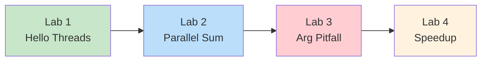
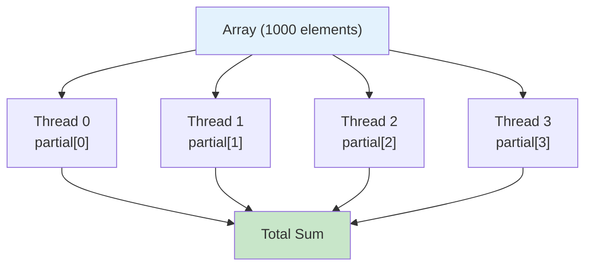
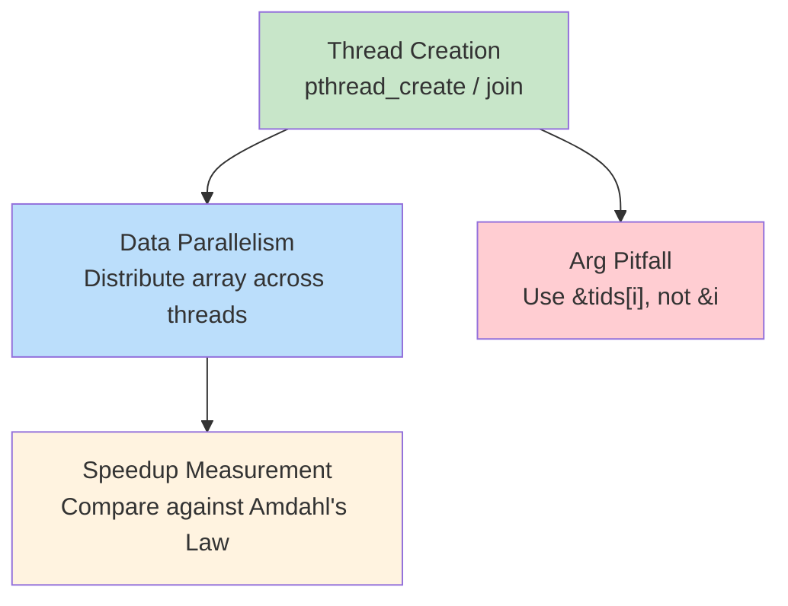

# Week 4 Lab — Pthreads: Thread Creation, Data Parallelism, and Speedup

> **Last Updated:** 2026-03-31

> **Prerequisites**: W04 Lecture concepts (threads, Pthreads API). Ability to compile C with `-pthread`.
>
> **Learning Objectives**: After completing this lab, you should be able to:
> 1. Create and join threads using pthread_create/pthread_join
> 2. Implement data-parallel computation with partial results
> 3. Avoid the common thread argument-passing pitfall
> 4. Measure and interpret speedup against Amdahl's Law

---

## Table of Contents

- [1. Lab Overview](#1-lab-overview)
- [2. Lab 1: Hello Threads](#2-lab-1-hello-threads)
- [3. Lab 2: Data-Parallel Array Sum](#3-lab-2-data-parallel-array-sum)
- [4. Lab 3: Thread Argument Pitfall](#4-lab-3-thread-argument-pitfall)
- [5. Lab 4: Speedup and Amdahl's Law](#5-lab-4-speedup-and-amdahls-law)
- [Summary](#summary)
- [Appendix](#appendix)

---

<br>

## 1. Lab Overview

- **Objective**: Practice Pthreads fundamentals — thread creation, data parallelism, and speedup measurement.
- **Duration**: Approximately 50 minutes · 4 labs
- **Topics**: `pthread_create`, `pthread_join`, data parallelism, argument passing, Amdahl's Law



**Build all labs**:

```bash
cd examples/
gcc -Wall -pthread -o lab1_hello_threads lab1_hello_threads.c
gcc -Wall -pthread -o lab2_parallel_sum  lab2_parallel_sum.c
gcc -Wall -pthread -o lab3_arg_pitfall   lab3_arg_pitfall.c
gcc -Wall -O2 -pthread -o lab4_speedup   lab4_speedup.c
```

> **Note:** The `-pthread` flag tells the compiler to link against the POSIX threads library. Without it, calls to `pthread_create` and `pthread_join` will cause linker errors.

---

<br>

## 2. Lab 1: Hello Threads

**Goal**: Create and join threads using `pthread_create` / `pthread_join`.

```bash
./lab1_hello_threads        # 4 threads (default)
./lab1_hello_threads 8      # 8 threads
```

**Core API** (Textbook Section 4.4):

```c
pthread_create(&tid, NULL, func, arg);   // Create a thread
pthread_join(tid, NULL);                 // Wait for a thread to finish
```

> **[Programming Languages]** `pthread_create` takes a **function pointer** as its third argument. `void *(*func)(void *)` means "a pointer to a function that takes a `void *` parameter and returns `void *`." Think of it as telling the new thread which function to run as its entry point.

### Thread Lifecycle

```text
Main Thread          Thread 0        Thread 1        Thread 2        Thread 3
    |
    |--create()----> Start
    |--create()-------------------> Start
    |--create()----------------------------------> Start
    |--create()---------------------------------------------------> Start
    |                  |              |              |              |
    |             (concurrent execution — order decided by scheduler)
    |                  |              |              |              |
    |                  |              |         printf("Hello 2!")  |
    |             printf("Hello 0!") |              |              |
    |                  |              |              |         printf("Hello 3!")
    |                  |         printf("Hello 1!") |              |
    |                  |              |              |              |
    |--join(T0)------> Done          |              |              |
    |--join(T1)--------------------> Done           |              |
    |--join(T2)----------------------------------> Done            |
    |--join(T3)---------------------------------------------------> Done
    |
 "All threads finished."
```

**Observation**: Run the program multiple times — the print order is **non-deterministic** because threads are independently scheduled by the OS.

> **Key Point:** Without `pthread_join()`, the main thread may exit before child threads finish, causing the entire process to terminate prematurely. This is analogous to how `wait()` is necessary after `fork()` to prevent zombie processes. Always join all threads you create.

---

<br>

## 3. Lab 2: Data-Parallel Array Sum

**Goal**: Distribute an array across threads — each thread computes a **partial sum**.

```text
Array: [1, 2, 3, ..., 1000]

Thread 0: sum [  1 ~ 250 ] = 31375
Thread 1: sum [251 ~ 500 ] = 93875
Thread 2: sum [501 ~ 750 ] = 156375
Thread 3: sum [751 ~ 1000] = 218875
                              ──────
Total                       = 500500 ✓
```



This is **Data Parallelism** (Textbook Section 4.2): applying the same operation to different subsets of data.

### Core Code Pattern

```c
/* Each thread computes its own range — no shared-write conflict */
void *sum_array(void *arg)
{
    int id    = ((struct thread_arg *)arg)->id;
    int chunk = ARRAY_SIZE / nthreads;
    int start = id * chunk;
    int end   = (id == nthreads - 1) ? ARRAY_SIZE : start + chunk;

    partial_sum[id] = 0;                        // Each thread writes to its own index
    for (int i = start; i < end; i++)
        partial_sum[id] += array[i];

    return NULL;
}
```

> **Why `partial_sum[id]` instead of a shared variable?**
> - Each thread writes to **its own index** — no conflict.
> - If all threads wrote to a single `total` variable, a **race condition** would occur (covered in Chapter 6).

> **[Data Structures]** The divide-and-conquer approach here is similar to merge sort: split the data, process each part independently, and combine the results. The key difference is that the "split" and "process" phases run **in parallel** across multiple cores.

---

<br>

## 4. Lab 3: Thread Argument Pitfall

**A common bug**: passing the address of a loop variable `&i` to `pthread_create`.

**Wrong code**:

```c
for (int i = 0; i < 4; i++)
    pthread_create(&t[i], NULL,
                   func, &i);  // All threads share &i!
```

Output (non-deterministic):

```text
Thread received id = 2
Thread received id = 4
Thread received id = 4
Thread received id = 4
```

**Correct code**:

```c
int tids[4];
for (int i = 0; i < 4; i++) {
    tids[i] = i;               // Separate copy
    pthread_create(&t[i], NULL,
                   func, &tids[i]);
}
```

Output (always correct):

```text
Thread received id = 0
Thread received id = 1
Thread received id = 2
Thread received id = 3
```

> All threads share the same `&i` address. By the time a thread reads it, `i` has already advanced.

### Why This Happens

```text
Main (loop)              Thread 0             Thread 1
    |
  i = 0
    |--create(&i)------> Start
  i = 1                    |
    |--create(&i)------------------------------> Start
  i = 2                    |                      |
    :                 id = *(&i)             id = *(&i)
    :                 Reads 2!               Reads 2!
    :                      |                      |
    :               Both get id=2 instead of 0, 1!
```

**Solution**: Store each value in a **separate memory location** (`tids[i]`), so each thread's pointer remains stable even as the loop advances.

> **Exam Tip:** This argument-passing pitfall is a frequently tested topic. The root cause is that `pthread_create` is **asynchronous** — the new thread may not run immediately. By the time it dereferences the pointer, the pointed-to value may have changed. This is a race condition between the main thread's loop and each child thread's pointer dereference.

---

<br>

## 5. Lab 4: Speedup and Amdahl's Law

**Goal**: Measure speedup as thread count increases.

```bash
./lab4_speedup
```

**Expected output** (varies by machine):

| Threads | Time (s) | Speedup |
|---------|----------|---------|
| 1 | 0.12 | 1.00x |
| 2 | 0.07 | ~1.7x |
| 4 | 0.04 | ~3.0x |
| 8 | 0.03 | ~4.0x |

**Amdahl's Law** (Textbook Section 4.2): Speedup $\leq \frac{1}{S + \frac{1-S}{N}}$

> **Note:** In this formula, **S** is the fraction of the program that must run **serially** (cannot be parallelized), and **N** is the number of processing cores. When S = 0 (fully parallel), ideal speedup = N. When S = 10%, maximum speedup with 8 threads = **4.71x** (not 8x). Even a small serial fraction places a hard ceiling on performance gains.

### Ideal vs Reality

| Threads | Ideal (S=0) | Real (S>0) |
|---------|-------------|------------|
| 1 | 1.0x | 1.0x |
| 2 | 2.0x | ~1.7x |
| 4 | 4.0x | ~3.0x |
| 8 | **8.0x** | **~4.0x** |

**Why is real speedup lower than ideal?**

1. **Thread creation/join overhead** (serial portion)
2. **Memory bus contention** — threads compete for RAM bandwidth
3. **Cache effects** — data spread across cores may cause cache misses
4. Amdahl's Law: even a tiny serial fraction caps the maximum speedup

> **[Computer Architecture]** Memory bus contention becomes a bottleneck when multiple cores simultaneously access main memory. Each core's L1/L2 cache can serve data locally and fast, but when threads access different parts of a large array, **cache misses** force repeated trips to the slower shared memory bus.

---

<br>

## Summary



| Lab | Topic | Key Takeaway |
|:----|:------|:-------------|
| Lab 1 | Hello Threads | `pthread_create` + `pthread_join`; output order is non-deterministic |
| Lab 2 | Parallel Sum | Data parallelism via `partial_sum[id]`; avoid shared-write conflicts |
| Lab 3 | Arg Pitfall | Never pass `&i` from a loop; use separate storage per thread |
| Lab 4 | Speedup | Real speedup < ideal due to serial overhead and Amdahl's Law |

**Complete Pthreads pattern used across all labs**:

```c
for (int i = 0; i < N; i++) {
    tids[i] = i;
    pthread_create(&threads[i], NULL, func, &tids[i]);
}
for (int i = 0; i < N; i++)
    pthread_join(threads[i], NULL);
```

---

<br>

## Appendix

- Next week: Implicit threading, fork/join, OpenMP, thread cancellation, TLS (Textbook Sections 4.5–4.8)

---

<br>

## Self-Check Questions

1. Why does passing `&i` from a for loop to `pthread_create` cause incorrect behavior?
2. Why do we use `partial_sum[id]` instead of a single shared `total` variable?
3. What factors cause real speedup to fall short of ideal speedup?
4. What happens if the main thread exits before calling `pthread_join` on all child threads?

---
