# 4주차 이론 — 스레드와 동시성 (1)

> **최종 수정일:** 2026-03-25
>
> Silberschatz, Operating System Concepts Ch 4 (Sections 4.1 – 4.4)

> **선수 지식**: 2주차-W03 프로세스 개념 (프로세스, fork, IPC). 기본 C 프로그래밍.
>
> **학습 목표**:
> 1. 스레드가 무엇인지 설명하고 프로세스와의 차이를 구분할 수 있다
> 2. 동시성(Concurrency)과 병렬성(Parallelism)을 구분할 수 있다
> 3. 멀티스레딩 모델(다대일, 일대일, 다대다)을 비교할 수 있다
> 4. Pthreads를 사용하여 기본적인 멀티스레드 프로그램을 작성할 수 있다
> 5. 암달의 법칙(Amdahl's Law)을 적용하여 병렬 속도 향상의 한계를 추정할 수 있다

---

## 목차

- [1. 스레드의 개념](#1-스레드의-개념)
  - [1.1 스레드란 무엇인가?](#11-스레드란-무엇인가)
  - [1.2 단일 스레드 vs 멀티스레드 프로세스](#12-단일-스레드-vs-멀티스레드-프로세스)
  - [1.3 스레드 vs 프로세스 비교](#13-스레드-vs-프로세스-비교)
  - [1.4 스레드를 사용하는 이유 — 실세계 예시](#14-스레드를-사용하는-이유--실세계-예시)
  - [1.5 멀티스레드 웹 서버](#15-멀티스레드-웹-서버)
- [2. 멀티스레딩의 이점](#2-멀티스레딩의-이점)
  - [2.1 스레드의 네 가지 이점](#21-스레드의-네-가지-이점)
- [3. 멀티코어 프로그래밍](#3-멀티코어-프로그래밍)
  - [3.1 동시성 vs 병렬성](#31-동시성-vs-병렬성)
  - [3.2 단일코어 vs 멀티코어 실행 비교](#32-단일코어-vs-멀티코어-실행-비교)
  - [3.3 멀티코어 프로그래밍의 다섯 가지 과제](#33-멀티코어-프로그래밍의-다섯-가지-과제)
  - [3.4 암달의 법칙 (Amdahl's Law)](#34-암달의-법칙-amdahls-law)
  - [3.5 병렬성의 유형](#35-병렬성의-유형)
- [4. 사용자 스레드와 커널 스레드](#4-사용자-스레드와-커널-스레드)
- [5. 멀티스레딩 모델](#5-멀티스레딩-모델)
  - [5.1 다대일 모델 (Many-to-One)](#51-다대일-모델-many-to-one)
  - [5.2 일대일 모델 (One-to-One)](#52-일대일-모델-one-to-one)
  - [5.3 다대다 모델 (Many-to-Many)](#53-다대다-모델-many-to-many)
  - [5.4 두 수준 모델 (Two-Level)](#54-두-수준-모델-two-level)
  - [5.5 멀티스레딩 모델 요약](#55-멀티스레딩-모델-요약)
- [6. 스레드 라이브러리](#6-스레드-라이브러리)
  - [6.1 스레드 라이브러리 개요](#61-스레드-라이브러리-개요)
  - [6.2 비동기 스레딩 vs 동기 스레딩](#62-비동기-스레딩-vs-동기-스레딩)
  - [6.3 Pthreads 개요](#63-pthreads-개요)
  - [6.4 Pthreads 예제 — 정수 합산](#64-pthreads-예제--정수-합산)
  - [6.5 Pthreads — 여러 스레드 생성과 조인](#65-pthreads--여러-스레드-생성과-조인)
  - [6.6 pthread_create() 상세](#66-pthread_create-상세)
  - [6.7 Windows 스레드 예제](#67-windows-스레드-예제)
- [7. Java 스레드](#7-java-스레드)
  - [7.1 Java 스레드 개요](#71-java-스레드-개요)
  - [7.2 Runnable 인터페이스](#72-runnable-인터페이스)
  - [7.3 람다 표현식](#73-람다-표현식)
  - [7.4 join()](#74-join)
  - [7.5 Pthreads/Windows와 비교](#75-pthreadswindows와-비교)
- [8. Java Executor 프레임워크](#8-java-executor-프레임워크)
  - [8.1 Executor 개요](#81-executor-개요)
  - [8.2 스레드 풀 유형](#82-스레드-풀-유형)
  - [8.3 스레드 풀의 장점](#83-스레드-풀의-장점)
  - [8.4 Callable과 Future — 결과 반환](#84-callable과-future--결과-반환)
  - [8.5 execute() vs submit()](#85-execute-vs-submit)
  - [8.6 JVM과 호스트 OS의 관계](#86-jvm과-호스트-os의-관계)
- [9. 실습 — Pthreads 멀티스레드 프로그래밍](#9-실습--pthreads-멀티스레드-프로그래밍)
  - [9.1 실습 개요: 배열 합산을 여러 스레드로 분할](#91-실습-개요-배열-합산을-여러-스레드로-분할)
  - [9.2 스레드 함수 구현](#92-스레드-함수-구현)
  - [9.3 메인 함수](#93-메인-함수)
  - [9.4 코드 분석](#94-코드-분석)
  - [9.5 thread_ids 배열이 필요한 이유](#95-thread_ids-배열이-필요한-이유)
  - [9.6 경쟁 조건 관찰](#96-경쟁-조건-관찰)
  - [9.7 Pthreads 정수 합산 (교재 예제 변형)](#97-pthreads-정수-합산-교재-예제-변형)
  - [9.8 실습 핵심 정리](#98-실습-핵심-정리)
- [요약](#요약)
- [부록](#부록)

---

<br>

## 1. 스레드의 개념

### 1.1 스레드란 무엇인가?

**스레드(Thread)** = 프로세스 내에서 **CPU 이용의 기본 단위** 이다.

> 프로세스가 공장이라면, 스레드는 공장 안의 작업자들이다. 같은 건물(코드, 데이터, 파일)을 공유하지만 각자 자기 작업대(스택)를 가지고 자기 진행 상황(PC, 레지스터)을 추적한다.

각 스레드가 **독립적으로 소유** 하는 것:
- 스레드 ID
- 프로그램 카운터(PC)
- 레지스터 집합(Register Set)
- **스택(Stack)** (함수 호출, 지역 변수)

> **프로그램 카운터(Program Counter, PC)**: 다음에 실행할 명령어의 메모리 주소를 보관하는 레지스터이다.

> **레지스터 집합(Register Set)**: 범용 레지스터, 상태 레지스터 등 스레드의 실행 상태를 정의하는 CPU 레지스터의 모음이다.

같은 프로세스 내 스레드들이 **공유** 하는 것:
- 코드 섹션(프로그램 코드)
- 데이터 섹션(전역 변수)
- OS 자원(열린 파일, 시그널 등)

> 전통적 프로세스 = 단일 스레드의 제어 흐름
> 현대 프로세스 = **다중 스레드** 의 제어 흐름

> **핵심:** 스레드는 "가벼운 프로세스"라고도 불린다. 프로세스가 실행의 **자원 단위**(주소 공간, 파일 등)라면, 스레드는 실행의 **스케줄링 단위**(PC, 스택, 레지스터)이다. 하나의 프로세스 안에서 여러 실행 흐름을 만들 수 있으므로 자원을 절약하면서도 병렬성을 확보할 수 있다.

### 1.2 단일 스레드 vs 멀티스레드 프로세스

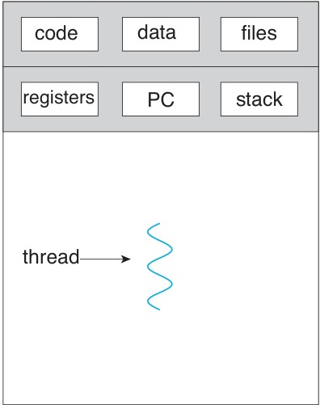 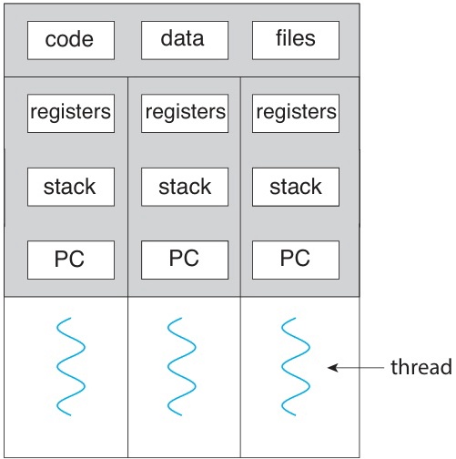

*Silberschatz, Figure 4.1 — 단일 스레드 프로세스와 멀티스레드 프로세스*

- 단일 스레드: 하나의 실행 흐름, 하나의 PC, 하나의 스택
- 멀티스레드: **여러 실행 흐름**, 각각 독립적인 PC와 스택 보유
- **코드, 데이터, 파일은 모든 스레드가 공유** 한다

> **[컴퓨터구조]** 각 스레드가 독립적인 PC(프로그램 카운터)를 갖는다는 것은, 각 스레드가 코드의 서로 다른 위치를 동시에 실행할 수 있다는 의미이다. 컨텍스트 스위칭 시 커널은 해당 스레드의 PC, 레지스터, 스택 포인터 등을 저장/복원한다.

### 1.3 스레드 vs 프로세스 비교

| 범주 | 프로세스(Process) | 스레드(Thread) |
|------|---------|--------|
| 생성 비용 | **높음** (메모리 및 자원 할당) | **낮음** (스택과 레지스터만 필요) |
| 컨텍스트 스위칭 | **느림** (주소 공간 전환) | **빠름** (같은 주소 공간) |
| 메모리 공유 | 기본적으로 격리됨 (IPC(프로세스 간 통신) 필요 — 파이프, 소켓 등) | **자연적으로 공유** (코드, 데이터) |
| 독립성 | 높음 (하나가 죽어도 다른 것에 영향 적음) | 낮음 (하나가 죽으면 전체 프로세스에 영향 가능) |
| 통신 | IPC 필요 (파이프, 소켓 등) | 전역 변수를 통한 직접 통신 |

> **IPC (Inter-Process Communication, 프로세스 간 통신)** 는 3주차에서 자세히 다루었다. 스레드는 같은 주소 공간을 공유하므로, IPC 없이 공유 메모리를 통해 직접 통신할 수 있다.

> 스레드는 **"경량 프로세스(Lightweight Process)"** 라고도 불린다.

> **[컴퓨터구조]** 스레드 간 컨텍스트 스위칭이 프로세스 간보다 빠른 이유는 주소 공간이 동일하므로 **TLB 플러시(flush)가 필요 없기 때문** 이다. 프로세스 전환 시에는 페이지 테이블이 바뀌므로 TLB를 무효화해야 하고, 이후 TLB 미스가 빈번하게 발생하여 성능이 저하된다. 페이지 테이블은 프로그램의 논리 주소를 물리 RAM 위치에 매핑하는 OS의 자료 구조이다. 각 프로세스가 고유한 페이지 테이블을 갖기 때문에 프로세스 전환 시 CPU가 다른 페이지 테이블을 로드해야 한다.
>
> **TLB (Translation Lookaside Buffer)**: 가상 주소에서 물리 주소로의 변환을 빠르게 하는 하드웨어 캐시이다. 같은 프로세스 내 스레드 전환은 동일한 주소 공간을 공유하므로 TLB 플러시가 필요 없다.

> **시험 팁:** "스레드와 프로세스의 차이" 또는 "스레드를 경량 프로세스라고 부르는 이유"는 시험 빈출 주제이다. **공유하는 것**(코드, 데이터, 파일)과 **독립적인 것**(PC, 레지스터, 스택)을 정확히 구분할 수 있어야 한다.

### 1.4 스레드를 사용하는 이유 — 실세계 예시

**웹 브라우저:**
- 스레드 1: 네트워크에서 데이터 수신
- 스레드 2: 이미지와 텍스트 렌더링
- 스레드 3: 사용자 입력 처리

**워드 프로세서:**
- 스레드 1: 문서를 화면에 표시
- 스레드 2: 키 입력 처리
- 스레드 3: 맞춤법/문법 검사 (백그라운드)

**사진 앱 — 썸네일 생성:**
- 컬렉션의 각 이미지를 별도의 스레드가 처리
- 병렬 처리로 총 소요 시간 단축

### 1.5 멀티스레드 웹 서버

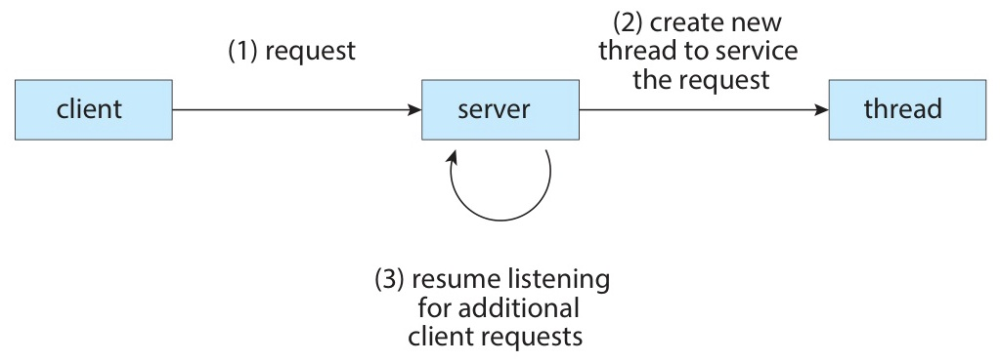

*Silberschatz, Figure 4.2 — 멀티스레드 서버 아키텍처*

**전통적 방식**: 요청당 새로운 **프로세스** 생성 → 시간 소모, 자원 낭비

**현대적 방식**: 요청당 새로운 **스레드** 생성
- 같은 주소 공간을 공유하므로 **빠르고 가볍다**
- 대량의 동시 접속 처리에 유리하다

> Linux 커널 자체도 멀티스레드이다 — `kthreadd` (pid=2)가 모든 커널 스레드의 부모이다

> **참고:** 현대 고성능 서버는 "요청당 스레드 생성"보다 더 발전한 **이벤트 루프(Event Loop)** 방식을 많이 사용한다. 예를 들어 Nginx는 소수의 워커 스레드가 `epoll`/`kqueue` 같은 I/O 멀티플렉싱으로 수만 개의 동시 접속을 처리한다. Node.js도 단일 스레드 이벤트 루프를 사용한다. 하지만 기본 개념으로서 "요청당 스레드"는 여전히 중요하며, Java의 Servlet 컨테이너(Tomcat 등)가 이 모델을 사용한다.

---

<br>

## 2. 멀티스레딩의 이점

### 2.1 스레드의 네 가지 이점

**1. 응답성 (Responsiveness)**
- UI 스레드가 계속 응답할 수 있다
- 오래 걸리는 작업은 별도 스레드에서 **비동기적** 으로 실행한다
- 예: 버튼 클릭 후 긴 처리 중에도 인터페이스가 응답 가능하다

**2. 자원 공유 (Resource Sharing)**
- 프로세스 간 공유에는 공유 메모리나 메시지 전달이 필요하다
- 스레드는 코드, 데이터, 파일을 **기본적으로 공유** 한다
- 같은 주소 공간 내에서 여러 활동을 수행할 수 있다

**3. 경제성 (Economy)**
- 스레드 생성은 프로세스 생성보다 **훨씬 저렴** 하다
  - 메모리 할당 및 자원 할당 비용이 낮다
- 스레드 간 컨텍스트 스위칭도 **훨씬 빠르다**
  - 같은 주소 공간이므로 TLB 플러시가 필요 없다

**4. 확장성 (Scalability)**
- 멀티프로세서/멀티코어 시스템에서 진정한 **병렬 실행** 이 가능하다
- 단일 스레드 프로세스는 코어가 아무리 많아도 **1개 코어** 만 사용한다
- 멀티스레드 프로세스는 각 스레드를 서로 다른 코어에서 동시에 실행할 수 있다

| 이점 | 핵심 설명 | 대표적 예시 |
|------|----------|----------|
| **응답성** | 블로킹 중에도 프로그램이 응답 유지 | 웹 브라우저 UI |
| **자원 공유** | 같은 주소 공간 내 자동 자원 공유 | 전역 변수 접근 |
| **경제성** | 프로세스보다 생성/전환 비용 낮음 | 웹 서버 요청 처리 |
| **확장성** | 멀티코어에서 병렬 실행 | 비디오 인코딩, 과학 계산 |

> 웹 서버가 요청마다 프로세스 대신 스레드를 생성하면 오버헤드가 크게 줄어든다.

> **시험 팁:** 스레드의 네 가지 이점(Responsiveness, Resource Sharing, Economy, Scalability)은 시험에서 단답형 또는 서술형으로 출제되기 쉬운 주제이다. 각 이점의 **핵심 이유** 를 한 문장으로 설명할 수 있어야 한다.

---

<br>

## 3. 멀티코어 프로그래밍

### 3.1 동시성 vs 병렬성

**동시성 (Concurrency)**
- 여러 작업이 동시에 **진행(making progress)** 하는 것이다
- 단일 코어에서도 가능하다 — 시분할(time-sharing)을 통한 **인터리빙(interleaving)**

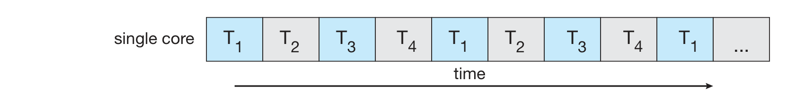

*Silberschatz, Figure 4.3 — 단일코어 시스템에서의 동시 실행*

**병렬성 (Parallelism)**
- 여러 작업이 **실제로 동시에 실행** 되는 것이다
- 멀티코어에서만 가능하다 — 각 코어가 서로 다른 스레드를 실행한다

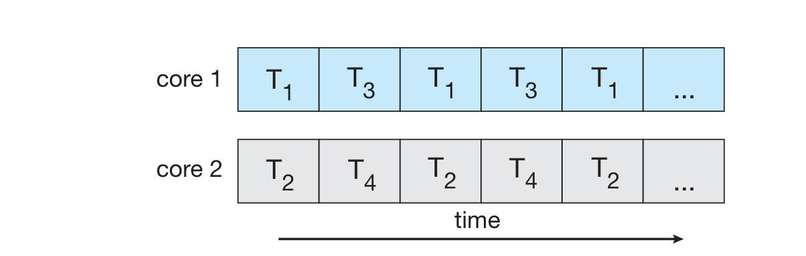

*Silberschatz, Figure 4.4 — 멀티코어 시스템에서의 병렬 실행*

> 병렬성 없는 동시성은 가능하지만, 동시성 없는 병렬성은 불가능하다

> 동시성은 한 사람이 요리와 빨래를 번갈아 하는 것이다 (둘 다 진행 중이지만 한 번에 하나만). 병렬성은 두 사람이 — 한 명은 요리, 한 명은 빨래 — 진짜 동시에 일하는 것이다.

> **핵심:** 동시성(Concurrency)과 병렬성(Parallelism)의 차이를 정확히 구분해야 한다. 동시성은 **논리적 개념** 으로, 단일 코어에서 여러 작업이 번갈아 실행되는 것도 포함한다. 병렬성은 **물리적 개념** 으로, 실제로 여러 코어에서 동시에 실행되는 것을 의미한다.

### 3.2 단일코어 vs 멀티코어 실행 비교

**단일코어 시스템 (Figure 4.3):**
- 4개의 스레드: T1, T2, T3, T4
- 한 번에 하나만 실행 → **인터리빙** 으로 동시성 달성
- 진정한 병렬성은 아니다

**멀티코어 시스템 (Figure 4.4):**
- 코어 1: T1과 T3를 번갈아 실행
- 코어 2: T2와 T4를 번갈아 실행
- T1과 T2가 **동시에** 실행 → **진정한 병렬성**

| 범주 | 단일코어 | 멀티코어 |
|------|---------|---------|
| 동시성 | O (인터리빙) | O (병렬) |
| 병렬성 | X | **O** |
| 성능 향상 | 시분할만 가능 | 실제 처리량 증가 |

### 3.3 멀티코어 프로그래밍의 다섯 가지 과제

멀티코어 시스템을 **효과적으로 활용** 하기 위해 극복해야 할 과제:

**1. 작업 식별 (Identifying tasks)**
- 분리 가능한 **독립적** 작업을 찾아야 한다
- 이상적으로는 작업 간 의존성이 없어야 한다

**2. 균형 (Balance)**
- 각 코어에 **동등한 작업량** 을 분배해야 한다
- 기여도가 낮은 작업에 별도 코어를 할당하는 것은 비효율적이다

**3. 데이터 분할 (Data splitting)**
- 작업과 함께 **데이터를 적절히 분할** 하여 각 코어에 분배해야 한다
- 예: 배열을 N등분하여 각 코어가 한 부분을 담당

**4. 데이터 의존성 (Data dependency)**
- 작업 간 데이터 의존성이 있으면 **동기화** 가 필요하다
- Task B가 Task A의 결과를 필요로 하면 순서를 보장해야 한다
- Ch 6에서 자세히 다룬다

**5. 테스트 및 디버깅 (Testing and debugging)**
- 병렬 실행 시 **다양한 실행 경로** 가 가능하다
- **비결정적(non-deterministic)** 결과가 발생할 수 있다
- 재현이 어려운 버그(heisenbug)가 발생한다

> 이러한 과제들로 인해, 많은 전문가가 멀티코어 시대에는 **근본적으로 새로운** 소프트웨어 설계 접근법이 필요하다고 주장한다.

> **참고:** "Heisenbug"는 하이젠베르크의 불확정성 원리에서 유래한 용어로, 관측(디버깅)하려고 하면 사라지는 버그를 뜻한다. 멀티스레드 프로그램에서 디버거를 붙이면 타이밍이 달라져 버그가 재현되지 않는 경우가 대표적이다.

### 3.4 암달의 법칙 (Amdahl's Law)

시스템의 **일부분만** 개선했을 때 전체 성능 향상의 한계를 나타내는 법칙이다.

$$
\text{speedup} \leq \frac{1}{S + \frac{1-S}{N}}
$$

- **S** = 순차 실행 비율 (직렬 부분의 비율)
- **N** = 프로세싱 코어의 수

> 이 수식에서 S는 프로그램 중 반드시 직렬로 실행해야 하는 비율(병렬화 불가능 부분)이고, N은 코어 수이다. 분모는 직렬 실행 시간(S) + 병렬 실행 시간을 N개 코어로 나눈 값((1-S)/N)을 나타낸다.

핵심 의미:
- N이 무한대에 가까워져도, 속도 향상은 **1/S** 에 수렴한다
- 순차 부분이 **병목(bottleneck)** 으로 작용한다

**수치 예시:**

| S (순차 비율) | N = 2 | N = 4 | N = 8 | N → ∞ |
|:---:|:---:|:---:|:---:|:---:|
| 5% | 1.90x | 3.48x | 5.93x | **20.00x** |
| 10% | 1.82x | 3.08x | 4.71x | **10.00x** |
| 25% | 1.60x | 2.28x | 3.02x | **4.00x** |
| 50% | 1.33x | 1.60x | 1.78x | **2.00x** |

예: 75% 병렬 + 25% 순차인 프로그램
- 2코어 → **1.6배** 속도 향상
- 4코어 → **2.28배** 속도 향상
- 코어를 아무리 늘려도 최대 **4배** (= 1/0.25)

> 순차 비율이 클수록 코어를 추가해도 성능 향상이 **제한** 된다.

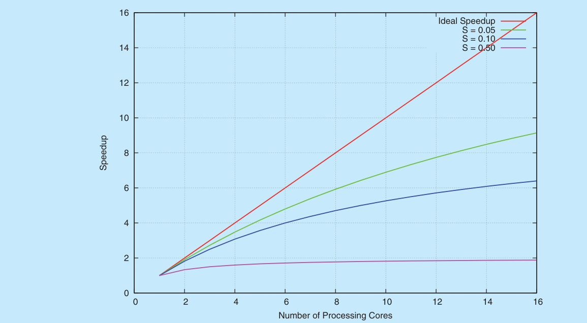

*Silberschatz, Amdahl's Law — 코어 수 대비 속도 향상*

- S가 작을수록(병렬화 비율이 높을수록) 코어 추가 효과가 크다
- S = 0.50이면 코어 수에 관계없이 최대 2배이다

> **시험 팁:** 암달의 법칙 공식과 "S가 주어졌을 때 N코어에서의 speedup" 계산은 시험에 자주 출제된다. 특히 **N → ∞일 때 speedup = 1/S** 라는 점을 기억해야 한다.

> **[알고리즘]** 암달의 법칙은 병렬 알고리즘 설계에서 핵심적인 개념이다. 아무리 뛰어난 병렬 알고리즘을 설계해도, 반드시 순차적으로 실행해야 하는 부분(예: 결과 병합, 초기화 등)이 있으면 그것이 속도 향상의 상한선을 결정한다.

### 3.5 병렬성의 유형

**데이터 병렬성 (Data Parallelism)**
- 데이터의 **부분 집합** 에 **동일한 연산** 을 분산한다
- 데이터를 분할하여 각 코어가 같은 작업을 수행한다
- 예: 크기 N인 배열의 합산
  - 코어 0: [0] ~ [N/2-1] 합산
  - 코어 1: [N/2] ~ [N-1] 합산

**작업 병렬성 (Task Parallelism)**
- 각 스레드에 **서로 다른 연산(작업)** 을 분배한다
- 서로 다른 작업이 같은 데이터에 대해 동작할 수 있다
- 예: 배열에 대해
  - 코어 0: 평균 계산
  - 코어 1: 표준편차 계산

**데이터 병렬성 vs 작업 병렬성 비교:**

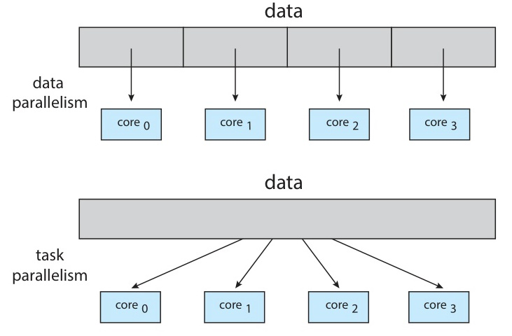

*Silberschatz, Figure 4.5 — 데이터 병렬성 vs 작업 병렬성*

| 범주 | 데이터 병렬성 | 작업 병렬성 |
|------|-------------|-----------|
| 데이터 분배 | **분할** 하여 분배 | 같은 데이터도 가능 |
| 연산 유형 | **동일한** 연산 | **서로 다른** 연산 |
| 확장성 | 데이터 크기에 비례 | 작업 수에 의존 |

> 실제로는 **하이브리드** 형태가 일반적이다.

> **참고:** GPU 프로그래밍(CUDA, OpenCL)은 데이터 병렬성의 대표적 활용 사례이다. 수천 개의 코어가 동일한 연산을 서로 다른 데이터 조각에 대해 동시에 수행한다. 반면 마이크로서비스 아키텍처는 작업 병렬성에 가깝다 — 서로 다른 서비스가 서로 다른 기능을 수행한다.

---

<br>

## 4. 사용자 스레드와 커널 스레드

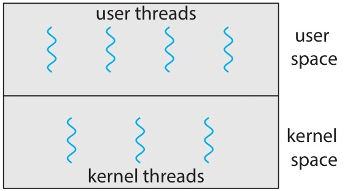

*Silberschatz, Figure 4.6 — 사용자 스레드와 커널 스레드*

**사용자 스레드 (User Threads):**
- 사용자 수준 라이브러리가 관리한다 (커널 지원 없이)
- 예: POSIX Pthreads, Windows 스레드, Java 스레드

> 사용자 수준 스레드는 사용자 공간의 라이브러리가 전적으로 관리한다 — 라이브러리가 자체적인 스레드 테이블을 유지하고 커널 개입 없이 컨텍스트 스위칭을 수행한다. 커널은 이 스레드들의 존재를 알지 못하므로, 하나의 사용자 스레드가 블로킹 시스템 콜을 하면 해당 프로세스의 모든 스레드가 블록될 수 있다.

**커널 스레드 (Kernel Threads):**
- OS 커널이 **직접 관리** 한다
- 사실상 모든 현대 OS가 지원: Windows, Linux, macOS

> 핵심 질문: 사용자 스레드를 커널 스레드에 **어떻게 매핑** 해야 하는가?

> **핵심:** "사용자 스레드"와 "커널 스레드"라는 용어에서 혼동하기 쉬운 점은, Pthreads나 Java 스레드도 결국 커널 스레드와 매핑되어 실행된다는 것이다. 여기서 "사용자 스레드"란 **사용자 수준 API로 생성·관리되는 스레드** 를 의미하고, "커널 스레드"란 **커널의 스케줄러가 인식하고 직접 스케줄링하는 스레드** 를 의미한다. 매핑 모델(다대일, 일대일, 다대다)이 이 둘 사이의 관계를 결정한다.

> 참고: 나열된 예시(Pthreads, Java 스레드)는 사용자 수준 API로 생성되므로 '사용자 스레드'라 불린다. 그러나 현대 리눅스에서는 각 사용자 스레드가 커널 스레드에 1:1로 매핑된다 — 그 이유는 5절에서 다룬다.

---

<br>

## 5. 멀티스레딩 모델

### 5.1 다대일 모델 (Many-to-One)

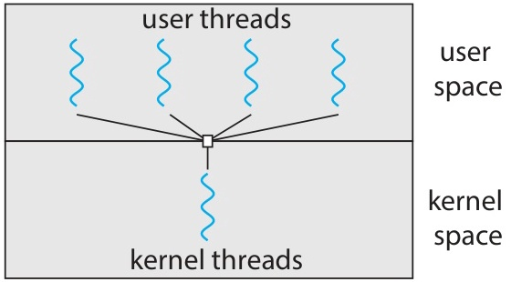

*Silberschatz, Figure 4.7 — 다대일 모델*

여러 사용자 스레드가 **하나의** 커널 스레드에 매핑된다.

장점:
- 스레드 관리가 사용자 공간에서 이루어지므로 **효율적** 이다

단점:
- 하나의 스레드가 **블로킹 시스템 콜** 을 하면 → **전체 프로세스가 블록** 된다
- **진정한 병렬성이 불가능** 하다 — 커널이 한 번에 하나의 스레드만 스케줄링 가능

사용 사례:
- 과거 Solaris Green Threads
- 초기 Java (Green Threads)
- 현대 시스템에서는 **거의 사용되지 않는다**

### 5.2 일대일 모델 (One-to-One)

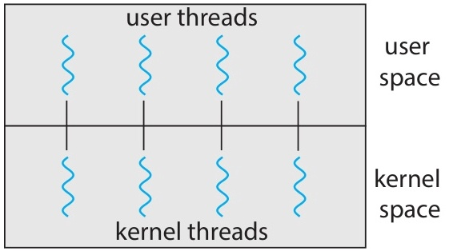

*Silberschatz, Figure 4.8 — 일대일 모델*

각 사용자 스레드가 **하나의** 커널 스레드에 매핑된다.

장점:
- 하나의 스레드가 블록되어도 **다른 스레드는 계속 실행** 가능하다
- 멀티프로세서에서 **진정한 병렬성** 달성 가능하다

단점:
- 사용자 스레드 생성 시 **커널 스레드도 생성** 되어야 한다 → 오버헤드
- 스레드를 너무 많이 만들면 **시스템 성능이 저하** 될 수 있다

사용 사례:
- **Linux** 와 **Windows** 운영체제가 사용한다
- 현재 가장 널리 사용되는 모델이다

### 5.3 다대다 모델 (Many-to-Many)

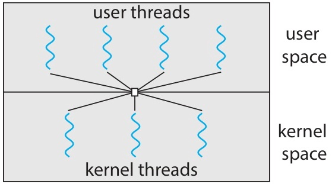

*Silberschatz, Figure 4.9 — 다대다 모델*

여러 사용자 스레드가 **같거나 더 적은 수의** 커널 스레드에 매핑된다.

장점:
- 개발자가 원하는 만큼 사용자 스레드를 생성할 수 있다
- 커널 스레드가 **병렬로** 실행 가능하다
- 하나의 스레드가 블록되면 커널이 **다른 스레드를 스케줄링** 할 수 있다

단점:
- **구현이 매우 복잡** 하다

> 이 복잡성은 커널 스케줄러와 협력하는 사용자 수준 스케줄러가 필요하고, 커널이 사용자 수준 스케줄러에 이벤트를 알리기 위한 업콜(upcall) 같은 메커니즘이 필요하기 때문에 발생한다. 업콜(Upcall)은 커널이 사용자 수준 스케줄러에 알림을 보내는 메커니즘이다 — 예를 들어 스레드가 블로킹되려 한다고 알려서 스케줄러가 다른 사용자 스레드로 전환할 수 있게 한다.

> 이론적으로 가장 유연하지만, 실제로는 일대일 모델이 지배적이다.

### 5.4 두 수준 모델 (Two-Level)

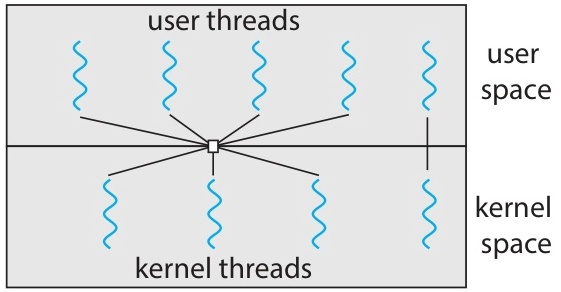

*Silberschatz, Figure 4.10 — 두 수준 모델*

**다대다** + **일대일** 허용

- 대부분의 사용자 스레드는 다대다로 관리한다
- 특정 **중요 스레드** 는 커널 스레드에 **직접 바인딩** 할 수 있다
  - 예: 실시간 처리가 필요한 스레드

> 실제로는 구현 복잡성 때문에 일대일이 표준이 되었고, 다대다는 일부 동시성 라이브러리 내부에서 사용된다

### 5.5 멀티스레딩 모델 요약

| 모델 | 매핑 | 장점 | 단점 | 사용 OS |
|------|-----|------|------|--------|
| 다대일 | N:1 | 관리 효율적 | 블로킹 시 전체 프로세스 블록, 병렬성 없음 | 과거 Solaris |
| **일대일** | 1:1 | 높은 동시성, 병렬 실행 | 스레드 수 제한(오버헤드) | **Linux, Windows** |
| 다대다 | N:M | 유연, 병렬 + 넌블로킹 | 구현 복잡 | 일부 라이브러리 |
| 두 수준 | N:M + 1:1 | 유연 + 중요 스레드 바인딩 | 구현 복잡 | 과거 Solaris, IRIX |

핵심:
- 프로세싱 코어가 늘어나면서 커널 스레드 수 제한이 덜 중요해졌다
- 대부분의 현대 OS는 **일대일** 모델을 채택한다

> **참고:** Go 언어의 고루틴(goroutine)은 현대적 다대다 모델의 예시이다. 수천~수백만 개의 고루틴이 소수의 OS 스레드에 매핑되어 실행된다. Java도 JDK 21부터 가상 스레드(Virtual Threads, Project Loom)를 도입하여 유사한 방식을 지원한다.

---

<br>

## 6. 스레드 라이브러리

### 6.1 스레드 라이브러리 개요

**스레드 라이브러리(Thread library)** = 스레드 생성 및 관리를 위한 **API** 를 제공한다.

두 가지 구현 방식:

**1. 사용자 수준 라이브러리 (사용자 공간)**
- 모든 코드와 데이터 구조가 사용자 공간에 위치한다
- 라이브러리 함수 호출 = **로컬 함수 호출** (시스템 콜이 아니다)

**2. 커널 수준 라이브러리 (커널 공간)**
- 코드와 데이터 구조가 커널 공간에 위치한다
- 라이브러리 함수 호출 = **시스템 콜**

세 가지 주요 스레드 라이브러리:
1. **POSIX Pthreads** — 사용자 수준 또는 커널 수준
2. **Windows Threads** — 커널 수준
3. **Java Threads** — JVM 위에서 실행, 호스트 OS의 라이브러리 사용

### 6.2 비동기 스레딩 vs 동기 스레딩

두 가지 주요 스레드 생성 전략:

**비동기 스레딩 (Asynchronous Threading)**
- 부모 스레드가 자식 스레드를 생성하면 **독립적으로** 실행한다
- 부모와 자식 간 **데이터 공유가 거의 없다**
- 예: 멀티스레드 웹 서버 — 각 요청을 독립적인 스레드가 처리

**동기 스레딩 (Synchronous Threading)**
- 부모 스레드가 모든 자식 스레드의 **완료를 대기(join)** 한다
- 자식 스레드가 완료 시 부모에게 **결과를 전달** 한다
- 작업 간 **상당한 데이터 공유** 가 있다
- 예: 병렬 합산 — 부모가 각 스레드의 부분합을 병합

> 이 장의 모든 예제는 **동기 스레딩** 패턴을 따른다.

### 6.3 Pthreads 개요

**POSIX Pthreads** = IEEE 1003.1c 표준

> 이것은 **명세(specification)** 이지 **구현(implementation)** 이 아니다
> OS 설계자가 자유롭게 구현 방식을 선택할 수 있다

주요 API 함수:

| 함수 | 설명 |
|------|------|
| `pthread_create()` | 새 스레드 생성 |
| `pthread_join()` | 스레드 종료 대기 |
| `pthread_exit()` | 현재 스레드 종료 |
| `pthread_attr_init()` | 스레드 속성 초기화 |

지원 환경: UNIX, Linux, macOS
- Windows는 네이티브 지원하지 않는다 (서드파티 구현 존재)

### 6.4 Pthreads 예제 — 정수 합산 (Figure 4.11)

```c
#include <pthread.h>
#include <stdio.h>
#include <stdlib.h>

int sum;  /* 전역 변수: 스레드 간 공유 데이터 */
void *runner(void *param);  /* 스레드가 실행할 함수 */

int main(int argc, char *argv[])
{
    pthread_t tid;           /* 스레드 식별자 */
    pthread_attr_t attr;     /* 스레드 속성 */

    pthread_attr_init(&attr);           /* 기본 속성 초기화 */
    pthread_create(&tid, &attr,         /* 스레드 생성 */
                   runner, argv[1]);
    pthread_join(tid, NULL);            /* 스레드 완료 대기 */

    printf("sum = %d\n", sum);
}

void *runner(void *param)
{
    int i, upper = atoi(param);
    sum = 0;
    for (i = 1; i <= upper; i++)
        sum += i;
    pthread_exit(0);  /* 스레드 종료 */
}
```

**실행 흐름** (입력 = 5):

1. `main()`에서 `pthread_attr_init(&attr)` — 기본 속성 설정
2. `pthread_create(&tid, &attr, runner, argv[1])`
   - 새 스레드 생성, `runner("5")`에서 실행 시작
3. `pthread_join(tid, NULL)` — 부모가 자식 완료까지 **대기**
4. 자식 스레드 (`runner`):
   - `upper = 5`, sum = 1+2+3+4+5 = **15**
   - `pthread_exit(0)`으로 종료
5. 부모: `printf("sum = %d\n", sum)` → **"sum = 15"** 출력

**핵심 포인트:**
- `sum`은 **전역 변수** → 모든 스레드가 공유한다
- `pthread_join()` 없이는 부모가 먼저 종료될 수 있다
- `runner()`는 `void *` 매개변수를 받고 `void *`를 반환한다

### 6.5 Pthreads — 여러 스레드 생성과 조인

**여러 스레드 조인 패턴 (Figure 4.12):**

```c
#define NUM_THREADS 10

pthread_t workers[NUM_THREADS];

/* 스레드 생성 */
for (int i = 0; i < NUM_THREADS; i++)
    pthread_create(&workers[i], NULL, task_func, &args[i]);

/* 모든 스레드 완료 대기 */
for (int i = 0; i < NUM_THREADS; i++)
    pthread_join(workers[i], NULL);
```

- 생성 루프와 조인 루프가 **분리** 되어 있다
- 모든 스레드가 **병렬로** 실행된 후 순차적으로 조인된다
- 멀티코어 시스템에서 흔히 사용되는 패턴이다

### 6.6 pthread_create() 상세

```c
int pthread_create(
    pthread_t *thread,             /* 스레드 ID를 저장할 변수 */
    const pthread_attr_t *attr,    /* 스레드 속성 (NULL = 기본값) */
    void *(*start_routine)(void*), /* 스레드가 실행할 함수 */
    void *arg                      /* 함수에 전달할 인자 */
);
```

**매개변수 설명:**

| 매개변수 | 역할 |
|---------|------|
| `thread` | 새로 생성된 스레드의 ID를 저장한다 |
| `attr` | 스택 크기, 스케줄링 정보 등 (NULL이면 기본값) |
| `start_routine` | `void *func(void *param)` 형태의 함수 포인터 |
| `arg` | start_routine에 전달될 인자 (void * 타입) |

> `void *(*start_routine)(void*)` 선언 읽는 법: `start_routine`은 `void *` 매개변수를 받고 `void *`를 반환하는 함수의 포인터이다. `void *` 타입은 제네릭 포인터(generic pointer) 역할을 한다 — 어떤 데이터 타입이든 가리킬 수 있다.

반환값: 성공 시 0, 실패 시 오류 번호

### 6.7 Windows 스레드 예제 (Figure 4.13)

Windows는 고유한 타입 별칭을 정의한다: `DWORD` (32비트 부호 없는 정수), `HANDLE` (불투명한 OS 자원 식별자), `LPVOID` (`void *`와 동일), `WINAPI` (호출 규약 키워드 — 장식으로 취급하면 된다).

```c
#include <windows.h>
#include <stdio.h>

DWORD Sum;  /* 공유 데이터 (부호 없는 32비트 정수) */

DWORD WINAPI Summation(LPVOID Param)
{
    DWORD Upper = *(DWORD*)Param;
    for (DWORD i = 1; i <= Upper; i++)
        Sum += i;
    return 0;
}

int main(int argc, char *argv[])
{
    DWORD ThreadId;
    HANDLE ThreadHandle;
    int Param = atoi(argv[1]);

    ThreadHandle = CreateThread(
        NULL,        /* 기본 보안 속성 */
        0,           /* 기본 스택 크기 */
        Summation,   /* 스레드 함수 */
        &Param,      /* 스레드 함수에 전달할 매개변수 */
        0,           /* 기본 생성 플래그 */
        &ThreadId);  /* 스레드 식별자 반환 */

    WaitForSingleObject(ThreadHandle, INFINITE);
    CloseHandle(ThreadHandle);
    printf("sum = %d\n", Sum);
}
```

**Pthreads와 비교:**

| 범주 | Pthreads | Windows Threads |
|------|---------|-----------------|
| 헤더 | `<pthread.h>` | `<windows.h>` |
| 스레드 생성 | `pthread_create()` | `CreateThread()` |
| 종료 대기 | `pthread_join()` | `WaitForSingleObject()` |
| 다중 대기 | for 루프 + `pthread_join()` | `WaitForMultipleObjects()` |
| 스레드 종료 | `pthread_exit()` | `return 0;` 또는 `ExitThread()` |
| 핸들 정리 | 자동 | `CloseHandle()` 필요 |
| 공유 데이터 | 전역 변수 | 전역 변수 (DWORD 등) |

**WaitForMultipleObjects() 예시:**
```c
/* 배열 내 N개 스레드 핸들이 모두 완료될 때까지 대기 */
WaitForMultipleObjects(N, THandles, TRUE, INFINITE);
```

---

<br>

## 7. Java 스레드

> **참고:** Java 스레드는 Pthreads와의 비교를 위해 소개한다. 이 과목의 실습에서는 주로 Pthreads를 사용한다. 개념을 이해하는 데 집중하고, Java 문법은 부차적으로 참고하면 된다.

### 7.1 Java 스레드 개요

Java에서 스레드는 프로그램 실행의 **기본 모델** 이다.
- 모든 Java 프로그램은 최소 하나의 스레드(메인 스레드)에서 실행된다
- **JVM** 위에서 실행 → 호스트 OS의 스레드 라이브러리 사용
  - Windows → Windows API
  - Linux/macOS → Pthreads API

스레드 생성 방법 2가지:

1. **Thread 클래스를 상속** 하고 `run()`을 오버라이드
2. **Runnable 인터페이스를 구현** (더 일반적)

> Runnable 방식이 권장된다 — Java는 다중 상속을 지원하지 않기 때문이다

### 7.2 Runnable 인터페이스

**방법 1: Runnable 인터페이스 구현**

```java
class Task implements Runnable {
    public void run() {
        System.out.println("I am a thread.");
    }
}

// 스레드 생성 및 시작
Thread worker = new Thread(new Task());
worker.start();  // 새 스레드에서 run() 실행
```

`start()` 메서드의 역할:
1. JVM에서 새 스레드를 위한 **메모리를 할당하고 초기화** 한다
2. `run()` 메서드를 호출하여 스레드를 **실행 가능 상태(runnable)** 로 만든다

> 주의: `run()`을 직접 호출하면 **같은 스레드** 에서 실행된다!
> 새 스레드를 생성하려면 반드시 `start()`를 호출해야 한다.

### 7.3 람다 표현식

**방법 2: 람다 표현식 (Java 8+)**

람다 표현식(Lambda Expression)은 인라인으로 작성되는 간결한 익명 함수로, 별도의 클래스를 정의할 필요가 없다. 함수형 인터페이스(Functional Interface)는 추상 메서드가 정확히 하나인 인터페이스로, Java가 람다가 무엇을 구현해야 하는지 추론할 수 있게 한다.

Runnable은 추상 메서드가 하나뿐인 **함수형 인터페이스** 이다 → 람다 사용 가능

```java
// 람다로 간결하게 표현
Runnable task = () -> {
    System.out.println("I am a thread.");
};

Thread worker = new Thread(task);
worker.start();
```

더 간결하게:

```java
new Thread(() -> {
    System.out.println("I am a thread.");
}).start();
```

> 람다 표현식을 사용하면 별도의 클래스 정의 없이 인라인으로 스레드 작업을 정의할 수 있어 **코드가 간결** 해진다.

### 7.4 join()

부모 스레드가 자식 스레드의 완료를 기다리려면 `join()`을 사용한다:

```java
Thread worker = new Thread(new Task());
worker.start();

try {
    worker.join();  // worker가 끝날 때까지 대기
} catch (InterruptedException ie) {
    // 대기 중 인터럽트 처리
}

System.out.println("Worker finished!");
```

**여러 스레드 조인 패턴:**

```java
Thread[] workers = new Thread[10];
for (int i = 0; i < 10; i++) {
    workers[i] = new Thread(new Task());
    workers[i].start();
}
for (int i = 0; i < 10; i++) {
    try { workers[i].join(); }
    catch (InterruptedException ie) { }
}
```

### 7.5 Pthreads/Windows와 비교

| 범주 | Pthreads (C) | Windows (C) | Java |
|------|-------------|-------------|------|
| 생성 | `pthread_create()` | `CreateThread()` | `new Thread().start()` |
| 대기 | `pthread_join()` | `WaitForSingleObject()` | `thread.join()` |
| 종료 | `pthread_exit()` | `return` / `ExitThread()` | `run()` 반환 |
| 공유 데이터 | 전역 변수 | 전역 변수 | **객체 필드** (전역 변수 없음) |
| 결과 반환 | 어려움 (`void *`) | 어려움 | **Callable/Future** |

Java의 특징:
- **전역 데이터 개념이 없다**
- 스레드 간 데이터 공유는 **객체를 통해 명시적으로 설정** 한다
- JVM 내부적으로 호스트 OS의 스레드 라이브러리를 사용한다

---

<br>

## 8. Java Executor 프레임워크

### 8.1 Executor 개요

Java 5부터 `java.util.concurrent` 패키지에서 제공한다.

**Executor 인터페이스:**
```java
public interface Executor {
    void execute(Runnable command);
}
```

전통적 방식과의 차이:
```java
// 전통적: 스레드를 직접 생성
Thread t = new Thread(new Task());
t.start();

// Executor 방식: 스레드 생성과 실행을 분리
Executor service = new SomeExecutor();
service.execute(new Task());
```

> **생산자-소비자 모델**: 작업(Runnable)을 생산하고, 스레드가 이를 소비하여 실행한다. 생산자-소비자 모델(Producer-Consumer Model)은 프로그램의 한 부분이 작업 항목을 생성(생산자)하고 다른 부분이 실행(소비자)하는 패턴이다 — 여기서 사용자 코드가 `Runnable` 태스크를 생산하고 스레드 풀의 스레드가 소비하여 실행한다.

> **[프로그래밍언어]** Executor 패턴은 **전략 패턴(Strategy Pattern)** 의 한 예이다. 작업(무엇을 할지)과 실행 전략(어떻게 실행할지)을 분리함으로써, 동일한 작업을 단일 스레드, 스레드 풀, 스케줄링 등 다양한 방식으로 실행할 수 있다.

### 8.2 스레드 풀 유형

`Executors` 클래스의 팩토리 메서드:

| 메서드 | 설명 |
|--------|------|
| `newSingleThreadExecutor()` | 크기 1인 스레드 풀 — 순차 실행 보장 |
| `newFixedThreadPool(int n)` | n개 스레드로 구성된 고정 풀 유지 |
| `newCachedThreadPool()` | 필요에 따라 스레드 생성, 유휴 스레드 **재사용** |

```java
// 고정 스레드 풀 예시
ExecutorService pool = Executors.newFixedThreadPool(4);

for (int i = 0; i < 100; i++) {
    pool.execute(new Task());  // 100개 작업, 4개 스레드가 처리
}

pool.shutdown();  // 모든 작업 완료 후 풀 종료
```

> 스레드 풀을 사용하면 스레드 생성/소멸 비용을 줄이고 동시 스레드 수를 **제한** 할 수 있다.

### 8.3 스레드 풀의 장점

**1. 기존 스레드 재사용으로 빠른 응답**
- 매번 스레드를 생성하는 비용을 절약한다
- 이미 존재하는 스레드가 즉시 작업을 수행한다

**2. 스레드 수 제한**
- 과도한 시스템 자원 사용을 방지한다
- 고정 풀: 최대 n개의 스레드만 동시 실행한다

**3. 작업과 실행 메커니즘의 분리**
- 작업 정의(무엇을 할지)와 실행 전략(어떻게 실행할지)을 분리한다
- 지연 실행, 주기 실행 등 다양한 전략이 가능하다

> 풀 크기는 **CPU 수, 메모리, 예상 동시 요청 수** 를 고려하여 설정해야 한다

### 8.4 Callable과 Future — 결과 반환

**문제**: Runnable의 `run()`은 반환값이 없다 (`void`)

**해결**: `Callable<V>` 인터페이스 + `Future<V>` 사용

```java
import java.util.concurrent.*;

class Summation implements Callable<Integer> {
    private int upper;

    public Summation(int upper) {
        this.upper = upper;
    }

    public Integer call() {
        int sum = 0;
        for (int i = 1; i <= upper; i++)
            sum += i;
        return new Integer(sum);
    }
}
```

- `Callable`의 `call()` 메서드는 **결과를 반환** 할 수 있다
- 반환된 결과는 `Future` 객체를 통해 수신한다

**전체 예시 (Figure 4.14):**

```java
import java.util.concurrent.*;

class Summation implements Callable<Integer> {
    private int upper;
    public Summation(int upper) { this.upper = upper; }

    public Integer call() {
        int sum = 0;
        for (int i = 1; i <= upper; i++)
            sum += i;
        return new Integer(sum);
    }
}

public class Driver {
    public static void main(String[] args) {
        int upper = Integer.parseInt(args[0]);
        ExecutorService pool =
            Executors.newSingleThreadExecutor();
        Future<Integer> result =
            pool.submit(new Summation(upper));

        try {
            System.out.println("sum = " + result.get());
        } catch (InterruptedException |
                 ExecutionException ie) { }
    }
}
```

- `submit()` → 작업을 제출하고 **Future** 를 반환한다
- `result.get()` → 결과가 준비될 때까지 **블록** 한다

### 8.5 execute() vs submit()

| 메서드 | 매개변수 | 반환값 | 사용 시점 |
|--------|---------|--------|------|
| `execute(Runnable)` | Runnable | 없음 (`void`) | 결과가 필요 없는 작업 |
| `submit(Callable)` | Callable | `Future<V>` | **결과가 필요한** 작업 |
| `submit(Runnable)` | Runnable | `Future<?>` | 완료 상태만 확인 |

**스레드 풀 예시 (Figure 4.15):**

```java
import java.util.concurrent.*;

public class ThreadPoolExample {
    public static void main(String[] args) {
        int numTasks = Integer.parseInt(args[0].trim());
        ExecutorService pool = Executors.newCachedThreadPool();

        for (int i = 0; i < numTasks; i++)
            pool.execute(new Task());

        pool.shutdown();  // 새 작업 거부, 기존 작업 완료 후 종료
    }
}
```

### 8.6 JVM과 호스트 OS의 관계

```text
 ┌──────────────────────────────┐
 │       Java 애플리케이션         │
 │  (Thread, Executor, ...)     │
 ├──────────────────────────────┤
 │            JVM               │
 │  Java 스레드 API 구현           │
 ├──────────────────────────────┤
 │       호스트 운영체제            │
 │  Windows → Windows API       │
 │  Linux/macOS → Pthreads      │
 └──────────────────────────────┘
```

- JVM 명세는 Java 스레드를 OS에 **어떻게 매핑** 하는지 규정하지 않는다
- 구현에 따라 다르다:
  - **Windows**: 일대일 모델 → 각 Java 스레드가 커널 스레드에 매핑
  - **Linux/macOS**: Pthreads API를 사용하여 매핑
- 결과적으로 Java 스레드도 **OS 스케줄러** 의 관리를 받는다

---

<br>

## 9. 실습 — Pthreads 멀티스레드 프로그래밍

### 9.1 실습 개요: 배열 합산을 여러 스레드로 분할

**목표**: 1000개 원소의 배열 합산을 4개 스레드로 분할

**데이터 병렬성 적용:**
- 스레드 0: [0] ~ [249] 합산
- 스레드 1: [250] ~ [499] 합산
- 스레드 2: [500] ~ [749] 합산
- 스레드 3: [750] ~ [999] 합산

```text
 Array: [  0 ~ 249  |  250 ~ 499  |  500 ~ 749  |  750 ~ 999  ]
              ↓             ↓              ↓              ↓
           Thread 0      Thread 1       Thread 2       Thread 3
          partial[0]    partial[1]     partial[2]     partial[3]
              ↘             ↓              ↓            ↙
                                Total Sum
```

### 9.2 스레드 함수 구현

```c
#include <pthread.h>
#include <stdio.h>

#define NUM_THREADS 4
#define ARRAY_SIZE  1000

int array[ARRAY_SIZE];
int partial_sum[NUM_THREADS];

void *sum_array(void *arg)
{
    int id    = *(int *)arg;
    int chunk = ARRAY_SIZE / NUM_THREADS;
    int start = id * chunk;
    int end   = start + chunk;

    partial_sum[id] = 0;
    for (int i = start; i < end; i++)
        partial_sum[id] += array[i];

    printf("Thread %d: partial_sum = %d\n",
           id, partial_sum[id]);
    pthread_exit(NULL);
}
```

- 각 스레드는 `id`에 따라 배열의 **서로 다른 구간** 을 담당한다
- 결과는 `partial_sum[id]`에 저장된다 (스레드마다 **별도 인덱스**)

### 9.3 메인 함수

```c
int main()
{
    pthread_t threads[NUM_THREADS];
    int thread_ids[NUM_THREADS];

    /* 배열 초기화: array[i] = i + 1 */
    for (int i = 0; i < ARRAY_SIZE; i++)
        array[i] = i + 1;

    /* 스레드 생성 */
    for (int i = 0; i < NUM_THREADS; i++) {
        thread_ids[i] = i;
        pthread_create(&threads[i], NULL,
                       sum_array, &thread_ids[i]);
    }

    /* 모든 스레드 대기 및 결과 누적 */
    int total = 0;
    for (int i = 0; i < NUM_THREADS; i++) {
        pthread_join(threads[i], NULL);
        total += partial_sum[i];
    }

    printf("Total sum = %d\n", total);
    /* 기댓값: 1+2+...+1000 = 500500 */
    return 0;
}
```

### 9.4 코드 분석

**실행 흐름:**
1. `array[i] = i + 1` → [1, 2, 3, ..., 1000]
2. 4개 스레드 생성, 각각 250개 원소를 담당
3. 스레드 0: 1+2+...+250 = 31375
4. 스레드 1: 251+252+...+500 = 93875
5. 스레드 2: 501+502+...+750 = 156375
6. 스레드 3: 751+752+...+1000 = 218875
7. `pthread_join()`으로 모든 스레드 완료 대기
8. 합계 = 31375 + 93875 + 156375 + 218875 = **500500**

**컴파일 및 실행:**
```text
gcc -pthread lab_sum.c -o lab_sum
./lab_sum
```

> `-pthread` 플래그가 필요하다 (Pthreads 라이브러리 링크)

### 9.5 thread_ids 배열이 필요한 이유

**잘못된 코드** (흔한 실수):
```c
for (int i = 0; i < NUM_THREADS; i++) {
    pthread_create(&threads[i], NULL,
                   sum_array, &i);  /* 위험! */
}
```

**문제점:**
- 모든 스레드가 **변수 `i`의 같은 주소** 를 공유한다
- 스레드가 실행될 때 `i`의 값이 이미 바뀌어 있을 수 있다
- 예: 4개 스레드 모두 `id = 4`를 읽을 수 있다

**올바른 코드:**
```c
int thread_ids[NUM_THREADS];
for (int i = 0; i < NUM_THREADS; i++) {
    thread_ids[i] = i;  /* 각 스레드별 별도 변수 */
    pthread_create(&threads[i], NULL,
                   sum_array, &thread_ids[i]);
}
```

> 이것은 **데이터 의존성** 문제의 고전적 예시이다.

> **시험 팁:** "왜 `&i`를 직접 전달하면 안 되는가?"는 Pthreads 관련 시험 문제로 자주 출제된다. 핵심은 `pthread_create()`가 비동기적으로 스레드를 생성하기 때문에, 스레드가 실제로 `*(int*)arg`를 읽는 시점에서 `i`의 값이 이미 변경되어 있을 수 있다는 것이다.

### 9.6 경쟁 조건 관찰

> 두 사람이 동시에 같은 은행 계좌 잔액을 확인하고 각각 1만 원을 인출한다고 상상해보자. 둘 다 5만 원을 보고, 둘 다 인출하지만, 하나의 인출만 기록된다 — 은행이 돈을 잃게 된다.

`partial_sum[id]` 대신 모든 스레드가 **단일 전역 변수** 를 공유하면?

```c
int global_sum = 0;  /* 모든 스레드가 공유 */

void *sum_array_bad(void *arg) {
    int id    = *(int *)arg;
    int start = id * (ARRAY_SIZE / NUM_THREADS);
    int end   = start + (ARRAY_SIZE / NUM_THREADS);

    for (int i = start; i < end; i++)
        global_sum += array[i];  /* 경쟁 조건! */

    pthread_exit(NULL);
}
```

**경쟁 조건(Race Condition)** 이 발생한다:
- `global_sum += array[i]`는 읽기-수정-쓰기의 3단계 연산이다
- 여러 스레드가 동시에 실행하면 **값이 손실** 될 수 있다
- 여러 번 실행하면 **다른 결과** 가 나올 수 있다

> 동기화는 Ch 6과 Ch 7에서 자세히 다룬다

> **핵심:** 경쟁 조건의 근본 원인은 `global_sum += array[i]`가 **원자적(atomic) 연산이 아니기 때문** 이다. 이 한 줄의 C 코드는 실제로 (1) `global_sum`을 레지스터로 읽기(LOAD), (2) `array[i]`를 더하기(ADD), (3) 결과를 `global_sum`에 쓰기(STORE)의 세 단계로 실행된다. 두 스레드가 동시에 같은 값을 읽으면 한쪽의 업데이트가 덮어씌워진다.

### 9.7 Pthreads 정수 합산 (교재 예제 변형)

명령줄 인자로 받은 정수를 합산한다:

```c
#include <pthread.h>
#include <stdio.h>
#include <stdlib.h>

int sum = 0;

void *runner(void *param)
{
    int upper = atoi(param);
    for (int i = 1; i <= upper; i++)
        sum += i;
    pthread_exit(0);
}

int main(int argc, char *argv[])
{
    if (argc != 2) {
        fprintf(stderr, "Usage: %s <integer>\n", argv[0]);
        return 1;
    }
    pthread_t tid;
    pthread_attr_t attr;
    pthread_attr_init(&attr);
    pthread_create(&tid, &attr, runner, argv[1]);
    pthread_join(tid, NULL);
    printf("sum = %d\n", sum);
    return 0;
}
```

실행: `./a.out 10` → "sum = 55"

### 9.8 실습 핵심 정리

**기본 Pthreads 패턴:**
1. `pthread_attr_init()` — 속성 초기화 (기본값으로 충분)
2. `pthread_create()` — 스레드 생성 (함수 포인터 + 인자)
3. 스레드 함수에서 작업 수행 (전역 변수로 결과 공유)
4. `pthread_join()` — 종료 대기
5. 결과 수집 및 출력

**주의사항:**
- 스레드 함수에 인자 전달 시 **별도 변수** 를 사용해야 한다 (경쟁 조건 방지)
- 공유 변수 접근 시 **동기화** 가 필요하다 (이 실습에서는 별도 인덱스 사용으로 회피)
- 컴파일 시 `-pthread` 플래그가 필요하다

---

<br>

## 요약

| 개념 | 핵심 정리 |
|:-----|:---------|
| 스레드 | 프로세스 내 실행 단위; 코드/데이터/파일 공유; PC/레지스터/스택은 독립 |
| 스레드의 이점 | 응답성, 자원 공유, 경제성, 확장성 |
| 멀티코어 프로그래밍 | 동시성 vs 병렬성; 5가지 과제 (작업 식별, 균형, 데이터 분할, 데이터 의존성, 테스트) |
| 암달의 법칙 | 순차 비율이 병목 — speedup ≤ 1/S; N → ∞이어도 1/S를 초과할 수 없다 |
| 데이터 병렬성 vs 작업 병렬성 | 데이터를 분할하여 같은 연산 vs 서로 다른 작업을 분배 |
| 멀티스레딩 모델 | 다대일(거의 미사용), **일대일**(Linux, Windows), 다대다(복잡) |
| Pthreads | `pthread_create()`, `pthread_join()`, `pthread_exit()`; POSIX 표준 |
| Windows Threads | `CreateThread()`, `WaitForSingleObject()`, `CloseHandle()` |
| Java Threads | `Runnable`, `Thread.start()`, `Thread.join()`, 람다 |
| Java Executor 프레임워크 | 스레드 풀로 작업과 실행 분리; `Callable`/`Future`로 결과 반환 |
| 경쟁 조건 | 공유 변수에 대한 비원자적 읽기-수정-쓰기 시 발생; 동기화 필요 (Ch 6) |
| 교재 범위 | Silberschatz Ch 4, Sections 4.1–4.4 |

---


<br>

## 점검 문제

1. 같은 프로세스의 스레드들이 공유하는 것은 무엇이고, 각 스레드가 독립적으로 소유하는 것은 무엇인가?
2. 같은 프로세스 내의 스레드 전환에서 TLB 플러시(flush)가 필요 없는 이유는 무엇인가?
3. 프로그램의 직렬 코드 비율이 20%일 때, 암달의 법칙에 따라 8코어에서의 최대 속도 향상은 얼마인가? 무한 코어에서는?
4. 동시성(Concurrency)과 병렬성(Parallelism)의 차이를 예시와 함께 설명하라.
5. 일대일(One-to-One) 멀티스레딩 모델이 사용자 스레드마다 커널 스레드를 생성하는 오버헤드가 있음에도 현대 운영체제에서 가장 널리 사용되는 이유는 무엇인가?

---
