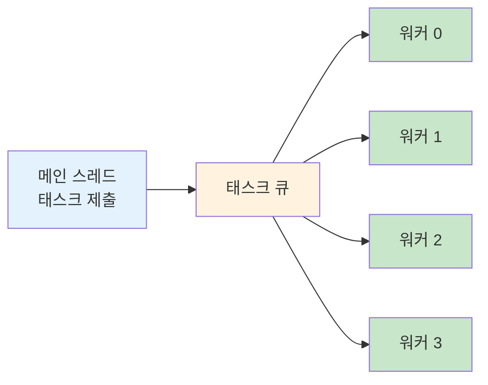
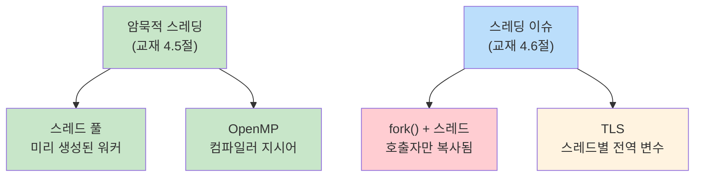

# 5주차 실습 — 암묵적 스레딩과 스레딩 이슈

> **최종 수정일:** 2026-04-02

> **선수 지식**: 5주차 이론 개념 (암묵적 스레딩, 스레딩 이슈). `-pthread` 및 `-fopenmp` 플래그로 C를 컴파일할 수 있는 능력.
>
> **학습 목표**: 이 실습을 완료하면 다음을 할 수 있어야 한다:
> 1. 태스크 큐와 미리 생성된 워커 스레드를 사용하여 스레드 풀을 구현할 수 있다
> 2. OpenMP 컴파일러 지시어를 사용하여 루프를 자동 병렬화할 수 있다
> 3. 다중 스레드 프로그램에서 fork()가 호출 스레드만 복제하는 이유를 설명할 수 있다
> 4. 스레드 로컬 저장소(TLS)를 사용하여 전역 상태의 경쟁 조건을 방지할 수 있다

---

## 목차

- [1. 실습 개요](#1-실습-개요)
- [2. 실습 1: 스레드 풀](#2-실습-1-스레드-풀)
- [3. 실습 2: OpenMP 병렬화](#3-실습-2-openmp-병렬화)
- [4. 실습 3: 다중 스레드 프로그램에서의 fork()](#4-실습-3-다중-스레드-프로그램에서의-fork)
- [5. 실습 4: 스레드 로컬 저장소 (TLS)](#5-실습-4-스레드-로컬-저장소-tls)
- [요약](#요약)
- [부록](#부록)

---

<br>

## 1. 실습 개요

- **목표**: 암묵적 스레딩 기법을 실습하고 일반적인 스레딩 이슈를 이해한다.
- **소요 시간**: 약 50분 · 실습 4개
- **주제**: 스레드 풀(Thread Pool), OpenMP, 스레드와 `fork()`, 스레드 로컬 저장소(TLS)


**전체 빌드**:

```bash
cd examples/
gcc -Wall -pthread -o lab1_thread_pool   lab1_thread_pool.c
gcc -Wall -fopenmp -o lab2_openmp_parallel lab2_openmp_parallel.c
gcc -Wall -pthread -o lab3_fork_threads  lab3_fork_threads.c
gcc -Wall -pthread -o lab4_tls           lab4_tls.c
```

> **참고:** 실습 1, 3, 4는 POSIX 스레드를 위해 `-pthread`를 사용한다. 실습 2는 OpenMP 컴파일러 지시어를 활성화하기 위해 `-fopenmp`를 사용한다. macOS에서는 `brew install libomp`를 설치하고 기본 `clang` 대신 `gcc-13`(또는 이후 버전)을 사용해야 할 수 있다.

---

<br>

## 2. 실습 1: 스레드 풀

**목표**: 미리 생성된 워커 스레드로 태스크 큐를 구현한다 (교재 4.5.1절).

```bash
./lab1_thread_pool    # 4개 워커가 12개 태스크 처리
```

### 왜 스레드 풀인가?

요청마다 새 스레드를 생성하는 것은 비용이 크다. 스레드 풀은 고정 개수의 워커 스레드를 미리 생성하여 태스크를 대기하게 한다:



**스레드 풀의 세 가지 장점**:

| 장점 | 설명 |
|------|------|
| 빠른 응답 | 기존 스레드 재사용 — 생성 오버헤드 없음 |
| 동시성 제한 | 스레드 수를 제한하여 자원 고갈 방지 |
| 태스크/실행 분리 | *무엇을* 실행할지와 *어떻게* 실행할지를 분리 |

### 핵심 코드 패턴

```c
void *worker_thread(void *arg) {
    while (1) {
        pthread_mutex_lock(&pool.lock);
        while (pool.count == 0 && !pool.shutdown)
            pthread_cond_wait(&pool.not_empty, &pool.lock);  // 작업 대기
        if (pool.shutdown && pool.count == 0) { unlock; break; }
        task = dequeue();
        pthread_cond_signal(&pool.not_full);  // 슬롯 확보
        pthread_mutex_unlock(&pool.lock);
        task.function(task.arg);              // 락 외부에서 실행
    }
}
```

**패턴**: 생산자(메인)가 태스크 제출 → 큐 → 소비자(워커)가 실행

- 큐가 비면 워커는 수면 상태 (`pthread_cond_wait`로 바쁜 대기 없음)
- 종료: 플래그 설정 + `pthread_cond_broadcast`로 모든 수면 워커를 깨움
- Java의 `ExecutorService.newFixedThreadPool(4)`과 비교해 볼 것

> **[자료구조]** 여기서 태스크 큐는 뮤텍스로 보호되는 **유한 원형 버퍼(Bounded Circular Buffer)** 이다. 생산자-소비자 조율에는 두 개의 조건 변수(`not_empty`와 `not_full`)를 사용한다 — 동시성 자료구조에서 학습한 것과 동일한 패턴이다.

> **핵심:** 워커는 `task.function(task.arg)`를 **임계 구역 바깥** 에서 실행한다 (`pthread_mutex_unlock`이 먼저). 이렇게 하면 동시성이 극대화된다 — 락은 공유 큐에 접근할 때만 보유하고, 태스크 실행 중에는 보유하지 않는다.

---

<br>

## 3. 실습 2: OpenMP 병렬화

**목표**: 컴파일러 지시어를 사용한 암묵적 스레딩 (교재 4.5.3절).

```bash
./lab2_openmp_parallel
OMP_NUM_THREADS=2 ./lab2_openmp_parallel   # 스레드 수 지정
```

### 순차 vs 병렬

**순차 코드**:

```c
for (int i = 0; i < N; i++)
    sum += array[i];
```

**병렬 코드 (OpenMP)**:

```c
#pragma omp parallel for reduction(+:sum)
for (int i = 0; i < N; i++)
    sum += array[i];
```

`#pragma` 한 줄만 추가하면, 컴파일러가 루프 반복을 자동으로 스레드에 분배한다.

### 주요 지시어

| 지시어 | 효과 |
|--------|------|
| `#pragma omp parallel` | 스레드 팀 생성 |
| `#pragma omp parallel for` | 루프 반복을 스레드에 분배 |
| `reduction(+:var)` | 각 스레드가 사본을 갖고, 마지막에 합산 |

### `reduction`의 동작 원리

```text
reduction 없이:              reduction(+:sum) 사용:

Thread 0: sum += a[0]       Thread 0: local_sum0 += a[0]
Thread 1: sum += a[1]       Thread 1: local_sum1 += a[1]
         ↓                           ↓
   경쟁 조건 발생!            sum = local_sum0 + local_sum1
                                   (안전한 최종 합산)
```

> **[프로그래밍언어]** OpenMP는 **선언적(declarative)** 병렬성 모델이다 — 컴파일러에 *무엇을* 병렬화할지 알려주고, *어떻게* 할지는 지정하지 않는다. 런타임이 스레드 수, 스케줄링, 동기화를 결정한다. 4주차에서 모든 세부 사항을 직접 관리했던 **명령적(imperative)** `pthread_create` 접근법과 대비된다.

> **핵심:** `reduction` 없이 여러 스레드가 같은 `sum` 변수에 쓰면 경쟁 조건이 발생한다. `reduction` 절은 각 스레드에 사적 복사본을 주고, 루프 완료 후 안전하게 합산한다.

---

<br>

## 4. 실습 3: 다중 스레드 프로그램에서의 fork()

**목표**: `fork()`가 **호출 스레드만** 복제함을 관찰한다 (교재 4.6.1절).

```bash
./lab3_fork_threads
```

### 여러 스레드가 있을 때 fork()하면 무슨 일이 일어나는가?

```text
fork() 이전:                  fork() 이후:

부모 프로세스                 부모 프로세스        자식 프로세스
┌──────────────┐             ┌──────────────┐     ┌──────────────┐
│ 메인 스레드  │             │ 메인 스레드  │     │ 메인 스레드  │ (복사됨)
│ 스레드 1     │    fork()   │ 스레드 1     │     │              │ (없음!)
│ 스레드 2     │ ─────────→  │ 스레드 2     │     │              │ (없음!)
│ 스레드 3     │             │ 스레드 3     │     │              │ (없음!)
│ counter = 7  │             │ counter = 10 │     │ counter = 7  │ (고정됨)
└──────────────┘             └──────────────┘     └──────────────┘
```

**핵심 관찰**:

- **부모**: 모든 스레드가 살아있어 counter가 계속 증가
- **자식**: 스레드가 복사되지 않아 counter가 7에서 고정
- 자식 프로세스는 `fork()` 시점의 메모리 **스냅샷** 을 받지만, 다른 스레드는 포함되지 않음

### 왜 위험한가

다른 스레드가 `fork()` 시점에 뮤텍스를 보유하고 있었다면, 자식은 **잠긴 뮤텍스** 를 상속받지만 이를 해제할 스레드가 없다 — **교착 상태(Deadlock)** 발생.

**안전한 패턴**: `fork()` 직후에 `exec()`를 호출:

```c
pid_t pid = fork();
if (pid == 0) {
    // 자식: 즉시 exec() 호출
    execlp("/bin/ls", "ls", NULL);
}
```

`exec()` 호출은 전체 프로세스 이미지를 교체하므로, 상속된 잠긴 뮤텍스 문제가 사라진다.

> **[운영체제]** 2~3주차에서 `fork()`가 호출 프로세스의 복사본을 생성한다고 배웠다. 단일 스레드 프로세스에서는 모든 것이 복사된다. 그러나 다중 스레드 프로세스에서 POSIX는 호출 스레드만 복제하도록 명시한다. 이 설계는 스레드 동기화 상태를 복제하는 복잡성을 피하기 위한 것이지만, 자식이 `exec()`를 호출할 때까지 취약한 상태에 놓인다는 것을 의미한다.

> **시험 팁:** 다중 스레드 프로그램에서의 `fork()`는 자주 출제되는 주제이다. 기억할 것: 호출 스레드만 복사된다. 안전한 패턴은 `fork()` + 즉시 `exec()`.

---

<br>

## 5. 실습 4: 스레드 로컬 저장소 (TLS)

**목표**: `__thread`를 사용하여 스레드별 사적 전역 상태를 만든다 (교재 4.6.4절).

```bash
./lab4_tls
# shared_var = 287453 (기대값 400000) 경쟁 조건!
# 각 스레드의 tls_var는 100000 (항상 정확)
```

### 공유 전역 변수 vs 스레드 로컬

**공유 전역 변수**:

```c
int shared_var = 0;

// 모든 스레드: shared_var++
// 결과: 경쟁 조건 — 기대값보다 작은 값
```

**스레드 로컬**:

```c
__thread int tls_var = 0;

// 각 스레드: tls_var++
// 결과: 항상 정확 (스레드당 100000)
```

### TLS의 동작 원리

```text
메모리 배치:

shared_var: [     하나의 복사본 — 모든 스레드가 읽기/쓰기     ]
                     ↓ 경쟁 조건 발생

tls_var:    [ 스레드 0 복사본 ] [ 스레드 1 복사본 ] [ 스레드 2 복사본 ] [ 스레드 3 복사본 ]
                     ↓ 각 스레드가 자기 것만 사용 — 충돌 없음
```

`__thread` 키워드(GCC 확장; C11에서는 `_Thread_local`)는 컴파일러에 각 스레드를 위한 **별도의 인스턴스** 를 생성하도록 지시한다. 각 스레드가 자신의 복사본을 읽고 쓰므로 동기화가 필요 없다.

### 실제 사용 사례

대표적인 예시는 `errno` — C 라이브러리의 에러 코드이다:

```c
// errno는 TLS — 각 스레드가 고유한 에러 코드를 가짐
// 스레드 0이 read() 호출 → errno = EAGAIN
// 스레드 1이 open() 호출 → errno = ENOENT
// 서로 간섭하지 않음
```

> **핵심:** TLS는 함수 매개변수로 데이터를 전달하는 오버헤드 없이 스레드별 전역 상태가 필요할 때 유용하다. 다만 스레드가 진정으로 **독립적인** 복사본이 필요한 경우에만 동작한다. 스레드가 같은 데이터를 공유하고 조율해야 한다면, 적절한 동기화(뮤텍스, 6장에서 다룸)가 필요하다.

---

<br>

## 요약



| 실습 | 주제 | 핵심 내용 |
|:----|:-----|:---------|
| 실습 1 | 스레드 풀 | 워커가 큐에서 대기 — 스레드 재사용, 동시성 제한 |
| 실습 2 | OpenMP | `#pragma` 한 줄로 `reduction`을 활용한 자동 병렬화 |
| 실습 3 | fork() + 스레드 | 호출 스레드만 복사됨 — 즉시 `exec()` 호출 |
| 실습 4 | TLS | `__thread` = 스레드별 복사본, 락 불필요 |

---

<br>

## 부록

- 지난 주: Pthreads 기초 — 스레드 생성, 데이터 병렬성, 인자 전달, 암달의 법칙 (교재 4.1–4.4절)
- 다음 주: CPU 스케줄링 — 스케줄링 기준, FCFS, SJF, 우선순위, 라운드 로빈 (교재 5장)

---

<br>

## 자가 점검 문제

1. 태스크마다 새 스레드를 생성하는 대신 스레드 풀을 사용하는 세 가지 장점은 무엇인가?
2. OpenMP에서 `reduction(+:sum)` 절은 무엇을 하며, 왜 필요한가?
3. 다중 스레드 프로그램에서 `fork()`를 호출하면 자식 프로세스에는 몇 개의 스레드가 있는가? 이것이 왜 위험한가?
4. `__thread`(TLS)는 일반 전역 변수와 어떻게 다른가? 각각 언제 사용하는가?

---
