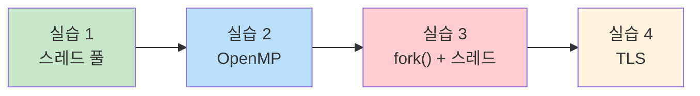
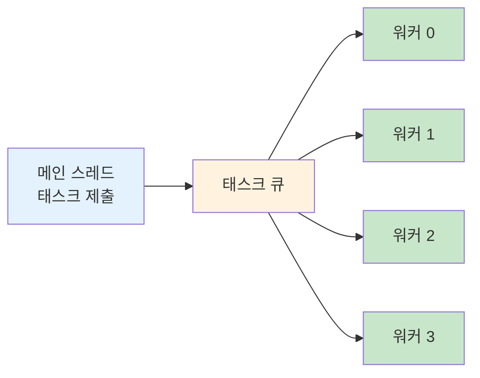
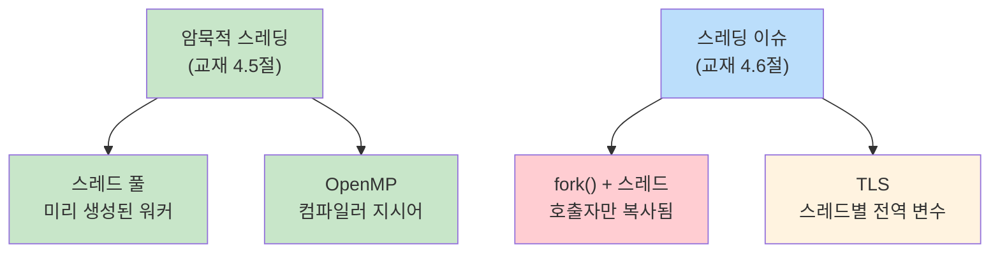

# 5주차 실습 — 암묵적 스레딩과 스레딩 이슈

> **최종 수정일:** 2026-04-09

> **선수 지식**: 5주차 이론 개념 (암묵적 스레딩, 스레딩 이슈). `-pthread` 및 `-fopenmp` 플래그로 C를 컴파일할 수 있는 능력.
>
> **학습 목표**: 이 실습을 완료하면 다음을 할 수 있어야 한다:
> 1. 태스크 큐와 미리 생성된 워커 스레드를 사용하여 스레드 풀을 구현할 수 있다
> 2. OpenMP 컴파일러 지시어를 사용하여 루프를 자동 병렬화할 수 있다
> 3. 다중 스레드 프로그램에서 fork()가 호출 스레드만 복제하는 이유를 설명할 수 있다
> 4. 스레드 로컬 저장소(TLS)를 사용하여 전역 상태의 경쟁 조건을 방지할 수 있다

---

## 목차

- [1. 실습 개요](#1-실습-개요)
- [2. 실습 1: 스레드 풀](#2-실습-1-스레드-풀)
- [3. 실습 2: OpenMP 병렬화](#3-실습-2-openmp-병렬화)
- [4. 실습 3: 다중 스레드 프로그램에서의 fork()](#4-실습-3-다중-스레드-프로그램에서의-fork)
- [5. 실습 4: 스레드 로컬 저장소 (TLS)](#5-실습-4-스레드-로컬-저장소-tls)
- [요약](#요약)
- [점검 문제](#점검-문제)

---

<br>

## 1. 실습 개요

- **목표**: 암묵적 스레딩 기법을 실습하고 일반적인 스레딩 이슈를 이해한다.
- **소요 시간**: 약 50분 · 실습 4개
- **주제**: 스레드 풀(Thread Pool), OpenMP, 스레드와 `fork()`, 스레드 로컬 저장소(TLS)



**전체 빌드**:

```bash
cd examples/
gcc -Wall -pthread -o lab1_thread_pool   lab1_thread_pool.c
gcc -Wall -fopenmp -o lab2_openmp_parallel lab2_openmp_parallel.c
gcc -Wall -pthread -o lab3_fork_threads  lab3_fork_threads.c
gcc -Wall -pthread -o lab4_tls           lab4_tls.c
```

> **참고:** 실습 1, 3, 4는 POSIX 스레드를 위해 `-pthread`를 사용한다. 실습 2는 OpenMP 컴파일러 지시어를 활성화하기 위해 `-fopenmp`를 사용한다. macOS에서는 `brew install libomp`를 설치하고 기본 `clang` 대신 `gcc-13`(또는 이후 버전)을 사용해야 할 수 있다.

---

<br>

## 2. 실습 1: 스레드 풀

**목표**: 미리 생성된 워커 스레드로 태스크 큐를 구현한다 (교재 4.5.1절).

```bash
./lab1_thread_pool    # 4개 워커가 12개 태스크 처리
```

### 왜 스레드 풀인가?

요청마다 새 스레드를 생성하는 것은 비용이 크다. 스레드 풀은 고정 개수의 워커 스레드를 미리 생성하여 태스크를 대기하게 한다:



**스레드 풀의 세 가지 장점**:

| 장점 | 설명 |
|------|------|
| 빠른 응답 | 기존 스레드 재사용 — 생성 오버헤드 없음 |
| 동시성 제한 | 스레드 수를 제한하여 자원 고갈 방지 |
| 태스크/실행 분리 | *무엇을* 실행할지와 *어떻게* 실행할지를 분리 |

### 자료 구조

```c
#define POOL_SIZE   4     /* 워커 스레드 수 */
#define QUEUE_SIZE  16    /* 큐의 최대 태스크 수 */

/* 태스크 = 함수 포인터 + 인자 */
/* void (*function)(int)은 함수 포인터이다 — int 매개변수 하나를 받고
   반환값이 없는(void) 함수의 주소를 저장한다.
   이를 통해 각 태스크가 어떤 함수를 실행할지 지정할 수 있다. */
struct task {
    void (*function)(int);
    int arg;
};

/* 스레드 풀 구조체 */
struct thread_pool {
    pthread_t workers[POOL_SIZE];

    struct task queue[QUEUE_SIZE];
    int head;           /* 디큐 인덱스 */
    int tail;           /* 인큐 인덱스 */
    int count;          /* 현재 태스크 수 */

    pthread_mutex_t lock;
    pthread_cond_t not_empty;   /* 태스크 추가 시 시그널 */
    pthread_cond_t not_full;    /* 태스크 제거 시 시그널 */
    int shutdown;               /* 1 = 풀 종료 중 */
};
```

### 워커 스레드 (소비자)

**조건 변수**(`pthread_cond_t`)는 조건이 참이 될 때까지 스레드를 수면시킨다. `pthread_cond_wait(&cv, &lock)`은 원자적으로 락을 해제하고 스레드를 수면시키며, 반환 전에 락을 재획득한다.

```c
void *worker_thread(void *arg)
{
    int id = *(int *)arg;
    printf("[Worker %d] started\n", id);

    while (1) {
        struct task t;

        pthread_mutex_lock(&pool.lock);

        /* 큐가 비어있고 종료 중이 아니면 대기 */
        while (pool.count == 0 && !pool.shutdown)
            pthread_cond_wait(&pool.not_empty, &pool.lock);

        if (pool.shutdown && pool.count == 0) {
            pthread_mutex_unlock(&pool.lock);
            break;
        }

        /* 태스크 디큐 */
        t = pool.queue[pool.head];
        pool.head = (pool.head + 1) % QUEUE_SIZE;
        pool.count--;
        pthread_cond_signal(&pool.not_full);

        pthread_mutex_unlock(&pool.lock);

        /* 락 외부에서 태스크 실행 */
        printf("[Worker %d] executing task(%d)\n", id, t.arg);
        t.function(t.arg);
    }

    printf("[Worker %d] exiting\n", id);
    return NULL;
}
```

> **왜 대기 루프에 `if` 대신 `while`을 사용하는가?** 조건 변수는 **가짜 깨어남(spurious wakeup)** 이 발생할 수 있다 — 시그널이 없어도 스레드가 깨어날 수 있다. `while`을 사용하면 조건을 재확인하여, 큐에 실제로 태스크가 있을 때만 진행한다.

### 태스크 제출 (생산자)

```c
void pool_submit(void (*function)(int), int arg)
{
    pthread_mutex_lock(&pool.lock);

    while (pool.count == QUEUE_SIZE)
        pthread_cond_wait(&pool.not_full, &pool.lock);

    pool.queue[pool.tail].function = function;
    pool.queue[pool.tail].arg = arg;
    pool.tail = (pool.tail + 1) % QUEUE_SIZE;
    pool.count++;
    pthread_cond_signal(&pool.not_empty);

    pthread_mutex_unlock(&pool.lock);
}
```

### 정상 종료

```c
void pool_shutdown(void)
{
    pthread_mutex_lock(&pool.lock);
    pool.shutdown = 1;
    pthread_cond_broadcast(&pool.not_empty);  /* 대기 중인 모든 워커 깨움 */
    pthread_mutex_unlock(&pool.lock);

    for (int i = 0; i < POOL_SIZE; i++)
        pthread_join(pool.workers[i], NULL);
}
```

**패턴**: 생산자(메인)가 태스크 제출 → 큐 → 소비자(워커)가 실행

- 큐가 비면 워커는 수면 상태 (`pthread_cond_wait`로 바쁜 대기 없음)
- 종료: 플래그 설정 + `pthread_cond_broadcast`로 모든 수면 워커를 깨움
- Java의 `ExecutorService.newFixedThreadPool(4)`과 비교해 볼 것

> **[자료구조]** 여기서 태스크 큐는 뮤텍스로 보호되는 **유한 원형 버퍼(Bounded Circular Buffer)** 이다. 생산자-소비자 조율에는 두 개의 조건 변수(`not_empty`와 `not_full`)를 사용한다 — 동시성 자료구조에서 학습한 것과 동일한 패턴이다.

> **핵심:** 워커는 `t.function(t.arg)`를 **임계 구역 바깥** 에서 실행한다 (`pthread_mutex_unlock`이 먼저). 이렇게 하면 동시성이 극대화된다 — 락은 공유 큐에 접근할 때만 보유하고, 태스크 실행 중에는 보유하지 않는다.

---

<br>

## 3. 실습 2: OpenMP 병렬화

**목표**: 컴파일러 지시어를 사용한 암묵적 스레딩 (교재 4.5.3절).

```bash
./lab2_openmp_parallel
OMP_NUM_THREADS=2 ./lab2_openmp_parallel   # 스레드 수 지정
```

이 실습은 단계적으로 진행되는 **3개의 데모** 로 구성되어 있다.

### 데모 1: Parallel Hello

가장 간단한 OpenMP 프로그램 — 각 스레드가 자신의 ID를 출력:

```c
#pragma omp parallel
{
    int tid = omp_get_thread_num();
    int total = omp_get_num_threads();
    printf("[Thread %d/%d] Hello from OpenMP!\n", tid, total);
}
```

`#pragma omp parallel` 지시어가 **스레드 팀** 을 생성한다. 각 스레드가 동일한 블록을 실행하지만, `omp_get_thread_num()`으로 고유한 ID를 얻는다.

### 데모 2: Parallel For와 속도 향상

`#pragma omp parallel for`로 배열 초기화를 병렬화:

```c
/* 순차 버전 */
t_start = omp_get_wtime();
for (int i = 0; i < ARRAY_SIZE; i++)
    array[i] = (double)i * 1.5;
t_end = omp_get_wtime();
printf("Sequential: %.4f sec\n", t_end - t_start);

/* 병렬 버전 */
t_start = omp_get_wtime();
#pragma omp parallel for
for (int i = 0; i < ARRAY_SIZE; i++)
    array[i] = (double)i * 1.5;
t_end = omp_get_wtime();
printf("Parallel:   %.4f sec\n", t_end - t_start);
```

> `omp_get_wtime()`은 이식성 있는 벽시계 시간 측정을 제공한다. 배열은 **5천만** 개 원소(`ARRAY_SIZE = 50000000`)로, 명확한 속도 향상을 관찰하기에 충분히 크다.

### 데모 3: Reduction

병렬 합산 — 가장 중요한 데모:

```c
/* 순차 합산 */
double sum_seq = 0.0;
for (int i = 0; i < ARRAY_SIZE; i++)
    sum_seq += array[i];

/* reduction을 사용한 병렬 합산 */
double sum_par = 0.0;
#pragma omp parallel for reduction(+:sum_par)
for (int i = 0; i < ARRAY_SIZE; i++)
    sum_par += array[i];
```

### 주요 지시어

| 지시어 | 효과 |
|--------|------|
| `#pragma omp parallel` | 스레드 팀 생성 |
| `#pragma omp parallel for` | 루프 반복을 스레드에 분배 |
| `reduction(+:var)` | 각 스레드가 사본을 갖고, 마지막에 합산 |

### `reduction`의 동작 원리

```text
reduction 없이:              reduction(+:sum) 사용:

Thread 0: sum += a[0]       Thread 0: local_sum0 += a[0]
Thread 1: sum += a[1]       Thread 1: local_sum1 += a[1]
         ↓                               ↓
   경쟁 조건 발생!             sum = local_sum0 + local_sum1
                                  (안전한 최종 합산)
```

> **[프로그래밍언어]** OpenMP는 **선언적(declarative)** 병렬성 모델이다 — 컴파일러에 *무엇을* 병렬화할지 알려주고, *어떻게* 할지는 지정하지 않는다. 런타임이 스레드 수, 스케줄링, 동기화를 결정한다. 4주차에서 모든 세부 사항을 직접 관리했던 **명령적(imperative)** `pthread_create` 접근법과 대비된다.

> **핵심:** `reduction` 없이 여러 스레드가 같은 `sum` 변수에 쓰면 경쟁 조건이 발생한다. `reduction` 절은 각 스레드에 사적 복사본을 주고, 루프 완료 후 안전하게 합산한다.

---

<br>

## 4. 실습 3: 다중 스레드 프로그램에서의 fork()

**목표**: `fork()`가 **호출 스레드만** 복제함을 관찰한다 (교재 4.6.1절).

```bash
./lab3_fork_threads
```

이 실습은 **2개의 데모** 로 구성된다: 첫 번째는 문제를 보여주고, 두 번째는 안전한 패턴을 보여준다.

### fork()의 두 가지 의미론

1. **모든** 스레드를 복제 (거의 사용되지 않음)
2. **호출 스레드만** 복제 (POSIX 기본값)

경험 법칙:
- 자식이 즉시 `exec()`를 호출하면 → 호출자만 복제 (안전)
- 자식이 실행을 계속하면 → 사라진 스레드/잠긴 락에 주의

### 데모 1: fork()는 호출 스레드만 복사한다

프로그램이 공유 카운터를 증가시키는 3개의 백그라운드 스레드를 생성한 후 `fork()`를 호출한다:

```c
volatile int counter = 0;

void *background_work(void *arg)
{
    int tid = *(int *)arg;
    while (1) {
        counter++;
        usleep(200000);  /* 200ms */
    }
    return NULL;
}
```

```text
 fork() 이전:                  fork() 이후:

 부모 프로세스                   부모 프로세스           자식 프로세스
┌──────────────┐             ┌──────────────┐     ┌──────────────┐
│ 메인 스레드     │             │ 메인 스레드     │     │ 메인 스레드    │ (복사됨)
│ 스레드 1       │    fork()   │ 스레드 1      │     │              │ (없음!)
│ 스레드 2       │ ─────────→  │ 스레드 2      │     │              │ (없음!)
│ 스레드 3       │             │ 스레드 3      │     │              │ (없음!)
│ counter = 7  │             │ counter = 10 │     │ counter = 7  │ (고정됨)
└──────────────┘             └──────────────┘     └──────────────┘
```

**핵심 관찰**:

- **부모**: 모든 스레드가 살아있어 counter가 계속 증가
- **자식**: 스레드가 복사되지 않아 counter가 7에서 고정
- 자식 프로세스는 `fork()` 시점의 메모리 **스냅샷** 을 받지만, 다른 스레드는 포함되지 않음

### 왜 위험한가

다른 스레드가 `fork()` 시점에 뮤텍스를 보유하고 있었다면, 자식은 **잠긴 뮤텍스** 를 상속받지만 이를 해제할 스레드가 없다 — **교착 상태(Deadlock)** 발생.

### 데모 2: fork() + exec() — 안전한 패턴

```c
pid_t pid = fork();
if (pid == 0) {
    /* 자식: 즉시 exec() 호출 */
    printf("[Child] About to exec 'echo'\n");
    execlp("echo", "echo", "Hello from exec!", NULL);
    perror("exec failed");
    exit(1);
} else {
    waitpid(pid, NULL, 0);
    printf("[Parent] Child finished exec.\n");
}
```

`exec()` 호출은 **전체 주소 공간** 을 교체하므로, 상속된 잠긴 뮤텍스 문제가 사라진다. 다른 스레드가 없어도 상관없다 — 프로세스 이미지 전체가 교체되기 때문이다.

> **[운영체제]** 2~3주차에서 `fork()`가 호출 프로세스의 복사본을 생성한다고 배웠다. 단일 스레드 프로세스에서는 모든 것이 복사된다. 그러나 다중 스레드 프로세스에서 POSIX는 호출 스레드만 복제하도록 명시한다. 이 설계는 스레드 동기화 상태를 복제하는 복잡성을 피하기 위한 것이지만, 자식이 `exec()`를 호출할 때까지 취약한 상태에 놓인다는 것을 의미한다.

> **시험 팁:** 다중 스레드 프로그램에서의 `fork()`는 자주 출제되는 주제이다. 기억할 것: 호출 스레드만 복사된다. 안전한 패턴은 `fork()` + 즉시 `exec()`.

---

<br>

## 5. 실습 4: 스레드 로컬 저장소 (TLS)

**목표**: `__thread`를 사용하여 스레드별 사적 전역 상태를 만든다 (교재 4.6.4절).

```bash
./lab4_tls
# shared_var = 287453 (기대값 400000) 경쟁 조건!
# 각 스레드의 tls_var는 100000 (항상 정확)
```

이 실습은 **2개의 데모** 로 구성된다: 첫 번째는 공유 변수와 TLS를 비교하고, 두 번째는 errno와 유사한 패턴을 보여준다.

### TLS 구현 방법

| 방법 | 언어/플랫폼 |
|------|-------------|
| `__thread` | GCC 확장 |
| `_Thread_local` | C11 표준 |
| `pthread_key_t` | Pthreads API |

### 데모 1: 공유 전역 변수 vs 스레드 로컬

```c
/* 일반 전역 변수 — 모든 스레드가 공유 */
int shared_var = 0;

/* 스레드 로컬 변수 — 각 스레드가 자체 복사본을 가짐 */
__thread int tls_var = 0;

void *demo1_worker(void *arg)
{
    int tid = *(int *)arg;

    for (int i = 0; i < ITERATIONS; i++) {
        shared_var++;   /* 공유 — 경쟁 조건! */
        tls_var++;      /* 스레드 로컬 — 안전, 사적 복사본 */
    }

    printf("[Thread %d] tls_var = %d (expected %d)\n",
           tid, tls_var, ITERATIONS);
    return NULL;
}
```

4개 스레드가 모두 완료된 후 (각각 100,000회 반복):

```text
shared_var = 287453 (expected 400000)  경쟁 조건!
Each thread's tls_var was 100000       (항상 정확)
```

### TLS의 동작 원리

```text
메모리 배치:

shared_var: [     하나의 복사본 — 모든 스레드가 읽기/쓰기     ]
                     ↓ 경쟁 조건 발생

tls_var:    [ 스레드 0 복사본 ] [ 스레드 1 복사본 ] [ 스레드 2 복사본 ] [ 스레드 3 복사본 ]
                     ↓ 각 스레드가 자기 것만 사용 — 충돌 없음
```

`__thread` 키워드는 컴파일러에 각 스레드를 위한 **별도의 인스턴스** 를 생성하도록 지시한다. 각 스레드가 자신의 복사본을 읽고 쓰므로 동기화가 필요 없다.

### 데모 2: 스레드별 상태 (errno 패턴)

`errno`는 시스템 콜이 실패할 때 에러 코드를 저장하는 C 라이브러리의 전역 변수이다 (예: `errno = ENOENT`는 '파일을 찾을 수 없음'). TLS 없이는 동시 실행 스레드들이 서로의 `errno`를 덮어쓰므로, 현대 C 라이브러리는 TLS를 사용하여 각 스레드에 사적 복사본을 제공한다.

`errno`의 동작 방식을 모방한 실용적인 TLS 데모:

```c
__thread int thread_error = 0;
__thread const char *thread_name = NULL;

void set_error(int code) { thread_error = code; }
int get_error(void) { return thread_error; }

void *demo2_worker(void *arg)
{
    int tid = *(int *)arg;
    char name_buf[32];

    sprintf(name_buf, "Worker-%d", tid);
    thread_name = name_buf;

    set_error((tid + 1) * 100);    /* 각 스레드가 자체 에러 코드 설정 */

    usleep(50000);                 /* 스레드가 겹치도록 대기 */

    printf("[%s] error = %d (expected %d)\n",
           thread_name, get_error(), (tid + 1) * 100);
    return NULL;
}
```

각 스레드가 `set_error()`로 에러 코드를 설정하고 `get_error()`로 읽어온다. 동시에 실행되지만 각 스레드의 값은 독립적이다 — C 라이브러리의 `errno`와 동일한 방식이다.

> **핵심:** TLS는 함수 매개변수로 데이터를 전달하는 오버헤드 없이 스레드별 전역 상태가 필요할 때 유용하다. **독립적인** 복사본에만 사용할 수 있다. 스레드가 같은 데이터를 공유하고 조율해야 한다면, 적절한 동기화(뮤텍스, 6장에서 다룸)가 필요하다.

---

<br>

## 요약



| 실습 | 주제 | 핵심 내용 |
|:----|:-----|:---------|
| 실습 1 | 스레드 풀 | 워커가 큐에서 대기 — 스레드 재사용, 동시성 제한 |
| 실습 2 | OpenMP | `#pragma omp parallel for reduction(+:var)` → 자동 병렬화 |
| 실습 3 | fork() + 스레드 | 호출 스레드만 복사됨 — 즉시 `exec()` 호출 |
| 실습 4 | TLS | `__thread` = 스레드별 복사본, 락 불필요 |

---

<br>

## 점검 문제

1. 태스크마다 새 스레드를 생성하는 대신 스레드 풀을 사용하는 세 가지 장점은 무엇인가?

   > **정답:** ① 태스크마다 생성/소멸 비용 없음; ② 활성 스레드 수 상한으로 부하 급증 시 자원 고갈 방지; ③ 태스크 제출과 스레드 관리를 깔끔하게 분리. 태스크마다 생성은 트래픽 폭주 시 프로세스가 다운될 수 있다.

2. 워커 스레드가 `pthread_cond_wait` 전에 `if (pool.count == 0)` 대신 `while (pool.count == 0)`을 사용하는 이유는 무엇인가?

   > **정답:** **스퓨리어스 웨이크업(spurious wakeup)**(커널/라이브러리가 시그널 없이도 대기자를 깨울 수 있음)과 `pthread_cond_broadcast`가 여러 스레드를 동시에 깨워 같은 조건을 경쟁하는 경우 때문이다. `while`로 조건을 재검사해야 깬 뒤에도 조건이 여전히 참임을 보장한다. `if`를 쓰면 조건이 거짓인데도 진행해 버그가 발생한다.

3. 실습 2의 세 가지 데모는 각각 어떤 OpenMP 지시어를 사용하는가?

   > **정답:** 일반적으로: **데모 1** — `#pragma omp parallel for`(루프 병렬화); **데모 2** — `#pragma omp parallel for reduction(+:x)`(안전한 누산); **데모 3** — `#pragma omp sections` 또는 `#pragma omp task`(태스크 기반 병렬). 정확한 매핑은 실습 본문 참조.

4. 다중 스레드 프로그램에서 `fork()`를 호출하면 자식 프로세스에는 몇 개의 스레드가 있는가? 이것이 왜 위험한가?

   > **정답:** 자식에는 **호출 스레드 하나**만 존재(POSIX 기본). 위험: 다른 스레드가 `fork()` 시점에 뮤텍스를 쥐고 있었다면 자식은 해제할 주인 스레드 없이 잠긴 뮤텍스를 상속 — 데드락. `malloc` 같은 라이브러리 내부 락이 특히 문제. 표준 권장은 `fork()` 직후 `exec()`.

5. 실습 4의 데모 1과 데모 2의 차이점은 무엇인가? 데모 2와 같은 패턴을 사용하는 실제 시스템은 무엇인가?

   > **정답:** 데모 1은 **모든 스레드**에 시그널 전달(기본 동작). 데모 2는 **전용 시그널 처리 스레드**를 두고 다른 스레드는 `sigprocmask`로 시그널을 블록 — 시그널 로직을 한 곳에 모은다. 실제 시스템: **nginx**, 많은 JVM 구현이 이 패턴을 사용한다.

6. C에서 스레드 로컬 변수를 선언하는 세 가지 방법을 말하시오.

   > **정답:** ① `__thread int x;`(GCC/Clang 확장), ② `_Thread_local int x;`(C11 표준), ③ `pthread_key_create(&key, NULL); pthread_setspecific(key, ptr);`(POSIX API).

---
