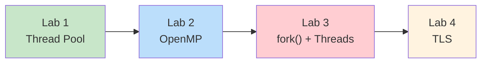
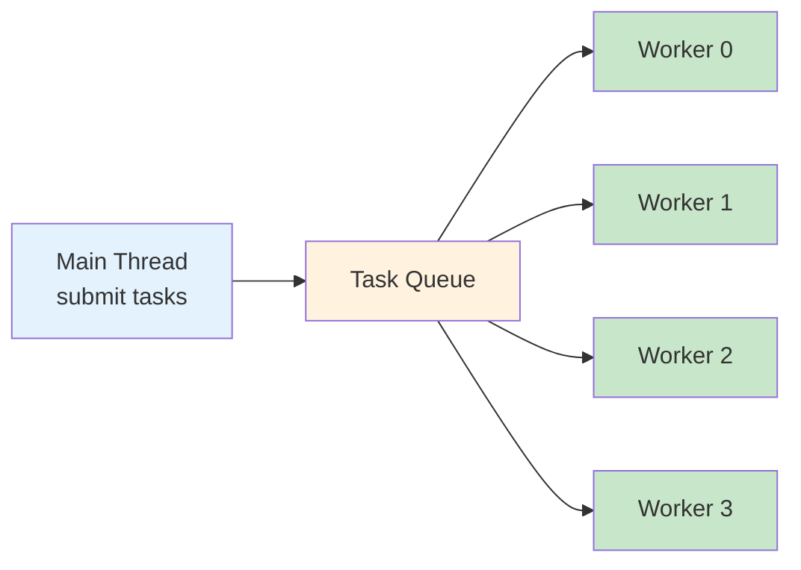
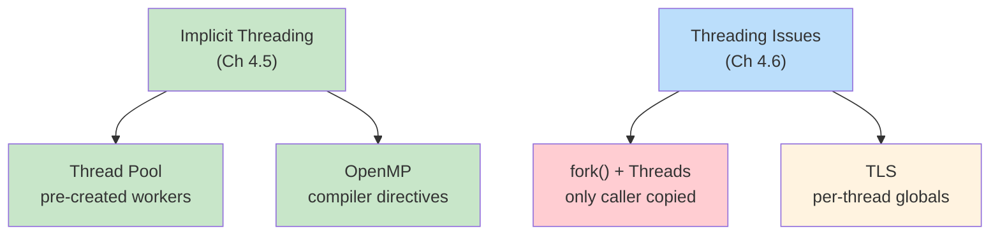

# Week 5 Lab — Implicit Threading and Threading Issues

> **Last Updated:** 2026-04-02

> **Prerequisites**: Week 5 Lecture concepts (implicit threading, threading issues). Ability to compile C with `-pthread` and `-fopenmp`.
>
> **Learning Objectives**: After completing this lab, you should be able to:
> 1. Implement a thread pool with a task queue and pre-created worker threads
> 2. Use OpenMP compiler directives for automatic loop parallelization
> 3. Explain why fork() in a multithreaded program copies only the calling thread
> 4. Use Thread-Local Storage (TLS) to avoid race conditions on global state

---

## Table of Contents

- [1. Lab Overview](#1-lab-overview)
- [2. Lab 1: Thread Pool](#2-lab-1-thread-pool)
- [3. Lab 2: OpenMP Parallel](#3-lab-2-openmp-parallel)
- [4. Lab 3: fork() in Multithreaded Programs](#4-lab-3-fork-in-multithreaded-programs)
- [5. Lab 4: Thread-Local Storage (TLS)](#5-lab-4-thread-local-storage-tls)
- [Summary](#summary)
- [Appendix](#appendix)

---

<br>

## 1. Lab Overview

- **Objective**: Practice implicit threading techniques and understand common threading issues.
- **Duration**: Approximately 50 minutes · 4 labs
- **Topics**: Thread Pool, OpenMP, `fork()` with threads, Thread-Local Storage (TLS)



**Build all labs**:

```bash
cd examples/
gcc -Wall -pthread -o lab1_thread_pool   lab1_thread_pool.c
gcc -Wall -fopenmp -o lab2_openmp_parallel lab2_openmp_parallel.c
gcc -Wall -pthread -o lab3_fork_threads  lab3_fork_threads.c
gcc -Wall -pthread -o lab4_tls           lab4_tls.c
```

> **Note:** Lab 1, 3, and 4 use `-pthread` for POSIX threads. Lab 2 uses `-fopenmp` to enable OpenMP compiler directives. On macOS, you may need `brew install libomp` and use `gcc-13` (or later) instead of the default `clang`.

---

<br>

## 2. Lab 1: Thread Pool

**Goal**: Implement a task queue with pre-created worker threads (Textbook Section 4.5.1).

```bash
./lab1_thread_pool    # 4 workers process 12 tasks
```

### Why Thread Pools?

Creating a new thread for every request is expensive. A thread pool pre-creates a fixed number of worker threads that wait for tasks:



**Three benefits** of thread pools:

| Benefit | Description |
|---------|-------------|
| Faster response | Reuse existing threads — no creation overhead |
| Bounded concurrency | Limit threads to prevent resource exhaustion |
| Task/execution separation | Decouple *what* runs from *how* it runs |

### Key Code Pattern

```c
void *worker_thread(void *arg) {
    while (1) {
        pthread_mutex_lock(&pool.lock);
        while (pool.count == 0 && !pool.shutdown)
            pthread_cond_wait(&pool.not_empty, &pool.lock);  // wait for work
        if (pool.shutdown && pool.count == 0) { unlock; break; }
        task = dequeue();
        pthread_cond_signal(&pool.not_full);  // free slot
        pthread_mutex_unlock(&pool.lock);
        task.function(task.arg);              // execute outside lock
    }
}
```

**Pattern**: Producer (main) submits tasks → Queue → Consumer (workers) execute

- Workers sleep when queue is empty (no busy-wait thanks to `pthread_cond_wait`)
- Shutdown: set flag + `pthread_cond_broadcast` to wake all sleeping workers
- Compare with Java's `ExecutorService.newFixedThreadPool(4)`

> **[Data Structures]** The task queue here is a **bounded circular buffer** protected by a mutex. The producer-consumer coordination uses two condition variables (`not_empty` and `not_full`) — the same pattern you studied in concurrent data structures.

> **Key Point:** The worker executes `task.function(task.arg)` **outside** the critical section (`pthread_mutex_unlock` comes first). This maximizes concurrency — the lock is only held while accessing the shared queue, not during task execution.

---

<br>

## 3. Lab 2: OpenMP Parallel

**Goal**: Use compiler directives for implicit threading (Textbook Section 4.5.3).

```bash
./lab2_openmp_parallel
OMP_NUM_THREADS=2 ./lab2_openmp_parallel   # control thread count
```

### Sequential vs Parallel

**Sequential**:

```c
for (int i = 0; i < N; i++)
    sum += array[i];
```

**Parallel (OpenMP)**:

```c
#pragma omp parallel for reduction(+:sum)
for (int i = 0; i < N; i++)
    sum += array[i];
```

With just one `#pragma` line, the compiler automatically distributes loop iterations across threads.

### Key Directives

| Directive | Effect |
|-----------|--------|
| `#pragma omp parallel` | Create a team of threads |
| `#pragma omp parallel for` | Split loop iterations across threads |
| `reduction(+:var)` | Each thread gets a private copy; combined at end |

### How `reduction` Works

```text
Without reduction:           With reduction(+:sum):

Thread 0: sum += a[0]       Thread 0: local_sum0 += a[0]
Thread 1: sum += a[1]       Thread 1: local_sum1 += a[1]
         ↓                           ↓
   RACE CONDITION!           sum = local_sum0 + local_sum1
                                   (safe merge at end)
```

> **[Programming Languages]** OpenMP is a **declarative** parallelism model — you tell the compiler *what* to parallelize, not *how*. The runtime decides thread count, scheduling, and synchronization. This contrasts with the **imperative** `pthread_create` approach from Week 4 where you manage every detail yourself.

> **Key Point:** Without `reduction`, multiple threads writing to the same `sum` variable would cause a race condition. The `reduction` clause gives each thread a private copy and safely combines them after the loop completes.

---

<br>

## 4. Lab 3: fork() in Multithreaded Programs

**Goal**: Observe that `fork()` copies **only the calling thread** (Textbook Section 4.6.1).

```bash
./lab3_fork_threads
```

### What Happens When You fork() with Multiple Threads?

```text
Before fork():                After fork():

Parent Process                Parent Process       Child Process
┌──────────────┐             ┌──────────────┐     ┌──────────────┐
│ Main Thread  │             │ Main Thread  │     │ Main Thread  │ (copy)
│ Thread 1     │    fork()   │ Thread 1     │     │              │ (gone!)
│ Thread 2     │ ─────────→  │ Thread 2     │     │              │ (gone!)
│ Thread 3     │             │ Thread 3     │     │              │ (gone!)
│ counter = 7  │             │ counter = 10 │     │ counter = 7  │ (frozen)
└──────────────┘             └──────────────┘     └──────────────┘
```

**Key observations**:

- **Parent**: counter keeps incrementing (all threads alive and running)
- **Child**: counter stays at 7 (threads were NOT copied — only the calling thread exists)
- The child process gets a **snapshot** of memory at the moment of `fork()`, but none of the other threads

### Why This Is Dangerous

If another thread held a mutex at the time of `fork()`, the child inherits a **locked mutex** with no thread to unlock it — **deadlock**.

**Safe pattern**: Call `exec()` immediately after `fork()`:

```c
pid_t pid = fork();
if (pid == 0) {
    // Child: call exec() right away
    execlp("/bin/ls", "ls", NULL);
}
```

The `exec()` call replaces the entire process image, so the inherited locked-mutex problem disappears.

> **[Operating Systems]** Recall from Week 2–3 that `fork()` creates a copy of the calling process. In a single-threaded process, this copies everything. In a multithreaded process, POSIX specifies that only the calling thread is duplicated. This design avoids the complexity of duplicating thread synchronization state, but it means the child is in a fragile state until it calls `exec()`.

> **Exam Tip:** `fork()` in a multithreaded program is a frequently tested topic. Remember: only the calling thread is copied. The safe pattern is `fork()` + `exec()` immediately.

---

<br>

## 5. Lab 4: Thread-Local Storage (TLS)

**Goal**: Use `__thread` for per-thread private global state (Textbook Section 4.6.4).

```bash
./lab4_tls
# shared_var = 287453 (expected 400000) RACE CONDITION!
# Each thread's tls_var was 100000 (always correct)
```

### Shared Global vs Thread-Local

**Shared global**:

```c
int shared_var = 0;

// All threads: shared_var++
// Result: RACE CONDITION — value is less than expected
```

**Thread-local**:

```c
__thread int tls_var = 0;

// Each thread: tls_var++
// Result: always correct (100000 per thread)
```

### How TLS Works

```text
Memory layout:

shared_var: [     one copy — all threads read/write     ]
                     ↓ RACE CONDITION

tls_var:    [ Thread 0 copy ] [ Thread 1 copy ] [ Thread 2 copy ] [ Thread 3 copy ]
                     ↓ each thread has its own — no conflict
```

The `__thread` keyword (GCC extension; C11 uses `_Thread_local`) tells the compiler to create a **separate instance** of the variable for each thread. Each thread reads and writes its own copy, so no synchronization is needed.

### Real-World Use Case

The classic example is `errno` — the C library's error code:

```c
// errno is TLS — each thread gets its own error code
// Thread 0 calls read() → errno = EAGAIN
// Thread 1 calls open() → errno = ENOENT
// They don't interfere with each other
```

> **Key Point:** TLS is useful when you need per-thread global state without the overhead of passing data through function parameters. However, it only works when threads truly need **independent** copies. If threads need to share and coordinate on the same data, you need proper synchronization (mutexes, covered in Chapter 6).

---

<br>

## Summary



| Lab | Topic | Key Takeaway |
|:----|:------|:-------------|
| Lab 1 | Thread Pool | Workers wait on queue — reuse threads, bound concurrency |
| Lab 2 | OpenMP | One `#pragma` line → automatic parallelization with `reduction` |
| Lab 3 | fork() + Threads | Only calling thread copied — call `exec()` right away |
| Lab 4 | TLS | `__thread` = per-thread copy, no locks needed |

---

<br>

## Appendix

- Previous week: Pthreads fundamentals — thread creation, data parallelism, argument passing, Amdahl's Law (Textbook Sections 4.1–4.4)
- Next week: CPU Scheduling — scheduling criteria, FCFS, SJF, Priority, Round-Robin (Textbook Chapter 5)

---

<br>

## Self-Check Questions

1. What are the three benefits of using a thread pool instead of creating a new thread for each task?
2. What does the `reduction(+:sum)` clause do in OpenMP, and why is it necessary?
3. When `fork()` is called in a multithreaded program, how many threads does the child process have? Why is this dangerous?
4. How does `__thread` (TLS) differ from a regular global variable? When would you use each?

---
