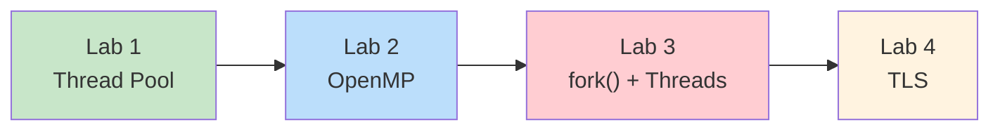
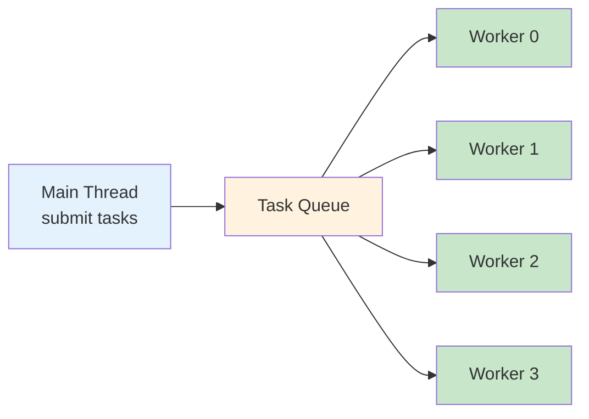
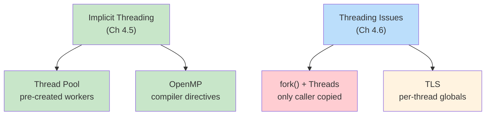

# Week 5 Lab — Implicit Threading and Threading Issues

> **Last Updated:** 2026-04-02

> **Prerequisites**: Week 5 Lecture concepts (implicit threading, threading issues). Ability to compile C with `-pthread` and `-fopenmp`.
>
> **Learning Objectives**: After completing this lab, you should be able to:
> 1. Implement a thread pool with a task queue and pre-created worker threads
> 2. Use OpenMP compiler directives for automatic loop parallelization
> 3. Explain why fork() in a multithreaded program copies only the calling thread
> 4. Use Thread-Local Storage (TLS) to avoid race conditions on global state

---

## Table of Contents

- [1. Lab Overview](#1-lab-overview)
- [2. Lab 1: Thread Pool](#2-lab-1-thread-pool)
- [3. Lab 2: OpenMP Parallel](#3-lab-2-openmp-parallel)
- [4. Lab 3: fork() in Multithreaded Programs](#4-lab-3-fork-in-multithreaded-programs)
- [5. Lab 4: Thread-Local Storage (TLS)](#5-lab-4-thread-local-storage-tls)
- [Summary](#summary)
- [Appendix](#appendix)

---

<br>

## 1. Lab Overview

- **Objective**: Practice implicit threading techniques and understand common threading issues.
- **Duration**: Approximately 50 minutes · 4 labs
- **Topics**: Thread Pool, OpenMP, `fork()` with threads, Thread-Local Storage (TLS)



**Build all labs**:

```bash
cd examples/
gcc -Wall -pthread -o lab1_thread_pool   lab1_thread_pool.c
gcc -Wall -fopenmp -o lab2_openmp_parallel lab2_openmp_parallel.c
gcc -Wall -pthread -o lab3_fork_threads  lab3_fork_threads.c
gcc -Wall -pthread -o lab4_tls           lab4_tls.c
```

> **Note:** Lab 1, 3, and 4 use `-pthread` for POSIX threads. Lab 2 uses `-fopenmp` to enable OpenMP compiler directives. On macOS, you may need `brew install libomp` and use `gcc-13` (or later) instead of the default `clang`.

---

<br>

## 2. Lab 1: Thread Pool

**Goal**: Implement a task queue with pre-created worker threads (Textbook Section 4.5.1).

```bash
./lab1_thread_pool    # 4 workers process 12 tasks
```

### Why Thread Pools?

Creating a new thread for every request is expensive. A thread pool pre-creates a fixed number of worker threads that wait for tasks:



**Three benefits** of thread pools:

| Benefit | Description |
|---------|-------------|
| Faster response | Reuse existing threads — no creation overhead |
| Bounded concurrency | Limit threads to prevent resource exhaustion |
| Task/execution separation | Decouple *what* runs from *how* it runs |

### Data Structures

```c
#define POOL_SIZE   4     /* number of worker threads */
#define QUEUE_SIZE  16    /* max tasks in queue */

/* A task is simply a function pointer + argument */
struct task {
    void (*function)(int);
    int arg;
};

/* Thread pool structure */
struct thread_pool {
    pthread_t workers[POOL_SIZE];

    struct task queue[QUEUE_SIZE];
    int head;           /* dequeue index */
    int tail;           /* enqueue index */
    int count;          /* current number of tasks */

    pthread_mutex_t lock;
    pthread_cond_t not_empty;   /* signaled when a task is added */
    pthread_cond_t not_full;    /* signaled when a task is removed */
    int shutdown;               /* 1 = pool is shutting down */
};
```

### Worker Thread (Consumer)

```c
void *worker_thread(void *arg)
{
    int id = *(int *)arg;
    printf("[Worker %d] started\n", id);

    while (1) {
        struct task t;

        pthread_mutex_lock(&pool.lock);

        /* Wait while queue is empty and not shutting down */
        while (pool.count == 0 && !pool.shutdown)
            pthread_cond_wait(&pool.not_empty, &pool.lock);

        if (pool.shutdown && pool.count == 0) {
            pthread_mutex_unlock(&pool.lock);
            break;
        }

        /* Dequeue a task */
        t = pool.queue[pool.head];
        pool.head = (pool.head + 1) % QUEUE_SIZE;
        pool.count--;
        pthread_cond_signal(&pool.not_full);

        pthread_mutex_unlock(&pool.lock);

        /* Execute the task outside the lock */
        printf("[Worker %d] executing task(%d)\n", id, t.arg);
        t.function(t.arg);
    }

    printf("[Worker %d] exiting\n", id);
    return NULL;
}
```

> **Why `while` instead of `if` for the wait loop?** Condition variables can have **spurious wakeups** — the thread may wake up even though no signal was sent. Using `while` re-checks the condition, ensuring the thread only proceeds when the queue truly has a task.

### Task Submission (Producer)

```c
void pool_submit(void (*function)(int), int arg)
{
    pthread_mutex_lock(&pool.lock);

    while (pool.count == QUEUE_SIZE)
        pthread_cond_wait(&pool.not_full, &pool.lock);

    pool.queue[pool.tail].function = function;
    pool.queue[pool.tail].arg = arg;
    pool.tail = (pool.tail + 1) % QUEUE_SIZE;
    pool.count++;
    pthread_cond_signal(&pool.not_empty);

    pthread_mutex_unlock(&pool.lock);
}
```

### Graceful Shutdown

```c
void pool_shutdown(void)
{
    pthread_mutex_lock(&pool.lock);
    pool.shutdown = 1;
    pthread_cond_broadcast(&pool.not_empty);  /* wake all waiting workers */
    pthread_mutex_unlock(&pool.lock);

    for (int i = 0; i < POOL_SIZE; i++)
        pthread_join(pool.workers[i], NULL);
}
```

**Pattern**: Producer (main) submits tasks → Queue → Consumer (workers) execute

- Workers sleep when queue is empty (no busy-wait thanks to `pthread_cond_wait`)
- Shutdown: set flag + `pthread_cond_broadcast` to wake all sleeping workers
- Compare with Java's `ExecutorService.newFixedThreadPool(4)`

> **[Data Structures]** The task queue here is a **bounded circular buffer** protected by a mutex. The producer-consumer coordination uses two condition variables (`not_empty` and `not_full`) — the same pattern you studied in concurrent data structures.

> **Key Point:** The worker executes `t.function(t.arg)` **outside** the critical section (`pthread_mutex_unlock` comes first). This maximizes concurrency — the lock is only held while accessing the shared queue, not during task execution.

---

<br>

## 3. Lab 2: OpenMP Parallel

**Goal**: Use compiler directives for implicit threading (Textbook Section 4.5.3).

```bash
./lab2_openmp_parallel
OMP_NUM_THREADS=2 ./lab2_openmp_parallel   # control thread count
```

This lab has **three demos** that progressively build on each other.

### Demo 1: Parallel Hello

The simplest OpenMP program — each thread prints its ID:

```c
#pragma omp parallel
{
    int tid = omp_get_thread_num();
    int total = omp_get_num_threads();
    printf("[Thread %d/%d] Hello from OpenMP!\n", tid, total);
}
```

The `#pragma omp parallel` directive creates a **team of threads**. Each thread runs the same block, but `omp_get_thread_num()` gives each a unique ID.

### Demo 2: Parallel For with Speedup

Array initialization parallelized with `#pragma omp parallel for`:

```c
/* Sequential version */
t_start = omp_get_wtime();
for (int i = 0; i < ARRAY_SIZE; i++)
    array[i] = (double)i * 1.5;
t_end = omp_get_wtime();
printf("Sequential: %.4f sec\n", t_end - t_start);

/* Parallel version */
t_start = omp_get_wtime();
#pragma omp parallel for
for (int i = 0; i < ARRAY_SIZE; i++)
    array[i] = (double)i * 1.5;
t_end = omp_get_wtime();
printf("Parallel:   %.4f sec\n", t_end - t_start);
```

> `omp_get_wtime()` provides portable wall-clock timing. The array has **50 million** elements (`ARRAY_SIZE = 50000000`), large enough to see a clear speedup.

### Demo 3: Reduction

Parallel summation — the most important demo:

```c
/* Sequential sum */
double sum_seq = 0.0;
for (int i = 0; i < ARRAY_SIZE; i++)
    sum_seq += array[i];

/* Parallel sum with reduction */
double sum_par = 0.0;
#pragma omp parallel for reduction(+:sum_par)
for (int i = 0; i < ARRAY_SIZE; i++)
    sum_par += array[i];
```

### Key Directives

| Directive | Effect |
|-----------|--------|
| `#pragma omp parallel` | Create a team of threads |
| `#pragma omp parallel for` | Split loop iterations across threads |
| `reduction(+:var)` | Each thread gets a private copy; combined at end |

### How `reduction` Works

```text
Without reduction:           With reduction(+:sum):

Thread 0: sum += a[0]       Thread 0: local_sum0 += a[0]
Thread 1: sum += a[1]       Thread 1: local_sum1 += a[1]
         ↓                           ↓
   RACE CONDITION!           sum = local_sum0 + local_sum1
                                   (safe merge at end)
```

> **[Programming Languages]** OpenMP is a **declarative** parallelism model — you tell the compiler *what* to parallelize, not *how*. The runtime decides thread count, scheduling, and synchronization. This contrasts with the **imperative** `pthread_create` approach from Week 4 where you manage every detail yourself.

> **Key Point:** Without `reduction`, multiple threads writing to the same `sum` variable would cause a race condition. The `reduction` clause gives each thread a private copy and safely combines them after the loop completes.

---

<br>

## 4. Lab 3: fork() in Multithreaded Programs

**Goal**: Observe that `fork()` copies **only the calling thread** (Textbook Section 4.6.1).

```bash
./lab3_fork_threads
```

This lab has **two demos**: the first shows the problem, the second shows the safe pattern.

### Two Variants of fork() Semantics

1. Duplicate **ALL** threads (rarely used)
2. Duplicate **ONLY** the calling thread (POSIX default)

Rule of thumb:
- If the child calls `exec()` immediately → fork only caller (safe)
- If the child continues executing → beware of lost threads/locks

### Demo 1: fork() Copies Only the Calling Thread

The program creates 3 background threads that increment a shared counter, then calls `fork()`:

```c
volatile int counter = 0;

void *background_work(void *arg)
{
    int tid = *(int *)arg;
    while (1) {
        counter++;
        usleep(200000);  /* 200ms */
    }
    return NULL;
}
```

```text
Before fork():                After fork():

Parent Process                Parent Process       Child Process
┌──────────────┐             ┌──────────────┐     ┌──────────────┐
│ Main Thread  │             │ Main Thread  │     │ Main Thread  │ (copy)
│ Thread 1     │    fork()   │ Thread 1     │     │              │ (gone!)
│ Thread 2     │ ─────────→  │ Thread 2     │     │              │ (gone!)
│ Thread 3     │             │ Thread 3     │     │              │ (gone!)
│ counter = 7  │             │ counter = 10 │     │ counter = 7  │ (frozen)
└──────────────┘             └──────────────┘     └──────────────┘
```

**Key observations**:

- **Parent**: counter keeps incrementing (all threads alive and running)
- **Child**: counter stays at 7 (threads were NOT copied — only the calling thread exists)
- The child process gets a **snapshot** of memory at the moment of `fork()`, but none of the other threads

### Why This Is Dangerous

If another thread held a mutex at the time of `fork()`, the child inherits a **locked mutex** with no thread to unlock it — **deadlock**.

### Demo 2: fork() + exec() — The Safe Pattern

```c
pid_t pid = fork();
if (pid == 0) {
    /* Child: call exec() right away */
    printf("[Child] About to exec 'echo'\n");
    execlp("echo", "echo", "Hello from exec!", NULL);
    perror("exec failed");
    exit(1);
} else {
    waitpid(pid, NULL, 0);
    printf("[Parent] Child finished exec.\n");
}
```

The `exec()` call replaces the **entire address space**, so the inherited locked-mutex problem disappears. It doesn't matter that other threads are missing because the whole process image is replaced.

> **[Operating Systems]** Recall from Week 2–3 that `fork()` creates a copy of the calling process. In a single-threaded process, this copies everything. In a multithreaded process, POSIX specifies that only the calling thread is duplicated. This design avoids the complexity of duplicating thread synchronization state, but it means the child is in a fragile state until it calls `exec()`.

> **Exam Tip:** `fork()` in a multithreaded program is a frequently tested topic. Remember: only the calling thread is copied. The safe pattern is `fork()` + `exec()` immediately.

---

<br>

## 5. Lab 4: Thread-Local Storage (TLS)

**Goal**: Use `__thread` for per-thread private global state (Textbook Section 4.6.4).

```bash
./lab4_tls
# shared_var = 287453 (expected 400000) RACE CONDITION!
# Each thread's tls_var was 100000 (always correct)
```

This lab has **two demos**: the first compares shared vs TLS variables, the second demonstrates the errno-like pattern.

### TLS Implementation Methods

| Method | Language/Platform |
|--------|-------------------|
| `__thread` | GCC extension |
| `_Thread_local` | C11 standard |
| `pthread_key_t` | Pthreads API |

### Demo 1: Shared Global vs Thread-Local

```c
/* Regular global variable — shared by all threads */
int shared_var = 0;

/* Thread-local variable — each thread gets its own copy */
__thread int tls_var = 0;

void *demo1_worker(void *arg)
{
    int tid = *(int *)arg;

    for (int i = 0; i < ITERATIONS; i++) {
        shared_var++;   /* shared — race condition! */
        tls_var++;      /* thread-local — safe, private copy */
    }

    printf("[Thread %d] tls_var = %d (expected %d)\n",
           tid, tls_var, ITERATIONS);
    return NULL;
}
```

After all 4 threads finish (each doing 100,000 iterations):

```text
shared_var = 287453 (expected 400000)  RACE CONDITION!
Each thread's tls_var was 100000       (always correct)
```

### How TLS Works

```text
Memory layout:

shared_var: [     one copy — all threads read/write     ]
                     ↓ RACE CONDITION

tls_var:    [ Thread 0 copy ] [ Thread 1 copy ] [ Thread 2 copy ] [ Thread 3 copy ]
                     ↓ each thread has its own — no conflict
```

The `__thread` keyword tells the compiler to create a **separate instance** of the variable for each thread. Each thread reads and writes its own copy, so no synchronization is needed.

### Demo 2: Per-Thread State (errno Pattern)

A practical demonstration of TLS mimicking how `errno` works:

```c
__thread int thread_error = 0;
__thread const char *thread_name = NULL;

void set_error(int code) { thread_error = code; }
int get_error(void) { return thread_error; }

void *demo2_worker(void *arg)
{
    int tid = *(int *)arg;
    char name_buf[32];

    sprintf(name_buf, "Worker-%d", tid);
    thread_name = name_buf;

    set_error((tid + 1) * 100);    /* each thread sets its own error code */

    usleep(50000);                 /* sleep so threads overlap */

    printf("[%s] error = %d (expected %d)\n",
           thread_name, get_error(), (tid + 1) * 100);
    return NULL;
}
```

Each thread sets its own error code via `set_error()` and reads it back via `get_error()`. Despite running concurrently, each thread's value is independent — just like `errno` in the C library.

> **Key Point:** TLS is useful when you need per-thread global state without the overhead of passing data through function parameters. It works for **independent** copies only. If threads need to share and coordinate on the same data, you need proper synchronization (mutexes, covered in Chapter 6).

---

<br>

## Summary



| Lab | Topic | Key Takeaway |
|:----|:------|:-------------|
| Lab 1 | Thread Pool | Workers wait on queue — reuse threads, bound concurrency |
| Lab 2 | OpenMP | `#pragma omp parallel for reduction(+:var)` → automatic parallelization |
| Lab 3 | fork() + Threads | Only calling thread copied — call `exec()` right away |
| Lab 4 | TLS | `__thread` = per-thread copy, no locks needed |

---

<br>

## Self-Check Questions

1. What are the three benefits of using a thread pool instead of creating a new thread for each task?
2. Why does the worker thread use `while (pool.count == 0)` instead of `if (pool.count == 0)` before calling `pthread_cond_wait`?
3. What are the three demos in Lab 2, and what OpenMP directive does each demonstrate?
4. When `fork()` is called in a multithreaded program, how many threads does the child process have? Why is this dangerous?
5. What is the difference between Demo 1 and Demo 2 in Lab 4? What real-world system uses the same pattern as Demo 2?
6. Name three different ways to declare a thread-local variable in C.

---
