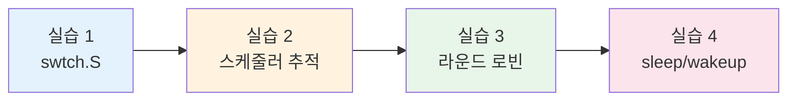
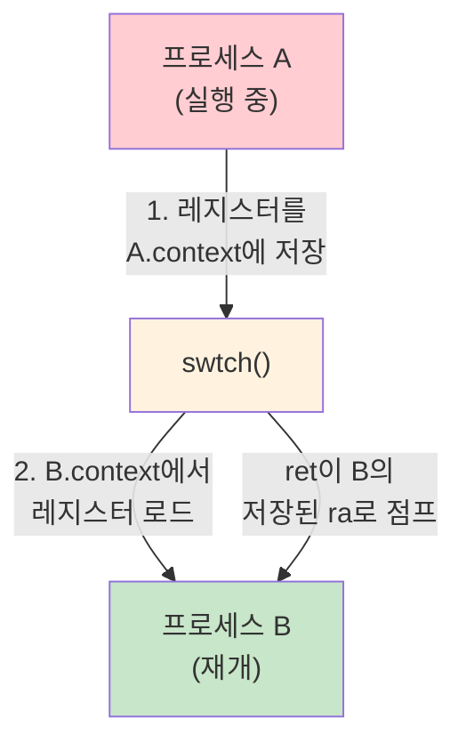
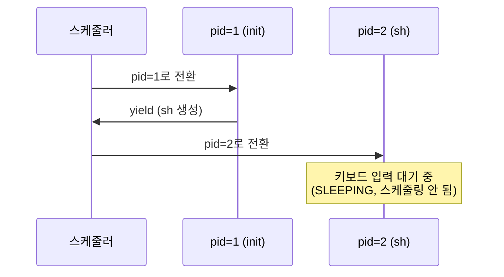
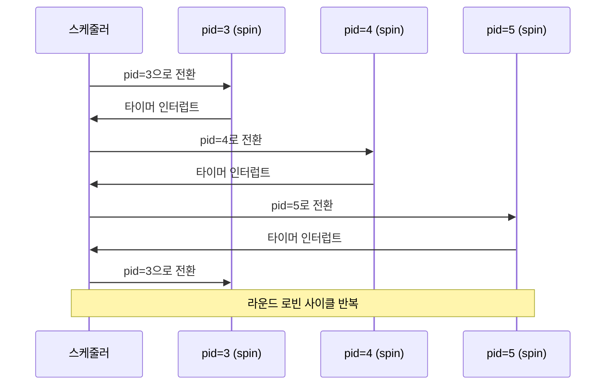
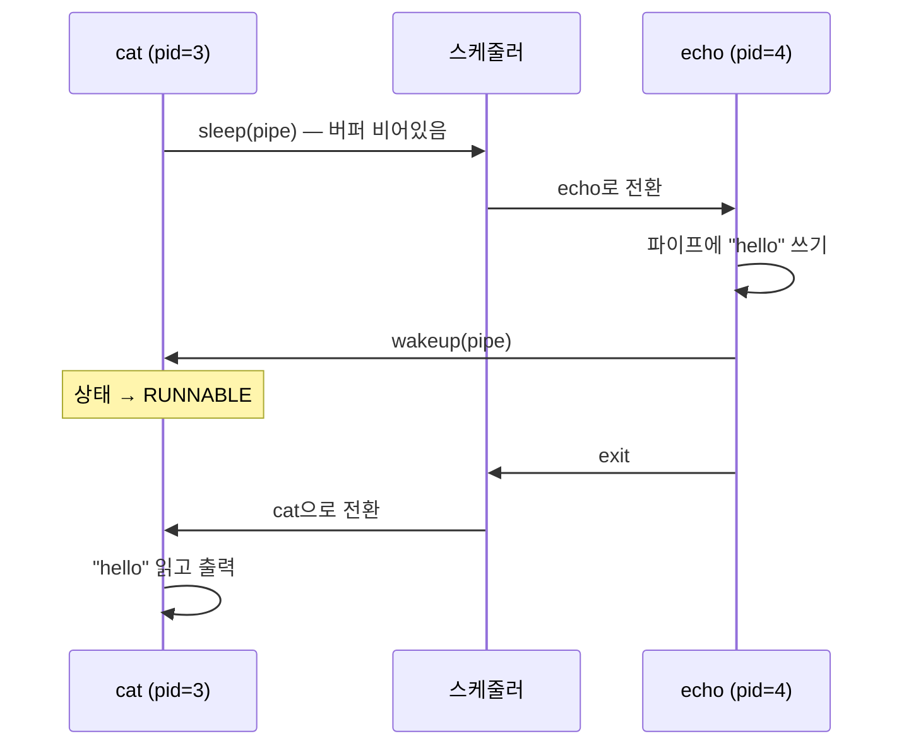
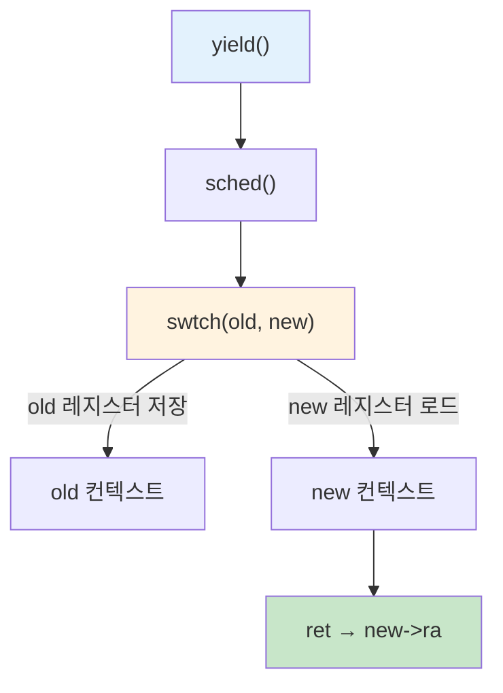

# 6주차 실습 — 문맥 교환 (Context Switching)

> **최종 수정일:** 2026-04-09

> **선수 지식**: 6주차 이론 개념 (CPU 스케줄링). xv6-riscv 빌드 환경이 정상적으로 구축되어 있어야 한다.
>
> **학습 목표**: 이 실습을 완료하면 다음을 할 수 있어야 한다:
> 1. `swtch.S`를 읽고 문맥 교환 시 어떤 레지스터가 저장/복원되는지 설명할 수 있다
> 2. xv6 스케줄러에 printf 기반 추적을 추가하고 출력을 해석할 수 있다
> 3. 여러 CPU 집약적 프로세스에서 라운드 로빈 스케줄링 동작을 관찰할 수 있다
> 4. 블로킹 I/O 파이프라인을 통해 sleep/wakeup 메커니즘을 추적할 수 있다

---

## 목차

- [1. 실습 개요](#1-실습-개요)
- [2. 실습 1: swtch.S 분석](#2-실습-1-swtchs-분석)
- [3. 실습 2: 스케줄러 추적](#3-실습-2-스케줄러-추적)
- [4. 실습 3: 라운드 로빈 관찰](#4-실습-3-라운드-로빈-관찰)
- [5. 실습 4: sleep/wakeup 추적](#5-실습-4-sleepwakeup-추적)
- [요약](#요약)
- [점검 문제](#점검-문제)

---

<br>

## 1. 실습 개요

- **목표**: 어셈블리 코드 읽기, 스케줄러 추적, 프로세스 상태 전이 관찰을 통해 xv6의 문맥 교환 메커니즘을 이해한다.
- **소요 시간**: 약 50분 · 실습 4개
- **주제**: `swtch.S`, 스케줄러 추적, 라운드 로빈 스케줄링, `sleep`/`wakeup`

### 문맥 교환(Context Switch)이란?

CPU는 한 번에 하나의 프로세스만 실행할 수 있다. 여러 프로그램이 동시에 실행되는 것처럼 보이게 하려면, OS가 프로세스들을 초당 수십 번씩 빠르게 전환해야 한다. 이 전환을 **문맥 교환(Context Switch)** 이라 한다:

1. **저장** — 현재 실행 중인 프로세스의 CPU 레지스터("문맥")를 메모리에 저장
2. **로드** — 다음 프로세스의 저장된 레지스터를 메모리에서 CPU로 로드
3. **재개** — CPU가 다음 프로세스를 멈춘 적 없는 것처럼 계속 실행

비유하자면, 읽던 책에 책갈피를 꽂고 다른 책을 집어 드는 것과 같다. "책갈피"가 저장된 레지스터 상태이고, 각 "책"이 서로 다른 프로세스이다.



**사전 준비**:

```bash
cd xv6-riscv && make qemu   # 정상 부팅 확인
```

> **참고:** 모든 실습은 xv6 커널 소스 파일을 수정하거나 검사한다. 커널 코드를 편집한 후 `make clean && make qemu` (또는 단일 CPU 출력을 위해 `make CPUS=1 qemu`)를 실행하여 다시 빌드하고 테스트한다.

---

<br>

## 2. 실습 1: swtch.S 분석

**목표**: xv6 문맥 교환 어셈블리를 읽고 어떤 레지스터가 저장·복원되는지 이해한다.

**파일**: `kernel/swtch.S`, `kernel/proc.h`

### 배경 지식: 호출자 저장 vs 피호출자 저장 레지스터

RISC-V 호출 규약(calling convention)에서 CPU 레지스터는 두 그룹으로 나뉜다:

| 그룹 | 레지스터 | 누가 저장하는가? | 언제? |
|------|---------|-----------------|-------|
| **호출자 저장(caller-saved)** | `a0`–`a7` (인자), `t0`–`t6` (임시) | **호출자** (다른 함수를 호출하는 함수) | 호출 전에 스택에 푸시 |
| **피호출자 저장(callee-saved)** | `ra` (반환 주소), `sp` (스택 포인터), `s0`–`s11` | **피호출자** (호출당하는 함수) | 반환 전에 반드시 원래 값으로 복원 |

비유: 책상을 다른 사람에게 빌려준다고 하자. **호출자 저장** 레지스터는 빌려주기 전에 내가 직접 치워두는 물건이다. **피호출자 저장** 레지스터는 빌린 사람이 쓰고 난 뒤 반드시 원래 자리에 돌려놓겠다고 약속한 물건이다.

### struct context — 피호출자 저장 레지스터만 저장

`kernel/proc.h`의 `struct context`는 **피호출자 저장(callee-saved)** 레지스터만 저장한다. C 컴파일러가 `swtch`를 호출하기 전에 호출자 저장 레지스터를 스택에 저장하는 코드를 이미 생성하므로, 우리가 명시적으로 저장해야 할 것은 피호출자 저장 레지스터뿐이다:

```c
struct context {
  uint64 ra;  // 반환 주소
  uint64 sp;  // 스택 포인터
  uint64 s0;  // s0 – s11
  uint64 s1;
  /* ... s2부터 s11까지 ... */
};
```

### swtch(old, new) 어셈블리

`swtch` 함수는 두 개의 포인터를 받는다: **old** 컨텍스트(저장 대상)와 **new** 컨텍스트(복원 대상). RISC-V에서 첫 번째 함수 인자는 `a0` 레지스터에, 두 번째는 `a1` 레지스터에 전달된다:

```asm
swtch:
  sd ra, 0(a0)   # old->ra에 ra 저장    (sd = "store doubleword", 8바이트 저장)
  sd sp, 8(a0)   # old->sp에 sp 저장    (오프셋 8 = 다음 필드)
  sd s0, 16(a0)  # old->s0에 s0 저장
  ...
  ld ra, 0(a1)   # new->ra를 ra에 로드  (ld = "load doubleword", 8바이트 로드)
  ld sp, 8(a1)   # new->sp를 sp에 로드
  ld s0, 16(a1)  # new->s0를 s0에 로드
  ...
  ret             # ra에 있는 주소로 점프 (이제 new->ra의 값)
```

어셈블리를 한 줄씩 읽어보면:
- `sd ra, 0(a0)` — "레지스터 `ra`의 8바이트 값을 메모리 주소 `a0 + 0`에 저장하라". `a0`는 old 컨텍스트 구조체를 가리키므로, 오프셋 0은 `ra` 필드이다.
- `ld ra, 0(a1)` — "메모리 주소 `a1 + 0`에서 8바이트를 `ra` 레지스터에 로드하라". `a1`은 new 컨텍스트 구조체를 가리키므로, new 프로세스가 저장해 둔 반환 주소를 로드한다.
- `ret` — "`ra`에 현재 들어있는 주소로 점프하라". 위의 로드 명령들 이후 `ra`에는 new 프로세스의 저장된 반환 주소가 들어있으므로, new 프로세스가 마지막으로 `swtch`를 호출했던 지점에서 실행이 재개된다.

### 문맥 교환 흐름



### 새 프로세스의 부트스트랩

`allocproc()`가 새 프로세스를 생성할 때 `p->context.ra = forkret`으로 설정한다. `swtch`가 `ret`(= `ra`로 점프)으로 끝나므로, 새 프로세스로의 **첫 번째** `swtch`는 이전 호출 지점으로 돌아가지 않고 `forkret()`으로 점프한다. `forkret()`은 새 프로세스의 일회성 초기화(예: 프로세스 락 해제)를 수행한 후 `usertrapret()`을 호출하여 사용자 공간으로 점프하고 프로그램 실행을 시작한다.

> **왜 피호출자 저장 레지스터만인가?** 호출자 저장 레지스터(`a0`–`a7`, `t0`–`t6`)는 `swtch`가 호출되기 전에 C 호출 규약에 의해 이미 스택에 푸시된다. 피호출자 저장 레지스터만 저장함으로써, xv6는 컨텍스트 구조체 크기를 최소화하면서도(14개 레지스터 × 8바이트 = 112바이트) 실행 상태를 정확하게 복원할 수 있다.

> **핵심:** `swtch`는 프로그램 카운터(PC)를 직접 저장/복원하지 **않는다**. 대신 `ra`(반환 주소 레지스터)를 저장한다. `ret`이 실행되면 `ra`에 있는 주소로 제어가 이전된다 — 사실상 새 프로세스가 중단된 바로 그 지점에서 재개된다.

---

<br>

## 3. 실습 2: 스케줄러 추적

**목표**: `printf` 계측을 추가하여 스케줄러를 가시화한다.

### 추적 코드 추가

`kernel/proc.c`의 `scheduler()` 함수 안에서, 문맥 교환 전에 `printf`를 추가한다:

```c
if (p->state == RUNNABLE) {
    printf("[sched] cpu%d: switch to pid=%d name=%s\n",
           cpuid(), p->pid, p->name);   // ← 이 줄 추가
    p->state = RUNNING;
    c->proc = p;
    swtch(&c->context, &p->context);
```

변수 설명:
- `c` — 현재 CPU의 `struct cpu` 포인터. 각 CPU는 자체 스케줄러 컨텍스트(`c->context`)와 현재 실행 중인 프로세스를 가리키는 포인터(`c->proc`)를 갖는다.
- `p` — `struct proc`(프로세스 구조체) 포인터. `p->state`는 스케줄링 상태, `p->pid`는 프로세스 ID, `p->name`은 프로세스 이름이다.
- `swtch(&c->context, &p->context)` — 스케줄러의 레지스터를 저장하고 프로세스의 레지스터를 로드한다. 이 호출 이후 CPU는 스케줄러가 아닌 해당 프로세스를 실행한다.

또는 미리 만들어진 패치를 적용할 수 있다: `git apply scheduler_trace.patch`

### 빌드 및 실행

```bash
make clean && make CPUS=1 qemu   # 읽기 쉬운 출력을 위해 단일 CPU
```

`CPUS=1`을 사용하면 스케줄러를 실행하는 CPU가 하나뿐이므로 출력이 순차적이고 따라가기 쉽다.

### 예상 출력



`CPUS=1`로 xv6를 부팅하면 다음을 관찰할 수 있다:
1. 스케줄러가 `pid=1` (`init`)로 전환 — 최초의 사용자 프로세스
2. `init`이 셸(`sh`)을 생성하고 양보(yield)
3. 스케줄러가 `pid=2` (`sh`)로 전환
4. 셸이 키보드 입력을 기다리며 블로킹 (상태가 `SLEEPING`이 됨), 무언가 `RUNNABLE`이 될 때까지 스케줄러 출력이 멈춤

> **핵심:** 스케줄러는 각 CPU에서 무한 루프로 실행된다. 프로세스 테이블을 스캔하여 `RUNNABLE` 프로세스를 찾는다. 하나를 찾으면 **스케줄러 컨텍스트에서 프로세스 컨텍스트로** 문맥 교환을 수행한다. 프로세스가 양보하거나 블로킹되면 또 다른 `swtch` 호출을 통해 스케줄러로 제어가 돌아온다.

---

<br>

## 4. 실습 3: 라운드 로빈 관찰

**목표**: xv6 스케줄러가 여러 CPU 집약적 프로세스에 CPU 시간을 어떻게 분배하는지 관찰한다.

### 여러 프로세스 실행

실습 2의 스케줄러 추적이 활성화된 상태에서 xv6 셸에서 여러 백그라운드 프로세스를 시작한다:

```
$ spin &
$ spin &
$ spin &
```

(`spin`은 무한 루프를 실행하는 간단한 프로그램이다 — xv6 빌드에 없다면 I/O 대기 없이 계속 연산만 수행하는 아무 CPU 집약적(CPU-bound) 사용자 프로그램을 사용하면 된다.)

### 예상 스케줄링 패턴



각 프로세스는 **타이머 인터럽트** 가 발생할 때까지 실행된다. 타이머 인터럽트란 클록 장치가 일정 간격(예: 수 밀리초)마다 CPU에 보내는 하드웨어 신호이다. 이 신호가 발생하면 CPU는 하던 일을 강제로 중단하고 인터럽트 핸들러를 실행하며, 이 핸들러가 `yield()` → `sched()` → `swtch()`를 호출하여 스케줄러로 제어를 돌려보낸다. 스케줄러는 배열에서 다음 `RUNNABLE` 프로세스를 선택한다.

### 왜 라운드 로빈인가?

xv6 스케줄러는 프로세스 테이블의 단순한 **선형 스캔** 을 사용한다:

```c
for (p = proc; p < &proc[NPROC]; p++) {
    if (p->state == RUNNABLE) { /* 실행 */ }
}
```

라운드 로빈 동작이 나타나는 이유:
1. 스케줄러가 항상 배열 처음부터 스캔
2. 각 프로세스가 타이머 틱 하나만큼 실행된 후 양보
3. 모든 CPU 집약적 프로세스가 항상 `RUNNABLE` 상태

### 미묘한 편향

`proc[]`에서 낮은 인덱스의 프로세스가 매 사이클마다 먼저 검사된다. 프로세스 정리나 생성 패턴이 배열 위치에 영향을 미치면, 일부 프로세스가 다른 프로세스보다 약간 더 많은 CPU 시간을 받을 수 있다.

### 다중 CPU 실험

다중 CPU로 다시 빌드하여 병렬 스케줄링을 관찰한다:

```bash
make clean && make CPUS=3 qemu
```

`CPUS=3`이면 여러 CPU가 동시에 서로 다른 프로세스를 선택한다. 추적 출력이 뒤섞여서, 서로 다른 CPU가 동시에 다른 프로세스를 실행할 수 있음을 보여준다.

> **[CPU 스케줄링]** xv6 스케줄러는 가장 단순한 스케줄링 알고리즘을 구현한다 — 우선순위 없음, 타임 퀀텀 조정 없음, 프로세스별 통계 없음의 선형 스캔. 실제 운영체제는 공정성과 응답성을 위해 더 정교한 알고리즘(리눅스의 CFS, FreeBSD의 MLFQ)을 사용하며, 이는 이론 수업에서 다룰 것이다.

> **핵심:** xv6의 라운드 로빈 공정성은 (1) 고정된 타이머 인터럽트 간격과 (2) 프로세스 테이블의 선형 스캔의 조합에서 비롯된다. 각 `RUNNABLE` 프로세스는 스케줄링 사이클당 정확히 하나의 타이머 틱을 받는다.

---

<br>

## 5. 실습 4: sleep/wakeup 추적

**목표**: 블로킹(`sleep`)과 언블로킹(`wakeup`) 경로를 통해 프로세스를 추적한다.

### 추적 코드 추가

`kernel/proc.c`의 `sleep()` 함수 안에서, 상태 전이 전후에 `printf`를 추가한다:

```c
printf("[sleep]  pid=%d name=%s chan=%p\n", p->pid, p->name, chan);
p->state = SLEEPING;
sched();
printf("[wakeup] pid=%d name=%s\n", p->pid, p->name);
```

코드 설명:
- `chan` ("channel"의 줄임말)은 **수면 식별자** 로 사용되는 포인터이다. 어떤 주소든 될 수 있다 — 예를 들어 파이프 구조체의 포인터. 같은 `chan` 값으로 `sleep`을 호출한 모든 프로세스는 같은 이벤트를 기다리는 것이다. `%p`는 포인터의 메모리 주소를 출력한다.
- 첫 번째 `printf`는 프로세스가 수면에 들어가려 할 때 출력된다.
- `sched()`는 `swtch()`를 호출하여 이 프로세스에서 전환한다. 이 시점에서 이 함수의 실행이 **일시 정지** 된다.
- 두 번째 `printf`는 프로세스가 **다시 스케줄링될 때** (잠재적으로 한참 후에) 출력된다. 프로세스 입장에서는 `sched()`가 아무 일 없었던 것처럼 "반환"하지만, 실제로는 그 사이에 CPU가 다른 프로세스들을 실행하고 있었다.

### 파이프로 테스트

xv6 셸에서 파이프라인을 실행한다:

```
$ echo hello | cat
```

### 예상 출력



순서는 다음과 같다:
1. `cat`이 파이프에서 읽으려 하지만 파이프 버퍼가 비어있음
2. `cat`이 `sleep(pipe)`를 호출 — 상태를 `SLEEPING`으로 설정하고 스케줄러에 양보
3. 스케줄러가 `echo`를 선택, 파이프에 `"hello"`를 씀
4. `echo`가 `wakeup(pipe)`를 호출 — 파이프 채널에서 수면 중인 `cat`을 찾아 상태를 `RUNNABLE`로 설정
5. `echo`가 종료
6. 스케줄러가 `cat`(이제 `RUNNABLE`)을 선택, `cat`이 재개되어 `"hello"`를 읽음

### wakeup은 프로세스를 즉시 실행하지 않는다

중요한 세부 사항: `wakeup(chan)`은 수면 중인 프로세스의 상태를 `RUNNABLE`로 설정하기만 한다. 해당 프로세스로 즉시 전환하지 **않는다**. 깨어난 프로세스는 다음 스케줄링 사이클에서 스케줄러가 선택할 때까지 기다려야 한다.

```text
wakeup(chan):
    각 프로세스 p에 대해:
        if p->state == SLEEPING && p->chan == chan:
            p->state = RUNNABLE     ← 상태만 변경
                                    ← swtch를 호출하지 않음
```

이는 "깨우기-즉시-전환(wake-and-switch)" 의미론을 가진 시스템과 다르다. xv6에는 우선순위가 없으며 — 깨어난 프로세스는 단순히 스케줄링 대상이 될 뿐이다.

> **[운영체제]** `sleep`/`wakeup` 메커니즘은 xv6의 **조건 동기화(condition synchronization)** 구현이다. `chan`(채널) 매개변수는 조건 변수의 식별자 역할을 한다 — 같은 채널에서 수면 중인 모든 프로세스가 깨어난다. 4~5주차 실습의 `pthread_cond_wait`/`pthread_cond_signal`과 비교해 볼 것.

> **핵심:** `sleep`/`wakeup` 쌍은 핵심 블로킹 I/O 패턴을 구현한다: 진행할 수 없는 프로세스(빈 파이프, 디스크 I/O 대기)가 채널에서 수면하고, 이벤트 생산자가 해당 채널에서 대기 중인 모든 프로세스를 깨운다. 바쁜 대기(busy-waiting)를 피하면서도 데이터가 준비되면 프로세스가 재개됨을 보장한다.

---

<br>

## 요약



| 실습 | 주제 | 핵심 내용 |
|:----|:-----|:---------|
| 실습 1 | swtch.S | 피호출자 저장 레지스터 저장 → 새 레지스터 로드 → `ret`으로 `new->ra`로 점프 |
| 실습 2 | 스케줄러 | `proc[]`를 선형 스캔하여 RUNNABLE 탐색 — 단순 라운드 로빈 |
| 실습 3 | 라운드 로빈 | 타이머 인터럽트 + 선형 스캔 = 프로세스당 균등한 CPU 시간 |
| 실습 4 | sleep/wakeup | `sleep(chan)` → SLEEPING; `wakeup(chan)` → RUNNABLE (즉시 실행 아님) |

**전체 문맥 교환 경로**: `yield()` → `sched()` → `swtch()` (스케줄러로) → `swtch()` (다음 프로세스로) → 재개

---

<br>

## 점검 문제

1. `struct context`가 피호출자 저장 레지스터만 저장하는 이유는 무엇인가? 문맥 교환 시 호출자 저장 레지스터는 어떻게 되는가?
2. `allocproc()`가 `p->context.ra`를 무엇으로 설정하며, 그 이유는? 새 프로세스로의 첫 번째 `swtch`에서 무슨 일이 일어나는가?
3. 스케줄러를 추적할 때 `CPUS=1`을 사용하는 이유는 무엇인가? `CPUS=3`을 사용하면 무엇이 달라지는가?
4. xv6 스케줄러가 라운드 로빈 동작을 만들어내는 원인은 무엇인가? 현재 구현에 존재하는 미묘한 편향은 무엇인가?
5. 실습 4에서 `echo`가 파이프에 쓰기 전에 `cat`이 수면 상태에 들어가는 이유는 무엇인가? `echo`가 먼저 실행되면 어떻게 되는가?
6. `wakeup()`이 깨어난 프로세스로 즉시 전환하지 않는 이유를 설명하시오. 이것이 `pthread_cond_signal`과 어떻게 다른가?

---
