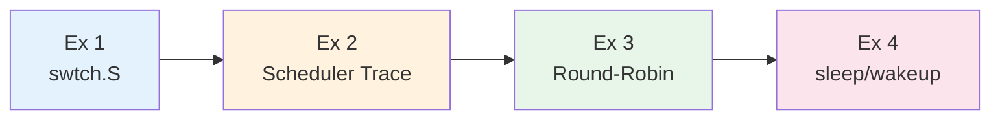
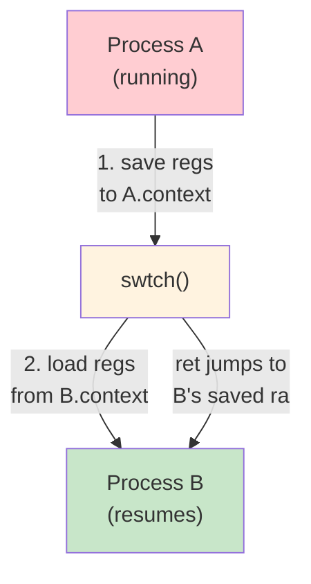
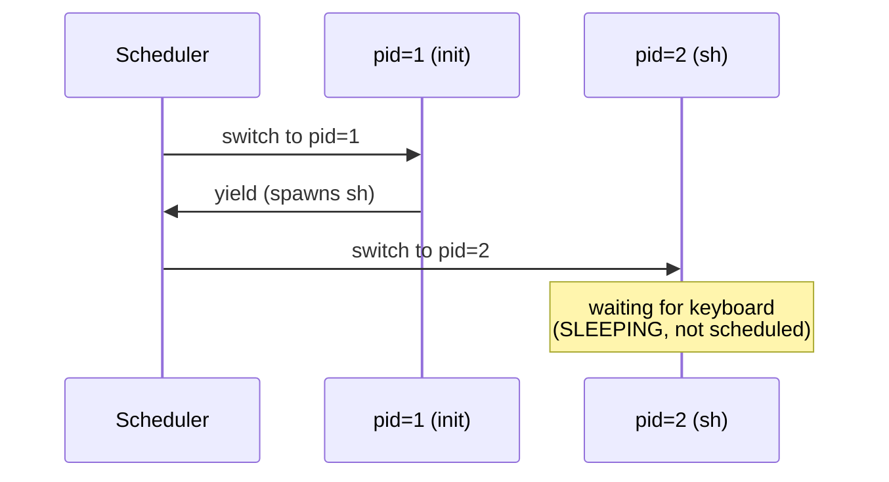
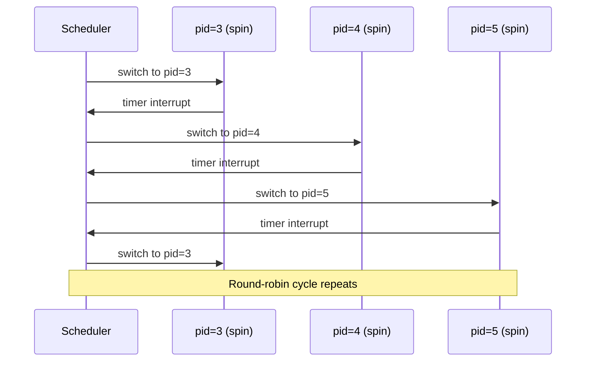
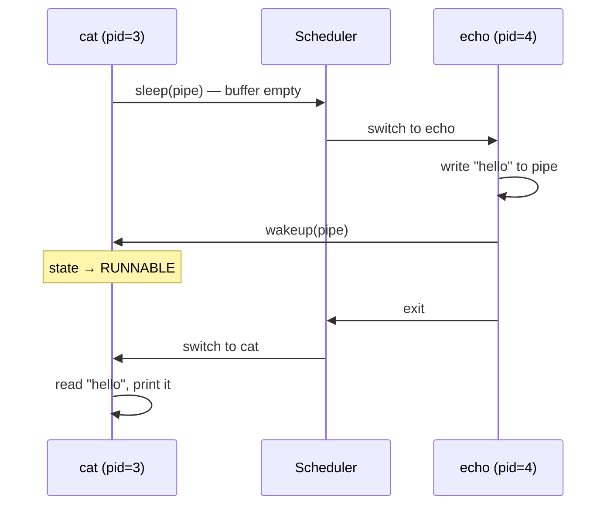
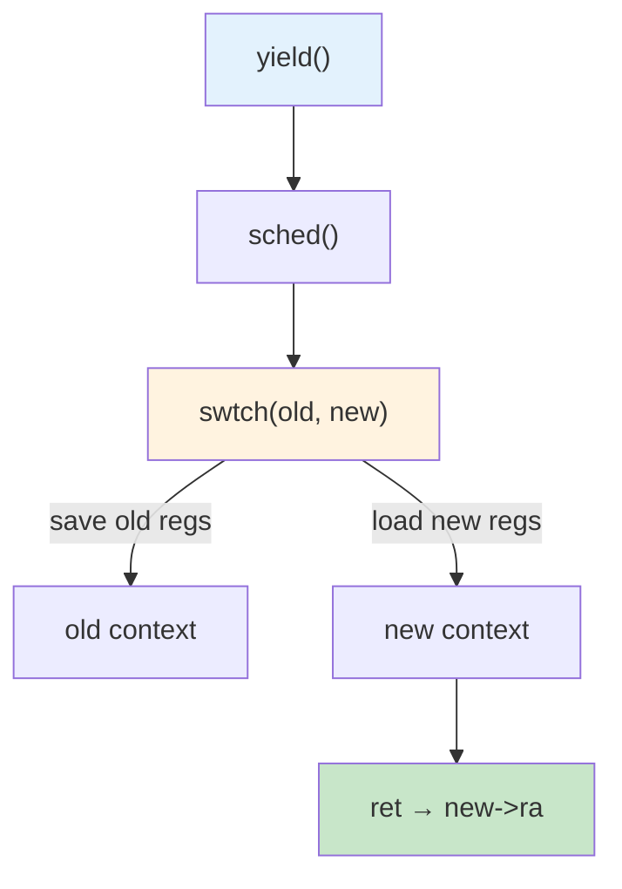

# Week 6 Lab — Context Switching

> **Last Updated:** 2026-04-09

> **Prerequisites**: Week 6 Lecture concepts (CPU scheduling). A working xv6-riscv build environment.
>
> **Learning Objectives**: After completing this lab, you should be able to:
> 1. Read `swtch.S` and explain which registers are saved/restored during a context switch
> 2. Add printf-based tracing to the xv6 scheduler and interpret the output
> 3. Observe round-robin scheduling behavior with multiple CPU-bound processes
> 4. Trace the sleep/wakeup mechanism through a blocking I/O pipeline

---

## Table of Contents

- [1. Lab Overview](#1-lab-overview)
- [2. Exercise 1: swtch.S Analysis](#2-exercise-1-swtchs-analysis)
- [3. Exercise 2: Scheduler Tracing](#3-exercise-2-scheduler-tracing)
- [4. Exercise 3: Round-Robin Observation](#4-exercise-3-round-robin-observation)
- [5. Exercise 4: sleep/wakeup Tracing](#5-exercise-4-sleepwakeup-tracing)
- [Summary](#summary)
- [Self-Check Questions](#self-check-questions)

---

<br>

## 1. Lab Overview

- **Objective**: Understand the xv6 context switch mechanism by reading assembly, tracing the scheduler, and observing process state transitions.
- **Duration**: Approximately 50 minutes · 4 exercises
- **Topics**: `swtch.S`, Scheduler tracing, Round-robin scheduling, `sleep`/`wakeup`

### What Is a Context Switch?

A CPU can only run one process at a time. To give the illusion that many programs run simultaneously, the OS rapidly switches between processes — dozens of times per second. Each switch is called a **context switch**:

1. **Save** the currently running process's CPU registers (its "context") into memory
2. **Load** the next process's saved registers from memory into the CPU
3. **Resume** execution — the CPU now continues the next process as if it had never stopped

Think of it like bookmarking your place in a book before picking up a different one. The "bookmark" is the saved register state, and each book is a different process.



**Prerequisites**:

```bash
cd xv6-riscv && make qemu   # verify clean boot
```

> **Note:** All exercises modify or inspect xv6 kernel source files. After editing kernel code, run `make clean && make qemu` (or `make CPUS=1 qemu` for single-CPU output) to rebuild and test.

---

<br>

## 2. Exercise 1: swtch.S Analysis

**Goal**: Read the xv6 context switch assembly and understand which registers are saved and restored.

**Files**: `kernel/swtch.S`, `kernel/proc.h`

### Background: Caller-Saved vs Callee-Saved Registers

In the RISC-V calling convention, CPU registers are divided into two groups:

| Group | Registers | Who saves them? | When? |
|-------|-----------|-----------------|-------|
| **Caller-saved** | `a0`–`a7` (arguments), `t0`–`t6` (temporaries) | The **caller** (the function that calls another function) | Before making the call, pushed onto the stack |
| **Callee-saved** | `ra` (return address), `sp` (stack pointer), `s0`–`s11` | The **callee** (the function being called) | Must be restored before returning |

An analogy: if you lend someone your desk, **caller-saved** registers are the items you put away yourself before lending it. **Callee-saved** registers are the items the borrower promises to put back exactly where they were.

### struct context — Callee-Saved Registers Only

The `struct context` in `kernel/proc.h` stores only the **callee-saved** registers. Since the C compiler already generates code to save caller-saved registers on the stack before calling `swtch`, we only need to explicitly save the callee-saved ones:

```c
struct context {
  uint64 ra;  // return address
  uint64 sp;  // stack pointer
  uint64 s0;  // s0 – s11
  uint64 s1;
  /* ... s2 through s11 ... */
};
```

### swtch(old, new) Assembly

The `swtch` function takes two pointers: one to the **old** context (to save into) and one to the **new** context (to restore from). In RISC-V, the first function argument is passed in register `a0`, and the second in `a1`:

```asm
swtch:
  sd ra, 0(a0)   # save ra to old->ra    (sd = "store doubleword", 8 bytes)
  sd sp, 8(a0)   # save sp to old->sp    (offset 8 = next field)
  sd s0, 16(a0)  # save s0 to old->s0
  ...
  ld ra, 0(a1)   # load new->ra into ra  (ld = "load doubleword")
  ld sp, 8(a1)   # load new->sp into sp
  ld s0, 16(a1)  # load new->s0 into s0
  ...
  ret             # jump to address in ra (which is now new->ra)
```

Reading the assembly step by step:
- `sd ra, 0(a0)` means "store the 8-byte value in register `ra` to the memory address `a0 + 0`". Since `a0` points to the old context struct, offset 0 is the `ra` field.
- `ld ra, 0(a1)` means "load 8 bytes from memory address `a1 + 0` into register `ra`". Since `a1` points to the new context struct, this loads the new process's saved return address.
- `ret` means "jump to the address currently in `ra`". After the loads, `ra` contains the new process's saved return address, so execution resumes wherever that process last called `swtch`.

### Context Switch Flow



### New Process Bootstrap

When `allocproc()` creates a new process, it sets `p->context.ra = forkret`. Since `swtch` ends with `ret` (which jumps to `ra`), the **first** `swtch` into a new process jumps to `forkret()` instead of returning to a previous call site. `forkret()` performs one-time initialization for the new process (e.g., releasing the process lock), then calls `usertrapret()` to jump into user space and start executing the program.

> **Why only callee-saved registers?** The caller-saved registers (`a0`–`a7`, `t0`–`t6`) are already pushed onto the stack by the C calling convention before `swtch` is called. By saving only callee-saved registers, xv6 minimizes the context structure size (14 registers × 8 bytes = 112 bytes) while still correctly restoring execution state.

> **Key Point:** `swtch` does **not** save/restore the program counter directly. Instead, it saves `ra` (the return address register). When `ret` executes, control transfers to whatever address is in `ra` — effectively resuming the new process exactly where it left off.

---

<br>

## 3. Exercise 2: Scheduler Tracing

**Goal**: Make the scheduler visible by adding `printf` instrumentation.

### Adding the Trace

Edit `kernel/proc.c` — inside the `scheduler()` function, add a `printf` before the context switch:

```c
if (p->state == RUNNABLE) {
    printf("[sched] cpu%d: switch to pid=%d name=%s\n",
           cpuid(), p->pid, p->name);   // ← add this
    p->state = RUNNING;
    c->proc = p;
    swtch(&c->context, &p->context);
```

Understanding the variables:
- `c` — pointer to the current CPU's `struct cpu`. Each CPU has its own scheduler context (`c->context`) and a pointer to the currently running process (`c->proc`).
- `p` — pointer to a `struct proc` (process). `p->state`, `p->pid`, and `p->name` are the process's scheduling state, process ID, and name.
- `swtch(&c->context, &p->context)` — saves the scheduler's registers and loads the process's registers. After this call, the CPU is running the process, not the scheduler.

Alternatively, apply a pre-made patch: `git apply scheduler_trace.patch`

### Build and Run

```bash
make clean && make CPUS=1 qemu   # single CPU for readable output
```

Using `CPUS=1` ensures only one CPU is running the scheduler, so the output is sequential and easy to follow.

### Expected Output



When xv6 boots with `CPUS=1`, you will see:
1. The scheduler switches to `pid=1` (`init`) — the first user process
2. `init` spawns the shell (`sh`) and yields
3. The scheduler switches to `pid=2` (`sh`)
4. The shell blocks waiting for keyboard input (state becomes `SLEEPING`), so the scheduler stops printing until something becomes `RUNNABLE`

> **Key Point:** The scheduler runs in an infinite loop on each CPU. It scans the process table looking for `RUNNABLE` processes. When it finds one, it performs a context switch **from the scheduler context to the process context**. When the process yields or blocks, control returns to the scheduler via another `swtch` call.

---

<br>

## 4. Exercise 3: Round-Robin Observation

**Goal**: Observe how the xv6 scheduler distributes CPU time among multiple CPU-bound processes.

### Running Multiple Processes

With the scheduler trace from Exercise 2 still active, start multiple background processes in the xv6 shell:

```
$ spin &
$ spin &
$ spin &
```

(`spin` is a simple program that runs an infinite loop — if it doesn't exist in your xv6 build, use any CPU-bound user program, i.e., a program that does computation continuously without waiting for I/O.)

### Expected Scheduling Pattern



Each process runs until a **timer interrupt** fires. A timer interrupt is a hardware signal sent to the CPU at regular intervals (e.g., every few milliseconds) by a clock device. When it fires, the CPU is forced to stop whatever it's doing and run the interrupt handler, which calls `yield()` → `sched()` → `swtch()` to return control to the scheduler. The scheduler then picks the next `RUNNABLE` process in the array.

### Why Round-Robin?

The xv6 scheduler uses a simple **linear scan** of the process table:

```c
for (p = proc; p < &proc[NPROC]; p++) {
    if (p->state == RUNNABLE) { /* run it */ }
}
```

This produces round-robin behavior because:
1. The scheduler always scans from the beginning of the array
2. Each process runs for one timer tick before yielding
3. All CPU-bound processes are always `RUNNABLE`

### Subtle Bias

Lower-index processes in `proc[]` are checked first every cycle. This means if process cleanup or creation patterns affect array positions, some processes may get slightly more CPU time than others.

### Multi-CPU Experiment

Rebuild with multiple CPUs to see parallel scheduling:

```bash
make clean && make CPUS=3 qemu
```

With `CPUS=3`, multiple CPUs pick different processes simultaneously. The trace output will be interleaved, showing that different CPUs can run different processes at the same time.

> **[CPU Scheduling]** The xv6 scheduler implements the simplest possible scheduling algorithm — a linear scan with no priority, no time quantum adjustment, and no per-process accounting. Real operating systems use more sophisticated algorithms (CFS in Linux, MLFQ in FreeBSD) to provide fairness and responsiveness, which we will study in the lecture.

> **Key Point:** Round-robin fairness in xv6 comes from the combination of (1) a fixed timer interrupt interval and (2) a linear scan of the process table. Each `RUNNABLE` process gets exactly one timer tick per scheduling cycle.

---

<br>

## 5. Exercise 4: sleep/wakeup Tracing

**Goal**: Follow a process through the blocking (`sleep`) and unblocking (`wakeup`) path.

### Adding the Trace

Edit `kernel/proc.c` — inside the `sleep()` function, add `printf` before and after the state transition:

```c
printf("[sleep]  pid=%d name=%s chan=%p\n", p->pid, p->name, chan);
p->state = SLEEPING;
sched();
printf("[wakeup] pid=%d name=%s\n", p->pid, p->name);
```

Understanding the code:
- `chan` (short for "channel") is a pointer used as a **sleep identifier**. It can be any address — for example, a pointer to a pipe struct. All processes that call `sleep` with the same `chan` value are waiting for the same event. `%p` prints the pointer's memory address.
- The first `printf` fires when a process is about to sleep.
- `sched()` calls `swtch()`, which switches away from this process. Execution of this function is **paused** at this point.
- The second `printf` fires when the process is **scheduled again** (potentially much later). From the process's perspective, `sched()` "returns" as if nothing happened, but in reality the CPU was running other processes in between.

### Test with a Pipe

Run a pipeline in the xv6 shell:

```
$ echo hello | cat
```

### Expected Output



The sequence works as follows:
1. `cat` tries to read from the pipe, but the pipe buffer is empty
2. `cat` calls `sleep(pipe)` — sets state to `SLEEPING` and yields to the scheduler
3. The scheduler picks `echo`, which writes `"hello"` to the pipe
4. `echo` calls `wakeup(pipe)` — finds `cat` sleeping on the pipe channel and sets its state to `RUNNABLE`
5. `echo` exits
6. The scheduler picks `cat` (now `RUNNABLE`), which resumes and reads `"hello"`

### wakeup Does Not Run the Process Immediately

A critical detail: `wakeup(chan)` only sets the sleeping process's state to `RUNNABLE`. It does **not** immediately switch to that process. The woken process must wait until the scheduler picks it up in the next scheduling cycle.

```text
wakeup(chan):
    for each process p:
        if p->state == SLEEPING && p->chan == chan:
            p->state = RUNNABLE     ← only changes state
                                    ← does NOT call swtch
```

This is different from systems with "wake-and-switch" semantics. In xv6, there is no priority — the woken process simply becomes eligible for scheduling.

> **[Operating Systems]** The `sleep`/`wakeup` mechanism is xv6's implementation of **condition synchronization**. The `chan` (channel) parameter acts like a condition variable's identity — any process sleeping on the same channel will be woken up. Compare this with `pthread_cond_wait`/`pthread_cond_signal` from Week 4–5 labs.

> **Key Point:** The `sleep`/`wakeup` pair implements the core blocking I/O pattern: a process that cannot proceed (empty pipe, disk I/O pending) sleeps on a channel, and the event producer wakes all processes waiting on that channel. This avoids busy-waiting while ensuring processes resume when data becomes available.

---

<br>

## Summary



| Exercise | Topic | Key Takeaway |
|:---------|:------|:-------------|
| Exercise 1 | swtch.S | Save callee-saved regs → load new regs → `ret` to `new->ra` |
| Exercise 2 | Scheduler | Linear scan of `proc[]` for RUNNABLE — simple round-robin |
| Exercise 3 | Round-Robin | Timer interrupt + linear scan = equal CPU time per process |
| Exercise 4 | sleep/wakeup | `sleep(chan)` → SLEEPING; `wakeup(chan)` → RUNNABLE (not immediate) |

**End-to-end context switch path**: `yield()` → `sched()` → `swtch()` (to scheduler) → `swtch()` (to next process) → resume

---

<br>

## Self-Check Questions

1. Why does `struct context` only store callee-saved registers? What happens to the caller-saved registers during a context switch?

   > **Answer:** `swtch` is a C function call, so by the RISC-V ABI the caller has already spilled/handled the caller-saved registers before the call. Only the **callee-saved registers** (s0–s11, sp, ra) must be preserved across the call, so `struct context` only needs to hold those.

2. What does `allocproc()` set `p->context.ra` to, and why? What happens on the first `swtch` into a new process?

   > **Answer:** `allocproc()` sets `ra` to the address of **`forkret`**. When the scheduler first `swtch`es into the new process's kernel thread, `ret` (which uses `ra`) jumps to `forkret`, which releases the initial lock and sets up the path back to user mode via `usertrapret`.

3. Why do we use `CPUS=1` when tracing the scheduler? What changes when we use `CPUS=3`?

   > **Answer:** On a single CPU, scheduling events serialize in a clean order, making `printf` traces easy to follow. With `CPUS=3`, multiple CPUs run `swtch`, mutate state, and interleave `printf` output concurrently — the order no longer reflects causality, making the trace confusing.

4. What causes the xv6 scheduler to produce round-robin behavior? What subtle bias exists in the current implementation?

   > **Answer:** The scheduler walks the **`proc[]` array linearly** looking for a RUNNABLE entry, which naturally cycles through processes. **Bias**: processes near the front of the array are found (and therefore scheduled) first, so xv6's RR is not strictly fair — it favors low-index slots rather than giving every process exactly equal turns.

5. In Exercise 4, why does `cat` go to sleep before `echo` writes to the pipe? What would happen if `echo` ran first?

   > **Answer:** `cat`'s first `read()` on the empty pipe has no data to return, so `cat` enters `sleep(channel)` and waits. If `echo` runs first, the data is already in the pipe buffer when `cat`'s `read()` is called, so `read()` returns immediately without sleeping — the sleep-wake code path wouldn't be exercised.

6. Explain why `wakeup()` does not immediately switch to the woken process. How does this differ from `pthread_cond_signal`?

   > **Answer:** `wakeup()` only changes the waiter's state SLEEPING → RUNNABLE and queues it; the current process keeps running until a scheduling point (timer, `yield`). Switching immediately could break the caller's critical section. `pthread_cond_signal` behaves the same way in spirit — it signals a waiter to eventually run, but the scheduler decides when.

---
