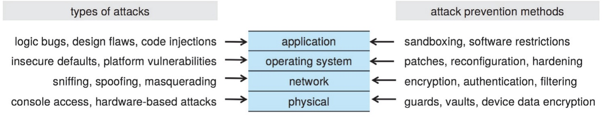
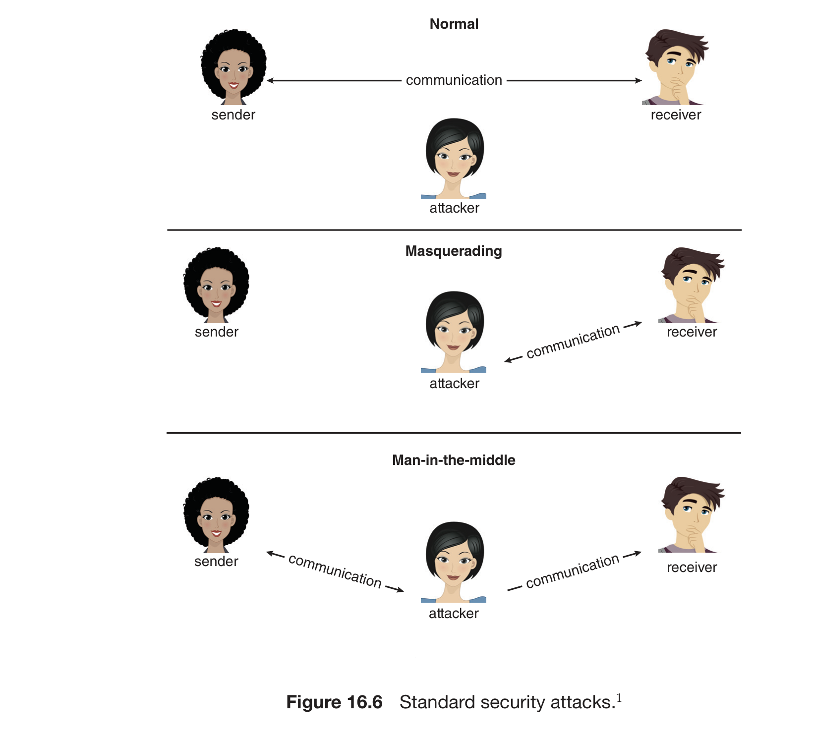
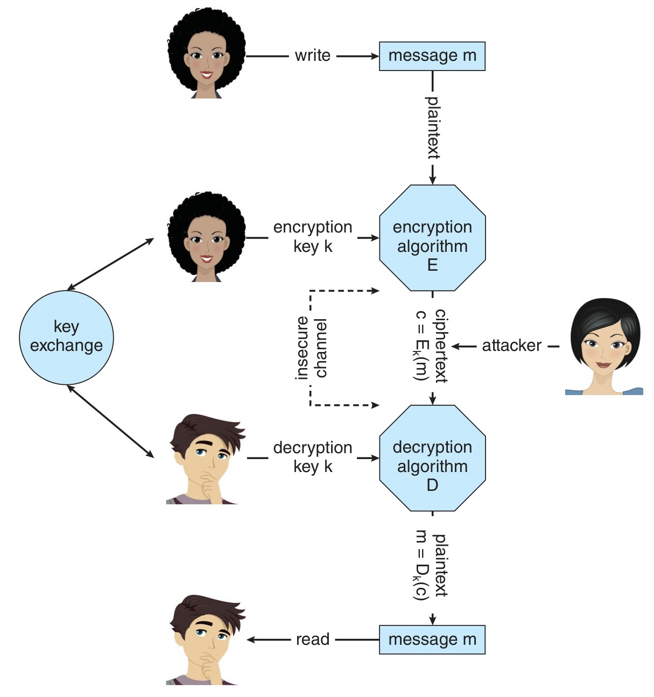
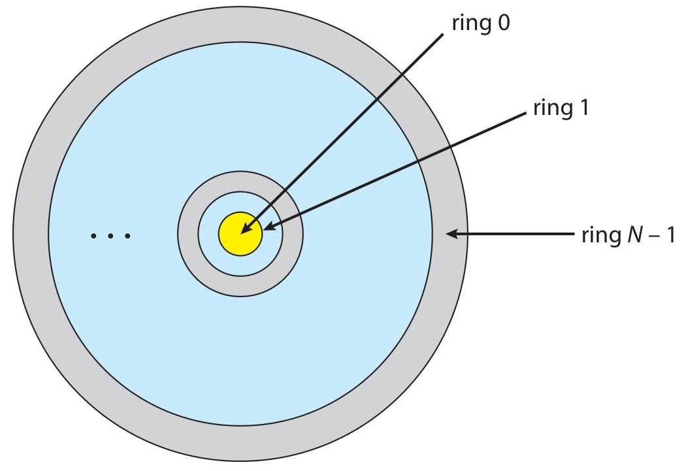
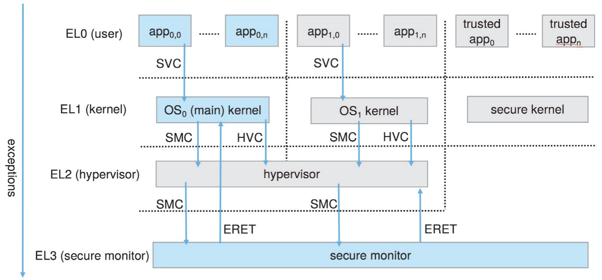

# Week 14 Lecture — Security and Protection

> **Last Updated:** 2026-06-19
>
> Operating System Concepts, Silberschatz - Ch 16, 17

> **Learning Objectives**:
> 1. Distinguish **Security** from **Protection** and explain the **CIA triad** (confidentiality, integrity, availability) plus extra violation types (theft of service, DoS)
> 2. Distinguish **threat** from **attack** and list major attacks (masquerading, replay, MITM, session hijacking, privilege escalation)
> 3. Explain the **four-layer security model**, the "weakest link," the human factor (social engineering), and the **attack surface**
> 4. Classify **malware** (Trojan, Spyware, Ransomware, Back door, Logic bomb) and explain how the **principle of least privilege** governs the blast radius
> 5. Explain **code injection** — buffer overflow (stack layout, return-address overwrite), shellcode/NOP-sled, SQL injection — and its defenses
> 6. Distinguish **viruses** (by type) from **worms** along host requirement, propagation, and damage
> 7. Distinguish **network threats** (sniffing, spoofing, MITM, DoS/DDoS, SYN flood, port scanning) and explain zombie/botnet concepts
> 8. Explain **symmetric/asymmetric** crypto (AES, RSA), **hashing** (SHA, salt), **digital signatures/certificates**, the **TLS handshake**, and the **key-distribution problem**
> 9. Explain the **three authentication factors**, password vulnerabilities, **OTP**, and **MFA**
> 10. Explain the **goals of protection** and core principles (least privilege, compartmentalization, defense in depth), and distinguish **need-to-know vs least-privilege**
> 11. Explain **protection rings** (Intel rings, ARM Exception Levels, TrustZone) and **domains / domain switching** (setuid)
> 12. Compare the **access matrix** and its implementations (global table, **ACL**, **capability**, lock-key) and explain **revocation**
> 13. Distinguish **access-control models** (RBAC, DAC vs MAC, SELinux, Linux capabilities)
> 14. Explain **sandboxing** (SECCOMP-BPF, Seatbelt) and **code signing** (SIP, Entitlements)

---

## Table of Contents

- [1. The Security Problem](#1-the-security-problem)
  - [1.1 Security vs Protection](#11-security-vs-protection)
  - [1.2 Three Principles of Security — the CIA Triad](#12-three-principles-of-security--the-cia-triad)
  - [1.3 Threat vs Attack](#13-threat-vs-attack)
  - [1.4 The Four-Layer Security Model](#14-the-four-layer-security-model)
- [2. Program Threats](#2-program-threats)
  - [2.1 Malware Overview](#21-malware-overview)
  - [2.2 Trojan Horse — Login Emulator](#22-trojan-horse--login-emulator)
  - [2.3 Ransomware and the Principle of Least Privilege](#23-ransomware-and-the-principle-of-least-privilege)
  - [2.4 Code Injection — Buffer Overflow](#24-code-injection--buffer-overflow)
  - [2.5 Shellcode and NOP-sled](#25-shellcode-and-nop-sled)
  - [2.6 SQL Injection](#26-sql-injection)
  - [2.7 Viruses](#27-viruses)
  - [2.8 Worms](#28-worms)
- [3. System and Network Threats](#3-system-and-network-threats)
  - [3.1 Attacking Network Traffic — Sniffing / Spoofing / MITM](#31-attacking-network-traffic--sniffing--spoofing--mitm)
  - [3.2 Denial of Service — DoS / DDoS](#32-denial-of-service--dos--ddos)
  - [3.3 Port Scanning](#33-port-scanning)
- [4. Cryptography](#4-cryptography)
  - [4.1 Overview](#41-overview)
  - [4.2 Symmetric Encryption](#42-symmetric-encryption)
  - [4.3 Asymmetric Encryption — RSA](#43-asymmetric-encryption--rsa)
  - [4.4 Symmetric vs Asymmetric and Hybrid](#44-symmetric-vs-asymmetric-and-hybrid)
  - [4.5 Hash Functions](#45-hash-functions)
  - [4.6 Hash Application — Password Storage and Salt](#46-hash-application--password-storage-and-salt)
  - [4.7 Digital Signatures](#47-digital-signatures)
  - [4.8 Digital Certificates](#48-digital-certificates)
  - [4.9 TLS](#49-tls)
  - [4.10 The Key-Distribution Problem](#410-the-key-distribution-problem)
- [5. User Authentication](#5-user-authentication)
  - [5.1 Authentication Methods — Three Factors](#51-authentication-methods--three-factors)
  - [5.2 Password Vulnerabilities](#52-password-vulnerabilities)
  - [5.3 One-Time Password (OTP)](#53-one-time-password-otp)
  - [5.4 Multifactor Authentication (MFA)](#54-multifactor-authentication-mfa)
- [6. Goals and Principles of Protection](#6-goals-and-principles-of-protection)
  - [6.1 Goals of Protection and Policy vs Mechanism](#61-goals-of-protection-and-policy-vs-mechanism)
  - [6.2 Key Protection Principles](#62-key-protection-principles)
  - [6.3 The Need-to-Know Principle](#63-the-need-to-know-principle)
- [7. Protection Rings](#7-protection-rings)
  - [7.1 Protection-Ring Structure](#71-protection-ring-structure)
  - [7.2 Intel and ARM Protection Rings](#72-intel-and-arm-protection-rings)
- [8. Domain of Protection](#8-domain-of-protection)
  - [8.1 Domain Structure](#81-domain-structure)
  - [8.2 Domain Switching — setuid](#82-domain-switching--setuid)
- [9. Access Matrix](#9-access-matrix)
  - [9.1 Access Matrix Overview](#91-access-matrix-overview)
  - [9.2 Domain Switching in the Matrix](#92-domain-switching-in-the-matrix)
  - [9.3 Modifying Access Rights — Copy / Owner / Control](#93-modifying-access-rights--copy--owner--control)
- [10. Implementation of the Access Matrix](#10-implementation-of-the-access-matrix)
  - [10.1 Global Table](#101-global-table)
  - [10.2 Access List (ACL) — Column-Based](#102-access-list-acl--column-based)
  - [10.3 Capability List — Row-Based](#103-capability-list--row-based)
  - [10.4 Lock-Key Mechanism](#104-lock-key-mechanism)
  - [10.5 Implementation Comparison](#105-implementation-comparison)
  - [10.6 Revocation of Access Rights](#106-revocation-of-access-rights)
- [11. Access-Control Models](#11-access-control-models)
  - [11.1 RBAC — Role-Based Access Control](#111-rbac--role-based-access-control)
  - [11.2 DAC vs MAC](#112-dac-vs-mac)
  - [11.3 MAC — Security Labels and SELinux](#113-mac--security-labels-and-selinux)
  - [11.4 Linux Capabilities](#114-linux-capabilities)
- [12. Sandboxing and Code Signing](#12-sandboxing-and-code-signing)
  - [12.1 Sandboxing](#121-sandboxing)
  - [12.2 Sandbox Profile Example](#122-sandbox-profile-example)
  - [12.3 Code Signing](#123-code-signing)
  - [12.4 System Integrity Protection (SIP)](#124-system-integrity-protection-sip)
- [13. Lab — Implementing an Access-Control System](#13-lab--implementing-an-access-control-system)
- [Summary](#summary)
- [Self-Check Questions](#self-check-questions)

---

<br>

## 1. The Security Problem

### 1.1 Security vs Protection

| Aspect      | Security                                  | Protection                          |
|-------------|-------------------------------------------|-------------------------------------|
| **Definition** | A measure of confidence that the integrity of a system and its data will be preserved | A set of mechanisms that control processes' and users' access to resources |
| **Focus**   | Protecting the system from external threats | Controlling internal resource access |
| **Target**  | Attackers, malware, network threats       | Processes, users, roles             |
| **Scope**   | Physical, network, OS, application        | Domains, access matrix, privileges  |
| **Textbook**| Ch 16                                     | Ch 17                               |

- **Security** is the broader, outward-facing notion of "confidence that the system will behave trustworthily,"
- while **Protection** is the concrete *mechanism* inside the OS that realizes that confidence. Protection is a subset of, and the foundation for, security.

### 1.2 Three Principles of Security — the CIA Triad

| Principle                  | Meaning                                       | Violation Example               |
|----------------------------|-----------------------------------------------|---------------------------------|
| **Confidentiality**        | Only authorized users can *access* information | Eavesdropping, information leakage |
| **Integrity**              | Only authorized users can *modify* information | Data tampering, source-code manipulation |
| **Availability**           | Authorized users can *access* resources when needed | DoS attacks, system outages |

Additional types of security violation:

- **Theft of Service:** unauthorized use of resources (e.g. cryptocurrency mining, spam relay).
- **Denial of Service:** preventing legitimate users from using the system.

> The CIA triad is the starting point of every security discussion. Whatever the attack, it ultimately breaks one or more of these three — eavesdropping targets confidentiality, tampering targets integrity, DoS targets availability.

### 1.3 Threat vs Attack

| Concept          | Definition                                          |
|------------------|-----------------------------------------------------|
| **Threat**       | A potential security violation — *the discovery of a vulnerability* (a possibility) |
| **Attack**       | An actual attempt to breach security — *a concrete action* |

Major attack types:

| Attack Type                  | Description                                    |
|------------------------------|------------------------------------------------|
| **Masquerading**             | Impersonating another user/system              |
| **Replay Attack**            | Maliciously repeating a valid data transmission |
| **Man-in-the-Middle**        | Intercepting or modifying data during communication |
| **Session Hijacking**        | Taking over an active communication session    |
| **Privilege Escalation**     | Gaining higher privileges than authorized      |

### 1.4 The Four-Layer Security Model



*Silberschatz Figure 16.1 — the four-layered model of security*

Security must be addressed simultaneously across four layers: Physical → Network → Operating System → Application.

- **Weakest link:** security is only as strong as its *weakest layer* (the chain analogy). If one layer is breached, the whole is at risk.
- **Human factor:** attacks targeting *people*, such as social engineering and phishing — often the most vulnerable link.
- **Attack surface:** the set of points where an attacker can attempt to infiltrate. Reducing the attack surface is a core defensive strategy.

---

<br>

## 2. Program Threats

### 2.1 Malware Overview

**Malware:** software designed to exploit, disable, or damage a system.

| Type                       | Description                                                |
|----------------------------|-----------------------------------------------------------|
| **Trojan Horse**           | Disguised as a legitimate program but executes malicious functions |
| **Spyware**                | Secretly collects user information and sends it externally (adware, keylogger) |
| **Ransomware**             | Encrypts files and demands payment for decryption         |
| **Back Door (Trap Door)**  | A secret access path left by a developer                  |
| **Logic Bomb**             | Malicious code that activates when specific conditions are met |

- A Trojan-Horse variant: the **login emulator** (fake login screen).
- Violating the **principle of least privilege** maximizes malware damage — if a program running with excessive privileges is compromised, the whole system falls.

### 2.2 Trojan Horse — Login Emulator

**Login-emulator attack scenario:**

```text
  1. The attacker leaves a fake login screen running
  2. The victim attempts to log in → "Password error" message is shown
  3. In reality, the ID/PW are sent to the attacker
  4. The fake program exits and the real login prompt appears
  5. The victim thinks "it was a typo" and logs in again (succeeds normally)
```

**Defenses:**
- Use a *non-trappable key sequence* like **Ctrl+Alt+Delete** (Windows) — a secure attention sequence (SAK) that a fake program cannot intercept.
- Display session-usage information at session termination (last login time, etc.).
- Verify URL accuracy (phishing prevention).

### 2.3 Ransomware and the Principle of Least Privilege

**Ransomware operation:**

```text
  1. Malware infection (phishing emails, vulnerable services, etc.)
  2. Encrypts files on the system using a strong encryption algorithm
  3. Demands payment (cryptocurrency) in exchange for the decryption key
  4. No guarantee of receiving the key even after payment
```

**The Principle of Least Privilege:**
- Grant programs and users only the **minimum privileges** needed for their tasks.
- Excessive privileges let malware take over the entire system.
- The OS should provide **fine-grained access control**.

### 2.4 Code Injection — Buffer Overflow

Most security threats occur through **code injection**.

**Buffer Overflow:** overwriting adjacent memory by providing input that exceeds buffer boundaries.

```c
#include <stdio.h>
#define BUFFER_SIZE 64

void vulnerable(char *input) {
    char buffer[BUFFER_SIZE];
    strcpy(buffer, input);   // No length check → overflow possible
}

// Safe version
void safe(char *input) {
    char buffer[BUFFER_SIZE];
    strncpy(buffer, input, sizeof(buffer) - 1);  // Length limited
    buffer[sizeof(buffer) - 1] = '\0';
}
```

- `strcpy()`, `sprintf()`, `gets()` are **dangerous functions** (no length check).
- Use *size-aware* functions like `strncpy()`, `snprintf()` instead.

**Consequences of a buffer overflow** — the stack (high address → low address):

```text
  ┌──────────────────┐
  │  Return Address   │  ← (3) overwrite this → control the code flow
  ├──────────────────┤
  │  Saved EBP        │  ← (2) frame pointer can be corrupted
  ├──────────────────┤
  │  Local Variables  │  ← (2) adjacent variables overwritten
  ├──────────────────┤
  │  buffer[64]       │  ← (1) within the padding range: no effect
  └──────────────────┘
         ↑ overflow direction
```

Consequences by overflow size:
1. **Small overflow** → absorbed by the padding area, no impact.
2. **Medium overflow** → overwrites adjacent variables, possible program crash.
3. **Large overflow** → **return-address corruption** → arbitrary code (shellcode) execution.

### 2.5 Shellcode and NOP-sled

**Shellcode:** code injected by the attacker (typically spawns a shell).

```c
void exploit(void) {
    execvp("/bin/sh", "/bin/sh", NULL);  // Spawn a shell
}
```

Attack process:
1. The attacker includes shellcode in user input.
2. A buffer overflow changes the return address to point to the shellcode location.
3. The shellcode executes when the function returns.

**NOP-sled:** since hitting the exact address is difficult, a large number of NOP (no-operation) instructions are placed before the shellcode. If the jump lands anywhere in the NOP region, the CPU *slides* through them and reaches the shellcode.

```text
  [NOP NOP NOP NOP NOP ... NOP] [SHELLCODE]
   ←──── NOP-sled ────────→     ← payload
```

- **Script kiddie:** a novice attacker who uses exploits created by other hackers.

### 2.6 SQL Injection

An attack that inserts SQL statements into user input to manipulate the database.

```text
  Normal input:     username = "alice"
  SQL query:        SELECT * FROM users WHERE name = 'alice'

  Malicious input:  username = "' OR '1'='1"
  SQL query:        SELECT * FROM users WHERE name = '' OR '1'='1'
  → All records are returned (authentication bypass)
```

**Defenses:**
- Use **Prepared Statements** (parameterized queries).
- Input **validation** and **sanitization**.
- Grant minimum privileges to DB accounts.

```java
// Safe approach (Prepared Statement)
PreparedStatement stmt = conn.prepareStatement(
    "SELECT * FROM users WHERE name = ?");
stmt.setString(1, username);  // Automatic escaping
```

### 2.7 Viruses

**Virus:** self-replicating code that spreads by **inserting itself** into other programs.

- **Requires a host program** (cannot run independently).
- Mainly spreads through user actions (executing files, email attachments).

| Virus Type      | Description                                       |
|-----------------|---------------------------------------------------|
| **File Virus**  | Inserts into executable files (parasitic virus)   |
| **Boot Virus**  | Infects the boot sector, executes before the OS loads |
| **Macro Virus** | Inserts into document macros (VBA, etc.), infects Office files |
| **Polymorphic** | Mutates code on each infection → evades signature detection |
| **Encrypted**   | Contains an encrypted virus + decryption code     |
| **Stealth**     | Evades detection by modifying system calls        |
| **Rootkit**     | Infects the OS itself, takes over the whole system |
| **Armored**     | Obfuscated to make analysis difficult             |

### 2.8 Worms

**Worm:** malware that propagates **autonomously** through networks.

- **No host program required** (can run independently).
- Spreads automatically over the network → generates massive traffic.

**Virus vs Worm:**

| Property        | Virus                     | Worm                        |
|-----------------|---------------------------|-----------------------------|
| Host program    | Required                  | Not required                |
| Propagation     | User action (file execution) | Automatic via network    |
| Self-replication| Inserts into other programs | Replicates independently  |
| Primary damage  | File corruption, system failure | Network paralysis, resource exhaustion |

- **Morris Worm** (1988): the first internet worm, exploited a buffer overflow.
- Modern worms are used to build botnets (DDoS, spam distribution).

---

<br>

## 3. System and Network Threats

### 3.1 Attacking Network Traffic — Sniffing / Spoofing / MITM

| Attack Type          | Description                                | Classification |
|----------------------|--------------------------------------------|----------------|
| **Sniffing**         | Eavesdropping on network packets to steal information | Passive attack |
| **Spoofing**         | Forging IP/MAC addresses to impersonate a trusted source | Active attack |
| **Man-in-the-Middle**| Intercepting and modifying data during communication | Active attack |



*Silberschatz Figure 16.6 — standard security attacks*

- **Zombie system:** a system hijacked by a hacker, used to conceal the source of attacks.
- **WarDriving:** searching for unprotected WiFi networks to gain access.

> **Passive vs active:** sniffing only *observes* data, so it is hard to detect — a **passive attack**. Spoofing/MITM *manipulate* data — **active attacks** that leave traces but cause greater damage.

### 3.2 Denial of Service — DoS / DDoS

**DoS:** disrupting normal service by sending excessive requests to a server.

| Type                  | Description                              |
|-----------------------|------------------------------------------|
| **Resource Exhaustion** | Depleting CPU, memory, bandwidth, etc. |
| **Network Disruption**  | Disabling the network itself           |
| **DDoS**              | Simultaneous attack from multiple zombies (botnet) |

**SYN Flood attack:**

```text
  Attacker → [SYN] → Server     (connection request)
  Server   → [SYN-ACK] → ???    (waiting for response)
  ※ ACK never arrives, half-open connections accumulate
  → Server's connection table is exhausted → legitimate connections denied
```

- DDoS is sometimes combined with **blackmail** (extortion).
- Defenses: rate limiting, upstream filtering, adding resources.

### 3.3 Port Scanning

**Port Scanning:** probing open ports to discover vulnerable services.

- Not an attack itself, but a **reconnaissance** phase.
- Security administrators also use it for service auditing.

```text
  Attacker → Port 21 (FTP)     → No response (closed)
  Attacker → Port 22 (SSH)     → Response (open!) → check version
  Attacker → Port 80 (HTTP)    → Response (open!) → identify web server
  Attacker → Port 443 (HTTPS)  → Response (open!)
  ...
```

- **Fingerprinting:** identifying the OS type and service versions to search for known vulnerabilities.
- Key tools:
  - **nmap:** network exploration and security-auditing tool.
  - **Metasploit:** vulnerability exploit-testing framework.

---

<br>

## 4. Cryptography

### 4.1 Overview

**Cryptography:** technology that enables secure communication over untrusted channels (network environments).

Components of a cryptographic algorithm:
- **K** = set of keys
- **M** = set of plaintext messages
- **C** = set of ciphertexts
- **E** : K → (M → C) — encryption function
- **D** : K → (C → M) — decryption function

Key property: given a ciphertext $c$, recovering the original message $m$ without the key $k$ must be **computationally infeasible**.

| Type       | Key Structure       | Speed  | Key Exchange |
|------------|---------------------|--------|--------------|
| Symmetric  | Same key            | Fast   | Difficult    |
| Asymmetric | Public/private key pair | Slow | Secure     |

### 4.2 Symmetric Encryption

Encryption and decryption use the **same key $k$**.



*Silberschatz Figure 16.7 — secure communication over an insecure medium*

| Algorithm | Key Length        | Characteristics                               |
|-----------|-------------------|-----------------------------------------------|
| **DES**   | 56-bit            | No longer secure, vulnerable to brute force   |
| **3DES**  | 168-bit           | DES repeated 3 times: $c = E_{k3}(D_{k2}(E_{k1}(m)))$ |
| **AES**   | 128/192/256-bit   | Current standard, fast and secure             |

- **Block cipher:** encrypts in fixed-size blocks (e.g. AES 128-bit block).
- **Stream cipher:** encrypts byte/bit by byte continuously, using XOR operations.
- Drawback: both sides must share the same key → the **key-exchange problem**.

### 4.3 Asymmetric Encryption — RSA

Encrypt with the public key, decrypt with the private key.

```text
  Plaintext m ──[Public Key ke]──→ Ciphertext c ──[Private Key kd]──→ Plaintext m
                  Encryption                         Decryption
```

**RSA algorithm** (Rivest, Shamir, Adleman):
- $p, q$: two large prime numbers, $N = p \times q$
- Public key $ke$: $ke \times kd \bmod (p-1)(q-1) = 1$
- Encryption: $c = m^{ke} \bmod N$
- Decryption: $m = c^{kd} \bmod N$

**RSA example** (small numbers):

```text
  p=7, q=13 → N=91, (p-1)(q-1)=72
  ke=5, kd=29   (5×29 mod 72 = 1)
  Encryption: 69^5  mod 91 = 62
  Decryption: 62^29 mod 91 = 69
```

> RSA's security rests on the assumption that **factoring a large composite is hard**. $N$ is public, but without knowing $p, q$ one cannot compute $kd$.

### 4.4 Symmetric vs Asymmetric and Hybrid

| Property      | Symmetric             | Asymmetric                      |
|---------------|-----------------------|---------------------------------|
| Key structure | One shared key        | Public key + private key pair   |
| Speed         | **Fast**              | Slow (tens to hundreds of times slower) |
| Key exchange  | Requires a secure channel | Public key freely distributed |
| Use cases     | Bulk data encryption  | Authentication, key exchange, small data |
| Representative algorithms | AES, DES  | RSA, ECC                        |

**Practical usage (hybrid encryption):**

```text
  1. Exchange a symmetric key securely using asymmetric encryption
  2. Subsequent communication uses (faster) symmetric encryption

  [Exchange AES key via RSA] → [Encrypt/decrypt data via AES]
```

- TLS/SSL uses this approach — combining asymmetric's *secure key exchange* with symmetric's *fast processing*.

### 4.5 Hash Functions

**Hash function $H(m)$:** arbitrary-length message → **fixed-length hash value** (message digest).

Properties:
- **One-way:** the original cannot be recovered from the hash value.
- **Collision Resistant:** computationally infeasible for different inputs to produce the same hash.
- A 1-bit change in input **completely changes** the hash (avalanche effect).

```text
  "Hello World"  ──[SHA-256]──→ a591a6d40bf420404a011733cfb7b190...
  "Hello World!" ──[SHA-256]──→ 7f83b1657ff1fc53b92dc18148a1d65d...
```

| Algorithm | Output Length | Status            |
|-----------|---------------|-------------------|
| MD5       | 128-bit       | **Not secure**    |
| SHA-1     | 160-bit       | Being phased out  |
| SHA-256   | 256-bit       | **Current standard** |
| SHA-3     | Variable      | Latest standard   |

### 4.6 Hash Application — Password Storage and Salt

Store hash values instead of **plaintext passwords**.

```text
  Registration:   password → H(password) → store hash in DB
  Authentication: input → H(input) → compare with stored hash
```

**Salt:** a random value added to the hash for enhanced security.

```text
  Without salt:  H("password123") → abc123...  (same password = same hash)
  With salt:     H("password123" + "x7k9") → def456...
                 H("password123" + "m2p5") → ghi789...
                 (same password, different salts → different hashes)
```

- **Dictionary-attack prevention:** with salt, every dictionary word must be re-hashed *for each salt*, so a precomputed **rainbow table** is rendered useless.
- UNIX `/etc/shadow`: stores hashed passwords readable only by the superuser.

### 4.7 Digital Signatures

A mechanism for verifying the **integrity** and **origin** of a message.

- Uses public-key cryptography in **reverse**: sign with the private key, verify with the public key.

```text
  Signature creation:     signature = H(m)^ks mod N      (sign with private key ks)
  Signature verification: H(m) =? signature^kv mod N      (verify with public key kv)
```

**MAC (Message Authentication Code):**
- Authentication using a symmetric key → only key holders can create/verify.

**Applications of digital signatures:**
- **Nonrepudiation:** the signer cannot deny the action.
- **Code Signing:** verifying the integrity and origin of programs.
- **Electronic document signing:** digital contracts, certificates.

### 4.8 Digital Certificates

An electronic document in which a **Certificate Authority (CA)** vouches for the owner of a public key.

```text
  Certificate:
    Subject:    www.example.com
    Public Key: [RSA 2048-bit key]
    Issuer:     Trusted CA
    Validity:   2025-01-01 ~ 2026-12-31
    Signature:  [Signed with CA's private key]
```

**Certificate chain (Chain of Trust):**

```text
  Root CA (built into the browser)
    ↓ signs
  Intermediate CA
    ↓ signs
  Server certificate (www.example.com)
```

- **X.509:** the standard format for digital certificates.
- The CA's public key is **pre-installed in the browser**.
- MITM prevention: verify the public key's authenticity via the certificate.

### 4.9 TLS

The encryption protocol underlying HTTPS (successor to SSL).

**TLS handshake process:**

```text
  Client                              Server
    │                                    │
    │──── ClientHello (nc) ────────→     │ (1) send random value
    │                                    │
    │←──── ServerHello (ns) ────────     │ (2) server random value +
    │←──── Certificate (certs) ────      │     send certificate
    │                                    │
    │   [Verify certificate]             │ (3) verify CA signature
    │                                    │
    │──── Eke(pms) ────────────→         │ (4) encrypt premaster secret
    │                                    │     with public key and send
    │                                    │
    │   ms = H(nc, ns, pms)              │ (5) both sides compute the
    │   (generate symmetric session key) │     same master secret
    │                                    │
    │←──── [AES encrypted comm] ────→    │ (6) communicate with symmetric key
```

> The essence: authenticate the server via its certificate, securely agree on a symmetric key via asymmetric crypto, then exchange the actual data with fast symmetric crypto (§4.4 hybrid).

### 4.10 The Key-Distribution Problem

**Symmetric key-exchange problem:**
- $N$ parties communicating pairwise require $N(N-1)/2$ keys.
- A secure channel is needed to deliver keys → out-of-band exchange has low scalability.

**Asymmetric public-key distribution problem:**

```text
  Man-in-the-Middle on a public key:

  Alice ──→ [Request public key] ──→ Bob
                     ↑
              Mallory sends her
              own public key instead

  Alice encrypts with Mallory's public key
  → Mallory decrypts, re-encrypts with Bob's public key, and forwards
```

**Solution:** public-key authentication via digital certificates — the CA vouches for the public key's owner, blocking MITM.

---

<br>

## 5. User Authentication

### 5.1 Authentication Methods — Three Factors

Three factors for verifying a user's identity:

| Factor                       | Category     | Examples                            |
|------------------------------|--------------|-------------------------------------|
| **Something you know**       | Knowledge    | Password, PIN, security questions   |
| **Something you have**       | Possession   | Smart card, OTP token, smartphone   |
| **Something you are**        | Biometrics   | Fingerprint, iris, facial recognition, voice |

**Password-based authentication:**
- The most common but has various vulnerabilities.
- A trade-off between convenience and security.

### 5.2 Password Vulnerabilities

| Attack Type           | Description                                    |
|-----------------------|------------------------------------------------|
| **Dictionary Attack** | Tries dictionary words and variations in sequence |
| **Brute Force**       | Tries all possible combinations (short passwords are vulnerable) |
| **Social Engineering**| Tricks users into directly revealing passwords |
| **Shoulder Surfing**  | Observing input over someone's shoulder        |
| **Sniffing**          | Stealing passwords from network traffic        |
| **Phishing**          | Inducing password entry via fake websites/emails |
| **Keylogger**         | Malware that records keyboard input            |

- 4-digit password: 10,000 possibilities → crackable in ~5,000 attempts on average.
- At 1 ms/attempt → cracked in **about 5 seconds**.
- Countermeasures: long passwords, mixed uppercase+lowercase+digits+special characters, attempt limits.

### 5.3 One-Time Password (OTP)

**OTP:** a password usable only once → prevents sniffing and replay attacks.

```text
  Challenge-Response method:
  1. Server → Client: send challenge (ch)
  2. Client: compute H(password, ch) → send authenticator
  3. Server: perform the same computation → compare results
  → Different challenge each time, so the authenticator differs each time
```

**OTP implementation methods:**
- Hardware tokens (RSA SecurID, etc.).
- Software apps (Google Authenticator, etc.).
- SMS authentication codes.

**Two-Factor Authentication (2FA):**
- "Something you have" (token) + "Something you know" (PIN) — if one is compromised, the other still protects.

### 5.4 Multifactor Authentication (MFA)

Combining two or more authentication factors for enhanced security.

```text
  Single factor:  Password only → vulnerable

  2FA examples:   Password (knowledge) + OTP (possession)
                  Password (knowledge) + Fingerprint (biometrics)

  3FA example:    Password (knowledge) + Smart card (possession) + Facial recognition (biometrics)
```

| Auth Level   | Factors | Security Strength | Use Cases             |
|--------------|---------|-------------------|-----------------------|
| Single factor| 1       | Low               | General websites      |
| 2FA          | 2       | Medium            | Online banking        |
| 3FA          | 3       | High              | Military/government systems |

**Biometrics pros and cons:**
- Pros: cannot be lost/stolen, high uniqueness.
- Cons: false-recognition rates exist, *cannot be changed* (catastrophic if leaked), privacy concerns.

---

<br>

## 6. Goals and Principles of Protection

### 6.1 Goals of Protection and Policy vs Mechanism

**Protection:** OS mechanisms that control resource access by processes and users.

Why protection is needed:
1. Prevent malicious access violations.
2. Ensure system resources are used only according to defined policies.
3. **Early detection of interface errors** between components → improved system reliability.

**Policy vs Mechanism:**

| Aspect    | Description           | Example                            |
|-----------|-----------------------|------------------------------------|
| Policy    | Decides **what** to do | "Students can only read their own files" |
| Mechanism | Decides **how** to do it | Access matrix, ACL               |

- **Separation** of policy and mechanism is important → no need to modify the mechanism when the policy changes. (The policy/mechanism separation from Week 9 reappears directly in protection design.)

### 6.2 Key Protection Principles

**Principle of Least Privilege:**
- Grant users/processes only the **minimum privileges** needed for their tasks.
- The UNIX practice of not running as root is a representative example.
- Excessive privileges expand the blast radius of errors or attacks.

**Compartmentalization (isolation):**
- Divide the system into independent zones.
- Prevent a breach in one zone from affecting others.
- Examples: DMZ, virtualization, containers.

**Defense in Depth (layered defense):**
- Deploy multiple security layers → if one is breached, the next defends.

```text
  [Firewall] → [IDS/IPS] → [OS Access Control] → [Application Auth] → [Data Encryption]
```

- **Audit Trail:** record access logs for attack detection and analysis.

### 6.3 The Need-to-Know Principle

**Need-to-Know:** a process should only access resources needed for its *current* task.

```text
  When Process P calls Procedure A():
  - A() can only access its local variables and passed parameters
  - It cannot access other variables of Process P

  When Process P invokes the Compiler:
  - The Compiler can only access related files (source, output, etc.)
  - It cannot access arbitrary files
```

| Concept         | Role                                |
|-----------------|-------------------------------------|
| Need-to-Know    | **Policy** — decides what access to allow |
| Least Privilege | **Mechanism** — the means to implement the policy |

---

<br>

## 7. Protection Rings

### 7.1 Protection-Ring Structure

A hardware-level privilege hierarchy — based on the **Bell-LaPadula model**.



*Silberschatz Figure 17.1 — protection-ring structure*

- Ring $i$ provides only a *subset* of Ring $j$ ($j < i$) functionality.
- **Ring 0** has the highest privilege (full privileges).
- Transition to a higher-privilege ring is only possible through a **gate** (e.g. a system call).

### 7.2 Intel and ARM Protection Rings

| Platform          | Structure           | Description                             |
|-------------------|---------------------|-----------------------------------------|
| **Intel x86**     | Ring 0~3            | Mostly only Ring 0 (kernel) and Ring 3 (user) are used |
| **Intel VT-x**    | Ring -1 added       | For the hypervisor (VMM)                |
| **ARM (early)**   | USR / SVC           | User mode / Supervisor mode             |
| **ARM TrustZone** | Secure / Normal World | Hardware-based secure-zone separation  |
| **ARMv8**         | EL0~EL3             | 4-level Exception Levels                |



*Silberschatz Figure 17.3 — ARM architecture*

- **TrustZone:** protects on-chip cryptographic keys — even the kernel cannot access them directly.
- Android 5.0+: actively uses TrustZone for password and encryption-key protection.

---

<br>

## 8. Domain of Protection

### 8.1 Domain Structure

**Domain:** the set of resources and privileges a process can access.

```text
  Domain = { <object-name, rights-set>, ... }

  D1 = { <File1, {read}>, <File2, {read, write}> }
  D2 = { <File2, {read}>, <Printer, {write}> }
  D3 = { <File1, {execute}>, <File3, {read}> }
```

**Domain association methods:**
- **Static:** the domain is fixed for the process lifetime → may grant excessive privileges.
- **Dynamic:** the process switches between domains → adheres to need-to-know.

**Domain implementations:**
- **User-based:** per-user domain, switches on logout/login.
- **Process-based:** per-process domain, switches via message passing.
- **Procedure-based:** per-procedure domain, switches on function calls.

### 8.2 Domain Switching — setuid

A process transitioning from one domain to another.

```text
  User Process (Ring 3, User Domain)
       │
       │ system call (syscall instruction)
       ↓
  Kernel (Ring 0, Kernel Domain)    ← domain switch
       │
       │ return
       ↓
  User Process (Ring 3, User Domain)
```

**UNIX setuid mechanism:**
- Setting the setuid bit on an executable → it runs with the **file owner's privileges**.
- Example: `passwd` → owned by root, setuid set → regular users can modify `/etc/shadow`.
- Risk: if a setuid binary has a vulnerability → **privilege escalation** is possible.

**Android Application ID:**
- Each app is assigned a unique UID/GID → isolation between apps.
- Each app owns its data directory `/data/data/<app-name>`.

---

<br>

## 9. Access Matrix

### 9.1 Access Matrix Overview

A model that represents resource access rights as a **matrix**.

| | F1 | F2 | F3 | Printer |
|------|------|------|------|---------|
| **D1** | read | read, write | | |
| **D2** | | read | read | write |
| **D3** | read, write | | read, write | |
| **D4** | read, write | | read, write | |

- **Row:** domain (subject) — users, processes, roles.
- **Column:** object — files, devices, memory regions.
- **Cell:** access rights — read, write, execute, etc.

Problem: in real systems most of the matrix is **empty** (a sparse matrix) → efficient implementation methods are needed (§10).

### 9.2 Domain Switching in the Matrix

Include domains as **objects** to control domain switching.

| | F1 | F2 | F3 | Printer | D1 | D2 | D3 | D4 |
|------|------|------|------|---------|------|------|------|------|
| **D1** | read | | read | | | switch | | |
| **D2** | | read, write | | | | | switch | switch |
| **D3** | | | execute | | | | | |
| **D4** | read, write | | read, write | | switch | | | |

- A `switch` in access(i, j) → switching from domain $D_i$ to $D_j$ is allowed.
- Example: $D_2$ can switch to $D_3$ or $D_4$.

### 9.3 Modifying Access Rights — Copy / Owner / Control

**Copy Right (`*`):**
- `read*` → the right can be *copied* to another domain in the same column.
- Transfer: copy then remove the original.
- Limited Copy: copy without `*` → re-copying is not allowed.

**Owner Right:**
- If access(i, j) includes owner → $D_i$ can add/delete all entries in column $j$.
- The file owner sets other users' access rights.

**Control Right:**
- Applies only to domain objects.
- If access(i, j) includes control → $D_i$ can delete access rights in row $j$.

**Confinement Problem:** ensuring information does not leak outside the execution environment → generally **undecidable**.

---

<br>

## 10. Implementation of the Access Matrix

Storing the whole sparse matrix is inefficient, so real systems represent it *partially*.

### 10.1 Global Table

The simplest implementation: a complete table of `<domain, object, rights-set>` triples.

```text
  < D1, F1, {read} >
  < D1, F2, {read, write} >
  < D2, F2, {read} >
  < D2, Printer, {write} >
  < D3, F1, {read, write} >
  < D3, F3, {read, write} >
  ...
```

- **Advantages:** simple to implement.
- **Disadvantages:**
  - The table is very large, **hard to keep in main memory** → extra I/O required.
  - Cannot leverage grouping (e.g. "all domains can read F1" → requires an individual entry per domain).

### 10.2 Access List (ACL) — Column-Based

Implemented based on the **columns (objects)** of the matrix — each object has a linked (domain, rights) list.

```text
  File1:    [(D1, {read}), (D3, {read, write})]
  File2:    [(D1, {read, write}), (D2, {read})]
  File3:    [(D2, {read}), (D3, {read, write})]
  Printer:  [(D2, {write})]
```

- **Default Rights:** can set default access rights for domains not in the list.
- On access request: search the object's ACL to check the domain's rights.
- **Advantages:** directly addresses user needs (specify access rights when creating files).
- **Disadvantages:** hard to determine all rights of a specific domain; an ACL search is required on every access → long lists cause performance degradation.

### 10.3 Capability List — Row-Based

Implemented based on the **rows (domains)** of the matrix — each domain has a linked (object, rights) list.

```text
  D1:  [(File1, {read}), (File2, {read, write})]
  D2:  [(File2, {read}), (File3, {read}), (Printer, {write})]
  D3:  [(File1, {read, write}), (File3, {read, write})]
```

- **Capability:** a *protected pointer* representing access rights to an object.
  - Possessing a capability grants access.
  - Managed by the OS; users cannot modify them directly.
- **Methods for protecting capabilities:**
  - **Tag method:** hardware uses a tag bit to distinguish capabilities from regular data.
  - **Separate address space:** store capability lists in separate memory accessible only by the OS.

### 10.4 Lock-Key Mechanism

A **compromise** between ACL and Capability List.

```text
  Assign a Lock (bit pattern) to each object:
    File1: Lock = [1010]
    File2: Lock = [0110]

  Assign a Key (bit pattern) to each domain:
    D1: Key = [1010]  → matches File1's Lock → access granted
    D2: Key = [0110]  → matches File2's Lock → access granted
```

- Access is granted if the Key matches the Lock.
- Keys can be freely transferred between domains.
- Changing the Lock enables effective **revocation of rights**.

### 10.5 Implementation Comparison

| Method           | Basis          | Advantages                    | Disadvantages                 |
|------------------|----------------|-------------------------------|-------------------------------|
| **Global Table** | Entire matrix  | Simple implementation         | Large table size, no grouping |
| **ACL**          | Column (object)| Intuitive for users, easy revocation | Hard to determine per-domain rights |
| **Capability**   | Row (domain)   | Fast access verification, process-centric | Difficult revocation       |
| **Lock-Key**     | Matching       | Flexible, easy revocation     | Key-management complexity     |

**Real systems** use a **combination** of ACL + Capability.
- **File open:** verify access rights via ACL.
- Create a **capability (file descriptor)** → subsequent access verified quickly via the capability.
- **File close:** delete the capability.
- Example: the UNIX file system (open → fd → read/write → close).

### 10.6 Revocation of Access Rights

Considerations when revoking rights:

| Question | Options                          |
|----------|----------------------------------|
| Timing   | **Immediate** vs **Delayed**     |
| Scope    | **Selective** vs **General**     |
| Extent   | **Partial** vs **Total**         |
| Duration | **Temporary** vs **Permanent**   |

| Method            | ACL                          | Capability                          |
|-------------------|------------------------------|-------------------------------------|
| Ease of revocation| **Easy** — delete from the list | **Difficult** — must find distributed capabilities |
| Immediate effect  | Yes                          | Depends on the method               |

**Capability revocation methods:**
- **Reacquisition:** periodically delete capabilities, requiring re-acquisition.
- **Back-pointers:** each object maintains a list of capability pointers (MULTICS).
- **Indirection:** indirect reference through a global table (CAL).
- **Keys:** invalidate existing capabilities by changing the master key.

---

<br>

## 11. Access-Control Models

### 11.1 RBAC — Role-Based Access Control

Access control through User → **Role** → Permission mapping.

```text
  Users          Roles            Permissions
  ┌──────┐      ┌──────────┐      ┌──────────────────┐
  │ Alice │──→  │  Admin   │──→   │ File: read/write │
  │  Bob  │──→  │  Editor  │──→   │ File: read/write │
  │ Carol │──→  │  Viewer  │──→   │ File: read       │
  └──────┘      └──────────┘      └──────────────────┘
```

**Advantages of RBAC:**
- Efficient management at the **role level** even with many users.
- Easy to apply the **principle of least privilege** — assign only necessary roles.
- When a user leaves the organization, simply remove them from the role.
- First fully adopted in Solaris 10.
- A *two-step* structure: assign privileges to roles, then assign roles to users.

### 11.2 DAC vs MAC

| Property         | DAC (Discretionary)      | MAC (Mandatory)            |
|------------------|--------------------------|----------------------------|
| Definition       | Resource owner sets access rights | System-enforced access policy |
| Permission setting | User (owner)           | System administrator/policy |
| Root privileges  | Root can access everything | **Root cannot change the policy** |
| Flexibility      | High                     | Low (subject to policy)    |
| Security strength| Relatively low           | High                       |
| Examples         | UNIX file permissions    | SELinux, macOS SIP         |

**Limitations of DAC:** owners can arbitrarily set/change permissions; no restriction on root.
**Need for MAC:** even with root privileges, access is blocked by policy — essential for military/government agencies.

### 11.3 MAC — Security Labels and SELinux

The core of MAC: **labels** (security labels).

- Assign labels to subjects (processes) and objects (files, devices).
- The policy determines whether access between labels is allowed/denied.

```text
  Security levels:  Unclassified < Secret < Top Secret

  "Secret" user:
    ✓ Can access "Unclassified" files
    ✓ Can access "Secret" files
    ✗ Cannot access "Top Secret" files (cannot even see they exist)
```

**SELinux (Security-Enhanced Linux):**
- A MAC implementation in the Linux kernel, developed by the NSA.
- Fine-grained access control via policy files.
- Integrated into most Linux distributions.

**Other implementations:** macOS (TrustedBSD-based), Windows (Mandatory Integrity Control).

### 11.4 Linux Capabilities

Subdivide root privileges to grant processes only the **necessary permissions**.

```text
  Traditional UNIX:  root = all privileges (all-or-nothing)

  Linux Capabilities:
    CAP_NET_BIND_SERVICE  → bind to ports below 1024
    CAP_SYS_ADMIN         → system administration tasks
    CAP_DAC_OVERRIDE      → override file access controls
    CAP_NET_RAW           → use raw sockets
    ... (managed as bitmasks)
```

**Three bitmasks:**
- **Permitted:** capabilities that are allowed.
- **Effective:** currently active capabilities.
- **Inheritable:** capabilities that can be inherited by child processes.

- Once a capability is **revoked, it cannot be reacquired**.
- A direct implementation of the **principle of least privilege**.
- Android also uses Linux capabilities (avoiding root for system processes).

---

<br>

## 12. Sandboxing and Code Signing

### 12.1 Sandboxing

**Isolating** a program's execution environment to limit its impact on the system.

| Example         | Description                               |
|-----------------|-------------------------------------------|
| **Web Browser** | Isolates each tab/plugin in a separate process |
| **Mobile App**  | Independent filesystem and permission system per app |
| **Container**   | Application-environment isolation via Docker, etc. |
| **Virtual Machine** | Complete isolation at the hardware level |
| **Java/JVM**    | Sandbox restrictions at the virtual-machine level |

**Sandboxing implementation methods:**
- **MAC policy-based:** SELinux labels (Android).
- **System-call filtering:** SECCOMP-BPF (Linux) — limits the system calls a process can invoke.
- **Profile-based:** Apple Seatbelt (macOS) — dynamic profiles written in the Scheme language, customized per binary.

### 12.2 Sandbox Profile Example

**macOS Sandbox Profile** (Scheme language):

```scheme
(version 1)
(deny default)                              ; Deny all operations by default
(allow file-chroot)                         ; Allow chroot
(allow file-read-metadata (literal "/var")) ; Allow reading /var metadata
(allow sysctl-read)                         ; Allow sysctl reads
(allow mach-per-user-lookup)
(allow mach-lookup
  (global-name "com.apple.system.logger"))  ; Allow access only to logger service
```

**SECCOMP-BPF** (Linux):
- Define system-call filters using the Berkeley Packet Filter language.
- Apply to processes via the `prctl()` system call.
- Restrictions inherited by child processes on fork.
- Automatically applied to all apps in the Android Bionic C library.

### 12.3 Code Signing

Verify code **integrity** and **origin** through **digital signatures**.

```text
  Developer                          User System
  ┌────────┐                        ┌──────────┐
  │ Code   │──[Private Key]──→ Signature
  └────────┘                        │
  Code + Signature ──[Public Key]──→ Integrity/origin check
                                    ├─ Success: allow execution
                                    └─ Failure: block execution or warn
```

| OS          | Implementation                             |
|-------------|--------------------------------------------|
| **Windows** | Driver Signing, Authenticode               |
| **macOS**   | Gatekeeper, SIP (System Integrity Protection) |
| **iOS**     | All apps require signing; Apple signs for App Store distribution |
| **Android** | APK Signing (developer signature)          |

- **Block or warn** when unsigned code is executed.
- Apple **Entitlements:** permissions declared in an XML plist, included in the code signature.

### 12.4 System Integrity Protection (SIP)

A **system-protection mechanism** introduced in macOS 10.11.

**SIP features:**
- Restricts access to system files and resources.
- **Even the root user** cannot modify system files.
- Only allows code-signed kernel extensions.
- Prevents debugging/tampering of system binaries.

```text
  Traditional UNIX:
    root → can access/modify all files

  With SIP:
    root → can manage other users' files
           can install/remove programs
           ✗ cannot modify system files
           ✗ cannot tamper with kernel extensions
```

- SIP is enforced on all processes at boot time.
- Only Apple-signed binaries with **Entitlements** are exceptions.

> SIP applies the MAC thinking of §11.2 to macOS — under DAC, root would be omnipotent, but under SIP (a MAC) even root is bound by policy.

---

<br>

## 13. Lab — Implementing an Access-Control System

The concepts of §9–§11 implemented in Python.

**Access Matrix:**

```python
class AccessMatrix:
    def __init__(self):
        self.matrix = {}  # {domain: {object: set(rights)}}

    def add_right(self, domain, obj, right):
        if domain not in self.matrix:
            self.matrix[domain] = {}
        if obj not in self.matrix[domain]:
            self.matrix[domain][obj] = set()
        self.matrix[domain][obj].add(right)

    def check_access(self, domain, obj, right):
        if domain in self.matrix:
            if obj in self.matrix[domain]:
                return right in self.matrix[domain][obj]
        return False

    def revoke_right(self, domain, obj, right):
        if domain in self.matrix:
            if obj in self.matrix[domain]:
                self.matrix[domain][obj].discard(right)
```

**ACL and Capability List** (column-based and row-based, respectively):

```python
class ACL:
    """Column (object) based — (domain, rights) list per object"""
    def __init__(self):
        self.acl = {}  # {object: {domain: set(rights)}}

    def grant(self, obj, domain, right):
        self.acl.setdefault(obj, {}).setdefault(domain, set()).add(right)

    def check(self, obj, domain, right):
        return right in self.acl.get(obj, {}).get(domain, set())

    def revoke(self, obj, domain, right):
        if obj in self.acl and domain in self.acl[obj]:
            self.acl[obj][domain].discard(right)


class CapabilityList:
    """Row (domain) based — (object, rights) list per domain"""
    def __init__(self):
        self.caps = {}  # {domain: {object: set(rights)}}

    def grant(self, domain, obj, right):
        self.caps.setdefault(domain, {}).setdefault(obj, set()).add(right)

    def check(self, domain, obj, right):
        return right in self.caps.get(domain, {}).get(obj, set())
```

**RBAC:**

```python
class RBAC:
    def __init__(self):
        self.roles = {}          # {role: {object: set(rights)}}
        self.user_roles = {}     # {user: set(roles)}

    def add_role(self, role):
        if role not in self.roles:
            self.roles[role] = {}

    def assign_permission(self, role, obj, right):
        if role not in self.roles:
            self.roles[role] = {}
        if obj not in self.roles[role]:
            self.roles[role][obj] = set()
        self.roles[role][obj].add(right)

    def assign_role(self, user, role):
        if user not in self.user_roles:
            self.user_roles[user] = set()
        self.user_roles[user].add(role)

    def check_access(self, user, obj, right):
        if user not in self.user_roles:
            return False
        for role in self.user_roles[user]:
            if role in self.roles and obj in self.roles[role]:
                if right in self.roles[role][obj]:
                    return True
        return False
```

**Simulation:**

```python
# Access Matrix test
am = AccessMatrix()
am.add_right("D1", "File1", "read")
am.add_right("D1", "File2", "read")
am.add_right("D1", "File2", "write")
am.add_right("D2", "File2", "read")
am.add_right("D2", "Printer", "write")

print(am.check_access("D1", "File2", "write"))   # True
print(am.check_access("D2", "File2", "write"))   # False

# RBAC test
rbac = RBAC()
rbac.add_role("admin")
rbac.add_role("editor")
rbac.add_role("viewer")
rbac.assign_permission("admin", "File1", "read")
rbac.assign_permission("admin", "File1", "write")
rbac.assign_permission("viewer", "File1", "read")
rbac.assign_role("Alice", "admin")
rbac.assign_role("Bob", "viewer")

print(rbac.check_access("Alice", "File1", "write"))  # True
print(rbac.check_access("Bob", "File1", "write"))    # False
```

> **Assignment:** extend the implementation above with role add/delete, permission revocation, and access logging (audit trail) features.

---

<br>

## Summary

| Topic              | Key Content                                                      |
|--------------------|------------------------------------------------------------------|
| **CIA**            | Confidentiality, Integrity, Availability                         |
| **Malware**        | Trojan, Spyware, Ransomware, Back Door, Logic Bomb               |
| **Code Injection** | Buffer Overflow, SQL Injection, Shellcode/NOP-sled               |
| **Virus vs Worm**  | Host requirement, propagation-method differences                 |
| **Network Threats**| Sniffing, Spoofing, DoS/DDoS, MITM, Port Scanning                |
| **Cryptography**   | Symmetric (AES), Asymmetric (RSA), Hashing (SHA), salt           |
| **TLS**            | Hybrid encryption, certificate-based handshake                   |
| **Authentication** | Password, Biometrics, OTP, MFA (three factors)                   |
| **Protection Principles** | Least Privilege, Compartmentalization, Defense in Depth, need-to-know |
| **Protection Rings**| Intel Rings, ARM Exception Levels, TrustZone                    |
| **Access Matrix**  | ACL (column-based), Capability (row-based), Lock-Key             |
| **RBAC/MAC/DAC**   | Role-based, Mandatory, Discretionary access control             |
| **Sandboxing**     | Process isolation, SECCOMP-BPF, Apple Seatbelt                  |
| **Code Signing**   | Digital signatures, SIP, Entitlements                           |

**Key takeaways:**

1. **Security** is a measure of confidence in system integrity (outward-facing, Ch 16), while **Protection** is the OS mechanism that realizes it (Ch 17). Every attack ultimately breaks one or more of the **CIA** triad.
2. Most **program threats** (malware, buffer overflow, SQL injection) and **network threats** (sniffing, spoofing, DoS) stem from **code injection** and **least-privilege violations**.
3. **Cryptography** combines symmetric (fast) and asymmetric (secure key exchange) into a **hybrid** (TLS), and uses hashing (+salt) and digital signatures/certificates to guarantee integrity, origin, and identity.
4. The two pillars of **protection design** are *policy vs mechanism separation* and *least privilege* — need-to-know (policy) is implemented by least-privilege (mechanism).
5. The **access matrix** is the abstract model of protection; real implementations combine **ACL (column)** and **Capability (row)** — verify with ACL on open, then handle the rest quickly via the fd capability.
6. **RBAC/MAC/DAC**, **protection rings**, **sandboxing**, and **code signing/SIP** all implement least privilege and defense in depth at different layers — MAC, which binds even root, is the strongest backstop.

> "Security is only as strong as its weakest link — crypto, authentication, and access control alike: if one layer is breached, the next must hold (defense in depth)."

---

<br>

## Self-Check Questions

1. **Security vs Protection, CIA:** Distinguish security from protection, and state which of the CIA triad is violated by eavesdropping, data tampering, and a DoS attack.

   > **Answer:** **Security** is a *measure of confidence* that the integrity of a system and its data will be preserved — an outward-facing notion against external threats (attackers, malware, networks; Ch 16). **Protection** is the *internal OS mechanism* (Ch 17) that controls processes'/users' access to resources, the foundation for and a subset of security. CIA violations: **eavesdropping** → unauthorized *access*, so **Confidentiality**; **data tampering** → unauthorized *modification*, so **Integrity**; **DoS** → *blocking* legitimate users' *access*, so **Availability**.

2. **Staged consequences of buffer overflow:** Explain how a buffer overflow worsens from harmless → crash → arbitrary code execution as input size grows, with reference to the stack layout.

   > **Answer:** The stack grows (from low addresses) `buffer[64]` → `local variables` → `Saved EBP` → `Return Address` (high addresses), and the overflow overwrites adjacent memory in the low→high direction. (1) **Small overflow:** stops within the padding range, no effect. (2) **Medium overflow:** overwrites adjacent *local variables* and *Saved EBP* (frame pointer), causing bad values / crashes. (3) **Large overflow:** overwrites the **Return Address**, so on function return control flow jumps to an attacker-chosen address (injected shellcode) → **arbitrary code execution**. Defenses: use size-aware functions (`strncpy` instead of `strcpy`), plus OS/compiler stack canaries, ASLR, and the NX bit.

3. **Role of the NOP-sled:** Explain why a NOP-sled is needed in a shellcode attack and what it makes easier.

   > **Answer:** The attacker must overwrite the return address with the *exact* start address of the shellcode, but stack addresses vary by environment/ASLR and are hard to hit precisely. A **NOP-sled** is a region of many NOP instructions (which do nothing and proceed to the next instruction) placed before the shellcode. If the jump lands *anywhere* in the NOP region, the CPU slides through the NOPs and eventually reaches the shellcode. So the NOP-sled enlarges the "target to hit" from a single point to a wide range, raising the attack's success probability. (A novice who merely reuses such exploits is a *script kiddie*.)

4. **Virus vs Worm:** Compare the two malware along host requirement, propagation, and primary damage. What does the Morris Worm illustrate?

   > **Answer:** A **virus** *requires a host program* (cannot run independently), *inserts itself* into other programs, spreads mainly through *user actions* (running files, opening attachments), and damages files / causes system failure. A **worm** *requires no host* (runs independently), replicates and spreads *autonomously* over the *network*, and causes network paralysis / resource exhaustion. The **Morris Worm (1988)**, the first internet worm, exploited a *buffer overflow* to spread without human intervention — showing how a code vulnerability becomes a channel for autonomous propagation, and how network connectivity *amplifies* threats. Modern worms build botnets for DDoS/spam.

5. **Symmetric vs Asymmetric and Hybrid:** Compare the speed and key-exchange properties of the two ciphers and explain why TLS combines them.

   > **Answer:** **Symmetric** (AES, DES) uses the *same key* for encryption/decryption → **fast**, but both sides must share the key, raising the *key-exchange problem* (needs a secure channel; $N$ parties need $N(N-1)/2$ keys). **Asymmetric** (RSA, ECC) uses a *public/private key pair* so the public key can be freely distributed, making *key exchange secure*, but it is tens to hundreds of times **slower**. **Hybrid (TLS)** takes the best of both: ① use the slow-but-secure *asymmetric* cipher to exchange/agree on a symmetric session key (premaster secret), then ② handle bulk data with the fast *symmetric* cipher (AES). It gains asymmetric's key-exchange security and symmetric's processing performance at once.

6. **Role of salt:** What attack does salt prevent when storing passwords as hashes, and how?

   > **Answer:** Without salt, storing only the hash means *the same password always yields the same hash*, so an attacker can use a precomputed table of common-password hashes (a **rainbow table**) to reverse them at once, or instantly identify users with the same hash in a leaked DB. A **salt** is a *random value* appended per password; the system stores `H(password + salt)`. With different salts, the same password produces different hashes, so the attacker must re-hash the dictionary *for each salt* — defeating precomputed tables (preventing dictionary/rainbow-table attacks) — and users sharing a password get different hashes, isolating exposure. UNIX `/etc/shadow` is the canonical application.

7. **Policy vs Mechanism, Need-to-Know vs Least-Privilege:** Explain how the two pairs of concepts correspond.

   > **Answer:** **Policy** decides "*what* to allow/forbid," and **Mechanism** decides "*how* to enforce it" — separating them means a policy change does not require modifying the mechanism (access matrix / ACL). This distinction maps directly onto protection: **Need-to-Know** is the *policy* "a process accesses only the resources needed for its current task," while **Least-Privilege** is the *mechanism/means* "grant only the minimum privileges" to realize that policy. That is, need-to-know (policy) is implemented by least-privilege (mechanism). Both aim to narrow the blast radius of a breach.

8. **Protection rings and domain switching:** Explain the Ring 0 / Ring 3 structure and the domain switch that occurs when a user process needs kernel functionality. What is the risk of setuid?

   > **Answer:** **Protection rings** are a hardware privilege hierarchy: Ring $i$ has only a subset of Ring $j$'s ($j<i$) functionality, and **Ring 0** has the highest privilege. Intel typically uses only Ring 0 (kernel) and Ring 3 (user). When a user process (Ring 3, User Domain) needs kernel functionality, it can only **domain-switch** to Ring 0 (Kernel Domain) through a **gate (system call)**, returning to Ring 3 afterward — preventing arbitrary entry into a higher ring. **setuid risk:** an executable with the setuid bit runs with the *file owner's privileges* (often root; e.g. `passwd` modifying `/etc/shadow`). If that binary has a vulnerability (e.g. a buffer overflow), a regular user can exploit it to seize root privileges — **privilege escalation** becomes possible.

9. **ACL vs Capability:** Compare the pros and cons of implementing the access matrix column-based (ACL) vs row-based (Capability), and explain how real OSes combine them.

   > **Answer:** **ACL** (column = object) keeps a (domain, rights) list per object → intuitive for specifying "who can do what" at file creation, and *revocation is easy* (delete from the list). Downsides: determining *all rights a given domain holds* requires scanning every object, and every access needs a list search. **Capability** (row = domain) keeps an (object, rights) list per domain → process-centric, so *access verification is fast*. Downside: *revocation is hard* because distributed capabilities must all be found. **Real combination:** on file **open**, verify rights once via ACL, then issue a **capability (file descriptor)** → subsequent read/write are verified quickly via the fd → on **close**, delete the capability. UNIX's open→fd→read/write→close is exactly this pattern.

10. **DAC vs MAC, SIP:** Explain the core difference between the two access-control models from the root-privilege angle, and state which one macOS SIP belongs to.

    > **Answer:** **DAC (discretionary)** lets the resource *owner* set permissions arbitrarily, and **root can access everything** (UNIX file permissions). **MAC (mandatory)** has *system policy* enforce access, with the key point that **even root cannot change the policy** — a label-based policy (e.g. Unclassified < Secret < Top Secret) decides allow/deny (SELinux). Essential where access must be blocked even after root compromise (military/government). **macOS SIP** is a **MAC**: in traditional UNIX root is omnipotent, but under SIP even root *cannot* modify system files or tamper with kernel extensions, and only Apple-signed binaries with Entitlements are exceptions. SIP is MAC-style protection that binds root by policy.

11. **Sandboxing implementations:** Compare what SECCOMP-BPF and Apple Seatbelt each restrict and how they achieve isolation.

    > **Answer:** **SECCOMP-BPF (Linux)** isolates at the *system-call* level — it defines a white/blacklist of "syscalls this process may invoke" using the Berkeley Packet Filter language, applies it via `prctl()`, and inherits it to children on fork (Android Bionic applies it to all apps automatically). It prevents a process from even calling disallowed kernel interfaces, shrinking the attack surface. **Apple Seatbelt (macOS)** is *profile*-based: a policy written in Scheme (`(deny default)` then `allow` only what is needed) is applied per binary to finely restrict *resource access* — files, Mach services, sysctl, etc. The commonality is "allow only what is needed (least privilege)" to confine a program's impact — they differ in *layer*: one a syscall filter, the other a resource-access profile.

12. **Synthesize via defense in depth:** Given an attacker targeting a web server, weave a single scenario showing how this week's mechanisms (from firewall to data encryption) defend in *successive layers*.

    > **Answer:** The essence of **Defense in Depth** is that if one layer is breached, the next holds. Scenario: ① a **firewall/port policy** closes unneeded ports, shrinking *port scanning* reconnaissance and mitigating *SYN floods* via rate limiting. ② Traffic that gets through is protected from *sniffing/MITM* by **TLS** (certificate-based server authentication + hybrid crypto). ③ Inputs are blocked from *SQL injection* by **prepared statements/validation** and from *buffer overflow* by size-aware functions, ASLR, and NX. ④ If code execution still succeeds, **sandboxing (SECCOMP/Seatbelt)** and **least privilege (Linux capabilities, non-root)** confine what resources the process can touch. ⑤ Even on a privilege-escalation attempt, **MAC (SELinux/SIP)** binds even root by policy and protects system files. ⑥ Finally, **data-at-rest encryption** and an **audit trail** reduce leakage damage and enable post-incident analysis. Each layer is independent, and the attacker must breach *every* layer in turn — the defensive application of "security is only as strong as its weakest link."
